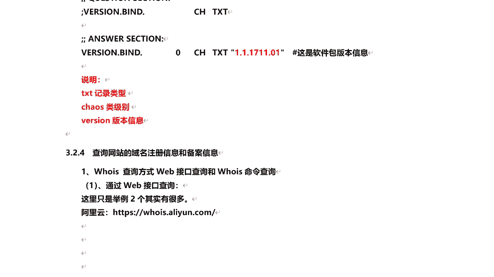
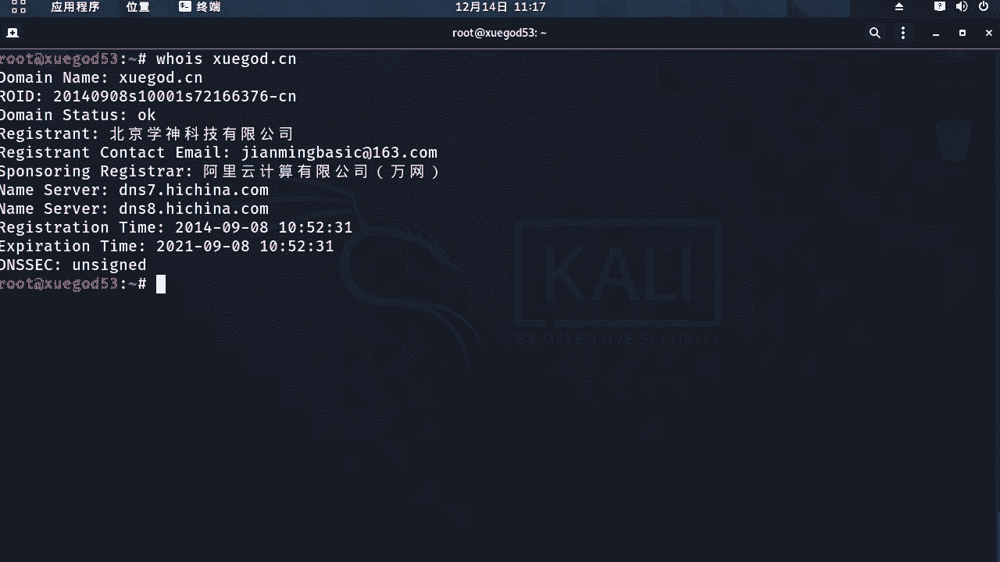
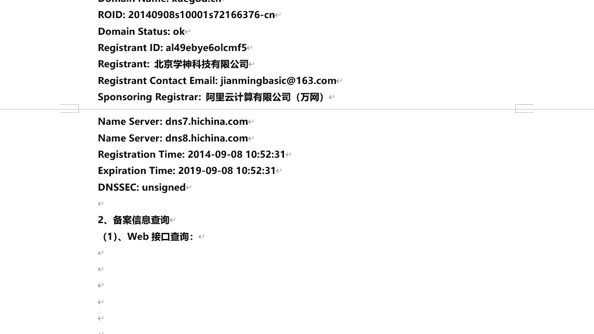

# P33：7.4-【被动信息收集系列】查询网站的域名注册信息和备案信息 - 一个小小小白帽 - BV1Sy4y1D7qv

好，下面呢我们来看一下查询网站的域名，注册信息和备案信息啊，那么通过域名哎，那么我们能得到它的一个ip地址啊，那么同时呢可以查询他的注册啊，注册域名的相关信息，比如说企业名称啊，注册邮箱注册时间啊。

倒计时间，还有相关的一些备案信息啊，那这里说到备案，那么正常我们在国内注册域名，如果啊你要在使用国内的服务器的话啊，那么你需要将对做一下备案好吧，那么你的域名和服务器的ip说做一下备案。

否则的话你的域名是用不了的，即使解析到你的服务器也是用不了的，那么如果假设不想备案，这不需要备案啊，那下面呢我们来看一下，来如何去查询域名的注册信息啊，那么也就是说who is查询域名注册器。

它的查询方式有外部接口查询，和who is命令查询两种方式啊，那首先呢我们来看一下，通过外部接口也是很多啊，有在线的没工具啊，可以去查询这个域名的注册系，比如说who is点阿里云点com。

那么我们来打开这个站点来看一下啊，当然除了他之外，就是站长之家啊，对也可以查询啊，我们来看，那么这里呢我们直接输入要查询的域名，比如说3w点学get了点cn，点击查询，好的。

那么这里呢考的注册商是阿里云的是吧，注册日期啊，到期日期还有域名状态，dns服务器有两个是吧，然后呢这里呢我们来看啊，这是关于它的获取时间啊，就当前时间，然后呢所有者联系的邮箱啊，邮箱。

那么这里呢这里邮箱是容易看到，看不到是吧，对而且我等下看啊，下面下面这里头啊是吧，也是啊，一样和上面信息都是一样的，只不过这是英文的啊，除了它之外呢，还有站长之家也可以啊，w h o i s。

china z。com，3w点学霸的cn查询，好的嗯，这里呢要比那个好像显示多一些啊，基本性都是写这里有个反差啊，域名反查啊，联系人反差，这都是反差，那么也就是说这个通过他这个反差。

可以查询到的这个公司啊，这个联系人注册了这个域名之外，有没有注册其他的域名，把他所有注册的域名都给他反查出来啊，还有这个邮箱也是这个邮箱，除了注册这注册过这个域名之外，还有没有注册过其他的域名。

通过这个反弹都可以查出来，对那么这里啥它只制作了一个域名对吧，只有一个啊，如果注册个多个的话，这些都可以列出来，ok啊这是关于域名的who is信息啊，通过什么web接口来查询啊，除了这个之外呢。

在我们的kelly里面对，那么也提供了这个会查询的命令叫who is啊。

通过who is这个命令呢也可以查询这个域名啊，相关的注册信息，w w h o i s学尬了点cn啊，注意啊，那么这里查要查顶级域名啊，顶级域名你注册的时候是吧，直接输入域名名称后面选个后缀嘛。

对这顶级域名啊，它然后这里呢我们得到一个结果啊，对域名的状态是ok的啊，注册公司邮箱是吧，dns服务器注册时间到期时间等等，这些呢都ok都查询出来了，好的，那么这个呢是关于域名注册信息的查询。

通过这几种方式啊，哪种方式都可以啊，除了域名注册信息之外呢，我们还可以查询他的备案信息啊，那么也就是说只要他使用的是国内的服务器，都需要进行备案，否则的话那么它是使用不了的，也访问不了道他的站点啊。

也不让他访问，那么这里呢首先可以通过什么web接口查询，哎，那么外部接口查询的话，我们用刚刚那个站长之家是吧，这里就有差啊，比如说好猜呢，这1。com，那么到底我们去找网站备案查询，i c p。

china这点com，然后我们输入要查询的域名，学的cn，啊那么这就查出来了啊，那么主办单位名称，主办单位性质企业啊，注意啊，备案分两种，一种是企业的，一种是个人的，个人的相对于比较好。

备案一下企业的相对麻烦一些，需要体验的信息啊比较多，然后就是备案许可号，当你有了这个备案号之后，诶，那你的服务器对吧，就可以正常使用了，通过域名就可以访问到你的站点了啊，然后网站名称对这个域名嗯。

还有审核时间，什么时间审核的啊，好的，那么这是关于备案，通过备案呢，我们可以查询到什么他企业名称啊，这个企业名称是真实的企业名称，这一点大家要注意啊，好的，那么这是关于备案，那么得到企业名称之后呢。

通过这个企业名称，我还可以进行进一步的信息收集啊，那么比如说到天眼查诶，天眼查，那么可以查企业，查个人，还可以查关系啊，查询这个企业相关的一些注册相关信息，企业的地址啊。

那么这里呢因为我开了danny是吧，他不让访问啊，那我关掉，ok打开了，那比如我们输入企业啊查询，比如查询百度啊是吧，哎这个公司好，那么通过天眼查呢，我们可以查查这个百度啊，这公司的法人是谁。

什么时间成立的纳税识别号对吧，登记机关，然后呢公司的类型等等，还有注册的地址啊，那么注意啊，那么这个注册地址很可能就是这个公司啊，现在的办公地址，那么又有一种可能就是它注册地址是假的，实际办公不在这里。

有可能是吧，那么这个系我们也需要收集，那比如要进行社工来讲，是不是得需要知道它的地址，人员职务组织架构是吧，这些都能查到下面ok那么这是什么，关于天眼查好的，那么这整个呢是关于域名。

注册信息和备案信息的查询啊。

