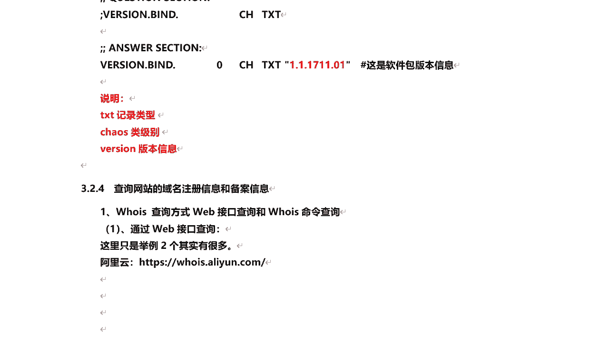
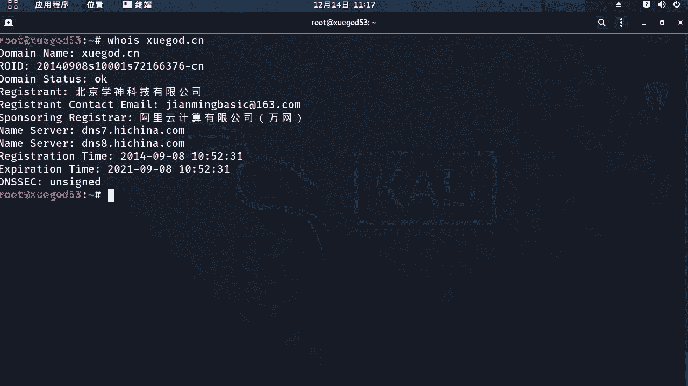
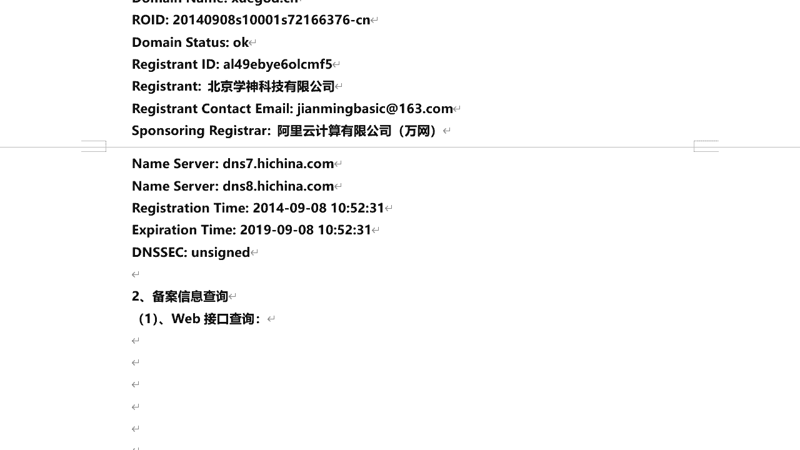

# 课程 P33：7.4 - 【被动信息收集系列】查询网站的域名注册信息和备案信息 🔍

在本节课中，我们将学习如何查询一个网站的域名注册信息和备案信息。通过获取这些信息，我们可以了解到网站背后的企业、联系人、注册时间等关键数据，这对于安全评估和信息收集至关重要。

---

## 一、域名注册信息查询

通过查询域名的注册信息，我们可以获取其IP地址、注册商、企业名称、注册邮箱、注册与到期时间等。查询方式主要有两种：通过Web接口在线查询和使用命令行工具查询。

### 1. 通过Web接口查询

以下是两种常用的在线查询工具：

*   **阿里云Whois查询**：访问 `whois.aliyun.com`，输入域名即可查询。
*   **站长之家Whois查询**：访问 `whois.chinaz.com`，输入域名进行查询。

以查询 `www.xuega.cn` 为例，在站长之家查询结果中，除了基础信息，还提供了“域名反查”和“联系人反查”功能。这意味着我们可以通过一个已知的注册公司或邮箱，反查出该实体名下注册的所有其他域名。

### 2. 通过命令行查询

在Kali Linux等渗透测试环境中，可以使用 `whois` 命令进行查询。命令格式如下：

```bash
whois xuega.cn
```



执行该命令后，会返回域名的状态、注册公司、联系邮箱、DNS服务器、注册及到期时间等详细信息。

---

## 二、网站备案信息查询



上一节我们介绍了如何查询域名的注册信息，本节中我们来看看如何查询网站的备案信息。根据中国法律规定，使用国内服务器的网站必须进行ICP备案，否则无法正常访问。备案信息中包含了真实的主办单位名称，这是非常有价值的信息。

查询备案信息主要通过Web接口进行。例如，在站长之家（`icp.chinaz.com`）输入域名 `xuega.cn` 进行查询。

查询结果会显示：
*   **主办单位名称**：企业的真实名称。
*   **主办单位性质**：分为“企业”和“个人”备案。
*   **备案许可证号**：网站合法的备案编号。
*   **审核时间**：备案通过的具体日期。

获取到企业名称后，我们可以进行更深层次的信息收集。

---

## 三、基于企业信息的深度收集

当我们通过备案信息获取到真实的企业名称后，可以进一步利用商业查询平台进行深度信息收集。例如，使用“天眼查”等工具。

在天眼查中输入企业名称（如“百度”），可以查询到：
*   公司法人代表
*   成立时间
*   统一社会信用代码（纳税识别号）
*   登记机关
*   公司类型
*   注册地址

这些信息，尤其是注册地址和法人信息，在后续的社会工程学评估或线下测试中可能具有重要参考价值。需要注意的是，注册地址可能与实际办公地址不一致，需要结合其他信息进行核实。

---

## 总结

本节课中，我们一起学习了被动信息收集的关键环节：查询域名注册信息和网站备案信息。
1.  我们掌握了通过 **Web接口** 和 **`whois`命令** 查询域名注册信息的方法。
2.  我们学会了如何查询网站的 **ICP备案信息**，并从中提取真实的企业名称。
3.  我们了解了如何利用企业名称，通过“天眼查”等工具进行 **深度信息收集**，获取公司架构、地址等关键数据。



这些信息是构建目标画像、理解其网络资产和业务背景的基础，对于全面的安全评估至关重要。