# 课程 P34：使用 Maltego 收集子域名信息 🕵️

在本节课中，我们将学习如何使用 Maltego 这一强大的开源情报（OSINT）工具来收集目标域名的子域名信息。这对于渗透测试和信息收集阶段至关重要。

## 概述：什么是 Maltego？

Maltego 是一款专注于分析互联网公开数据之间真实世界关系的工具。它通过查询 WHOIS 记录、DNS 记录、社交网络以及各种在线 API 来收集和关联信息，本质上是一个强大的社会工程学工具。它提供广泛的图形化布局，允许对数据进行聚类分析，使关系呈现得更加准确和及时。

## 核心概念：域名与子域名

在开始使用工具前，我们需要理解两个核心概念：顶级域名和子域名。

*   **顶级域名**：是域名的最后一部分，即最后一个点之后的字母。例如，在 `xuegao.cn` 中，顶级域是 `.cn`。它不区分大小写。
    *   **通用顶级域名**：例如 `.com`（商业）、`.org`（组织）、`.net`（网络）。
    *   **国家/地区顶级域名**：例如 `.cn`（中国）、`.uk`（英国）。

*   **子域名**：凡是在顶级域名前添加前缀的，都属于该域的子域名。根据层级可分为二级、三级、四级子域名等。
    *   **公式**：`[前缀].[主域名]`
    *   **示例**：
        *   主域名：`xuegao.cn`
        *   二级子域名：`www.xuegao.cn`
        *   三级子域名：`a.b.xuegao.cn`

## 为何要挖掘子域名？🎯

上一节我们介绍了域名的基础概念，本节中我们来看看挖掘子域名的重要性。在网络安全评估中，主站点的防御往往非常严密。此时，渗透测试人员可以采用迂回战术，先寻找并攻击防护相对薄弱的子站点（子域名），获取权限后再逐步向主站渗透。

例如，若 `www.target.com` 无懈可击，但其子域名 `dev.target.com` 存在漏洞，攻击者便可从 `dev.target.com` 入手。

## 子域名挖掘方法简介

除了我们将要重点介绍的 Maltego，子域名挖掘还有多种方法：

以下是常见的几种子域名收集方法：
*   **专用工具**：如子域名挖掘机，其原理常基于字典爆破。
*   **搜索引擎语法**：在谷歌等搜索引擎中使用 `site:qq.com` 进行搜索。
*   **第三方查询网站**：利用公开的在线服务进行查询。
*   **证书透明度日志**：通过查询 SSL/TLS 证书的公开记录来发现子域名。

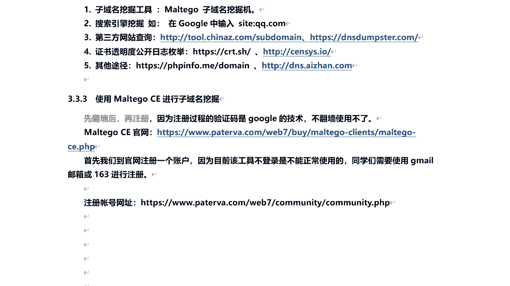

## 实战：使用 Maltego 收集子域名 🛠️

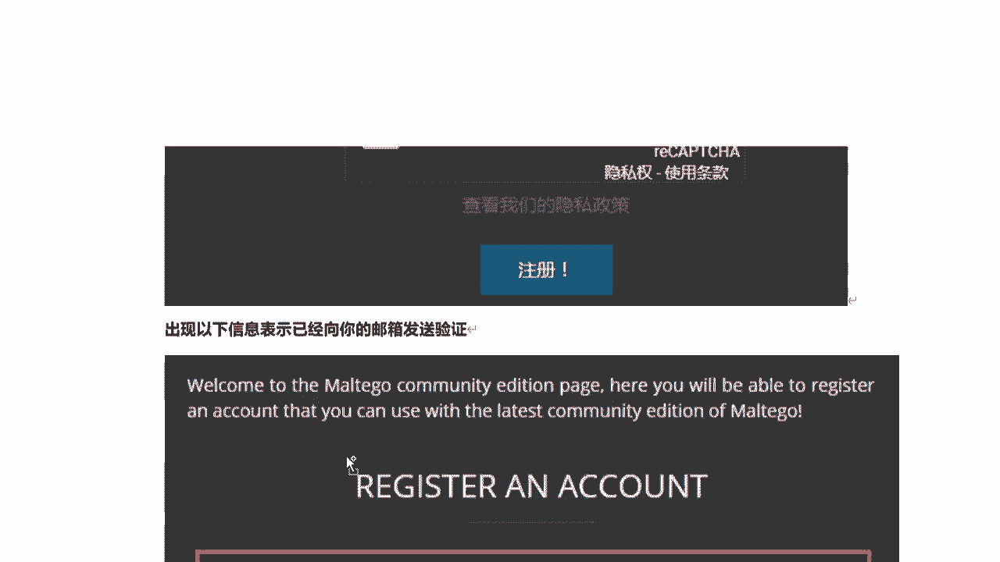

了解了背景知识后，我们进入实战环节，看看如何具体操作 Maltego。


### 步骤一：注册 Maltego 账号

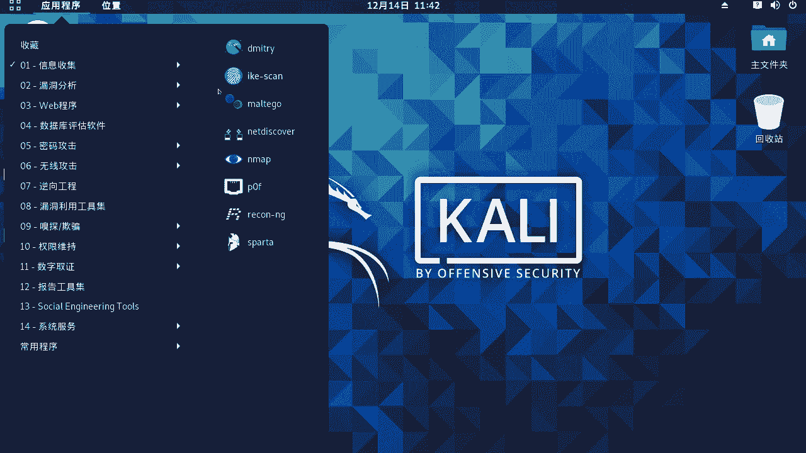

Maltego 社区版免费，但需要注册账号。由于注册过程涉及谷歌的人机验证，建议使用 Gmail 或 163 等邮箱注册。

1.  访问官网注册地址：`https://www.maltego.com/registration/`
2.  填写姓名、邮箱、密码等信息完成注册。
3.  登录邮箱，点击激活邮件中的链接完成账号激活。

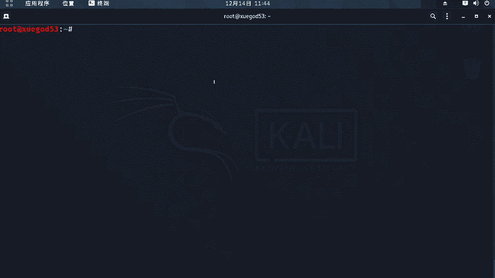

### 步骤二：在 Kali Linux 中启动 Maltego

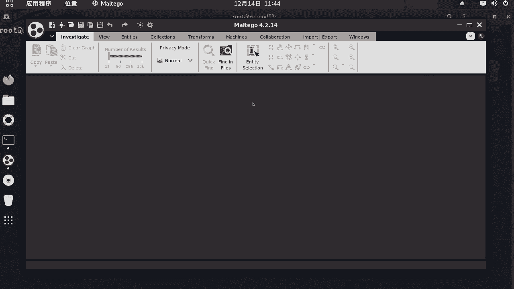

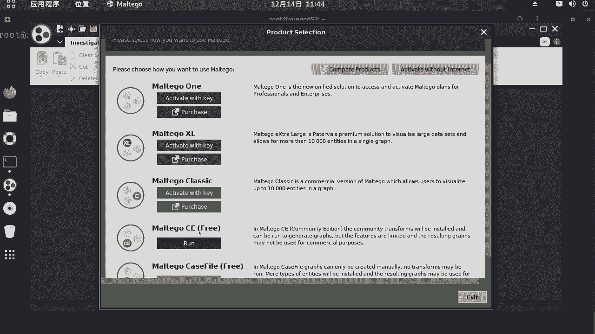

Maltego 已预装在 Kali Linux 中。请注意，新版本可能不允许在 `root` 用户下直接运行。

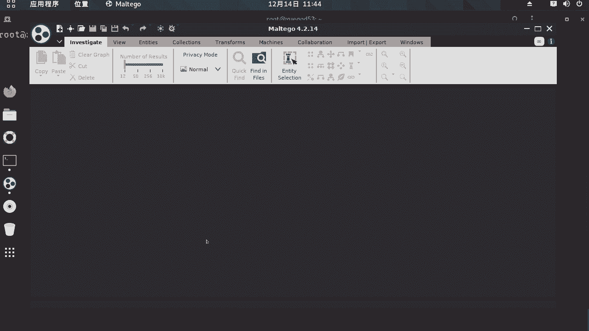

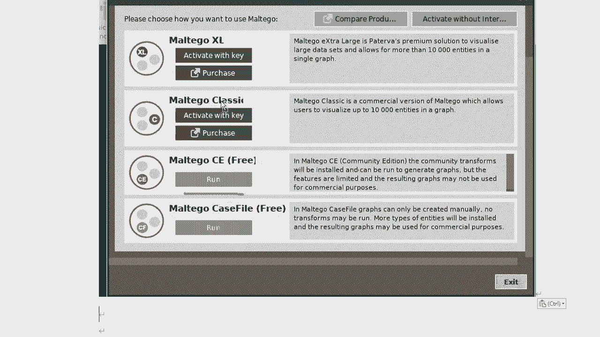

如果无法启动，请尝试在终端执行以下命令重新安装：
```bash
apt install maltego
```
或者，创建一个普通用户，切换到该用户后再运行 Maltego。


安装或配置完成后，在 Kali 的应用程序菜单中找到 **“信息收集” -> “Maltego”** 并启动。


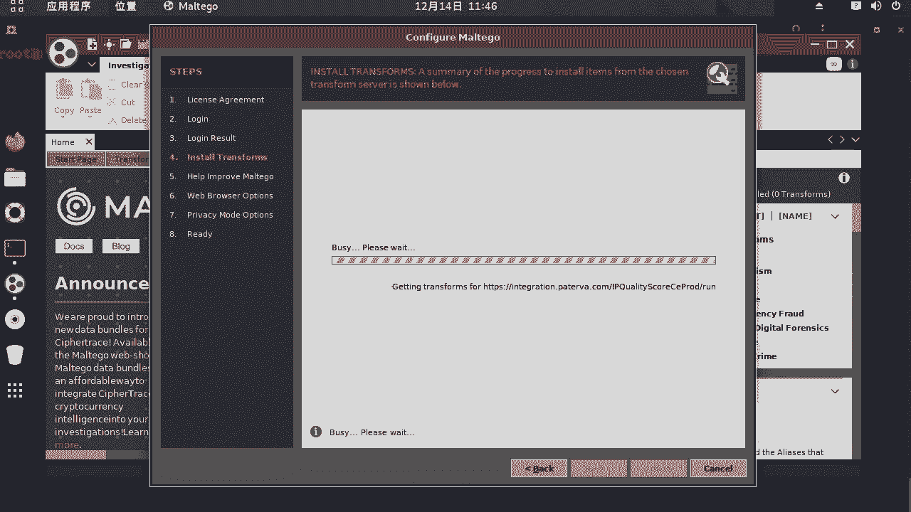

### 步骤三：登录与初始化

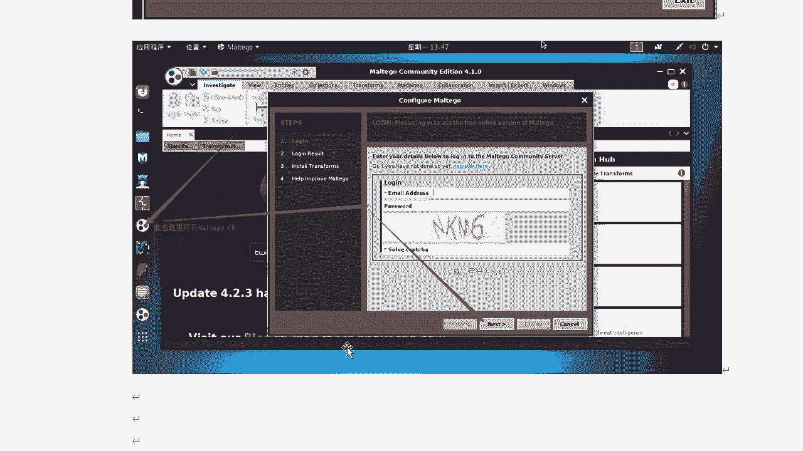


1.  启动后，选择运行 **“Maltego CE”（社区免费版）**。
2.  接受许可协议，输入之前注册的邮箱和密码进行登录。
3.  工具会自动下载和更新必要的组件（需要网络通畅）。完成后，会打开一个空白的绘图区域（画布）。

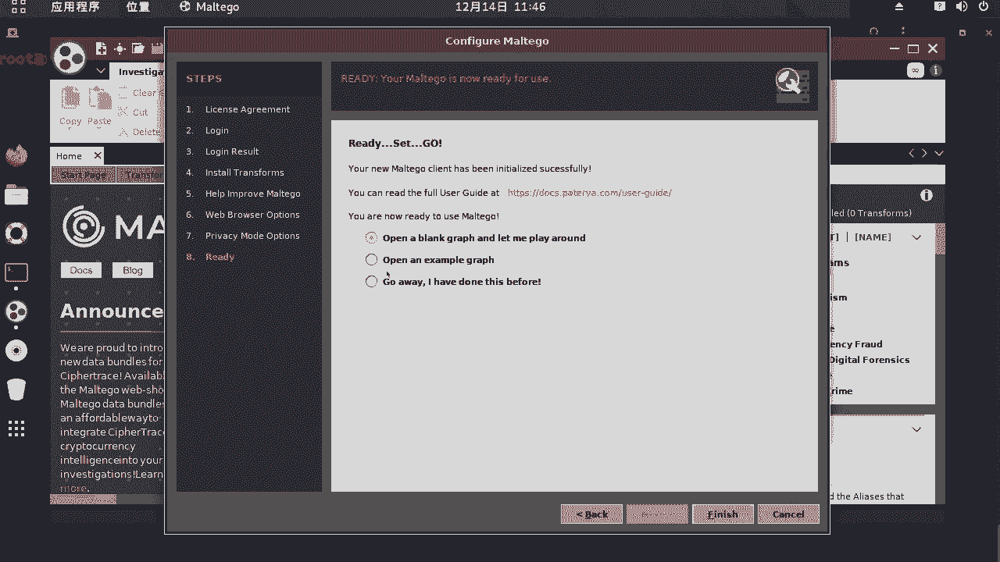

### 步骤四：收集子域名

现在，我们开始收集指定域名的子域名。

以下是操作步骤：
1.  在左侧实体（Entities）面板中，找到 **“Domain”** 选项。
2.  按住鼠标左键，将 **“Domain”** 图标拖拽到右侧的画布中。
3.  双击画布中的 “Domain” 图标，输入目标域名，例如 `ke.qq.com`，然后按回车。
4.  右键单击该域名图标，在弹出的菜单中选择 **“All Transforms”**。
5.  在展开的列表中找到并点击 **“To DNS Name – Domain (DNS)”** 或其他子域名查询选项。
6.  Maltego 将开始查询并自动将结果以图形化的方式展示在画布上，所有发现的子域名（如 `test.ke.qq.com`）都会列出。

### 步骤五：进一步信息收集

查询出子域名后，我们可以对其进行深入分析。

例如，可以右键单击任何一个子域名，选择 **“To IP Address”** 来解析其对应的 IP。如果多个子域名指向同一个 IP，则表明它们可能托管在同一台服务器上。

Maltego 功能非常丰富，您可以根据需要尝试其他转换（Transforms）来获取网络块、邮件地址、相关文档等信息。

## 总结 📝


本节课中我们一起学习了子域名收集的重要性以及如何使用 Maltego 工具来高效地完成这项任务。我们首先了解了域名体系，然后完成了 Maltego 的账号注册与工具启动，最后通过实战演练掌握了查询子域名及其关联信息（如 IP 地址）的基本流程。Maltego 是一个功能强大的 OSINT 工具，熟练掌握它将极大提升您在信息收集阶段的能力。