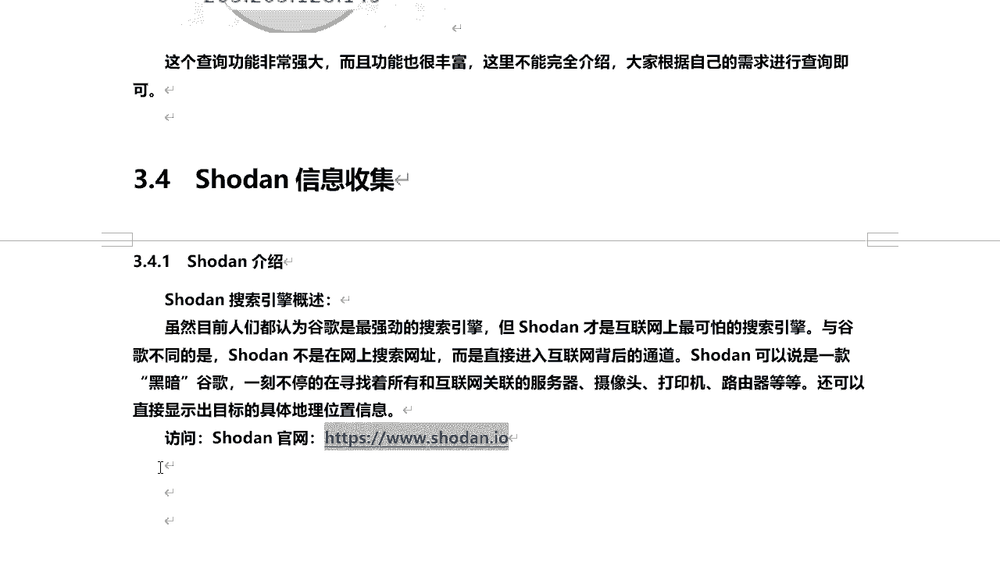

# P35：7.6-【被动信息收集系列】Shodan信息收集-介绍 - 一个小小小白帽 - BV1Sy4y1D7qv

好下面呢我们来讲一下，使用收藏来进行信息收集啊，那么什么是收蛋呢，虽然目前人们都认为，谷歌是最强劲的一个搜索引擎啊，但是呢，收蛋才是互联网上最可怕的一个搜索引擎，嗯与谷歌不同的是收。

但不是在网上搜索网址，而是直接啊进入互联网背后的通道啊，互联网背后啊很可怕啊，那收藏可以说是一款黑暗，谷歌一刻不停的在寻找着，所有和互联网关联的服务器呀，摄像头啊，打印机啊，路由器等等啊，那么说到这里。

其中有一个关键词摄像头，那么可能大家眼前一亮啊，能搜到摄像头是吧，真的还是假的，一会能给大家演示一下的啊，那么还可以直接显示出目标的，具体的地理位置信息啊，那么这个手段是比谷歌还要强大啊。

那么它的网址呢是这个地址啊，我们来直接可以访问啊，直接就可以来访问他啊，我们来打开看一下它长得什么样呢，唉呀好的，长得是这样是吧，那只不过都是英文的啊，都是英文的，那我看这里呢就在这里直接搜索就可以了。

输入关键词直接搜索就可以了，好那么我们把它来截个图啊。

放到这里啊，这是收到，那么在使用收蛋呢，最好是先注册一下的啊，因为你不做的话，不注册的话可能会受限制，搜索的时候会受限制搜索的次数啊，对啊，或者是你搜索到结果之后，你只能看到第一页。

第二页往后就看不到了，所以说这里呢就不给大家提供注册过程了啊，很简单啊，同学们可以直接在官网注册账号，那么同时呢如果你有谷歌账号的话，也可以直接使用你的谷歌账号来进行登录啊，那么要注册的话。

打开这个地址好吧。

我们来看啊，打开这个地址直接来访问这个地址，然后进行注册就可以了啊。

那么我们来看这是注册页面啊，手段的一个注册页面，然后呢在这里头设置下了啊，用户名啊，密码啊，邮箱啊就可以了，然后点击这个打勾，然后点击创建啊，就可以注册成功了，那整个注册过程呢就伟大演示了好吧。

那么也可以在登录的时候呢，对使用谷歌账号登录autivator啊，windows live都可以啊，比如说你直接来点击谷歌。

啊这是我我的谷歌账号，直接选择它对他就登录成功了啊，那接下来我们就可以来使用啊，搜带搜索引擎来进行搜索。

