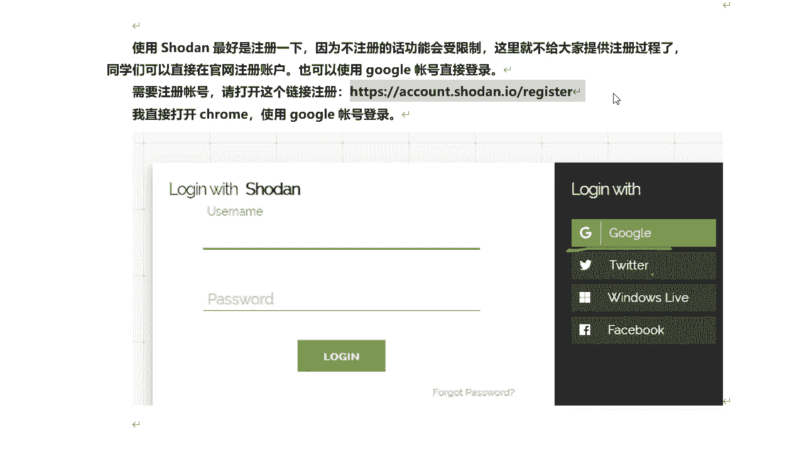

# 课程P35：7.6-【被动信息收集系列】Shodan信息收集-介绍 🕵️

在本节课中，我们将要学习什么是Shodan搜索引擎，以及如何注册和使用它进行网络设备与服务的发现。这是一种强大的被动信息收集工具。

## 什么是Shodan？🌐

上一节我们介绍了被动信息收集的概念，本节中我们来看看一个被称为“黑暗谷歌”的工具——Shodan。

虽然目前人们都认为谷歌是最强劲的搜索引擎，但是Shodan才是互联网上最可怕的搜索引擎。与谷歌不同的是，Shodan不是在网上搜索网址，而是直接进入互联网背后的通道。Shodan一刻不停地在寻找着所有和互联网关联的服务器、摄像头、打印机、路由器等等。

其中有一个关键词是摄像头。它还可以直接显示出目标的具体地理位置信息。这个手段比谷歌还要强大。

## 访问与界面 🔍

它的网址是 `https://www.shodan.io/`，我们可以直接访问。它的界面如下图所示，主要是英文的。在搜索框中输入关键词即可开始搜索。

## 注册Shodan账户 📝

在使用Shodan时，最好先注册一下。因为如果不注册，搜索可能会受到限制，例如搜索次数受限，或者只能看到搜索结果的第一页。注册过程很简单，可以直接在官网注册账号。

以下是注册步骤：
1.  打开注册地址 `https://account.shodan.io/register`。
2.  在注册页面填写用户名、密码和邮箱。
3.  勾选同意条款，点击“创建”按钮即可完成注册。

也可以在登录时使用谷歌账号、GitHub账号或微软账号进行快捷登录。例如，点击“使用谷歌登录”按钮，选择你的谷歌账号即可快速登录成功。

注册并登录后，我们就可以开始使用Shodan搜索引擎进行搜索了。

## 总结 📚

本节课中我们一起学习了Shodan搜索引擎的基本概念。我们了解到Shodan是一个专门搜索联网设备（如服务器、摄像头、路由器）的搜索引擎，功能强大。我们还学习了如何访问Shodan官网以及注册和登录账户的步骤，为后续的实际搜索操作做好了准备。