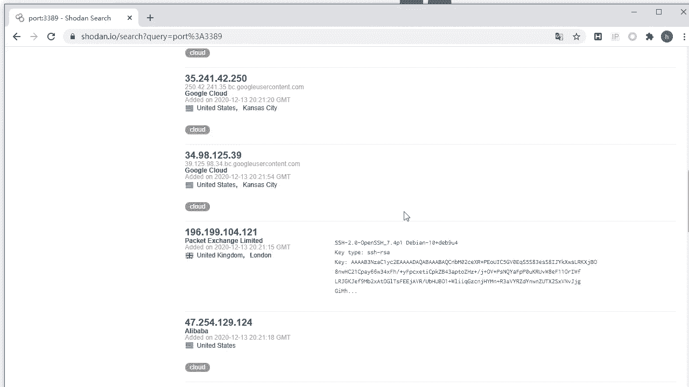
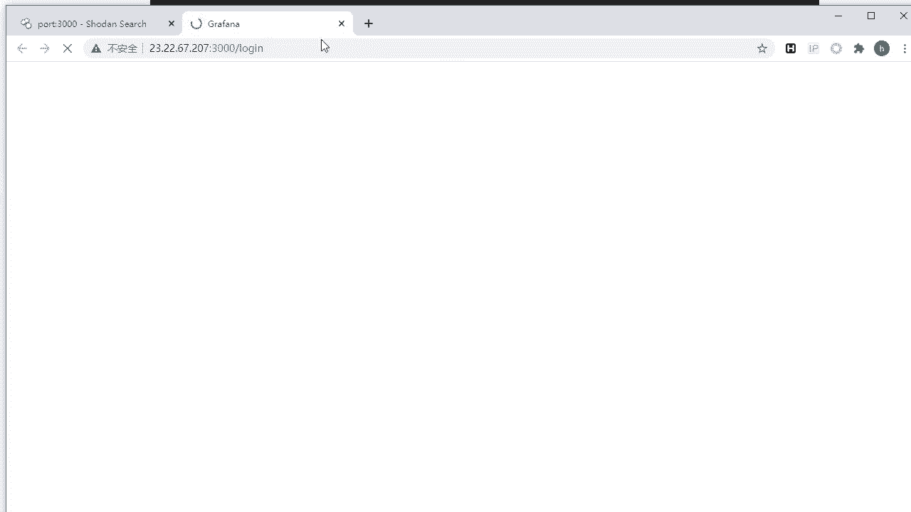
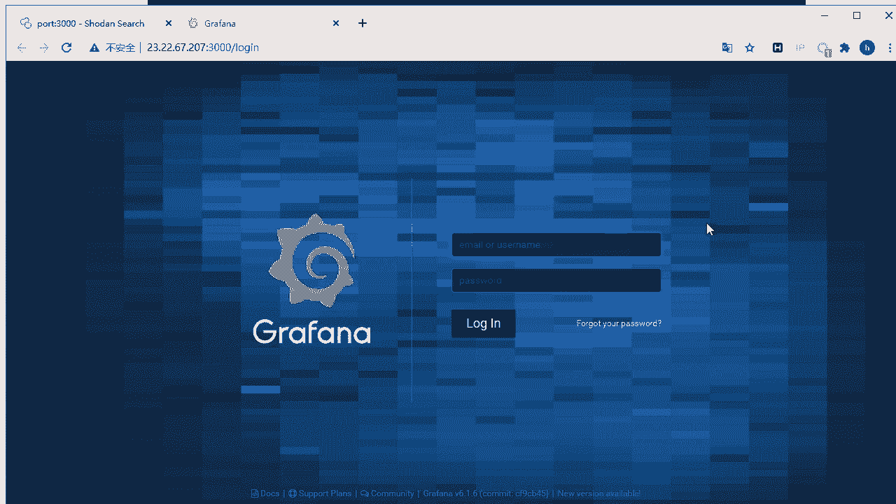
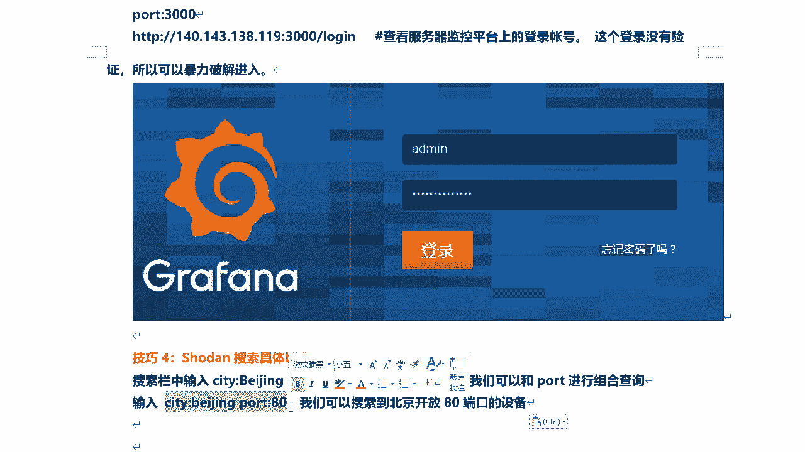

# 课程 P36：7.7 - 【被动信息收集系列】Shodan信息收集 - 搜索技巧 🕵️

在本节课中，我们将要学习Shodan搜索引擎的核心搜索技巧。Shodan是一个强大的网络设备搜索引擎，能够帮助我们以被动方式收集目标信息，避免直接扫描目标系统。我们将通过具体的语法和示例，学习如何精准地查找网络摄像头、特定IP、端口、城市以及组合条件。

---

## 1. 搜索网络摄像头设备 📹

上一节我们介绍了Shodan的基本概念，本节中我们来看看如何利用它搜索特定的联网设备，例如网络摄像头。

网络摄像头是指安装在电脑或监控设备上，并连接到互联网的摄像头。通过Shodan可以搜索到大量此类公开设备。

在搜索框中直接输入 `webcam` 或 `网络摄像头` 即可进行搜索。

**重要提示**：以下演示仅为教学目的。请勿尝试登录或访问他人的网络设备，这可能带来法律风险和不必要的麻烦。

以下是搜索步骤：
1.  在Shodan搜索框中输入 `webcam` 并回车。
2.  搜索结果会显示全球的公开网络摄像头设备列表。
3.  点击结果中的链接图标可以尝试访问，但许多设备需要账号密码验证。
4.  在搜索结果页面左侧，可以按国家（如 `country:CN`）或城市（如 `city:北京`）进行筛选，以细化搜索结果。

例如，搜索北京的摄像头可以使用语法：`city:北京 webcam`。

---

## 2. 搜索指定IP地址 🖥️

了解了如何搜索设备后，我们来看看如何针对一个具体的IP地址进行信息收集。这有助于我们了解目标服务器的公开信息。

通过搜索指定IP，我们可以获取该服务器开放的服务、端口、服务版本及可能存在的漏洞信息，这是一种高效的被动信息收集方式。

搜索语法为：`net:目标IP地址`。

例如，搜索一个IP地址：`net:xxx.xxx.xxx.xxx`。

以下是搜索后可以获取的信息：
*   **开放端口与服务**：列出服务器所有开放的端口及其对应的服务（如HTTP, SSH, MySQL）。
*   **服务商与地理位置**：显示互联网服务提供商（ISP）和服务器所在位置。
*   **服务版本信息**：显示运行服务的具体软件版本。
*   **潜在漏洞提示**：Shodan可能会列出与该服务版本相关的已知漏洞。

**请注意**：Shodan报告的漏洞可能存在误报或漏报，需要进一步验证才能确认其真实性和可利用性。

---

## 3. 搜索指定端口 🔌

除了针对IP，我们还可以直接搜索互联网上开放了特定端口的所有设备。这能帮助我们快速定位提供某种服务（如Web服务、数据库服务）的资产。

搜索语法非常简单：`port:端口号`。

以下是几个常用端口及其搜索示例：
*   **HTTP服务**：`port:80`。这将返回所有开放80端口的Web服务器。
*   **Windows远程桌面**：`port:3389`。这将找到开放远程桌面服务的设备。
*   **Elasticsearch服务**：`port:9200`。用于搜索ELK日志分析系统。
*   **Grafana等监控平台**：`port:3000`。常用于服务器监控面板。

**安全提醒**：搜索到的结果可能是任何人的设备。请勿尝试进行未授权的访问、登录或暴力破解，这些行为是非法的。

---

## 4. 组合搜索条件 🔗

单一的搜索条件可能返回结果过多。为了更精确地定位目标，我们可以将多个搜索技巧组合使用。

组合搜索的语法是使用空格连接多个条件。

以下是几种常见的组合搜索示例：
*   **搜索特定城市的Web服务器**：`city:北京 port:80`
*   **搜索特定IP的特定端口**：`net:xxx.xxx.xxx.xxx port:3306`
*   **搜索特定产品（如Nginx）**：`product:nginx`

在搜索结果页面左侧的筛选栏，系统通常会显示当前使用的组合条件，例如 `city:北京 port:80 product:nginx`。

Shodan的搜索语法非常丰富，大家可以通过搜索引擎查找“Shodan search syntax”来获取更全面的官方或社区文档。

---

## 总结 📝

本节课中我们一起学习了Shodan的几种核心搜索技巧：
1.  使用 `webcam` 等关键词搜索特定类型的联网设备。
2.  使用 `net:` 语法搜索指定IP地址的详细资产信息。
3.  使用 `port:` 语法搜索开放特定端口的所有设备。
4.  通过组合 `city:`、`port:`、`product:` 等条件进行精细化搜索。

掌握这些技巧，可以让我们在渗透测试的信息收集阶段，更安全、更高效地获取目标的外部攻击面信息。请务必在合法授权的范围内使用这些技术。