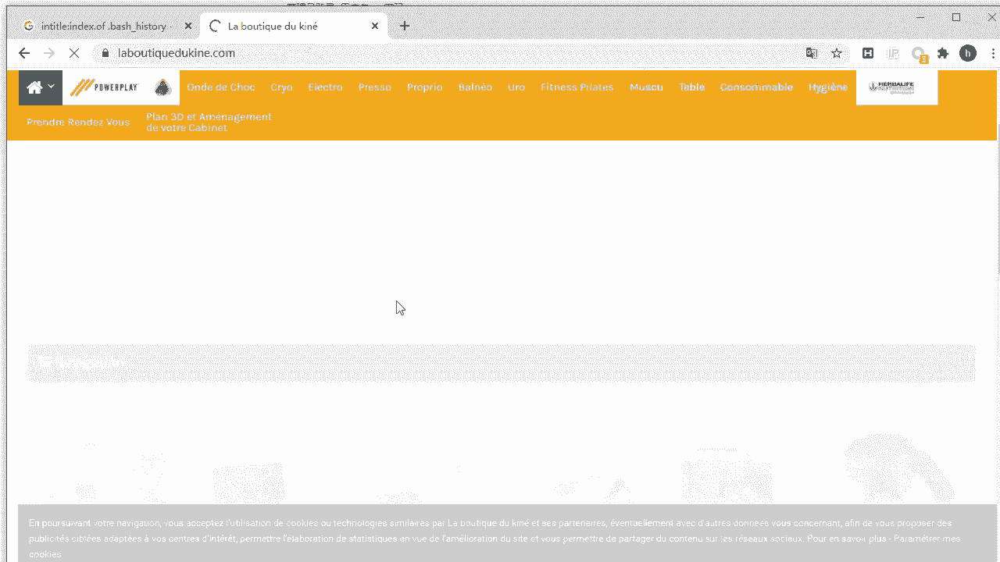
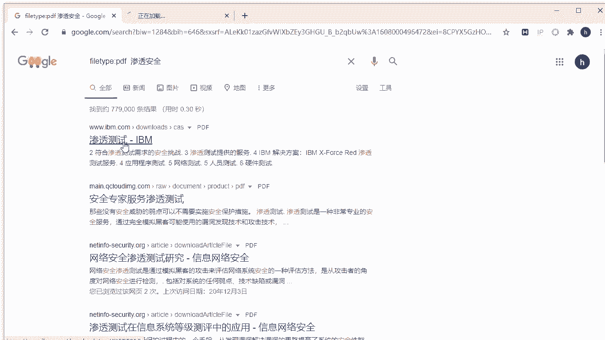
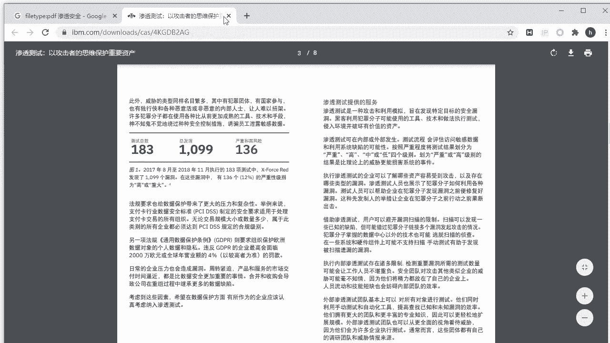

# P37：7.8-【被动信息收集系列】Google搜索引擎的使用技巧 - 一个小小小白帽 - BV1Sy4y1D7qv

想要的内容，那么正常情况下，我们都是直接使用语言进行描述，问题来进行搜索，那比如说你在做实践的过程中遇到了什么问题，或者是你想要什么资料，直接来搜索他的一些关键词或错误提示信息，对吧。

来达到得到你想要的结果对吧，然后呢搜索引擎呢也有特定语法可以使用，你熟练的去掌握这些搜索引擎的语法，可以让你的搜索效率和准确率呢的大幅度提升，当然了，我们学习啊，这种技巧是为了寻找存在漏洞的页面。

或者是存在敏感信息的文件啊，那么关于谷歌呢，他常用的语法呢有哪些呢，我们给大家介绍一些常用的好吧，哎那第一个呢set，那么通过set可以指定域名来搜索这个域名，所有相关的关于这个域名的信息啊。

in url，那么也就是在u r l中存在的关键字的页面啊，就地址里面存在关键字的页面，还intt就是网页内容里面的关键字啊，那么当然这个关键字啊我们可以自己去定，你想搜索什么关键字对吧。

通过这个关键词对吧，去指定就可以了，还有file type指定文件类型啊，比如说你想搜索种子是不是诶in title，网页标题中的关键字，网页标题还有某个关键字的啊。

还有link返回你所有的指定域名的链接，好info，查找指定站点的信息，还有cash，这个是搜索谷歌里的内容缓存啊，那么每个搜索引擎关于某个站点对吧，它都有一个缓存啊，而且他会不定期的去更新这个缓存。

好的，那么下面呢我们来看一下第一个set，这个给大家演示一下啊，我们来打开谷歌啊，否则的话你也访问不了谷歌啊，那么这里要说的就是说呃除了谷歌之外啊，百度啊，对那么有些所谓语法百度也是通用的。

那比如说我们在这里直接搜set学尬的点cn，那么搜索出来的结果呢说都是关于学霸的cn，这个网站被谷歌收录的页面啊，要注意这个啊，那么我要搜其他站点了，直接写他域名都可以了，那么还有一种搜索方式。

就是说我说了点gp啊，结尾的啊，点jp。jp结尾这个域名它属于国家域名是吧，是哪个城市的，我想老司机都懂得是吧，jp啊，日本的，那你搜索的站点都是日本的站点啊，那在这里还有一个点uk，uk是英国的是吧。

唉这些都是英国的站点，ok好的啊，那有人说，那我说说点com结尾的是吧，可不可以啊，那么这一站站点都是点com结尾的域名，点com。com或者是点net的，是不是都可以啊，对修手方式很多啊。

这些都是点net结尾的好不好，对点net。neo好的，那么这是关于set啊，set这个它的用法指定域名啊，呃当然的后面我们可以结合了多个关键词啊，多个语法结合在一起，用搜索在指定站点里面的。

比如存在敏感信息泄露的啊页面啊对吧，可以这么去搜set，再加其他一些关键词就可以了，好那么下面我们来看一个in url对吧，in u r拆开来就是印在u i l里面。

那么它的作用呢就是限定在url中进行搜索，那么咱们url就是这个地址啊，那么比如我们常规的就是因url里面呢，我们跟上一个关键词啊，比如qq。t s t，那么你就在这url里头，还有qq。

tt这个关键词的啊，那在qq的t t这里边上存储的啥呀，账号密码是吧，3亿多qq。tc网盘，百度网盘啊，这是什么，我们来打开看一眼啊，那么看这个关键词，u r里边含有qq。t t这个关键词的是吧。

这个大家能理解了吧，哎还有这个这里一般啊能搜到他这个qq账号啊，这里存储的，但是仅仅你搜索到了，我估计那里的密码都已经失效了，还有一种就是说通过它呢来找后台好，那么做过开发的都知道。

那么一般常见的后台地址，比如说adm。p t p是吧，对地址来了，对url里还有他这个关键字的，那比如说像第一个这个是不是啊，哎都有可能是登后台登录的啊，这个就是登录，那这里还有adman。

p a p的啊，啊还有一种常用的啊，就是让我们看奥特曼下火线login，对，这就登录地址的啊，也有这个都是看到吗，都是啊，啊，那么或者是假的，我在指定站点去搜啊对吧，set学干点cn对吧。

然后呢in u i l a的慢点，菲律宾啊，搜不到是吧，嗯你搜不到的结果啊，那么也就是它的地址不是这个吗对吧，那有可能哈通过这种方式搜索啊，那么都是被搜索引擎收录的页面。

在这些被搜索引擎收录的页面里面去搜索啊，那么有的站点可能说可以去禁止某些页面，被搜索引擎蜘蛛爬到，不被搜索引擎搜集到收入到好吧，那么你通过这种方式呢就找不到，所以说通过这种方式得到的结果呢。

他一虽然没有不代表它，它真正的不存在啊，这一点大家要记住啊，唉只有被收录的才能搜索到啊，那么这是几个关于音url对吧，它的搜索语法的用啊，使用方式啊，好那下面呢我们来看第二个，来下一个搜索技巧啊。

哎entitle title的话意思就是在标题里面标题啊，那么网页这是标题，那我会打开一个网站啊，比如说我们直接访问谷歌是吧，这个就是标题谷歌好，那么通过它呢我们也可以去搜索到，比如说后台啊。

entitle后面呢一般啊一个后台登录页面来讲，那么它的标题可能就叫后台登录或者登录，我来好的，那么这个呢因为我们的搜索太频繁了啊，他怀疑是机器人是吧，让我们进行一下人机验证，点一下就可以了，好的。

那么这样呢我们得到的结果呢是吧，都是后台登录地址啊，那我们点击进去看对吧，都是后台，这个比较简单哈，对像这种的话，你可能会存在弱口令啊，还没有验证码啊，你要爆破的话应该很容易啊，很容易这个有验证码。

但是这个验证码比较简单的，也容易识别啊，对这个也是是吧，商泰网官网英文管理后台，好的，这个是这种方式，然后通过in title呢，我们还可以去搜索对吧，敏感信息泄露啊，比如说这种方式。

in title冒号index。off cm是固定写法啊，这个index。off就代表的是什么网站有开放目录啊，开放目录什么是开放目录呢，就是一个页面，本来你应该打开它是一个正常页面。

但是他把这个页面啊，这个目录对应下面的一些文件的列表，显示出来了，要开放目录啊，可以查看网站的目录下的所有的文件信息啊，后面的关键词可以自己去指定嗯，对，那么也就是说，这个开放目录里面含有的关键词啊。

某些文件对吧，哎那bash history，那这个的表示我们筛选的文件名称对吧，这开放入目录的目录列表里边，文件列表里边的关键词还有他的，那么这个呢，是你也可以替换成其他的敏感信息文件啊。

对你可以随意啊，写什么都可以，这个文件呢是记录的什么用户的历史命令记录，那么就是在linux系统里面，你使用过哪些命令，在这里都有记录，那么我们通过它来搜索一下的，能不能得到对我们想要的结果呢。

应该是可以的啊，可以的好啊，这个是网络摄像头啊，有意外收获是吧，哎看吧，这就是开放目录是吧，本来打开它是吧，里边这些目录里表显示出来它为什么会存在炸，它是预出一个漏洞啊，敏感信息漏啊。

但是这个漏洞呢它的严重程度，对严重程度是高危的，中国还地位呢还取决于你这个泄露的信息，对黑客他的利用价值有多大，如果对黑客对吧，这些信息能够利用这些信息啊，渗透到你的服务器，渗透目标附近拿到权限的话。

那么它就严重了啊，如果他没有什么可利用价值，那不算高温低温能力吧，那么这里呢应该存储的他的一个一些照片啊，照片这里我们就不看了，不看了好吧，看这20g存储的，然后大家自己去体会一下就可以了啊。

然后呢再往下看往下看，这里都是吗，index of对开放目录啊，开放目录，那这个里其中就有best history，那其实呢我们可以点开看一眼对吧，它不容允许访问啊，禁止了啊。

对那么这是由于它服务器端啊，对使用阿帕奇或n g s啊，他做了设置不允许你直接去访问，那么这也很正常，也为了安全嘛是吧，那七零这零那得有3w啊，3w是啥，一般来讲我们啊这不站点根目录吗。

那你点进去可能可以显示它的里边，输一个网站的文件。

no他直接打开网站了是吧，这里呢他没有让他在目录列表显示出来啊。

那还可以啊，这个还可以诶，我们再往下看啊，这这有没有呢，这个比说得看一眼啊，哎这个有点开看一眼，这也禁止访问了是吧，那如果啊有的文件你自己打开，可以看到里面内容，那么以为他在服务器端啊。

都执行了哪些linux命令对吧，那么这些命令呢也属于敏感信息啊对吧，可能会泄露啊，某个目录啊或者某个敏感文件啊，对啊都可以啊，但是呢他虽然记者再通过这个呢，我们能得到另外一个信息。

什么它使用的是阿帕奇2。2。10啊，而且是u那个系统是吧，好的这个呢还有p i p的版本，是不是都泄露出来了，相关的一些软件的版本啊，对这也是可以的啊，这是不是我们需要收集的信息啊，对是的好的。

那么这是关于这个啊，那比如说，那么我们这里来搜一下其他的关键词呢，对啊后面的可以改啊，不一定去搜索它呀，啊比如说我们来搜啊，my。cn f，这是什么，这是mysql的配置文件名称是吧。

你看看有没有存在嗯，信息目录开放的，而且呢这个目录列表里，文件列表里呢还有mysql配置文件的对吧，那我看这个啊，这个好像应该是哈，唉这个呢唉这个啥也没有啊是吧，这个在404404就不存在了啊。

那也就是说之前啊他存在过，被谷歌收入已经收录了对吧，但是现在不存在，后来已经修复了对吧，但是那个在谷歌搜索你行李呢，他还有缓存这个库里头嗯，这个啊大概是啊这买四口的啊，mysql配置文件对吧。

那么你通过这个配置是吧，卖点c n f吗对吧，能够得到什么信息呀，那里边可能得到关于数据库进行配置信息啊，对吧，但是呢在这里头啥也看不到没有是吧，ok那么这个搜索方法大家学会了吗，ok可以啊。

然后呢咱们再继续啊，继续好的，那么还有另外一种就是说我们嗯搞安全的啊，对大家知道有些开源的也cm s系统，我们必须得熟悉啊，像那种通用型的漏洞是吧，比如说disca论坛，它是开源的是吧。

我们可以直接下载到它的源码，那么来据他代码进行代码审计啊，那么在注意，那么在discr论坛中，那么它有一个配置文件这个名称对吧，存储mysql密码的配置文件，config global，点p p注意啊。

那么这个所有使用这次看论坛的啊，那么这些站点，那么它的配置文件名称基本上都是一样的，都是这个名称，而且存储路径呢也是基本上都是一样的，很多人基本上他都不会去改啊，那么我们来直接搜索这个文件名称好吧。

嗯也就是说啊来我们把这个关键词换下来，也就是说存在啊，就是这个存储这个配置文件的那个目录，它呢允许显示文件列表啊，那你呢才能通过它来去搜索到啊，我们看这里哎这不da论坛吗，这不是都是吗是吧，这也是是吧。

那我再看是不是看到了，那么这是菲律宾文件p a p a n，它属于服务端脚本语言对吧，从本预期处理器正常来讲，那么他在服务端执行完成之后，再把结果返回给客户端，能为我点击之后。

那么他去执行一个配置文件对吧，他呢不会去，不可能把源代码给你显示出来，执行结果它应该是空白，但是这里出现一个意外，那么它呢直接下载下来了对吧，下载下来了意味着什么，我们可以直接打开对吧。

它源码我们自己可以看到了，是不是这么道理，我们来看一下啊，来这嗯，通过这里呢，我们可以看到这里存储的数据库的地址，local host的对，那么也可能啊，他的网站和mysql数据库是在同一台服务器对吧。

那一般来讲mysql是不允许通过远程登录的，这里呢虽然我们可以看到他的账号和密码，但你不一定能连上去，它不允许远程的路啊，所以你连不上去啊，但是呢这也属于敏感信息对吧，这个属于一个很大的。

也属于一个漏洞啊，但是你利用的话，利用不了，领不了，这个呢我们来看啊，这禁止访问了这个呢对这是正常的对，因为配置文件嘛里面没有任何内容，基本上都是配置的，这是信息，对不对，所以你访问不了也很正常啊。

这是正常现象啊，那像一开始能下载下来就不对了啊，ok然后呢这是关于这个in title啊，那当然还有很多其他的搜索知识啊，那么大家呢你们可以去自己去发挥好吧，对自己去发挥啊，然后你想搜索什么关键字啊。

自己去搜就可以了，嗯然后呢下面呢我们来看一下呢，另一个搜索方式啊，开始catch呢返回的结果是被搜索引擎啊，收录的页面啊，比如说一页面被删除了，但是我们通过缓存呢开始还可以访问对吧，那就是它这个缓存啊。

那可能是其有一段时间了，一直没更新对吧，虽然目标服务器已经三重了，但是呢谷歌的它还没更新啊，比如说我们搜索随gcn。

啊稍等一会儿啊，好的，那么我们看他这个缓存事件啊，是在2020年12月9号啊。

那么距离今天是有段日子了，哎缓存的好吧。

那即使现在就是mov过把这个站点停了，访问不了了。

你依然可以去打开它，在这里，因为它已经缓存了吗，好吧对。

那么这个呢是关于这个关键词的搜索方式啊，哎好的，要不然我看一个比较啊，有意思的啊，是不是啊，来，fire type对fire type file什么文件类型是啊，那比如说我们通过这种方式。

sky fire tab，这是种子文件是吧，那就是搜索所有关于ky的种子文件，那一般来讲对吧，什么镜像吗，种子是吧对那么这kd是我们想要搜索的关键字，至于同学关心什么奇怪的内容对吧，唉老师就不知道了。

好吧对，那他可以用file tap可以指定文件类型啊，那么这个是文件类型名称，它是种子文件，可以填写任意的扩展名，那么比如说你想搜索啊。

是不是啊，对诶那你就写陈老师就可以了啊。

陈老师是谁，我也不知道好不好，ok file type t r e n t是吧，tiny，那我们是不是叫tiny，得到一个什么结果啊，哎开了镜像的种子是吧，2019。4啊，这个是吧，这个版本的啊。

当然你可以搜索其他的吗，比如说我搜了pdf文件，关于安全的渗透，安全的是吧，咱们利用这些方式啊，去找一些对自己学习有帮助的资料，好吧，那么得到这些都是应该是p a p d f文件啊。

pdf的都应该都是pdf的，那有的可能直接就下载了，是不是啊，这个看啊。

点开啊，有的可以打开，这是一个pdf文件，对这就打开了好吧，唉这是什么渗透测试啊，以攻击者的思维去保护重要的资产啊，那什么意思啊，搞渗透来讲是吧，我们要利用黑客的思维去吧。

去采用各种方式去攻击渗透攻击目标网站，目的是发现尽可能多的存在的漏洞和弱点，然后再从防御的角度对这些漏洞进行防御啊，修补。

这样才可以去避免尽最大可能对吧，最大程度的去避免被黑客攻击啊，好吧对，这就是咱们做渗透测试啊，对需要做的好，另外呢我们来看最后一个技巧好吧，最后一个技巧，比如说我们啊使用谷歌啊。

对第三方站点呢进行信息收集啊，信息收集是吧，哎那么我们需要配合对一开始讲的吧，set对吧，指定站点，然后然后再结合其他的一些搜索知识方式，来进行搜索是吧，这样呢是在指定的站点里去收集信息。

那么比如像这种方式，阿尔法级的是我们搜索的关键字啊，然后side指定站点叫b b s点，学校的c，那么在学生的论坛里面去搜啊，前提哈对，那么是被谷歌搜索引擎收录的页面里去搜，明白吧。

唉那比如说那么我们来用这个去搜一下，它能得到一个什么样的结果呢，那得到就肯定都是学生论坛里面的，还有阿帕奇关键词的啊，这个能理解吧，好的啊，那这些都是啊有阿帕奇关键词的，那至于这关键词是吧。

哎你可以自己去指定后面呢在哪个站点里去搜，那么你要看你目标站点的域名是什么，你就写什么就可以了啊，对那我记得前面咱们讲过，通过set这种方式还可以收集子域名是吧，就比如说我输入雪糕点cn。

那么可以关于学神的子域名都能搜集出来，能看这里有c t l学卡，在c n bbs dns 3 w是不是对，这些都是二级域名吗，好的，那么这里咱就不多说了，好吧得了，然后呢咱们来继续啊，继续嗯。

另外一个技巧就是说可以多个啊，多种方式组合在一起去使用，对，比如说像intt，intt是在网页内容里头对，还有你要搜索的关键字的，他把这个结果给你显示出来啊，然后in title呢。

冒号index of啊，这个是啥标题里面是吧对，然后呢是目录开放列表的开放目录的嗯，那么这两个组合在一起收呢，什么意思啊，这个是查询啊，包含uc。sql对用户数据库袭击的页面，页面里面还有右侧点sql。

这个呢表示网站目录呢这个状态是开放的啊，有时候课还会显示网站的目录列表，文件列表嗯，那么我们来搜一下，看一下它的结果是什么呢，对啊那么能不能找到什么优点，s t l这个好像是一个sql文件是吧。

应该是关于用户的啊，一个数据库啊，或者是它一个数据库备份，但是他的目开放的啊，就得到了吧，优势点sql还有他的关键字啊，那这里是关于create创建数据库，创建数据表，这里呢都是应该是一个对吧。

sql语句啊，那我就不给大家看了，那么就是说大家要注意，那么你通过这种方式啊，对搜索到一些文件啊，你下载到本地，不要轻易的去打开，对就怕什么里面可能会存在木马啊，就怕你中招了啊，然后我们看这个啊。

这个是之前啊找到了一个关于，这里面都是关于数据库备份信息的对，那么这是不是属于敏感信息啊，属于数据库备份的页面好吧，敏感信息泄露啊，那么通过这些数据库备份，那么从这个数据库里面可能你可能会找到什么。

有没有账号啊是吧，用户账号系啊，有没有可能会存在啊，爱的可能这对你渗透有利用价值的一些信息啊，啊但是这些好像都不大啊，最大值125k，这也不小哈，嗯好的，还有就是1。6兆，这是什么订单。

应该是订单的好吧，ok这是关于对它可以使用多种方式啊，结合在一起去搜索啊，对这种方式啊，其实大家可以在实际使用过程中，灵活的去运用啊，还有一种比较特殊的搜索方式，我们看啊这种s3 set。

那么这个s3 关键字啊，是加马逊的一种服务器的类型啊，关键字啊，空格set在指定站点，指定的，在亚马逊的云平台这个站点去搜索好吧，那么搜索什么就在这个服务器，亚马逊上这个服务器对吧。

s服务器去搜索文件什么文件呢，xl s对吧，x2 表格啊，那么这个表格里面还有password这个关键字的，那么也就是相当于这是一个密码文件对吧，唉诶那么他只要被收入已经收录了，你就能搜索到啊。

只能搜索到我们来看啊，看这不都是吗是吧，这些都是啊，那我就不访问了啊，对大家可以自己下载来看，但是你要怕中招是吧，万一有病毒怎么办，你可以在虚拟机里面再取下来，好吧对，那之前呢这也是这样啊，我们看啊。

这是关于用户名密码，但是这个利用价值好像不是很大啊，不大啊，这是角色啊，那就是大家给大家提个醒，就是不要下载什么文件都直接打开，要注意你要开启杀毒软件，不要裸奔，因为是黑客会利用我们这种行为。

伪造一个包含信息的页面，我们打开页面后会下载里面的文件，就可能还有病毒文件对吧，那你就中招了是吧，那么黑人肯定知道，有很多人要通过搜索搜索语法对吧，去搜索这些呃目录开放的，是不是啊。

这些敏感信息泄露的单点对吧，那他故意开放里面放了一个有病毒的文件对吧，那你要搜索到了，点击打开了啊，那你是不是就中招了，所以说大家一定一定一定一定要小心啊，然后最后呢给大家总结一个谷歌黑客数据库。

那么这个数据库呢，就是说黑客在使用谷歌搜索引擎啊，在搜索的时候会经常使用的一些搜索语法啊，受理法有很多啊，很多对这些都是用400多页啊，对那课后呢大家可以自己去试试啊，那作为我们搞渗透测试来讲是吧。

也要需要去了解啊，一些常用的搜索语法，通过第三方对目标进行进行收集，这样呢相对安全，也不容易被发现好吧。

