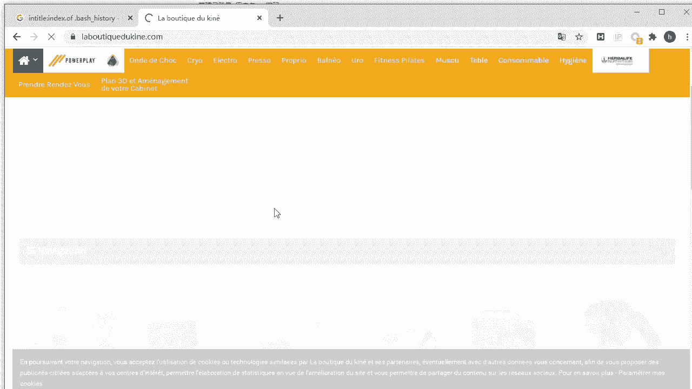
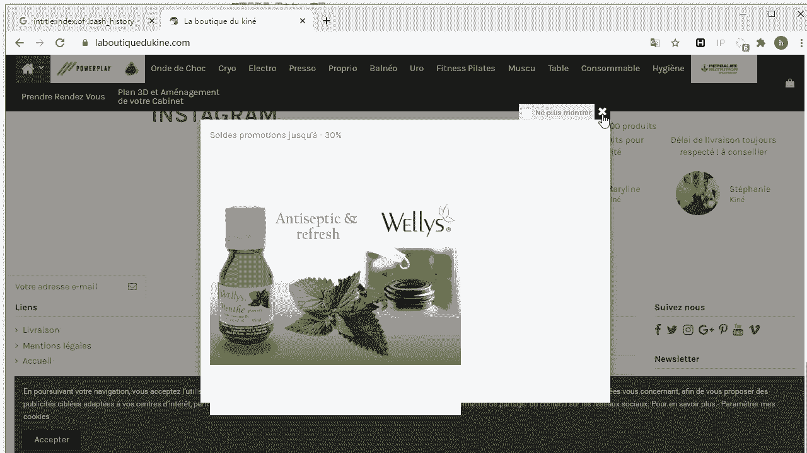
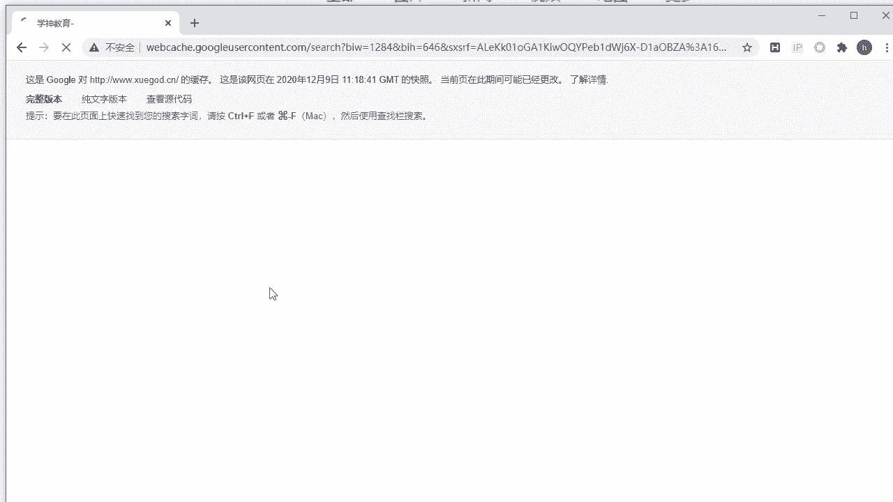
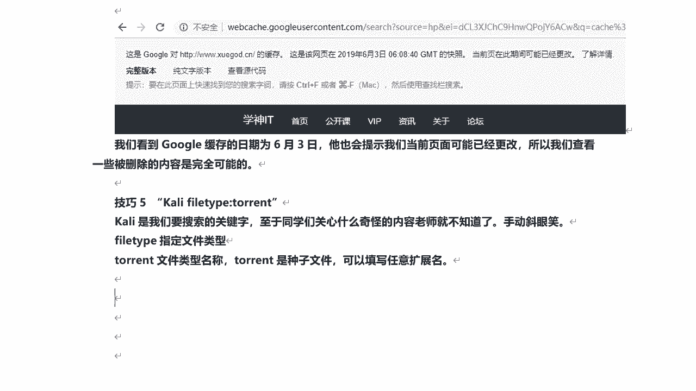
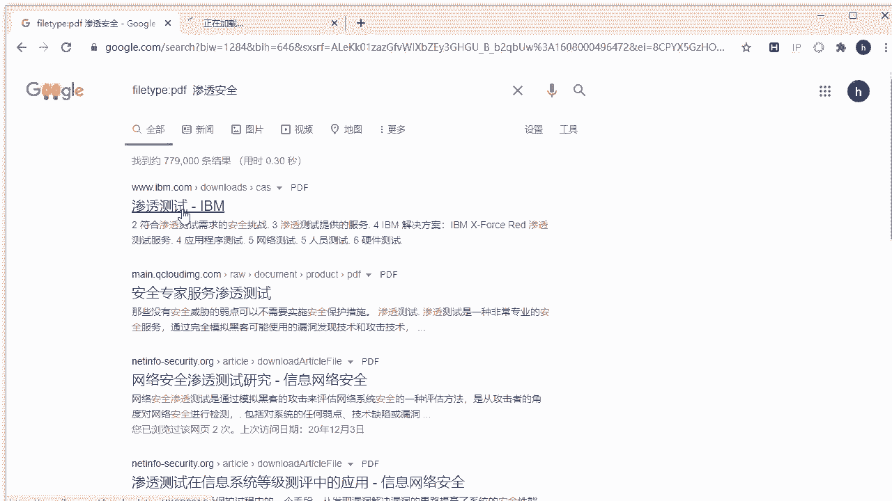
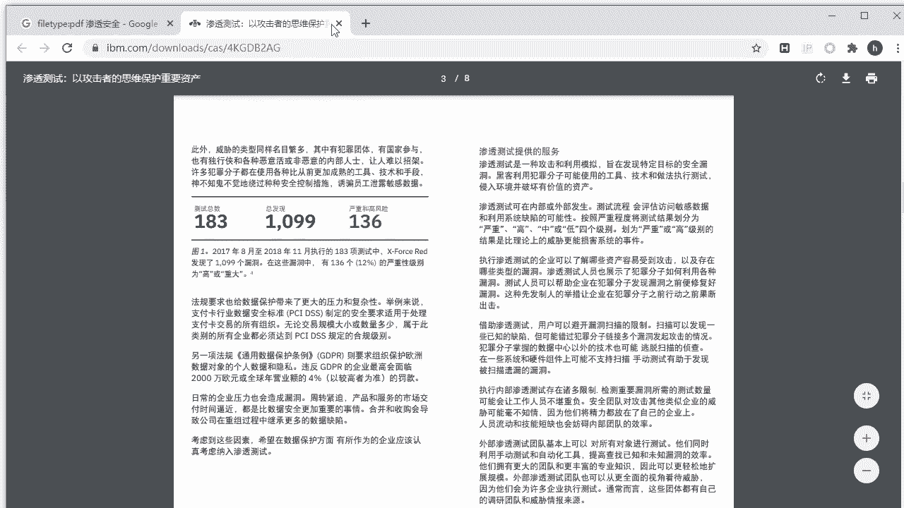
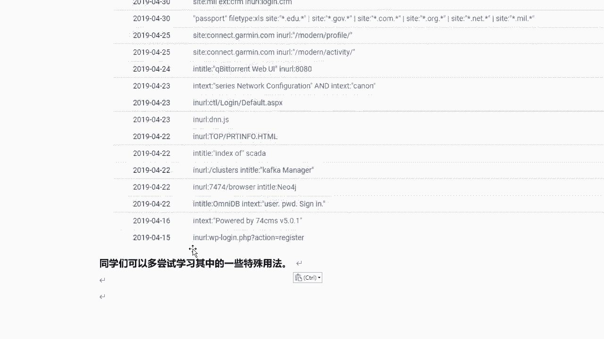

# 课程 P37：7.8 - 【被动信息收集系列】Google搜索引擎的使用技巧 🔍

在本节课中，我们将要学习如何高效地使用Google搜索引擎进行信息收集。掌握特定的搜索语法可以显著提升搜索的效率和准确性，这对于寻找存在漏洞的页面或敏感信息文件至关重要。

## 概述

通常，我们使用自然语言或关键词进行搜索。然而，搜索引擎支持特定的语法规则。熟练运用这些语法，可以更精准地定位目标信息。本节将介绍一些常用的Google搜索语法及其应用场景。

## 常用搜索语法介绍

以下是Google搜索引擎中一些常用且强大的搜索语法。

### 1. `site:` - 指定域名搜索

`site:` 语法用于搜索指定域名下的所有相关信息。其基本格式为：
```
site:example.com
```
这将返回Google收录的关于 `example.com` 的所有页面。

**使用示例与技巧：**
*   搜索特定站点：`site:xuegaz.cn`
*   搜索特定国家顶级域名（如日本）：`site:.jp`
*   搜索特定域名后缀（如 `.com` 或 `.net`）：`site:.com` 或 `site:.net`

`site:` 语法可以与其他关键词组合使用，以在特定站点内搜索更具体的内容，例如存在敏感信息泄露的页面。

### 2. `inurl:` - 在URL中搜索关键词

`inurl:` 语法用于限定在网页的URL地址中进行关键词搜索。其基本格式为：
```
inurl:keyword
```
这将返回URL中包含指定关键词的页面。





**使用示例与技巧：**
*   搜索可能包含账号密码的文件：`inurl:qq.txt`
*   搜索常见的网站后台登录地址：`inurl:admin.php` 或 `inurl:login`
*   组合使用，在特定站点搜索后台：`site:xuegaz.cn inurl:admin`

需要注意的是，通过此方法只能搜索到已被Google收录的页面。未被收录的页面即使存在也无法找到。

### 3. `intitle:` - 在网页标题中搜索关键词

`intitle:` 语法用于在网页的标题标签中进行关键词搜索。其基本格式为：
```
intitle:keyword
```
这将返回网页标题中包含指定关键词的页面。

**使用示例与技巧：**
*   搜索后台登录页面（标题常包含“登录”）：`intitle:登录`
*   搜索存在目录遍历（开放目录）漏洞的页面：`intitle:index.of`
*   搜索开放目录中特定的敏感文件（如 `bash_history` 或 `my.cnf`）：`intitle:index.of bash_history`

`intitle:index.of` 是一个强大的组合，用于发现网站目录列表被意外暴露的情况，这可能泄露服务器上的文件信息。

### 4. `filetype:` - 指定文件类型搜索

`filetype:` 语法用于搜索特定类型的文件。其基本格式为：
```
keyword filetype:extension
```
这将返回包含指定关键词且文件类型为指定扩展名的结果。




**使用示例与技巧：**
*   搜索关于“kali”的种子文件：`kali filetype:torrent`
*   搜索关于“渗透测试”的PDF文档：`渗透测试 filetype:pdf`


此语法有助于快速定位特定格式的学习资料或文件。




### 5. `cache:` - 查看网页缓存



`cache:` 语法用于查看Google对某个网页的缓存版本。其基本格式为：
```
cache:example.com/page
```
即使目标页面已被删除或无法访问，只要Google存在缓存，就可能通过此方式访问历史内容。



### 6. `intext:` - 在网页正文中搜索关键词

`intext:` 语法用于在网页的正文内容中搜索关键词。其基本格式为：
```
intext:keyword
```
这将返回网页内容中包含指定关键词的页面。

## 高级组合搜索技巧

单一的搜索语法功能有限，将多种语法组合使用能实现更复杂、更精确的搜索。

**组合使用示例：**
*   **在特定论坛中搜索关键词**：`apache site:bbs.xuegaz.cn` （在学神论坛中搜索包含“apache”的页面）
*   **搜索子域名**：`site:xuegaz.cn` （直接使用 `site:` 语法常可列出目标的子域名）
*   **搜索暴露的数据库文件**：`intitle:index.of intext:user.sql` （搜索开放目录中内容包含 `user.sql` 的页面）
*   **在特定云服务上搜索敏感表格**：`s3 site:amazonaws.com filetype:xls password` （在亚马逊S3服务上搜索包含“password”的Excel文件）

**⚠️ 重要安全提醒：**
通过此类方法搜索到的文件，在下载和打开时需格外谨慎。攻击者可能故意设置包含恶意软件的文件诱骗用户中招。建议在虚拟机环境中进行检查，并确保系统安装有杀毒软件。

## 总结

本节课我们一起学习了Google搜索引擎的核心使用技巧。我们介绍了 `site:`、`inurl:`、`intitle:`、`filetype:`、`cache:` 和 `intext:` 等关键语法，并探讨了如何将它们组合起来进行高效、精准的被动信息收集。掌握这些技巧是渗透测试和信息收集工作中非常有价值的一环。



课后，你可以进一步探索“Google Hacking Database”（GHDB），其中收录了安全研究人员常用的数百条搜索语法，能帮助你更深入地理解和运用这些技术。