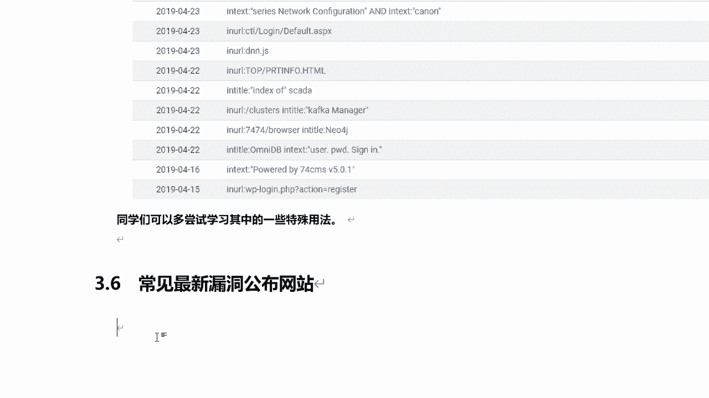
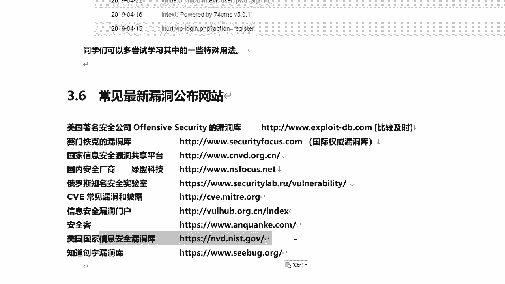
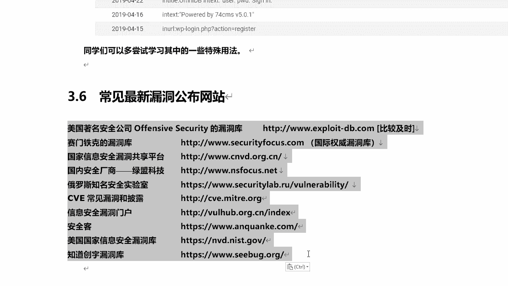
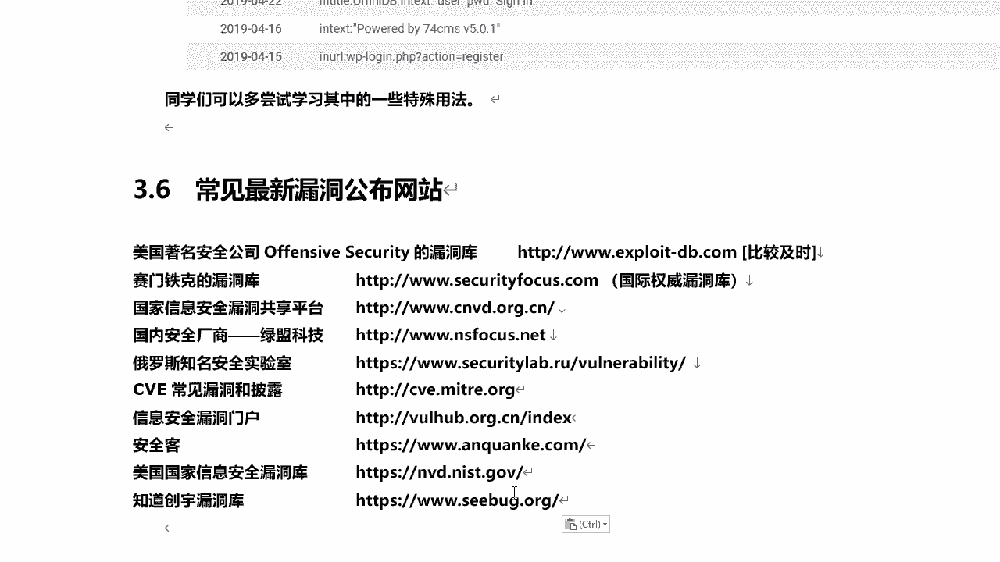
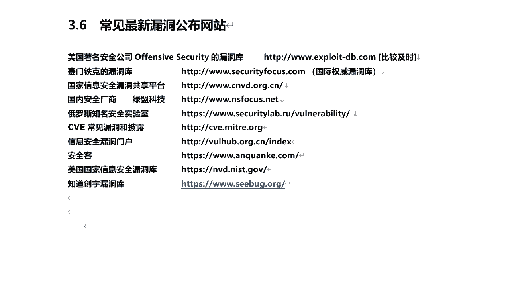
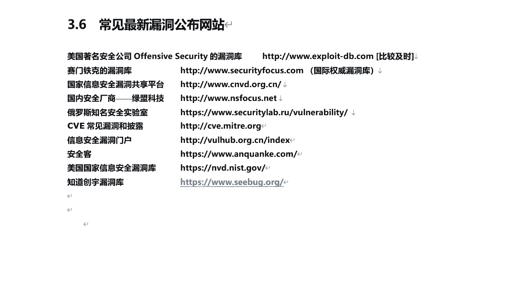
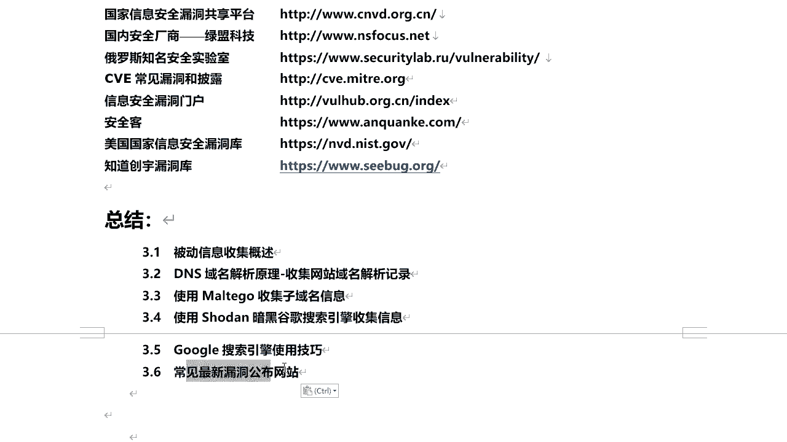

# P38：7.9-【被动信息收集系列】常见最新漏洞公布网站 - 一个小小小白帽 - BV1Sy4y1D7qv

好下面呢给大家介绍一些常见的啊，最新漏洞公布的网站啊，那么通过这些站点呢，我们可以及时去了解啊，最新出现的一些漏洞相关的信息啊，那对于我们学习安全来讲，那么我们必须得时刻关注一些行业的动态。

最新的安全新闻啊，资讯啊对吧，最新的出现了一些漏洞啊，我们对这些漏洞呢进行一些了解和熟悉啊，这对以后你们的发展对或者是你们面试啊，找工作啊都有好处的好吧，我们必须得养成这个习惯好。

那么我们来看都有哪些呢，第一个美国著名安全公司啊，对opensive security的漏洞库，那么这是kelly的对吧对，然后呢注意还有一个这个exploit db。

对他这个漏洞库就是他提供的x ploit db。com，它比较及时，然后包括我们在开裂里面使用设施啊，search ploit，那么这个工具命令去搜索指定的一些漏洞，它使用的就是这个库啊。

这个大家呃用的人比较多啊，比较多，还有赛门铁克的漏洞库啊，这个是国际权威的一个漏洞库啊，还有国家信息安全漏洞共享平台，国内安全厂商绿盟科技的啊，还有俄罗斯知知名的安全实验室这个漏洞库啊。

就是我们都可以去把他们给他收藏一下的啊，都去看一下他经常关注一下的啊，哪个比较及时，都比较及时啊，那么可能有的他没有的最新漏洞，可能这个站点有说要结合在一起，我们去看一下。

他还有c v e常见的漏洞和披露的cv啊，这个站点还有信息安全漏洞门户嗯，还有安全客，还有美国国家信息安全漏洞库。

知道创宇骆驼户等等啊，那么这个是目前给大家收集的这些啊。

大家可以收藏一下，那也就除了这些之外呢，嗯也有可能还存在，还有一些其他的一些漏洞库啊。

对那么这里呢没有提及的，大家如果你们知道了好吧。

也可以自己去收藏，ok好的，那最后呢咱们做一个总结啊。

那么咱们这节课主要讲了哪些东西呢，被动信息收集对吧，然后呢dns域名解析的原理，收集网站域名解析记录和备案信息是吧，域名注册信息使用metal搜集子域名啊，那么为什么要收集主子一名，什么是值域名。

这个大家要整清楚啊，然后使用搜带暗黑谷歌搜索引擎来搜集信息，最后呢我们来讲谷歌搜索引擎的使用技巧，还要给大家分享了一些常见的最新漏洞。

漏洞啊。