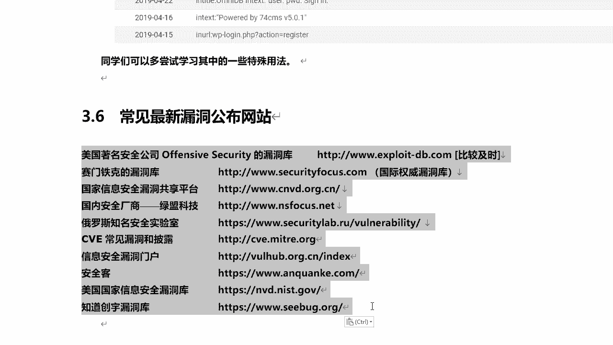
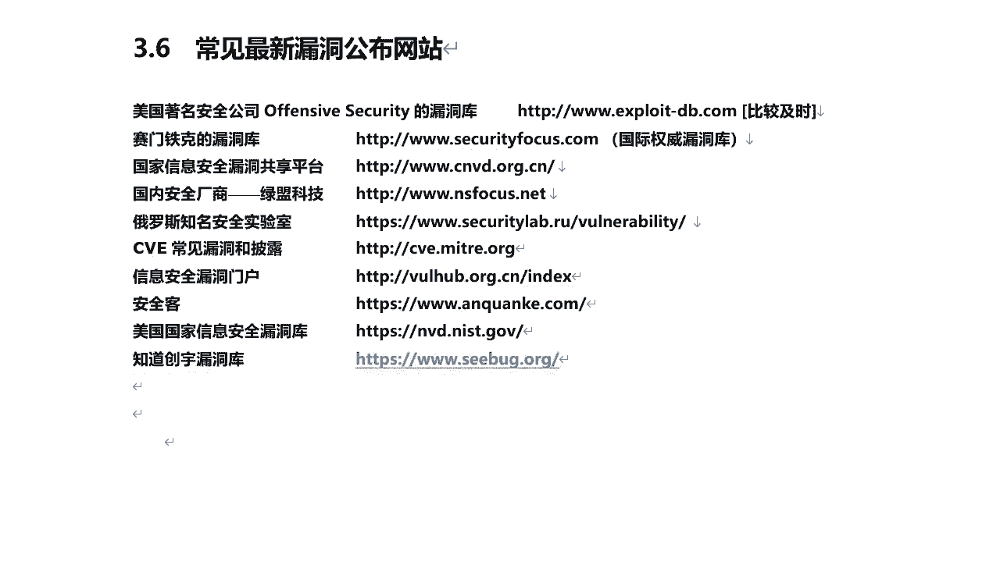
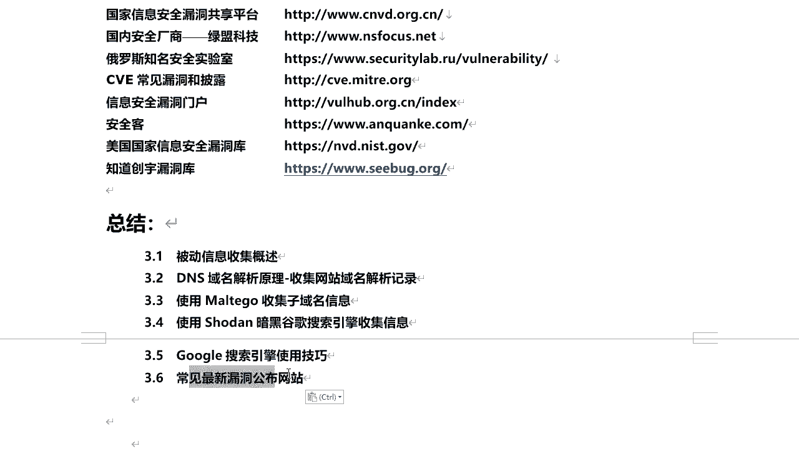

# 课程P38：7.9-【被动信息收集系列】常见最新漏洞公布网站 🔍

在本节课中，我们将学习被动信息收集的一个重要环节：如何通过关注权威的漏洞公布网站，及时获取最新的安全漏洞信息。这对于安全学习者和从业者至关重要。

上一节我们介绍了利用搜索引擎等工具进行信息收集。本节中，我们来看看如何通过专业网站，主动获取最新的漏洞情报。

以下是几个常见且权威的最新漏洞公布网站，建议收藏并定期访问。

*   **美国著名安全公司Offensive Security的漏洞库**：即Kali Linux内置的漏洞库。其提供的 **`exploit-db.com`** 网站更新非常及时。在Kali中使用 **`searchsploit`** 命令搜索漏洞时，调用的正是这个数据库。
*   **赛门铁克（Symantec）漏洞库**：国际权威的漏洞库之一。
*   **国家信息安全漏洞共享平台（CNVD）**：国内重要的漏洞信息共享平台。
*   **绿盟科技（NSFOCUS）漏洞库**：国内知名安全厂商维护的漏洞库。
*   **俄罗斯知名安全实验室漏洞库**：提供国际化的漏洞视角。
*   **常见漏洞和披露（CVE）**：访问 **`cve.mitre.org`** 或 **`nvd.nist.gov`** 可查询标准化的漏洞编号与详情。
*   **信息安全漏洞门户**：另一个综合性的漏洞信息平台。
*   **安全客**：国内活跃的安全资讯与漏洞发布平台。
*   **美国国家信息安全漏洞库（NVD）**：由美国国家标准与技术研究院维护，与CVE深度关联。
*   **知道创宇（Knownsec）漏洞库**：国内知名安全公司的漏洞信息库。

除了以上列举的网站，可能还存在其他有价值的漏洞库。如果你了解到其他可靠的来源，可以自行收藏并关注。

最后，我们来对本节课做一个总结。

本节课中，我们一起学习了被动信息收集的多个方面：从DNS域名解析的原理开始，到如何收集域名解析记录、备案信息和注册信息；接着介绍了使用Metasploit等工具搜集子域名的方法及其重要性；然后讲解了如何利用Shodan、暗黑引擎及谷歌搜索引擎进行信息搜集，并分享了谷歌搜索的高级技巧；最后，我们重点介绍了多个国内外常见的最新漏洞公布网站，帮助你建立持续关注安全动态的习惯。