# P39：8.1-【主动信息收集系列】主动信息收集的原理 - 一个小小小白帽 - BV1Sy4y1D7qv

大家好，我是讲师root，那么今天呢给大家讲一下主动信息收集，那首先呢我们来了解主动信息收益的原理，然后呢基于拼命令的探测，然后基于n map的扫描方式啊，然后接着实战使用sky定制数据包。

来进行高级扫描，最后呢我们来学下僵尸上庙啊，首先呢我们来看主动信息收集的原理啊，那么主动信息收集它有什么特点呢，首先呢它直接与目标啊系统直接交互通信啊，这样呢无法避免的会留下访问的痕迹。

那么怎么可以去避免留下痕迹呢，那么可以使用受控的第三方电脑来进行探测，就比如说是肉鸡，或者是使用代理或已经被控制的机器啊，同时呢要做好被封杀的准备，对因为目标机可能会存在一定的防御措施啊。

比如防火墙啊对吧，i d i p s对吧，如果你扫描的频率如果过大的话，有可能你的ip会被封啊，那么通过扫描发送不同的探测呢，根据它的返回结果来判断呢目标的一个状态啊，好的，那么如何去发现啊。

目标主机呢，也就是发现目标主机的一个过程是什么样的，首先啊我们要去识别存活的主机，发现潜在的被攻击目标，那么所谓存活的，那么有这台电脑是在线的联网的对吧，你能探测到的啊，那么只有这样才这样的主机。

才是你真正攻击的一个目标，然后同时呢通过输出一个ip地址地址列表，比如说ip呀地址段啊或ip呀地址范围啊，然后使用234层，然后进行探测发现那说到234层啊，探测发现。

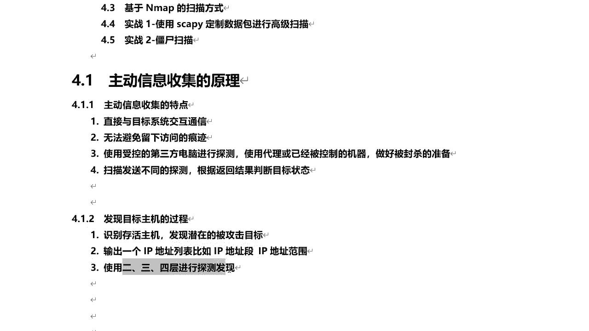

那么这里我们不得不了解一下的osi啊，七层模型和tcp ip 5层模型啊，那么所谓的o s i啊，那么七层模型啊，那么什么是osi呢，o si啊，那么它是开放系统互联啊，那也是在1983年或者84年啊。

i i o它是国际标准化委员会啊，设计并推出的一套对网络行业的一个标准啊，实现整个网络行业的一个兼容性，那么o i i参考模型呢，那么它从上到下啊，那么就是七七层是应用层，六层表示层，五层绘画层对吧。

四层三层，二层一层啊，那么每一层呢代表不同的含义，那么这主要是应用层对吧，主要代表什么，表示成代表什么，下面呢我给大家来说一下的好吧，那么这里呢我们只针对os啊。

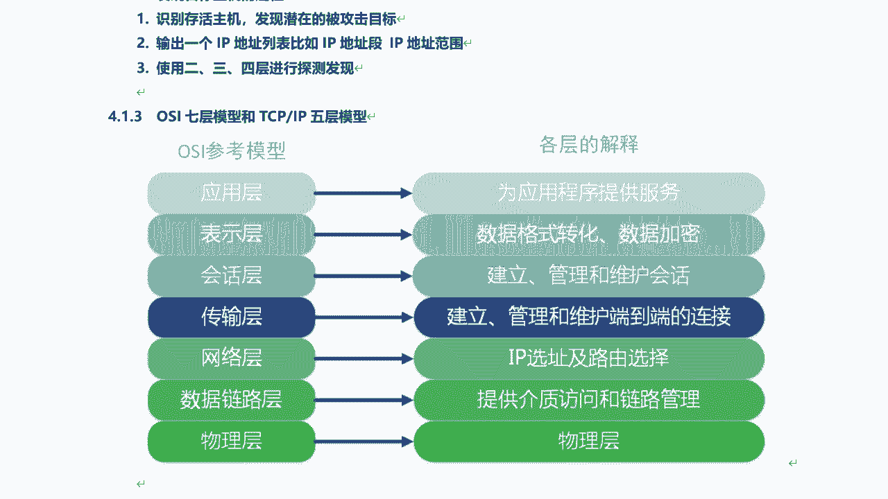

各种功能上进行大概的一个阐述啊，不详细的深究啊，那如果大家想详细的去了解的话，大家可以去看一些相关的网络，相关的一些知识啊，因为每一层啊实力都是一个复杂的层啊，后面呢我也会根据个人发展方向。

展开部分层的一个深入学习啊，这里面呢我们大概了解一下它好吧，那我们从最顶层与应用层开始，给大家介绍一下整个过程呢，比如说以公司a和公司b的一次商业报价单啊，发送为例来给大家进行讲解啊。

那么首先我们来看啊第七层。

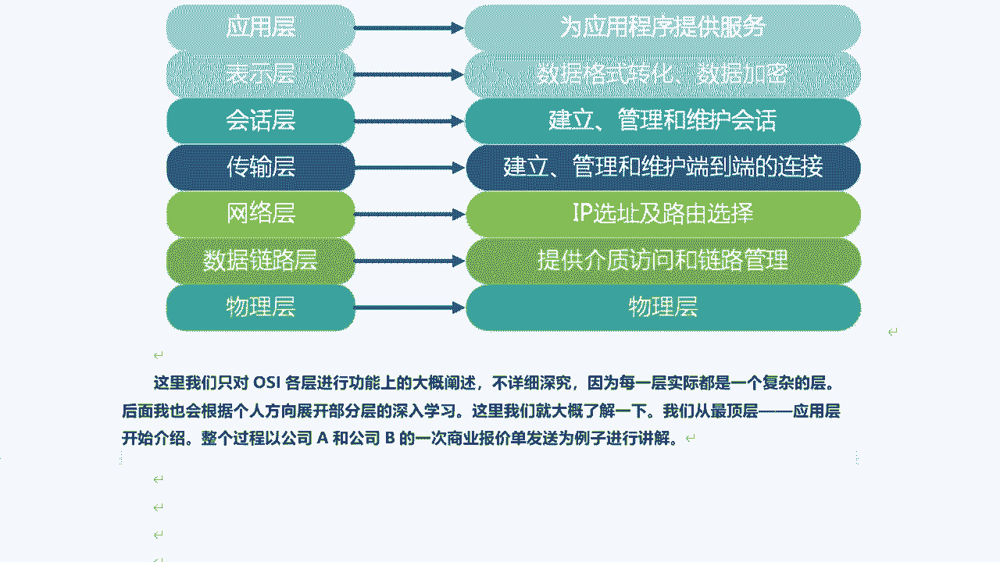

那么第七层是应用层，那么什么是应用层面，那么为特定的类型的网络应用，提供了访问osi环境的一个手段啊，说白了，那么应用层它主要是为用户提供软件啊，接口或界面啊，那么比如说我们常常经常用的即时通信软件。

比如微信qq啊，陌陌麦麦钉钉等等，还有一个购物软件，天猫啊，京东啊，还有一些影音类的风行啊，p p s爱奇艺，腾讯视频等，这些都是在应用层，它属于应用软件类啊，那么这个层主要针对的协议有哪些呢。

主要有这些啊，比如说h t t p i t p s f t p对吧，turn s h s m tp pop 3等啊，那么这是应用层好。

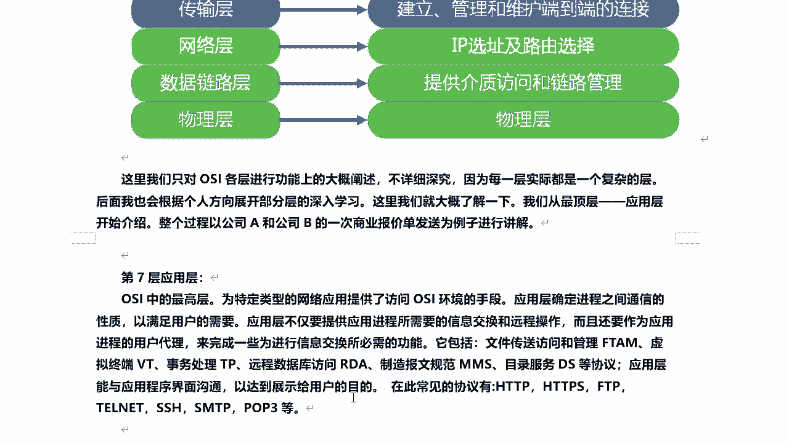

那么下面呢我们来看一下的六层啊，六层是什么表示层啊，那么所谓的表示层，主要是用于处理两个通信系统中啊，交换信息的一个表示方式啊，那么这里说到表示方式，它就包括什么数据格式交换数据加密与解密。

还有数据压缩与终端类型的一个转换啊，那么说白了它主要是什么对用户数据对吧，进行数据呈现啊，包括数据格式，比如说a v i呀，r n m b m k v d o c是吧，xl s啊。

表格还有p p t等啊，那么这个呢是表示成好，我们看第五层啊。

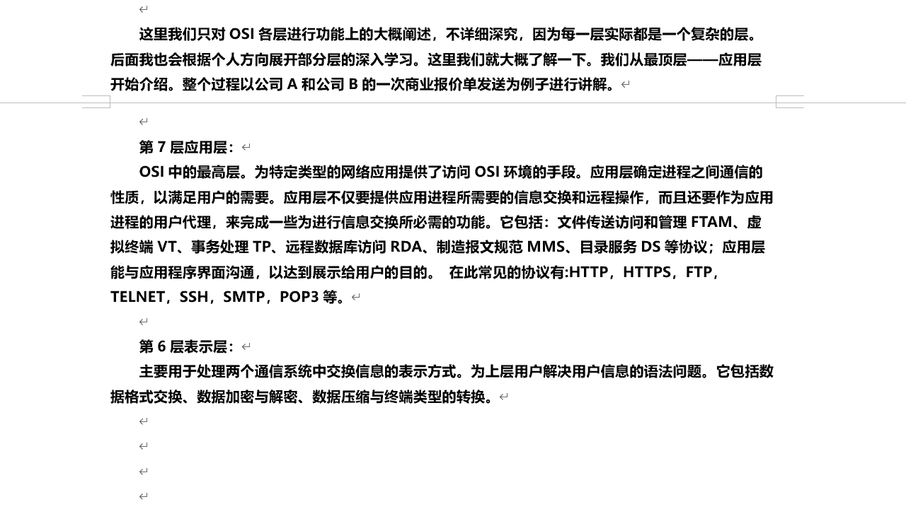

第五层是绘画成，那么所谓的绘画程啊，那么它呢是在两个节点之间建立端连接啊，那为端系统的应用程序之间提供啊，那对话控制机制好吧，那么这里呢给大家简单的说一下啊，那么所谓的绘画层主要是用于金融化。

绘画管理啊，那包括建立绘画，维持绘画，关闭和区分绘画，举个简单的例子，比如说我们打开浏览器，输入一个域名，访问一个站点好，那么当你打开这个网站的时候，相当于就建立一个绘画是吧。

对那么它的实际完成了一个什么连接啊，tcp 3次握手建立绘画了，建立后呢它会维持这个话。

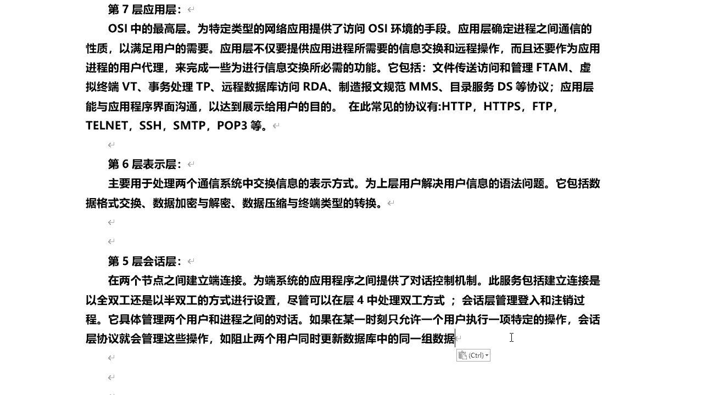

直到你把这个网页关掉了，那这绘画就关闭了啊，那么这是绘画成下面呢我们来看一下第四层。

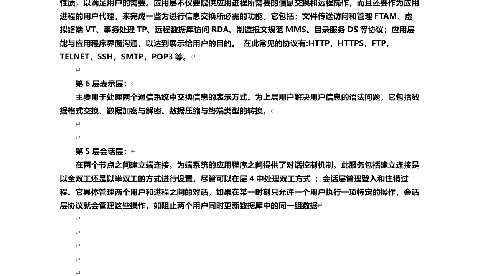

也就是传输层，那么传输层主要是建立了主机啊，端口到端口的这么一个链接啊，那么传输层的作用是为上层协议，上层的时候绘画成对，提供呢，端口到端口的可靠和透明的一个，数据传输问题啊。

那么其中就包括处理差错控制和流量控制啊，等问题，那么这里呢传输层主要是用来什么，主要实验数据的可靠或不可靠传输。

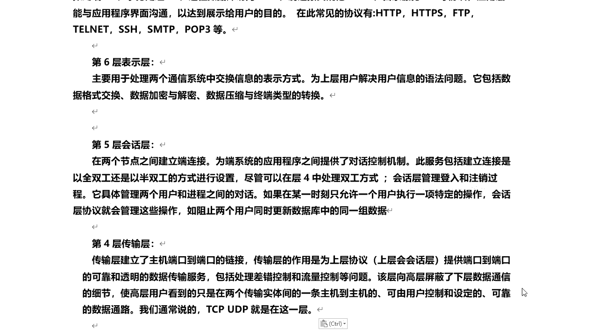

对那么t t p就在ud p就在这一层，那么这里呢tcp是什么可靠传输的啊，u d p呢是不可靠的啊，后面咱们也会讲tcp 3次握手啊，好那么我们再往下看第三层，第三层呢是网络层。

那么这个层主要是通过ip寻址来建立，两个节点之间的一个连接好吧，为原端的运输层运来的分组啊，选择合适的路由和交换节点，正确无误的按照地址就是ip地址对吧，传送给目的端的运输层啊。

那么这个传说主要是用来的吗，对这个网络层网络层的时候，提供什么路由寻址啊，ip寻址和三层通信也是路由器对吧，那么这层主要是什么ip协议网络层，好的。

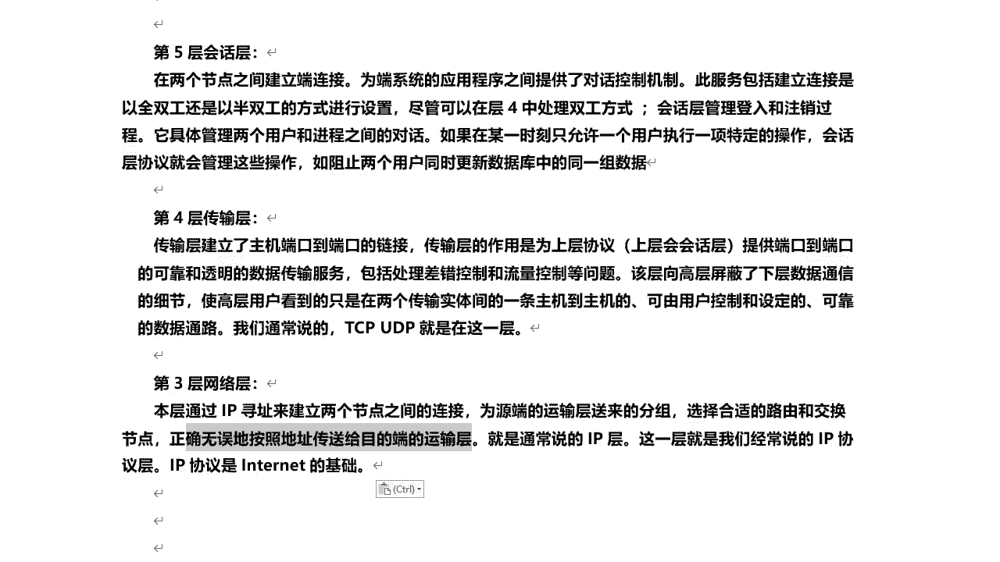

那再看看二层，二层的是数据链路层对，那么链路层呢主要是将比特啊组合成字节，然后再将字节组合成真，然后使用链路层地址，这个链路层地址主要是什么，mark地址，有网卡地址，也叫物理地址啊。

那么通过它来访问介质啊，并进行了吗，差错检测好吧，那么链子主要层链路层主要提供了二层寻址，就是mark地址和二层二层通信，这里主要针对的设备就是交换机啊对吧，内网啊，说白了就是内网啊。

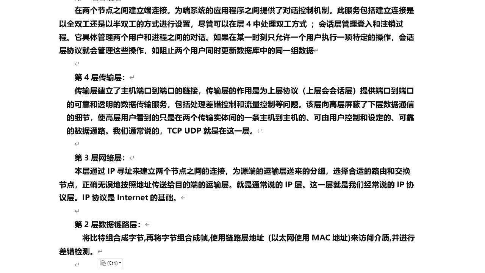

第一层也是最底层，那么是物理层嗯，物理层呢主要是处理osi参考模，运行的一个最最底层，那么它的主要功能呢是利用物理传输介质，为数据链路层提供一个物理连接啊，说白了就是常用的一些物理设备了。

所以叫什么网卡呀，集线器呀，中继器，调制解决器，解调器啊，网线双绞线这些都在什么都在物理层好吧，那么这是关于osi 7层模型啊，那么我们简单来总结一下的，那么整个局域网啊，那么局域网内啊。

局域网内它涉及到什么mac地址，交换机和链路层对吧，二层链路层属于局域网的，那么广域网呢对，那么ip地址路由器和它属于网络层的网络层，对吧，那正常一个数据传输啊对吧。

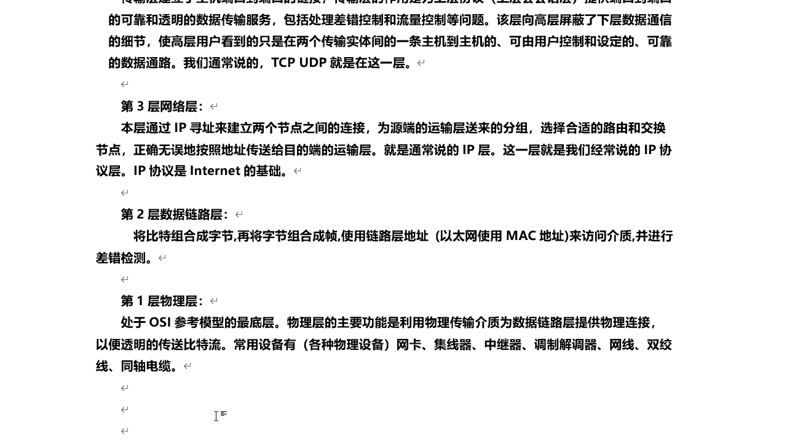

发送那比如说我们来对，那么公司a和公司b的一次商业报价单发送啊。

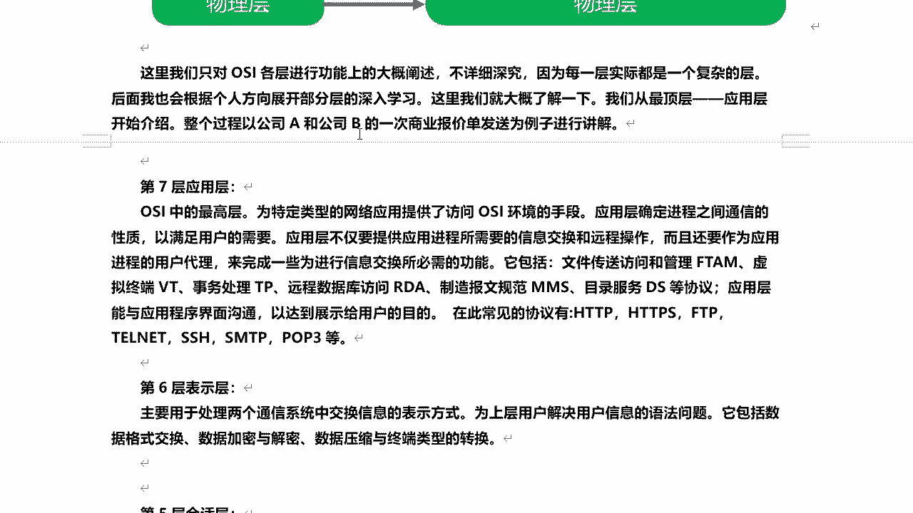

那么他是怎么发送的呢，对啊，那么就像我们正常邮寄一个包裹一样对吧，那么邮寄一个包裹怎么去邮寄啊，对啊哎呀，那么就是填写单的对吧，有地址啊，姓名啊，电话是吧，得有地址吧对吧，得有姓名是吧。

然后呢去直接邮寄给对方啊，那么这里呢在链路层链路层，那么这个交换机啊就相当于快递员啊，取货送货的好吧，那么网络层路由器，那么就相当于物流的货车啊，或者是飞机是吧，那么其中的这个mac地址和ip地址。

就相包裹当中的一个快递单是快递单，那么你通过ip对吧，哎那么发送给目标啊，那个ip地址对吧，然后呢到它它本地收到之后呢，再通过mac地址，mac地址是局域网内的每台机器的网卡地址对吧。

通过它呢找到哎这台机器也发送给他吗，是吧对，然后呢在本季之后呢，对那每个应用针对是不同的端口，再通过端口找到吗，他接收到具体的一个数据包啊，数据包好的，那么这个是关于啊对osi 7层模型嗯。

那么tcp ip 5层模型对吧，那么它是怎么回事。

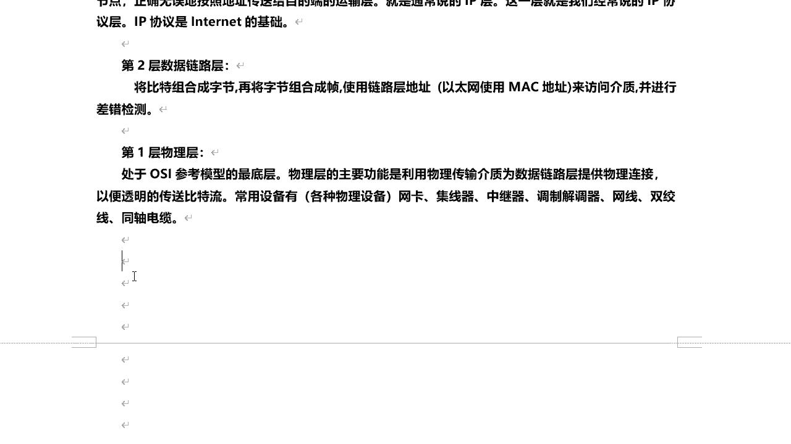

它其实就是将osi参考模型中的sun啊，最顶的那样的三层应用层表示层和绘画层合并，为什么应用层啊，好的，这个呢我们来了解一下它，那么这里呢对应的一个网络设备好吧。

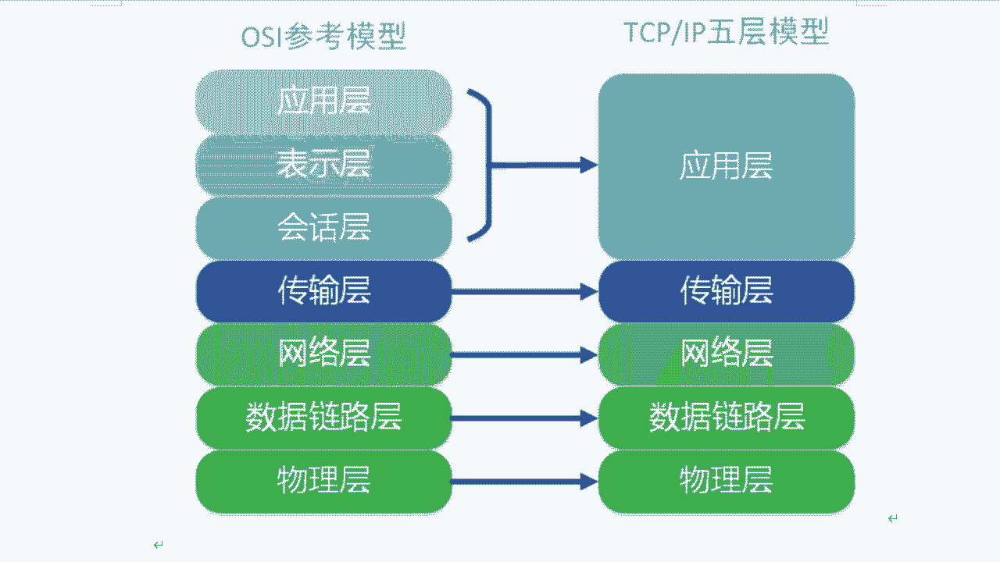

那么是比如说每一层啊，针对的是什么样的网络设备，都有什么网络设备啊，物理层啊，针对的是路中继器对吧，集线器还有双绞线，数据链路层呢主要有网桥啊，以太网交换机啊，网卡啊对吧，这层呢属于内网。

那广域网网络层属于广域网的啊，它有路由器啊，三层交换机，路由器君子吗，对ip协议ip协议，然后传输层呢主要四层交换机啊，四层的路由器tcp udp协议啊，那么应用层对吧。

那主要是有什么对htp f t b t net这些协议啊。

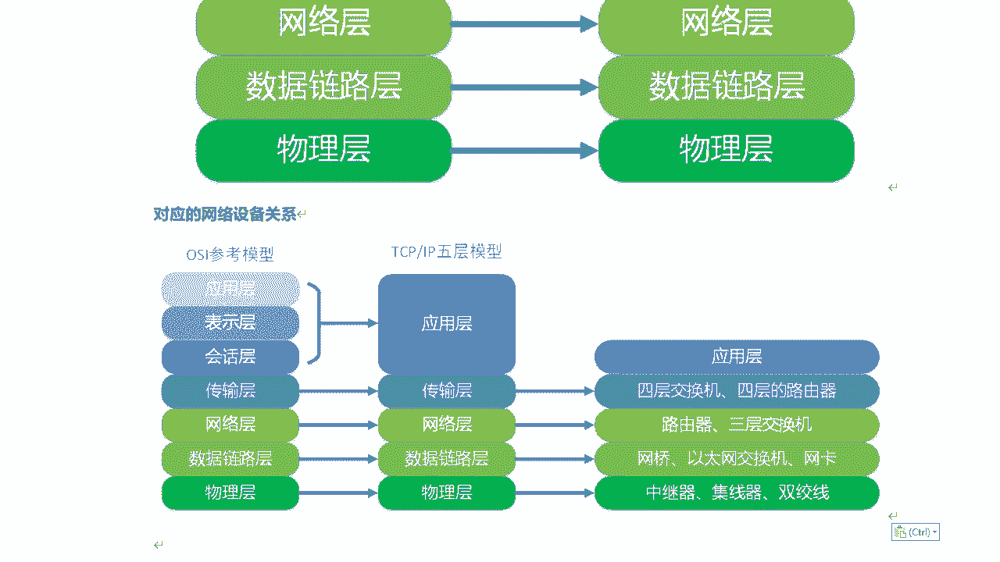

下面呢我们来看看这张图，每一层啊，他针对的协议啊有哪些是吧。

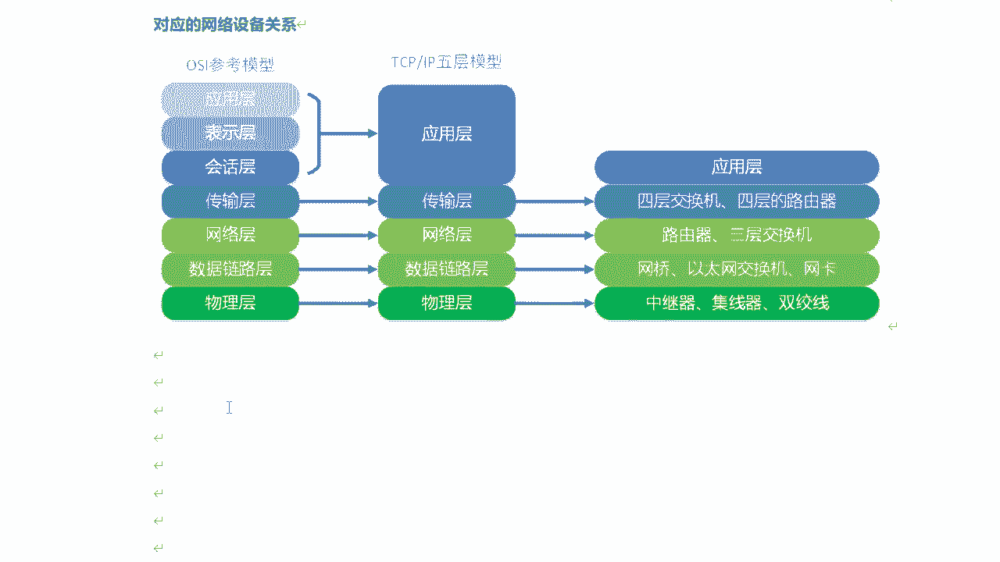

来那其实这个是我们所要关注的，我们在进行信息收集的时候对吧，要进行234层探测发现，那么二层就是链路层，网络层和传输层，234层，那么主要是利用这些协议对吧，进行信息收集，a r p i p协议啊。

s m p t c p u d p对这些协议啊好的，那么基于啊osi模型我们进行扫描啊，信息收集和探测。

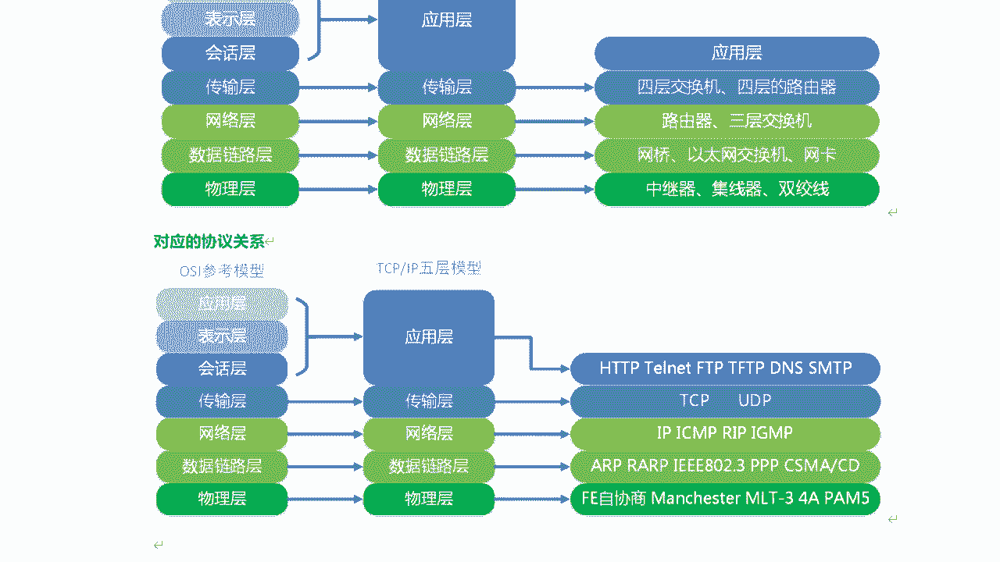

那么它呢优缺点我们了解一下的好吧，那首先我们看二层上描的优缺点，那所谓二层就是链路程呗对吧，那么优点呢就是扫描的速度快，而且是可靠的，缺点呢是不可路由对啊。

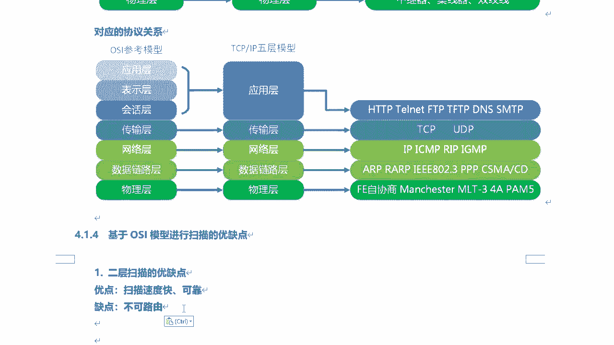

二层链中是不可路由的啊，那二层主要是什么交换机好，那么三层呢对三层主要是网络层对吧，优点呢是可路由，而且速度是较快的啊，速度它比二乘慢，经常被边界防火墙过滤啊，主要是使用的是ib和i c m b协议啊。

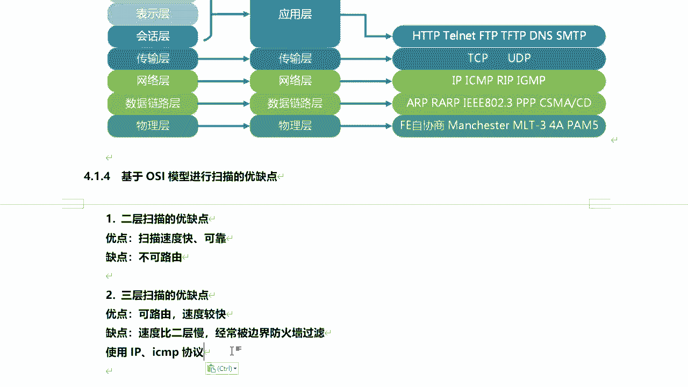

然后四层扫描，四层主要是传输层对吧，唉传说主要就是tcp udp协议，可路由器结果是可靠的啊，优点啊不太可能啊，被防火墙过滤啊，那么可以发现所有端口都被过滤的主机啊，这个是优点好吧，那么缺点呢。

那么这里缺点主要是记忆状态过滤的防火墙，可能会被过滤扫描啊，而且全端口扫描的速度呢是比较慢的啊。

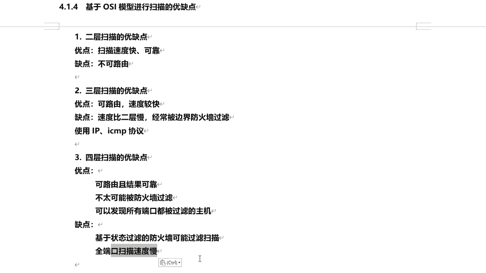