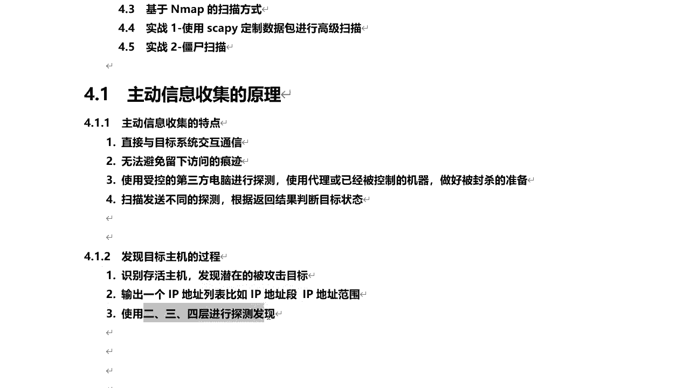
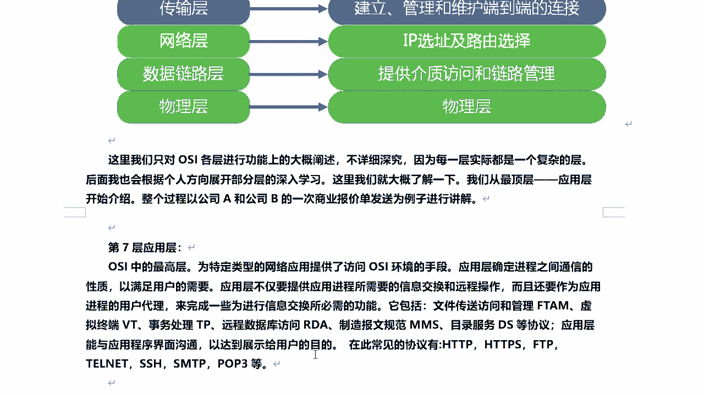
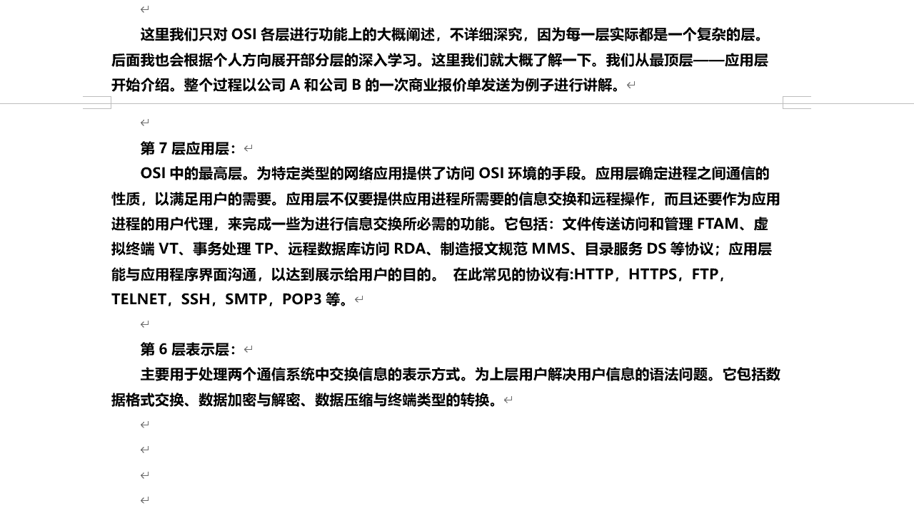
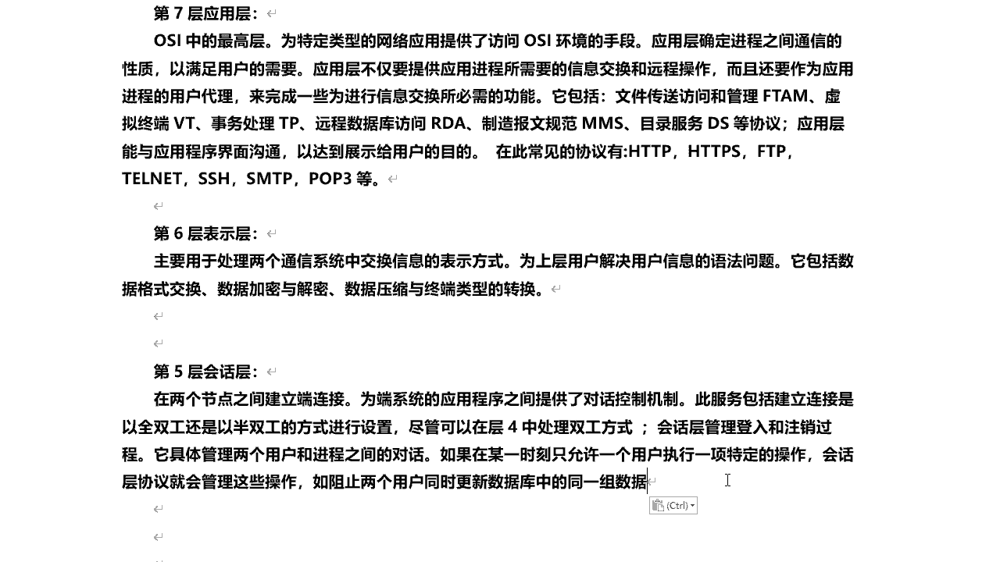
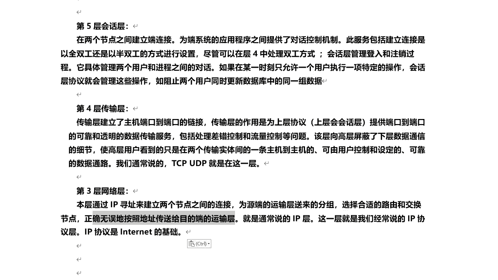
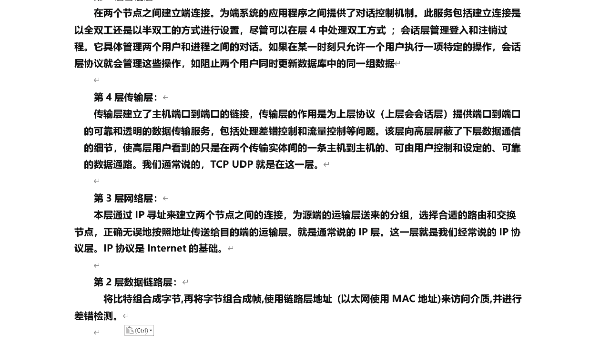
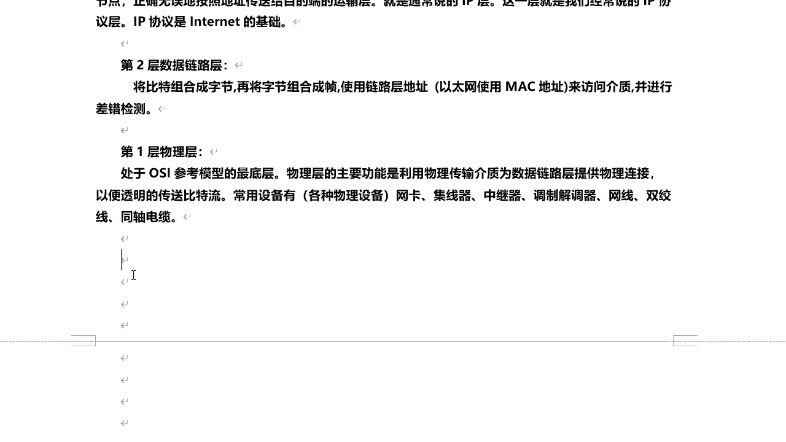
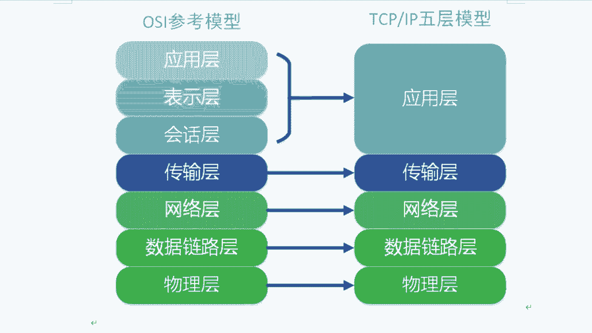
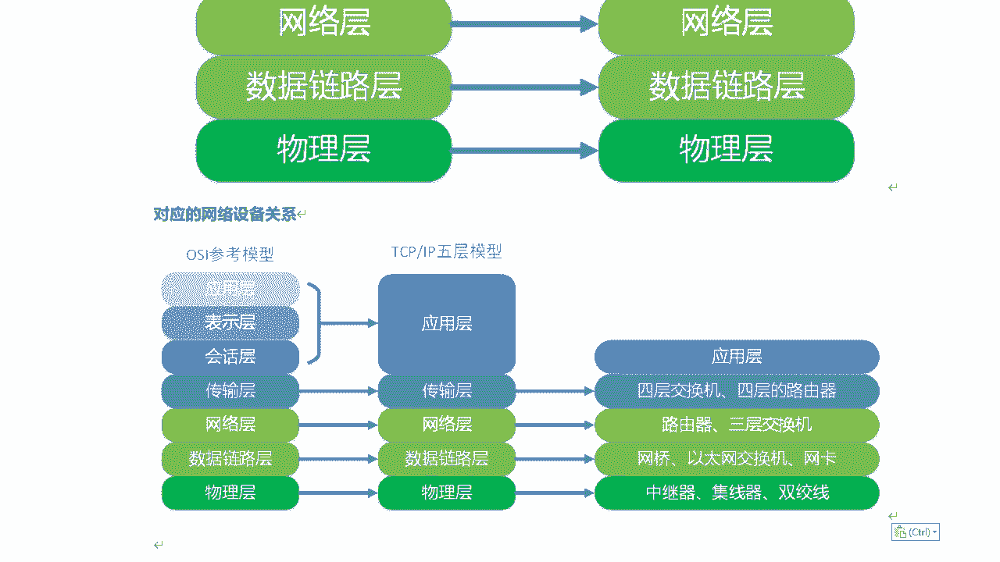
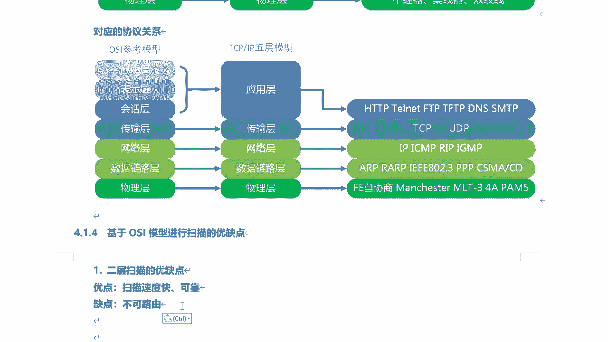

# 课程P39：8.1-【主动信息收集系列】主动信息收集的原理 🎯

## 概述
在本节课中，我们将要学习主动信息收集的基本原理。我们将从主动信息收集的特点入手，了解如何发现目标主机，并深入探讨OSI七层模型与TCP/IP五层模型，理解不同网络层次在信息收集中的作用。最后，我们会分析基于不同网络层进行扫描的优缺点。

---

## 主动信息收集的特点
主动信息收集是指直接与目标系统进行交互通信。这种方式无法避免地会留下访问痕迹。

为了避免留下痕迹，可以使用受控的第三方电脑进行探测，例如使用“肉鸡”（被控制的计算机）或代理服务器。同时，需要做好IP地址被封禁的准备，因为目标系统可能部署了防火墙、IDS/IPS等防御措施。如果扫描频率过高，攻击者的IP可能会被封锁。

通过向目标发送不同的探测数据包，并根据其返回的结果，可以判断目标系统的状态。

---

## 发现目标主机的过程
发现目标主机的过程通常遵循以下步骤：
首先，需要识别网络中存活的主机，即那些在线且可被探测到的设备。只有存活的主机才是潜在的攻击目标。
其次，需要生成一个目标IP地址列表，这个列表可以包含单个IP、IP地址段或IP地址范围。
最后，利用OSI模型中的第二层（数据链路层）、第三层（网络层）和第四层（传输层）协议进行探测和发现。

---

## OSI七层模型与TCP/IP五层模型
为了理解第二、三、四层探测，我们有必要了解OSI七层模型和TCP/IP五层模型。

**OSI模型**（开放系统互联模型）由国际标准化组织（ISO）设计，旨在实现网络行业的兼容性。它将网络通信分为七层，从上到下依次是：

*   **第七层：应用层**
    *   为特定类型的网络应用提供访问OSI环境的手段。它主要为用户提供软件接口或界面。
    *   常见协议包括：`HTTP`, `HTTPS`, `FTP`, `Telnet`, `SSH`, `SMTP`, `POP3`。

*   **第六层：表示层**
    *   处理通信系统间交换信息的表示方式，包括数据格式转换、加密解密、数据压缩等。
    *   它负责数据的呈现，例如处理`AVI`、`RMVB`、`DOC`、`XLS`等格式的文件。

*   **第五层：会话层**
    *   在两个节点之间建立、维持和终止会话（连接）。它为应用程序之间的对话提供控制机制。
    *   例如，浏览器访问网站时建立的TCP连接就是一个会话。

*   **第四层：传输层**
    *   建立主机端口到端口的连接，为上层协议提供可靠或不可靠的数据传输服务，处理差错控制和流量控制。
    *   核心协议是**TCP**（可靠传输）和**UDP**（不可靠传输）。

*   **第三层：网络层**
    *   通过**IP寻址**来建立两个节点之间的连接，为数据包选择路由。
    *   核心协议是**IP协议**，主要设备是路由器。

*   **第二层：数据链路层**
    *   将比特组合成帧，使用**MAC地址**（物理地址）访问介质，并进行差错检测。
    *   主要提供二层寻址和通信，核心设备是交换机，属于局域网范畴。

*   **第一层：物理层**
    *   利用物理传输介质（如网线、光纤）为数据链路层提供物理连接。
    *   涉及网卡、集线器、中继器等物理设备。

**TCP/IP五层模型**则将OSI模型的应用层、表示层和会话层合并为**应用层**，其他层次基本不变。

---

## 数据传输类比
我们可以用寄送包裹来类比网络数据传输：
*   **数据包**如同包裹。
*   **MAC地址**和**IP地址**如同包裹上的快递单，其中IP地址用于广域网寻址（找到哪个城市哪个小区），MAC地址用于局域网内最终定位（找到具体哪户人家）。
*   **交换机**如同快递员，负责在局域网内“取货送货”。
*   **路由器**如同物流货车或飞机，负责在不同网络间运输数据包。
*   最终，数据到达目标主机后，通过**端口号**找到具体的接收应用程序。

---

## 基于不同网络层扫描的优缺点
上一节我们介绍了OSI模型，本节我们来看看基于不同网络层进行扫描的优缺点。

以下是各层扫描的特点：

**第二层（数据链路层）扫描**
*   **优点**：扫描速度非常快，结果可靠。
*   **缺点**：不可路由，只能在同一个局域网（LAN）内进行。

**第三层（网络层）扫描**
*   **优点**：可以跨路由，扫描速度较快。
*   **缺点**：经常被边界防火墙过滤。主要使用`IP`和`ICMP`协议（如`ping`命令）。

**第四层（传输层）扫描**
*   **优点**：可以路由，结果可靠，不太可能被简单的防火墙完全过滤，能够发现所有端口都被过滤的主机。
*   **缺点**：可能被具备状态检测功能的防火墙过滤，进行全端口扫描时速度较慢。

---

## 总结
本节课中，我们一起学习了主动信息收集的核心原理。我们了解了主动收集会留下痕迹的特点及应对策略，明确了发现目标主机的基本流程。通过深入剖析OSI七层模型和TCP/IP五层模型，我们掌握了每一层的功能与核心协议。最后，我们分析了基于第二、三、四层进行网络扫描的优缺点，为后续学习具体的扫描工具和方法奠定了坚实的理论基础。