# 课程P4：1.3 - 网络安全基础-白帽守则（下）🛡️

在本节课中，我们将学习如何对一台新安装的Linux服务器进行基础安全配置，并将其封装为可重复使用的模板机。核心内容包括配置静态IP地址、安装必要工具、关闭不必要的服务以及创建虚拟机快照。

---


## 一、 配置静态IP地址

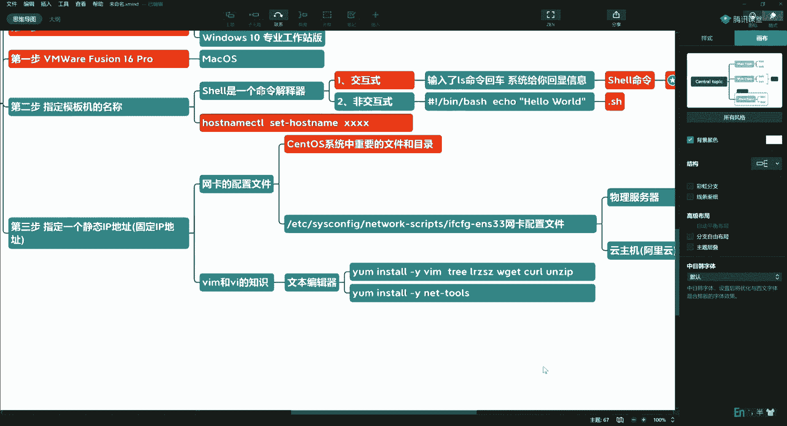

上一节我们介绍了服务器初始化的概念，本节中我们来看看如何配置静态IP地址。这是拿到服务器后必须做的一件事，因为动态分配的IP地址在每次启动时都可能变化。

网卡配置文件位于Linux系统中一个非常重要的目录下。这些重要的文件和目录是安全监控的重点，例如可以编写脚本监控其MD5值是否被篡改，一旦变化就触发告警。


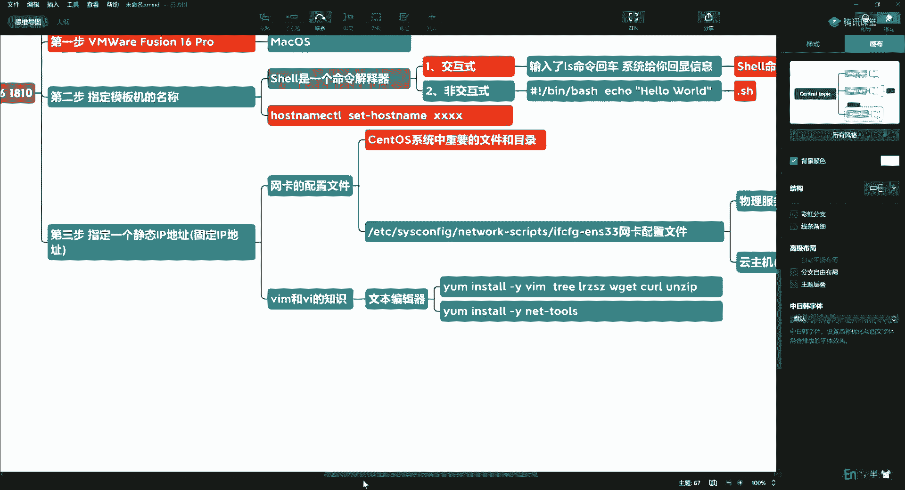

网卡配置文件的具体路径是：`/etc/sysconfig/network-scripts/`，文件名通常为 `ifcfg-ens33`。

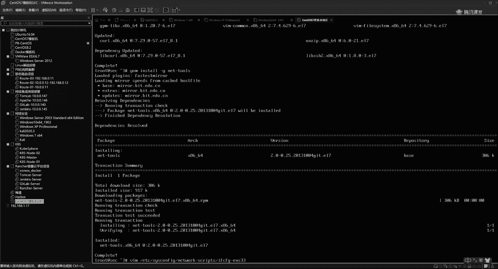

以下是不同环境下网卡名称的区分：
*   **物理服务器**（如戴尔品牌）：网卡名称通常为 `em1`， `em2`， `em3`， `em4`。
*   **云主机**（如阿里云）：网卡名称通常为 `eth0`。


编辑配置文件需要使用文本编辑器，例如 `vi` 或 `vim`。如果系统未安装，可以使用以下命令安装：
```bash
yum install -y vim
```

## 二、 安装必要工具

在配置系统前，我们需要安装一些常用的工具，以便后续操作。

以下是需要安装的工具列表：
*   `vim`： 强大的文本编辑器。
*   `telnet`： 用于测试网络连接。
*   `lrzsz`： 提供 `rz`/`sz` 命令，方便文件上传下载。
*   `wget`： 从网络下载文件的工具。
*   `curl`： 传输数据的命令行工具。
*   `unzip`： 解压ZIP压缩包。
*   `net-tools`： 提供 `ifconfig` 等传统网络工具（CentOS 7 默认可能未安装）。

安装命令如下：
```bash
yum install -y vim telnet lrzsz wget curl unzip net-tools
```
系统可能使用国内的软件源（如阿里云、清华大学、中科大的镜像源），如果下载速度不理想，可以根据自身网络情况更换为访问最快的源。

## 三、 编辑网卡配置文件

必要的工具安装完成后，我们开始修改网卡配置文件以设置静态IP。


使用 `vim` 编辑配置文件，例如：
```bash
vim /etc/sysconfig/network-scripts/ifcfg-ens33
```
在 `vim` 编辑器中，按下 `i` 键进入插入（编辑）模式。

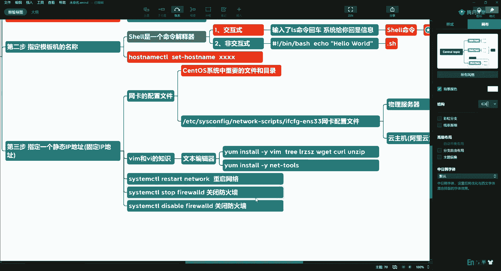

需要修改或确认以下几处关键配置：
1.  **BOOTPROTO**： 将 `dhcp` 改为 `static` 或直接删除该行。
2.  **UUID**： 删除 `UUID` 这一行，这在克隆虚拟机时有助于避免MAC地址冲突。
3.  **IPADDR**： 设置固定的IP地址，例如 `192.168.10.128`。
4.  **NETMASK**： 设置子网掩码，例如 `255.255.255.0`。
5.  **GATEWAY**： 设置网关地址。此地址需与VMware虚拟网络编辑器（VMnet8）中NAT设置的网关IP一致。
6.  **DNS1**： 设置DNS服务器，可以设置为网关地址，或公共DNS如 `114.114.114.114`， `8.8.8.8`。

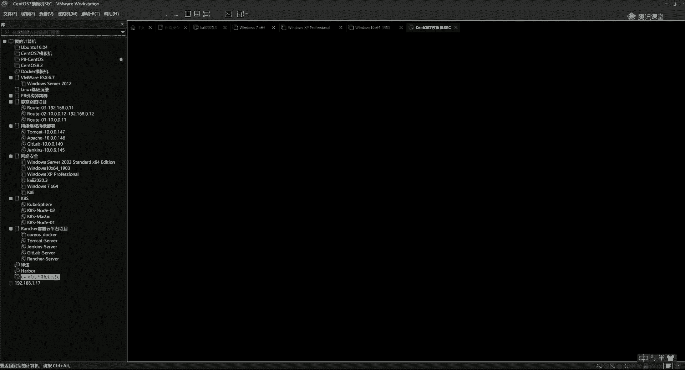

配置完成后，按下 `ESC` 键退出编辑模式，然后输入 `:wq` 保存并退出。最后，重启网络服务使配置生效：
```bash
systemctl restart network
```
可以使用 `ip a` 命令检查IP地址是否已更新。

## 四、 关闭防火墙并设置开机禁用

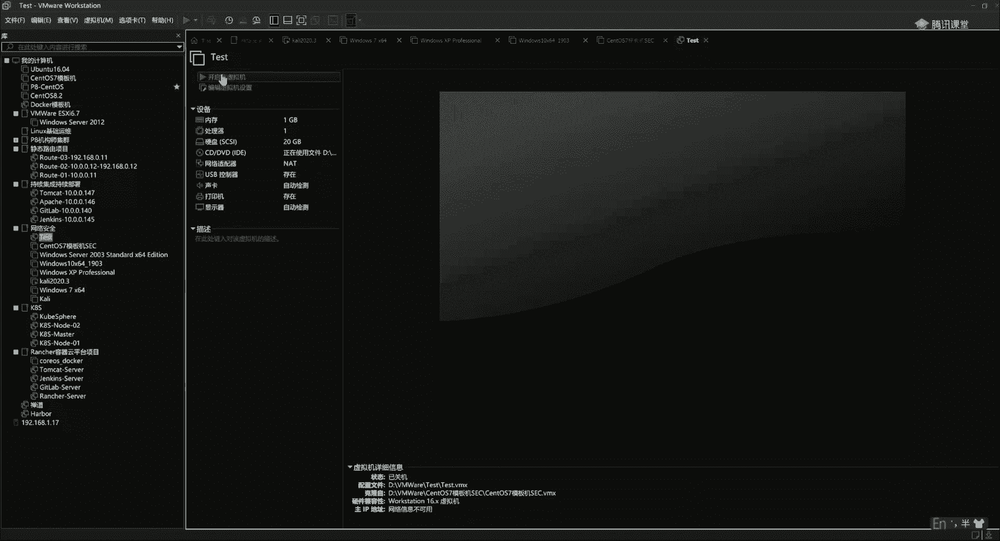

为了在实验环境中减少干扰，我们通常关闭防火墙。在生产环境中请谨慎操作。

以下是关闭防火墙并禁止其开机的命令：
```bash
systemctl stop firewalld      # 停止防火墙服务
systemctl disable firewalld   # 禁止防火墙开机自启
```

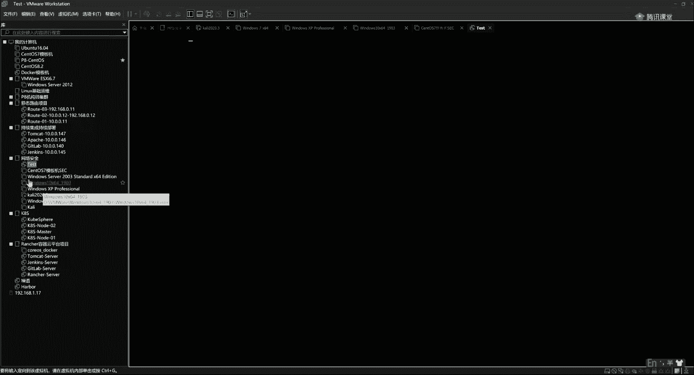

## 五、 封装模板机与克隆使用


完成所有基础配置后，可以将此虚拟机封装为模板机。

操作步骤如下：
1.  关闭虚拟机。
2.  在VMware中，对模板机右键选择“快照” -> “拍摄快照”，填写描述信息（如“安装系统并做基本配置”）。
3.  此后，模板机应保持原状。当需要新机器时，右键模板机选择“管理” -> “克隆”。
4.  克隆类型选择“创建链接克隆”，这样可以快速生成新虚拟机且节省磁盘空间。

使用克隆出的新虚拟机时，需要修改其IP地址以避免冲突。只需再次编辑网卡配置文件，将 `IPADDR` 改为同一网段内未使用的地址（如将 `.128` 改为 `.129`）即可。这样，如果某台克隆机损坏，可以直接删除并重新克隆。


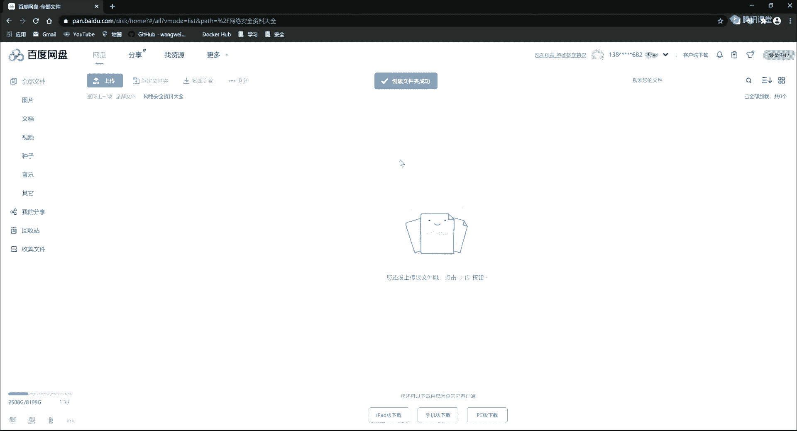

## 六、 模板机的分享与使用

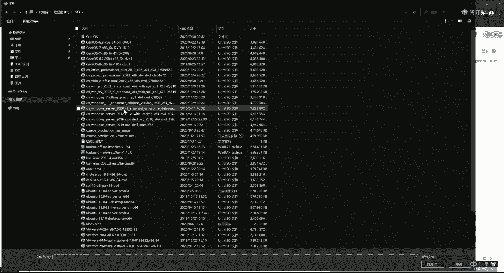


制作好的模板机可以导出为OVA格式文件分享给他人。

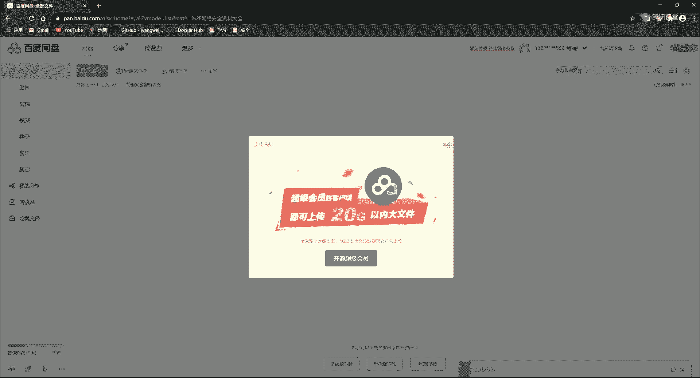

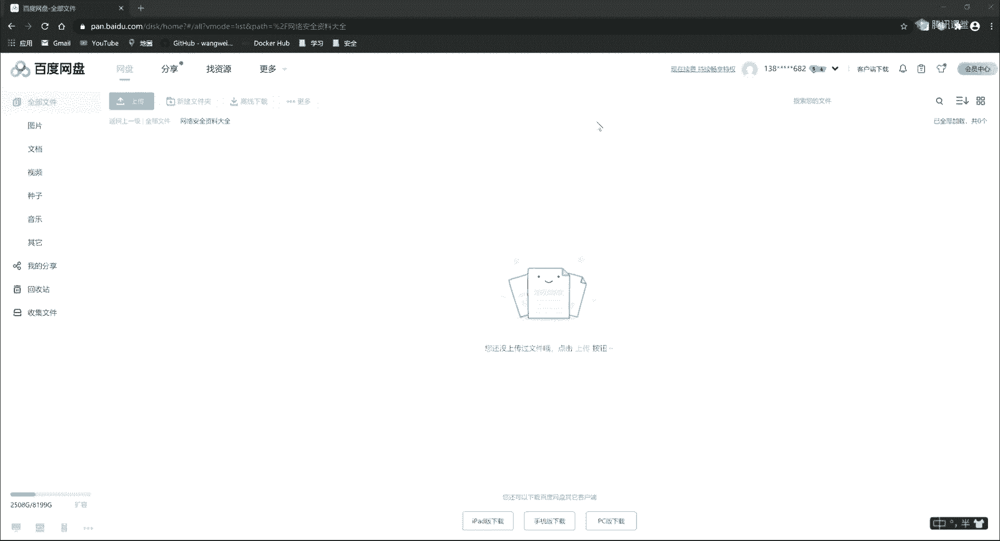

在VMware中，选择“文件” -> “导出为OVF...”，即可生成 `.ova` 文件。其他人只需在VMware中通过“文件” -> “打开”，选择此OVA文件即可导入使用该模板机。


---


本节课中我们一起学习了Linux服务器的初步安全加固与模板化流程。我们掌握了配置静态IP、安装基础工具、关闭防火墙的方法，并最终学会了如何创建和使用虚拟机模板机及快照，这为后续搭建可重复、易维护的实验环境打下了坚实基础。