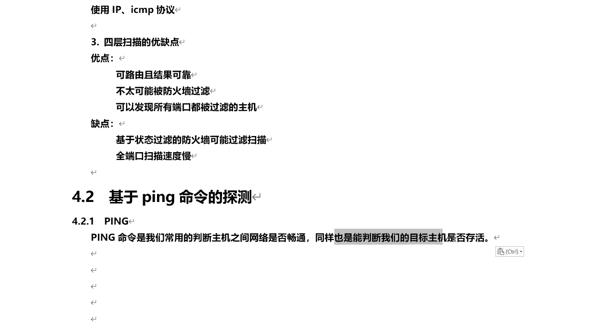
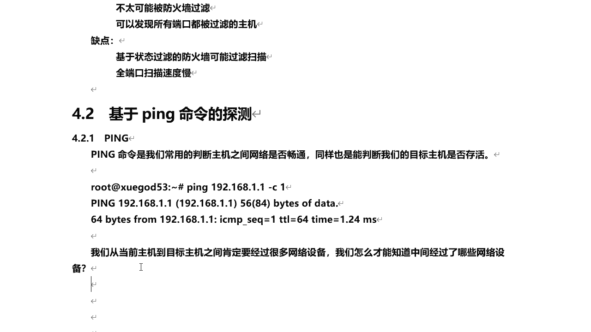
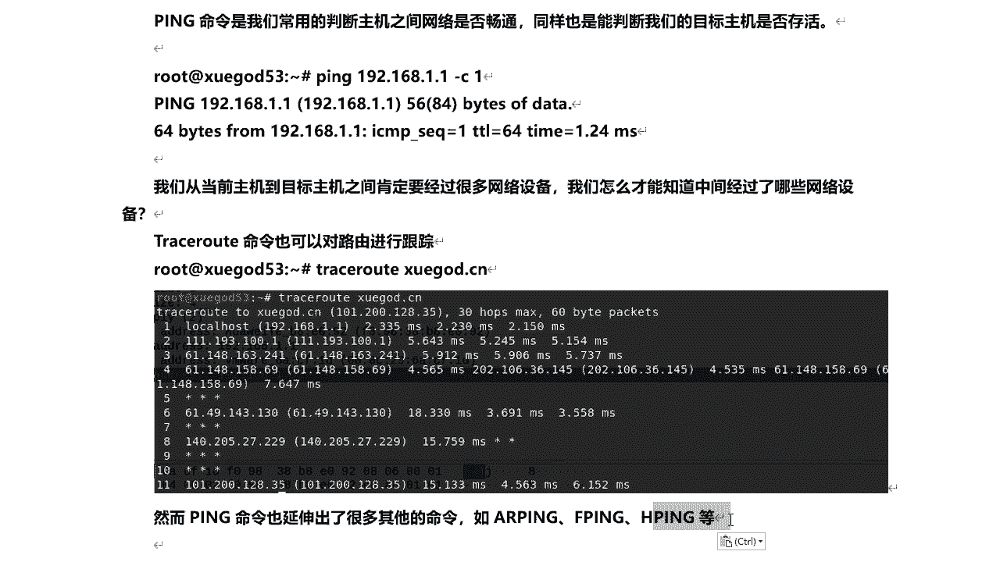

# P40：8.2-【主动信息收集系列】基于ping命令的探测-PING - 一个小小小白帽 - BV1Sy4y1D7qv

好，那么下面呢我们来讲一下基于拼命令的探测啊，那么说到拼的这个大家都比较熟悉，也经常在用啊，那么通过ping命令可以实现哪些功能呢，对啊那么比如说我们常用啊，它来判断主机之间啊，网络是否畅通。

哎或者是比如说我们ky系统安装好了，通过pa来拼一下外网，比如拼一下百度点com，看外网是否通对吧，那么同样也能判断我们的目标主机啊。

是否是存活的，对通过拼命令啊，那么我们来看一下它哎，打开终端，比如说我们来拼一下网关对吧，我们看网关能不能拼通啊，1。1啊，我的网关1。1杠c啊，那指定发送数据包的数量发送一个啊就可以了，好的。

那么通过他的一个响应结果，我们可以判断出来啊，对这个目标主义啊，1。1它是存活的对吧好的。

那么这个呢拼命令比较简单啊，那这个大家很好理解是吧，那么我们从当前主机啊到目标主机之间啊，大家想一个问题啊，肯定要经过很多网络设备对吧，那么我们怎么才能知道，中间经过了哪些网络设备呢。

比如说呢我们来拼一下学神对吧，学个点c n，那么从你当前的机器到学神对吧，拼图整个过程对吧，他是直接到达学成的吗。

不是对，那他中间呢肯定会经过很多个网络设备和路由，路由器对吧，那么这里呢我们通过这个吹事，root t r a c e r u t e这个命令呢，我们可以来看到对，那么从你当前啊这个1。1对吧。

出网了哈，出你的网关之后，他中间经过了多少个网络设备才到达啊，雪盖点cn这台服务器啊，对我们稍微等一下的啊，因为啊每台服务器啊经过中间的网络设备，它的响应时间啊，网络状况都不一样，有的可能慢一点是吧。

所以说这块呢可能得稍微等一下他啊，他得知他的行应时间。

唉又到达一个网络设备，啊这个稍微有点慢啊，那么也就是说啊，那么你trace root啊，对路由跟踪对吧，那当你每到达一个网络设备的时候，它呢如果是存活的这台网络是没有问题对吧，他都会给你响应。

对一个包想给谁啊，响应个本机对吧，所以说你能知道他的ip地址，然后这里的响应时间等等啊，好的那么经过了12个网络设备，从一开始吧，对到达雪糕的cn，他的ip地址是这个是吧，对每个中间经过的每个网络设备。

它的ip地址这里它都会显示出来，当然有一种情况就是说诶这块不显示ip地址啊，显示星星星，那么有可能啊，你的数据包啊是吧，就是他没有得到响应包，没有得到当前这个网络设备的响应包。

或者是被什么对防火墙给过滤了，或者是屏蔽了啊，这点大家要注意，那么这是trash root啊，然后呢g拼命令呢对，那么一衍生出了很多其他的命令，比如说a i p呢。

