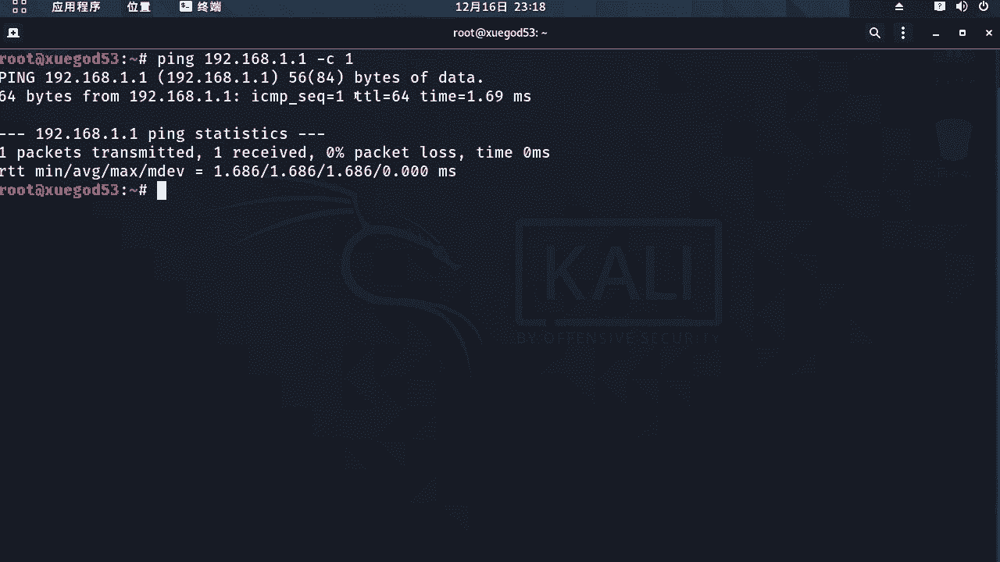
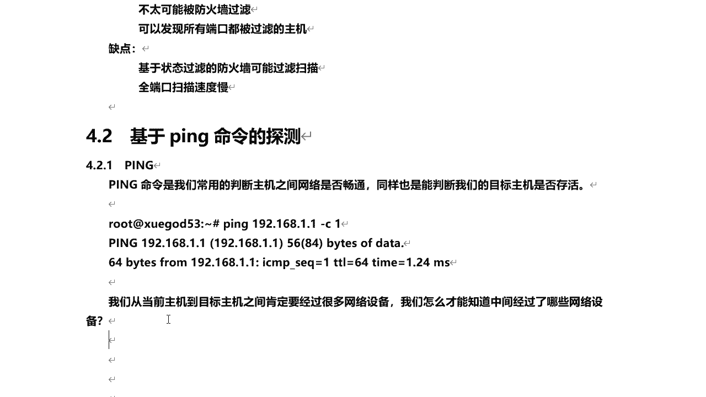
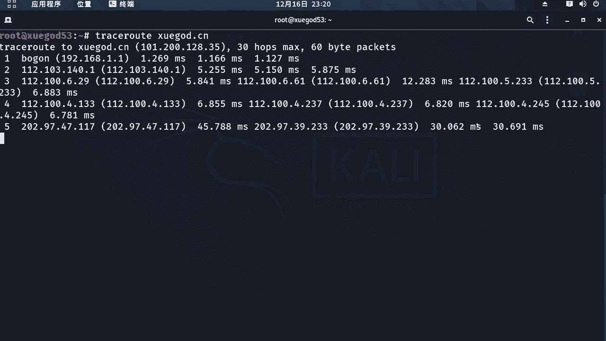
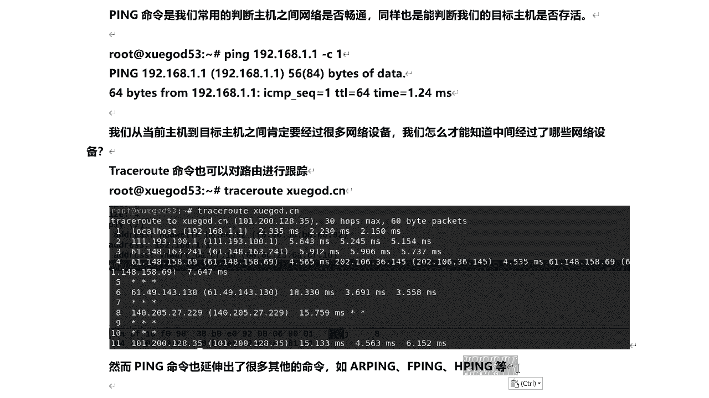

# 课程P40：8.2 - 【主动信息收集系列】基于ping命令的探测 🎯

在本节课中，我们将要学习基于`ping`命令的网络探测技术。`ping`是一个基础且强大的网络诊断工具，常用于检查主机间的连通性。我们将从简单的连通性测试开始，逐步深入到路由跟踪等高级用法，帮助你理解数据包在网络中的传输路径。


---

## 通过ping命令判断主机存活 🖥️



`ping`命令最常用的功能是判断目标主机是否在线以及网络是否畅通。例如，在系统安装后，我们常通过`ping`一个外部地址（如百度）来测试网络连接。

打开终端，使用以下命令格式可以测试与特定主机的连通性：
```bash
ping -c 1 [目标IP或域名]
```
参数`-c 1`表示只发送一个数据包。如果收到回复，则表明目标主机是存活的，网络路径基本畅通。



---

## 使用traceroute跟踪数据包路径 🛣️

上一节我们介绍了如何判断主机是否存活。本节中我们来看看，数据包从本机到达目标主机的具体路径。数据包在网络中传输时，通常会经过多个路由器和网络设备。



为了查看这条路径，我们可以使用`traceroute`命令。以下是该命令的基本用法：
```bash
traceroute [目标域名或IP]
```
执行该命令后，它会显示数据包到达目标主机前所经过的每一跳（即每一个网络设备）的IP地址和响应时间。

如果某一跳显示为星号（`*`），可能的原因包括：
*   该网络设备没有响应我们的探测包。
*   探测包被该设备的防火墙过滤或屏蔽。

通过分析这些信息，我们可以了解网络的拓扑结构和可能存在的故障点。

---

## 总结 📝



本节课中我们一起学习了基于`ping`命令的主动信息收集技术。我们首先使用`ping`命令来快速判断目标主机的存活状态。接着，我们利用`traceroute`命令深入探查了数据包从源到目的地的完整传输路径，识别出中间经过的所有网络节点。掌握这些基础命令，是进行网络故障诊断和安全评估的重要第一步。