# 课程P41：8.3-【主动信息收集系列】基于ARPING的探测 🎯

在本节课中，我们将要学习ARP协议的基本原理，并掌握如何使用`arping`命令及其相关工具进行局域网内的主机探测。我们将从ARP协议的概念入手，逐步讲解其工作原理、`arping`命令的基本使用、结果筛选技巧，并最终通过编写Shell脚本实现自动化批量扫描。

## ARP协议简介

上一节我们介绍了基于ICMP协议的`ping`命令。本节中，我们来看看另一种基于ARP协议的探测方式。

ARP（Address Resolution Protocol，地址解析协议）是局域网内用于将IP地址转换为MAC地址（物理地址）的协议。计算机之间的直接通信依赖于目标主机的MAC地址，但用户通常只知道目标主机的IP地址。ARP协议就是负责完成这个“地址解析”的过程。

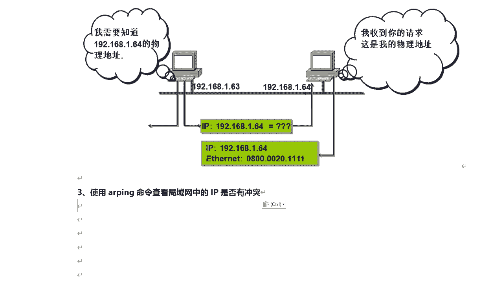

简单来说，ARP协议负责将局域网内的32位IP地址转换为对应的48位物理地址（即网卡MAC地址），以确保通信的顺利进行。

## ARP工作原理图解

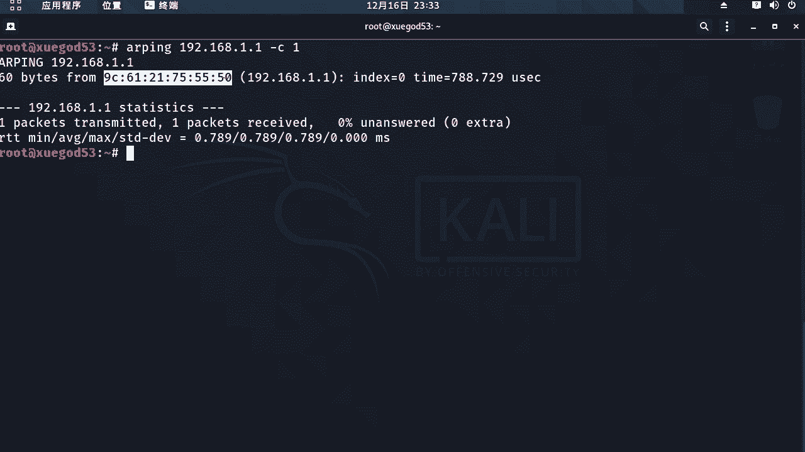

为了更直观地理解ARP的工作过程，我们通过一张图来分析。


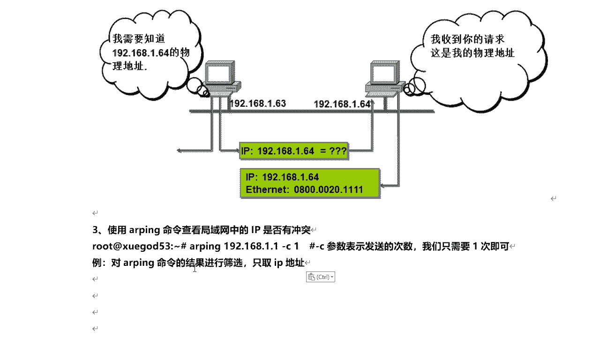

假设局域网内有两台主机：192.168.1.63 和 192.168.1.64。
1.  当主机 192.168.1.63 想与 192.168.1.64 通信时，它首先需要知道后者的MAC地址。
2.  如果它不知道，就会向整个局域网广播一个ARP请求包，询问“谁知道192.168.1.64的MAC地址？”。
3.  局域网内所有主机都会收到这个广播包。
4.  其他主机发现询问的不是自己，便会丢弃该数据包。
5.  主机 192.168.1.64 收到请求后，会向 192.168.1.63 发送一个ARP应答包，告知自己的MAC地址。
6.  主机 192.168.1.63 收到应答后，便获得了目标MAC地址，随后即可开始数据传输。

这就是ARP协议的基本工作原理。

## ARPING命令基础应用

了解了ARP的原理后，我们来看看如何利用`arping`命令进行探测。

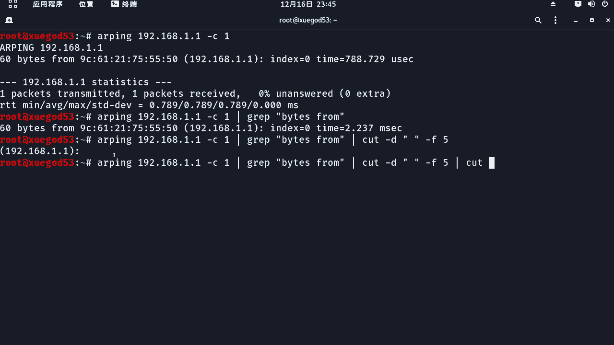

`arping`命令可以向指定IP地址发送ARP请求，并根据是否收到ARP应答来判断目标主机是否在线。它主要有两个用途：
*   **检测IP地址冲突**：例如，检测局域网内是否有人冒充网关。
*   **获取目标主机的MAC地址**。

以下是`arping`命令的基本用法示例：
```bash
arping 192.168.1.1
```
执行上述命令，如果网关（192.168.1.1）在线且唯一，你将看到其MAC地址。如果局域网内存在IP冲突（例如有两台设备都声称自己是192.168.1.1），你可能会收到两个不同的MAC地址响应。


## 筛选ARPING命令结果

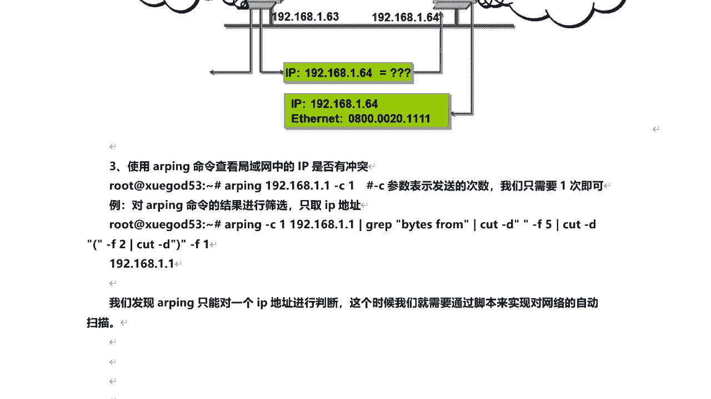


默认的`arping`输出信息较多。在实际扫描中，我们通常只关心IP地址。因此，我们需要学习如何从输出结果中筛选出IP地址。

以下是利用管道符 `|` 和 `grep`、`cut` 命令进行筛选的步骤：

1.  **首先，使用`grep`筛选出包含IP地址的关键行。**
    `arping`的输出中，包含IP地址的行通常有“from”字样。
    ```bash
    arping 192.168.1.1 | grep “from”
    ```
    执行后，会得到类似 `64 bytes from 192.168.1.1: icmp_seq=0 ttl=64 time=0.338 ms` 的一行。

2.  **接着，使用`cut`命令以空格为分隔符，提取IP地址所在的列。**
    ```bash
    arping 192.168.1.1 | grep “from” | cut -d “ “ -f 5
    ```
    这里 `-d “ “` 指定空格为分隔符，`-f 5` 表示取第五列（即`192.168.1.1:`）。

3.  **最后，再次使用`cut`命令去除IP地址后的冒号。**
    我们可以用左括号 `(` 或右括号 `)` 作为分隔符来进一步处理。
    ```bash
    arping 192.168.1.1 | grep “from” | cut -d “ “ -f 5 | cut -d “(” -f 2 | cut -d “)” -f 1
    ```
    这个命令链的最终效果是输出纯净的IP地址：`192.168.1.1`。


## 编写脚本实现批量ARP扫描

`arping`命令一次只能探测一个IP地址，手动扫描整个网段效率极低。因此，我们需要编写Shell脚本实现自动化批量扫描。

脚本的核心思路是：获取本机网段，然后循环对该网段内的所有IP地址（如1到254）执行`arping`命令，并筛选出存活主机的IP。

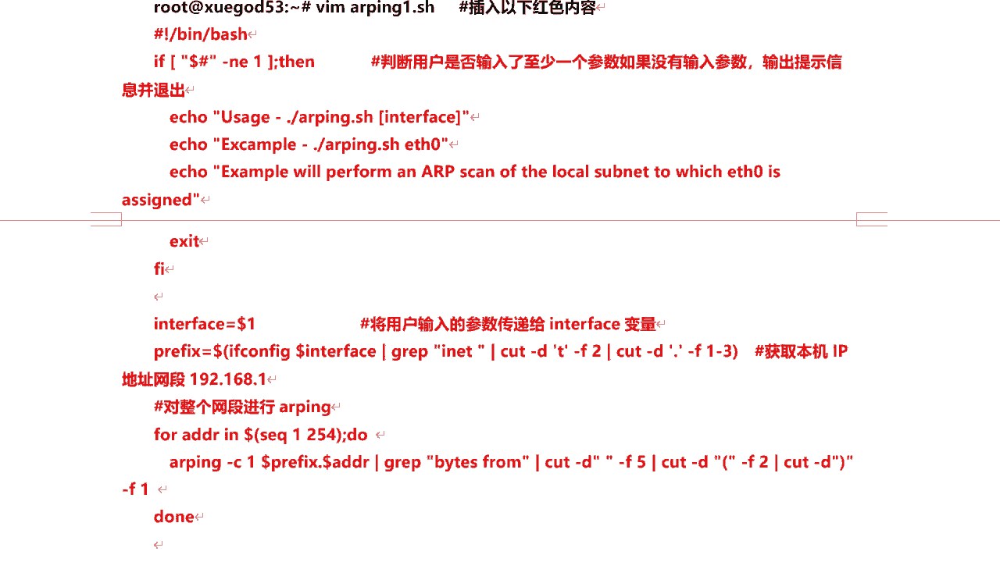

以下是脚本内容 `arping.sh`：
```bash
#!/bin/bash

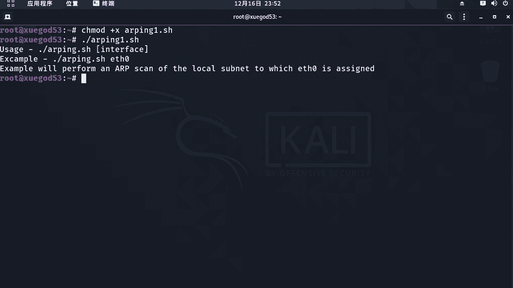

if [ $# -ne 1 ]; then
    echo “用法: $0 <网卡名称>”
    echo “示例: $0 eth0”
    exit 1
fi


interface=$1
prefix=$(ifconfig $interface | grep “inet ” | cut -d “ “ -f 10 | cut -d “.” -f 1-3)


if [ -z “$prefix” ]; then
    echo “无法获取网卡 $interface 的IP地址前缀。”
    exit 1
fi

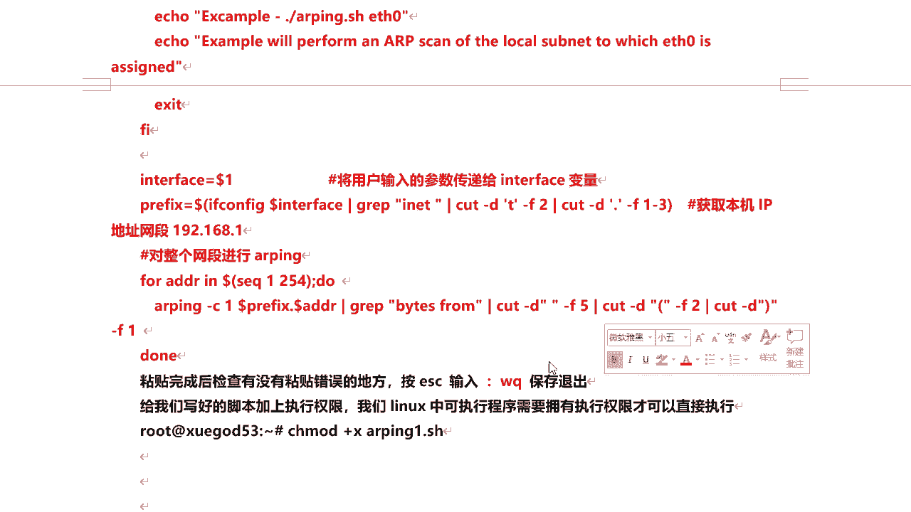


for addr in $(seq 1 254); do
    arping -c 1 $prefix.$addr | grep “from” | cut -d “ “ -f 5 | cut -d “(” -f 2 | cut -d “)” -f 1
done
```


**脚本解释：**
1.  `if [ $# -ne 1 ]`：检查用户是否输入了一个参数（网卡名），否则提示用法并退出。
2.  `interface=$1`：将用户输入的参数赋值给变量 `interface`。
3.  `prefix=$(…)`：通过`ifconfig`获取指定网卡的IP地址，并截取前三位（网段），例如 `192.168.1`。
4.  `for addr in $(seq 1 254)`：循环生成IP地址的最后一位（1到254）。
5.  循环体内：对每个IP执行`arping -c 1`（发送一个ARP请求），并用之前学习的筛选命令链提取存活主机的IP。

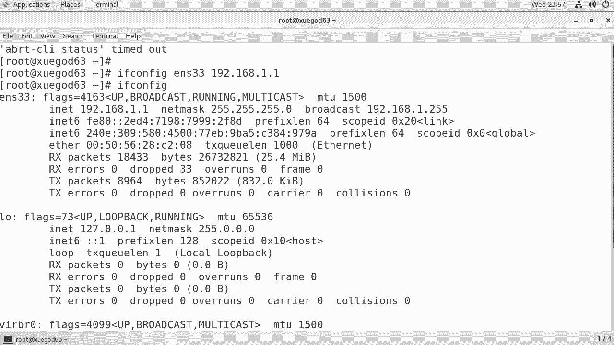

**使用脚本：**
1.  保存脚本并赋予执行权限。
    ```bash
    chmod +x arping.sh
    ```
2.  运行脚本，需指定网卡名称（如`eth0`）。
    ```bash
    ./arping.sh eth0
    ```
    脚本将开始扫描整个 `192.168.1.0/24` 网段，并输出所有在线主机的IP地址。


此脚本同样可用于检测ARP欺骗攻击。如果扫描结果中出现两个相同的IP地址对应不同的MAC地址，则表明可能存在ARP欺骗或IP冲突。


## 拓展工具：Netdiscover

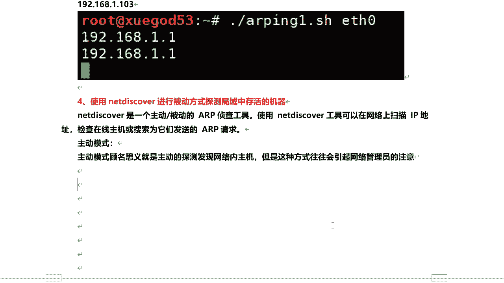

除了`arping`，还有一个功能更强大的ARP探测工具——`netdiscover`。它支持主动和被动两种探测模式。

**主动模式：**
主动向局域网内所有主机发送ARP请求，速度快，但容易被发现。
```bash
netdiscover -i eth0 -r 192.168.1.0/24
```
*   `-i`：指定网卡。
*   `-r`：指定要扫描的网段。


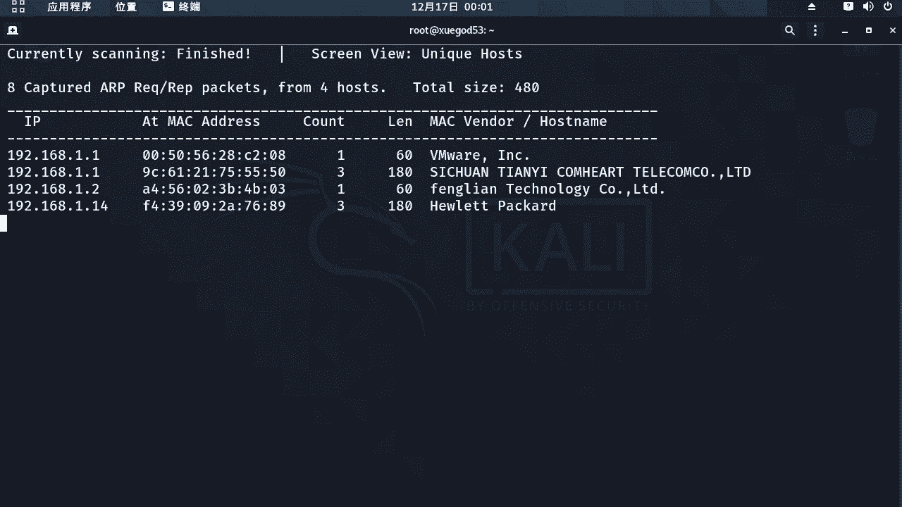

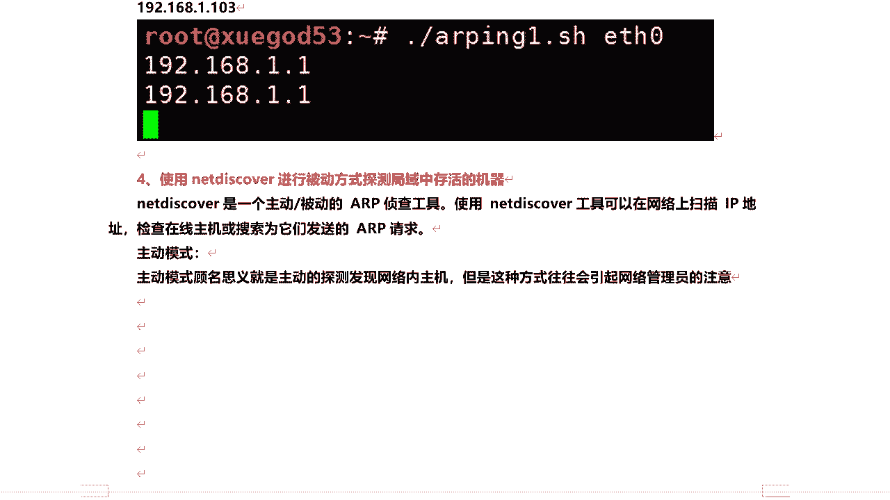

**被动模式：**
将网卡置于混杂模式，监听流经本机的ARP数据包。这种方式更隐蔽，但速度慢，需要等待网络中有ARP通信发生。
```bash
netdiscover -p
```

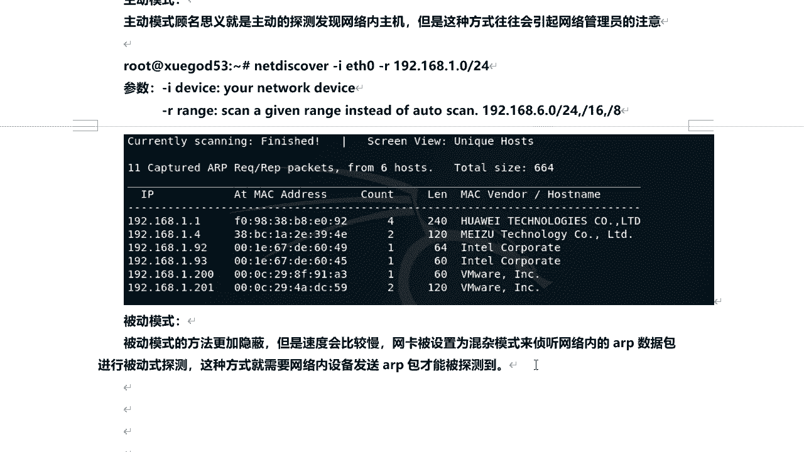


## 课程总结

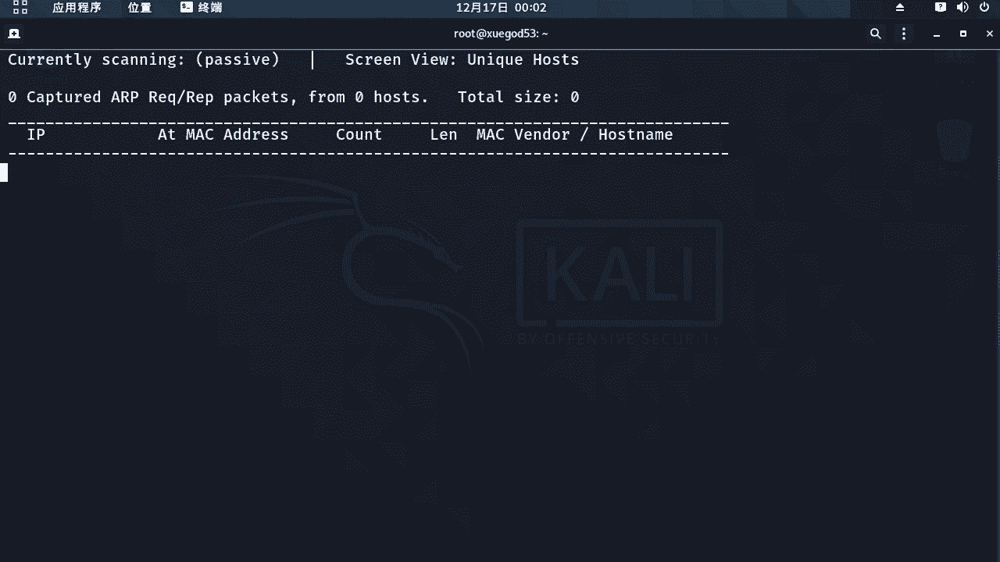

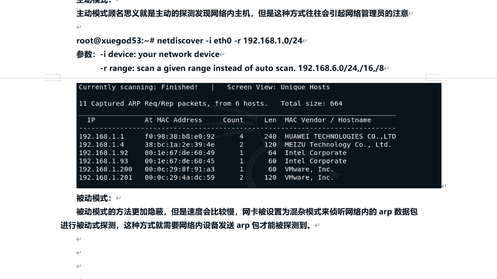

本节课中我们一起学习了基于ARP协议的主机探测技术。
1.  我们首先理解了**ARP协议**如何将IP地址解析为MAC地址，这是局域网通信的基础。
2.  接着，我们掌握了 **`arping`命令** 的基本用法，用于探测单个主机的存活状态和检测IP冲突。
3.  然后，我们学习了使用 **`grep`和`cut`命令** 筛选命令行输出，精确提取所需信息（如IP地址）。
4.  最重要的是，我们通过编写一个 **Shell脚本**，实现了对整个局域网网段的自动化、批量ARP扫描，极大地提升了效率。
5.  最后，我们简要介绍了功能更全面的ARP扫描工具 **`netdiscover`** 及其主动/被动两种工作模式。

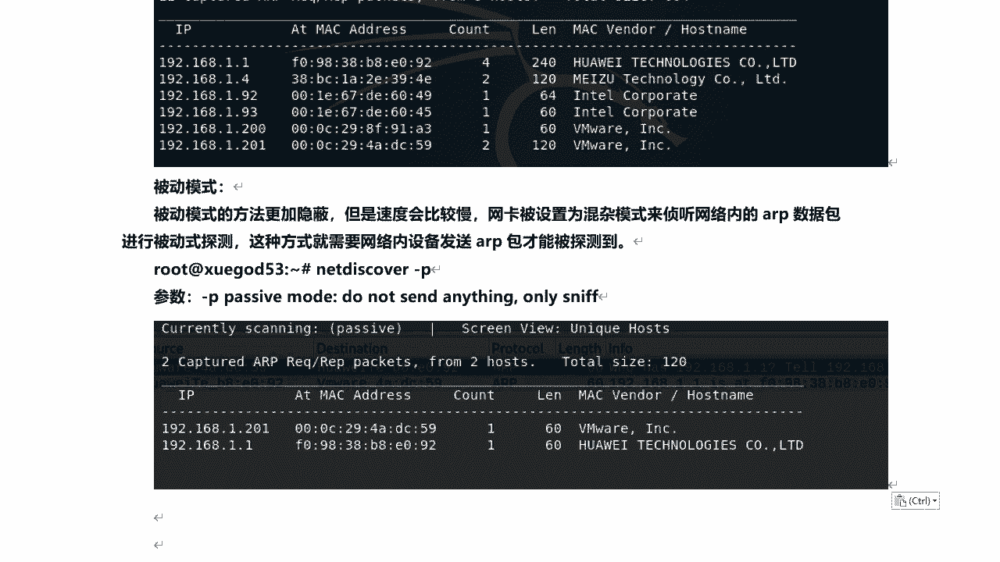

通过本课的学习，你已掌握了在局域网内进行主动主机发现的另一种有效方法，并具备了将简单命令组合成自动化工具的能力。