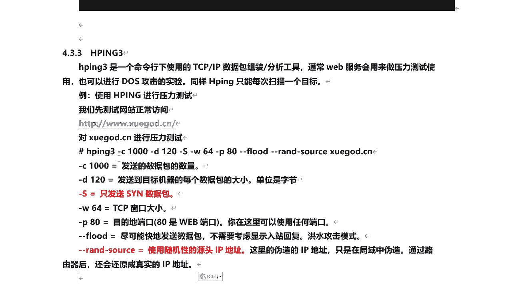
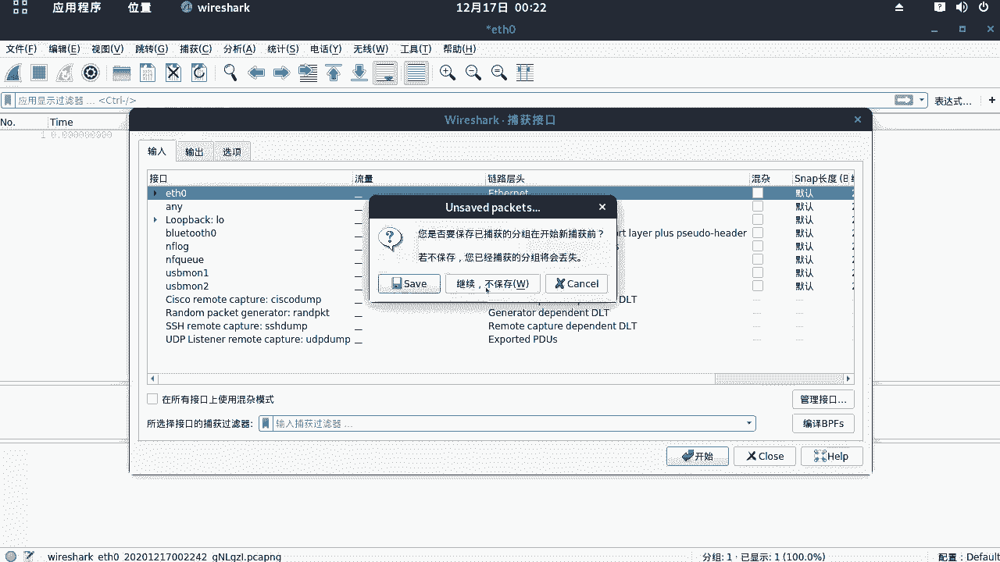
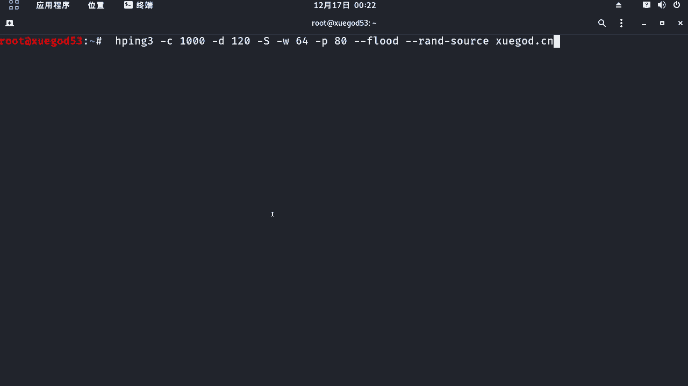
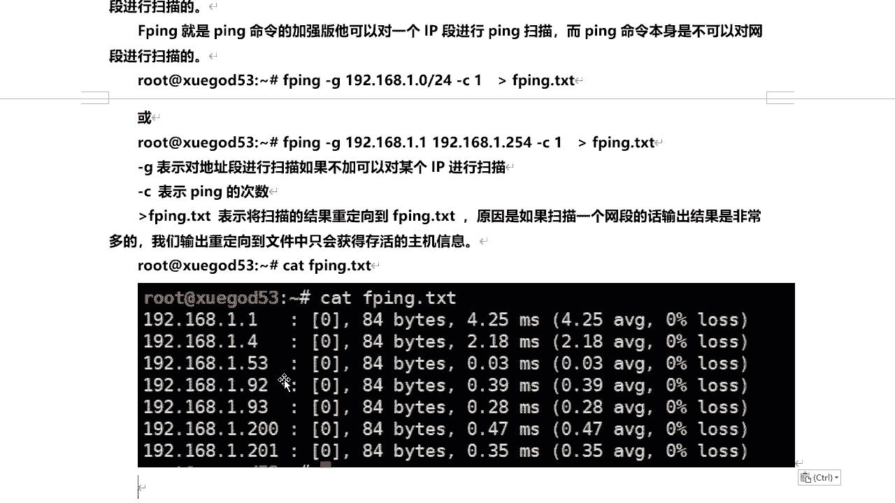

# 课程 P42：8.4 - 【主动信息收集系列】基于ping命令的探测 - HPING & FPING 🚀

在本节课中，我们将学习两个基于`ping`命令的增强工具：`hping3`和`fping`。我们将了解它们的基本原理、参数含义以及如何利用它们进行网络探测和简单的压力测试。

---

## HPING3：数据包组装与分析工具 🔧


上一节我们介绍了基础的`ping`命令，本节中我们来看看一个更强大的工具`hping3`。它是一个命令行下的TCP/IP数据包组装和分析工具。网络管理员通常用它进行压力测试，它也可以用于模拟网络层攻击实验。


与`ping`类似，`hping3`一次通常只能针对一个目标进行操作。这里我们以演示为目的，使用它进行简单的压力测试。**请注意，此类操作仅应在授权的测试环境中进行，切勿对未授权的目标使用。**

首先，我们确认目标网站（例如 `xue.cn`）可以正常访问。


访问正常，网站可以打开。


下面我们使用`hping3`命令。以下是命令中各个参数的含义：

*   `-c 1000`：指定发送数据包的总数量为1000个。
*   `-d 120`：指定每个发送到目标机器的数据包大小为120字节。
*   `-S`：代表发送的是SYN数据包。SYN包是TCP三次握手中第一次建立连接的请求包。
*   `-w 64`：指定TCP窗口大小为64字节。它用于流量控制，告知目标主机本机一次能接受的最大数据量。
*   `-p 80`：指定目标端口为80（Web服务端口）。你也可以指定其他任何端口。
*   `--flood`：以最快速度发送数据包，不等待回复，即洪水式攻击模式。
*   `--rand-source`：使用随机的伪造源IP地址。**注意**：这种伪造通常在局域网内有效，数据包一旦经过路由器出网，源地址可能会被还原为真实IP。
*   `xue.cn`：这是压力测试的目标站点域名。

完整的命令示例如下：
```bash
hping3 -c 1000 -d 120 -S -w 64 -p 80 --flood --rand-source xue.cn
```



下面我们在Kali Linux中执行这个命令来观察效果。


在执行命令前，我们可以打开抓包软件Wireshark来捕获数据包，验证源IP是否被伪造。我们确保网卡处于混杂模式（本例中已关闭），然后开始抓包。






开始抓包后，执行`hping3`命令。


随后，我们可以在Wireshark中捕获到大量数据包。可以看到目标IP是学神的地址，而源IP地址各不相同，这证实了伪造源IP的行为。这些数据包都是SYN请求，窗口大小为64，每个包120字节，瞬间发送了1000个。


此时，我们再次尝试访问目标网站。


打开一个新窗口访问 `xue.cn`，会发现网站变得非常缓慢甚至无法打开。我们简单观察效果即可，随后停止命令。这就是`hping3`的基本使用，它一次同样只能针对一个IP地址进行操作。

---

## FPING：批量主机存活探测工具 📡

接下来我们看另一个基于`ping`命令衍生的工具——`fping`。通过它可以快速查看一个局域网中有哪些主机在线。`fping`可以看作是`ping`命令的增强版，它能够对一个IP地址段进行扫描，而普通的`ping`命令无法直接扫描网段。

首先，`fping`也可以对单个IP进行探测。例如：
```bash
fping 192.168.1.1 -c 1
```
这个命令会向`192.168.1.1`发送一个数据包，如果收到回复，则证明该主机存活。

如果我们想扫描一个网段，则需要使用`-g`参数，它表示对地址段进行扫描（不加此参数则扫描单个IP）。指定网段有两种写法：
1.  `192.168.1.0/24`
2.  `192.168.1.1 192.168.1.254`

同时，我们可以使用`-c 1`指定对每个地址只发送一个探测包。由于扫描整个网段输出结果较多，我们可以将存活主机的列表保存到一个文本文件中。使用重定向符号 `>` 可以将扫描结果输出到指定文件。

以下是扫描网段并将结果保存的示例命令：
```bash
fping -g 192.168.1.0/24 -c 1 > alive_hosts.txt 2>&1
```
执行完成后，我们可以使用`cat`命令查看结果文件：
```bash
cat alive_hosts.txt
```
文件中将只列出在线的主机IP地址。例如，可能得到类似以下的输出，显示当前网络中有四台存活主机（网关、物理机、Kali虚拟机和CentOS虚拟机）：
```
192.168.1.1
192.168.1.100
192.168.1.128
192.168.1.163
```



---

## 总结 📝

本节课中我们一起学习了两个重要的网络探测工具。
*   **`hping3`**：一个功能强大的数据包生成器，可用于压力测试和TCP/IP协议分析。我们通过指定参数伪造SYN洪水攻击，观察了其对目标服务的影响。
*   **`fping`**：一个高效的批量`ping`工具，能够快速扫描一个IP地址段，并找出所有存活的主机，极大提高了局域网主机发现的效率。


在实际进行信息收集时，有多种命令可以实现相似功能。具体选择使用哪一个，可以根据实际场景和个人操作习惯来决定。掌握这些工具的原理和用法，是进行网络诊断和安全评估的基础技能。