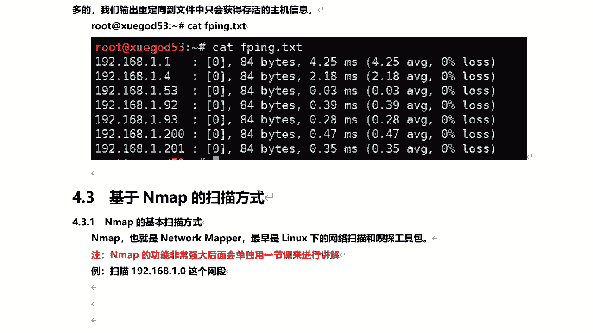
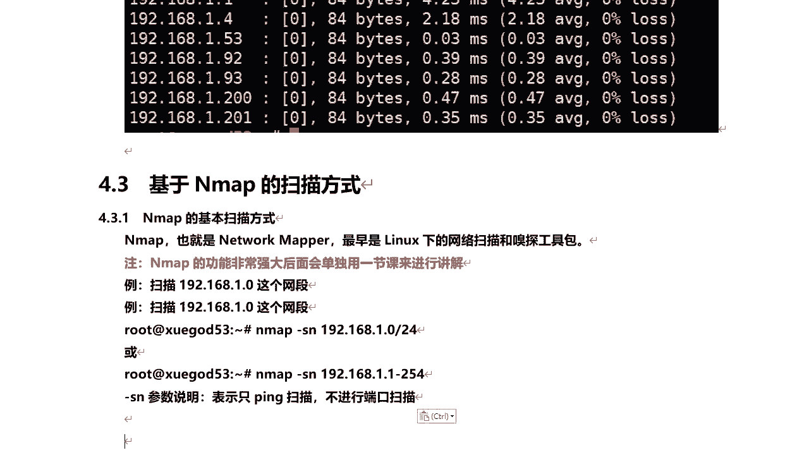
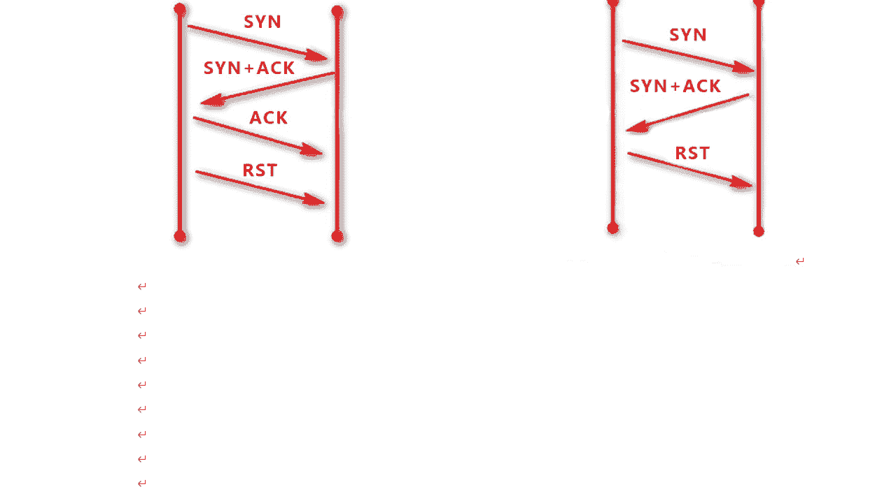
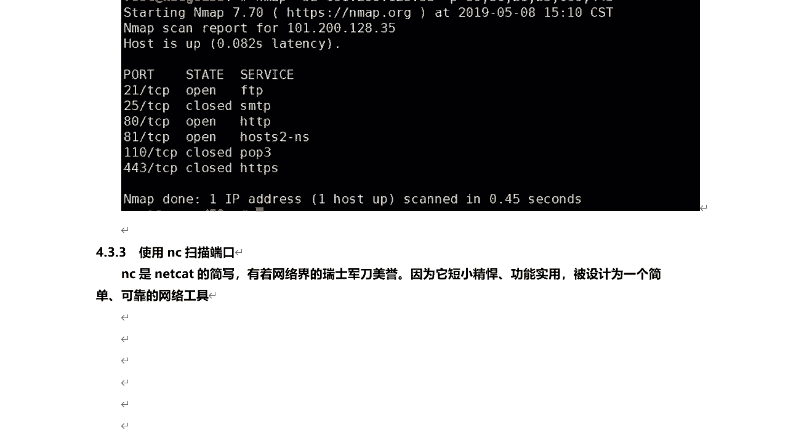
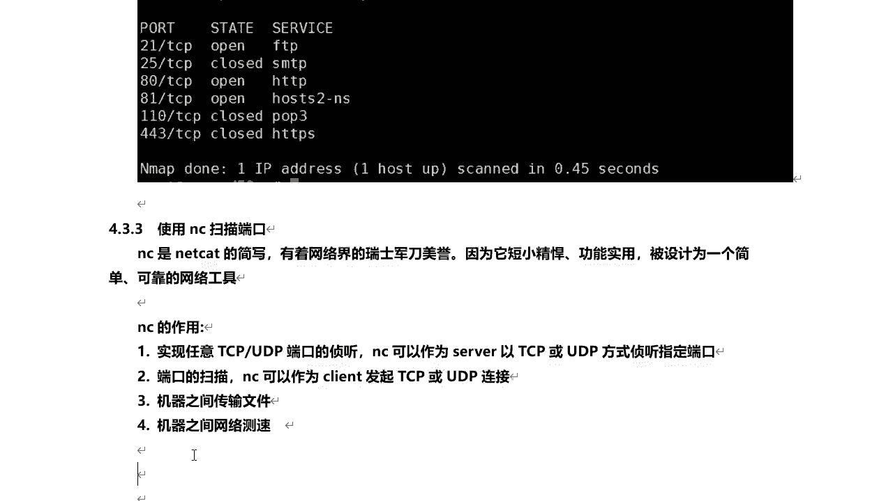
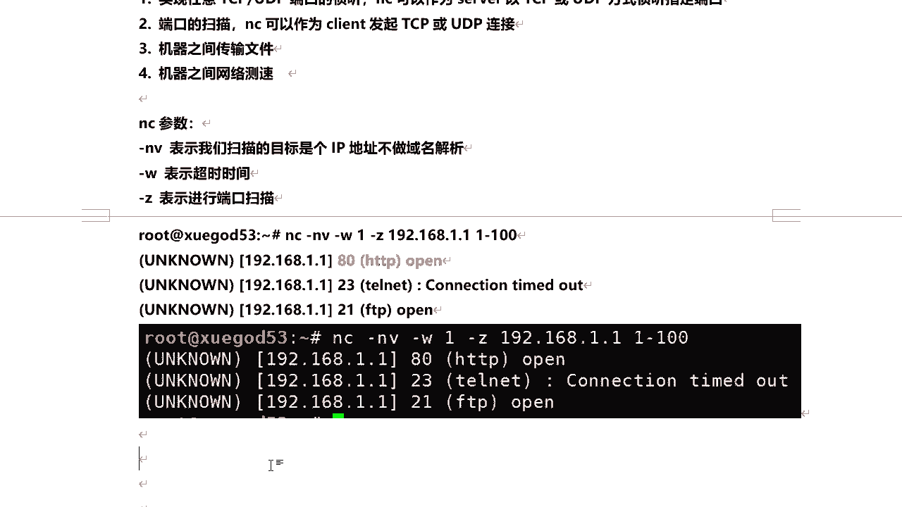

# 课程P43：8.5-【主动信息收集系列】基于Nmap的扫描方式 🛠️

在本节课中，我们将要学习两种重要的网络扫描工具：Nmap和Netcat。我们将重点了解如何使用Nmap进行主机存活扫描和半连接端口扫描，并学习Netcat的基本端口扫描功能。这些工具是网络安全和信息收集的基础。

## Nmap主机存活扫描

上一节我们介绍了主动信息收集的概念，本节中我们来看看如何使用Nmap进行基础的网络探测。Nmap全称Network Mapper，最初是Linux下的一个网络扫描和嗅探工具包，功能非常强大。我们将在后续课程中单独深入讲解Nmap。这里，我们先学习如何使用Nmap扫描整个网段内存活的主机。

Nmap最著名的是端口扫描功能，但在此我们仅用它来发现网段内存活的主机，即只进行Ping扫描，不扫描端口。

以下是使用Nmap进行主机存活扫描的命令：



```bash
nmap -sn 192.168.1.1/24
```
参数 `-sn` 表示只进行Ping扫描，实现Ping的功能，不进行端口扫描。后面的 `192.168.1.1/24` 是目标网段。



执行该命令后，Nmap会列出局域网内所有存活的主机，包括本机。输出结果会显示“Host is up”（主机存活）以及对应的MAC地址。

此外，还可以使用另一种格式指定扫描范围：

```bash
nmap -sn 192.168.1.1-254
```
这两种方式的结果是相同的，都可以用于批量扫描，发现局域网内的存活主机，这个功能非常实用。


## Nmap半连接扫描

学会了基础的主机发现后，我们下面来看另外一种更有意思的扫描方式：半连接扫描。要理解半连接扫描，首先需要了解TCP三次握手。

Nmap的扫描类型主要有TCP全连接扫描和半连接扫描。其中，全连接扫描会在目标主机上留下记录，因为它完成了整个TCP三次握手过程。而半连接扫描则不会留下记录，因为它只完成了TCP三次握手的前两次。

下面我们通过一张图来理解TCP三次握手。假设主机A要与主机B建立连接：
1.  首先，A向B的某个端口（例如22端口）发送一个SYN连接请求。
2.  当B收到请求后，如果该端口开放，则会回复一个SYN+ACK包，表示确认连接，同时要求A也开放一个端口供B连接。
3.  A收到SYN+ACK后，会打开一个高位端口，并回复一个ACK确认包。至此，三次握手完成，双方可以开始数据传输。

如果目标端口是关闭的，B在收到SYN请求后就不会回复SYN+ACK包。

所谓半连接扫描，就是只完成前两次握手。当扫描方（A）收到目标主机（B）回复的SYN+ACK包时，就证明该端口是开放的。此时，扫描方不再发送第三次握手的ACK确认包，而是直接断开连接，因此不会在目标主机上留下完整的连接记录。

理解了TCP三次握手，全连接和半连接扫描的原理就清晰了。下面我们通过Nmap来实现半连接扫描。

以下是使用Nmap进行半连接扫描的命令：

```bash
nmap -sS 目标IP -p 端口列表
```
参数 `-sS` 表示进行半连接扫描。`-p` 用于指定要扫描的端口，例如 `-p 80,21,25,443`。

执行命令后，Nmap会给出指定端口的状态，如“open”（开放）或“closed”（关闭），并确认目标主机是存活的（up）。





## 使用Netcat进行端口扫描


除了Nmap，还有一个工具也可以进行端口扫描，那就是Netcat。Netcat全称NetCat，被誉为网络界的“瑞士军刀”。它短小精悍，功能实用，被设计为一个简单可靠的网络工具。



Netcat的作用很多，主要包括：
*   可以监听TCP/UDP端口。
*   可以作为客户端发起TCP或UDP连接。
*   可以进行端口扫描。
*   可以在机器间传输文件。
*   可以进行网络测试等。

这里我们需要用到它的几个参数。Netcat参数很多，其中：
*   `-n`：直接使用IP地址，不进行域名解析。
*   `-v`：显示详细信息。
*   `-w`：设置超时时间（秒）。
*   `-z`：进行端口扫描。

下面我们利用Netcat工具来扫描一个IP地址或一个IP范围。



以下是使用Netcat进行端口扫描的命令示例：

```bash
nc -nv -w 1 -z 192.168.1.1 1-100
```
参数说明：
*   `-nv`：不解析域名并显示详细信息。
*   `-w 1`：设置超时时间为1秒。如果超过1秒没有响应，则放弃探测。
*   `-z`：指定进行端口扫描。
*   `192.168.1.1 1-100`：表示扫描IP地址192.168.1.1的1到100号端口。

执行该命令可以探测出目标IP在指定范围内有哪些端口是开放的，例如可能会发现80端口和22端口是开放的。这是使用Netcat进行端口扫描的简单方法。


## 工具选择与总结


现在，无论是Nmap还是Netcat，都可以实现端口扫描。那么具体该用哪个呢？其实，如果它们能实现同一个目的并得到相同的结果，选择往往取决于个人习惯和具体场景的需求。Nmap功能更为全面和强大，而Netcat则更加轻量和灵活。


本节课中我们一起学习了：
1.  使用Nmap的 `-sn` 参数进行网段内存活主机的发现（Ping扫描）。
2.  理解了TCP三次握手，并学会了使用Nmap的 `-sS` 参数进行更隐蔽的半连接端口扫描。
3.  认识了Netcat工具，并学会了使用其 `-n -v -w -z` 参数组合进行基本的端口扫描。



这些是主动信息收集中探测网络主机和服务的核心技能，为后续更深入的安全测试工作奠定了基础。