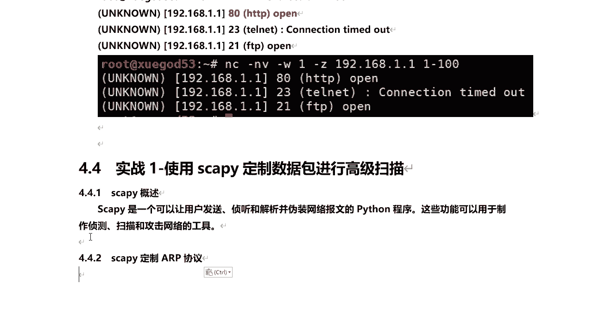
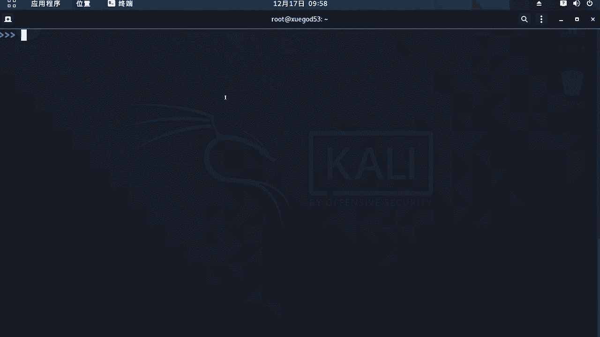
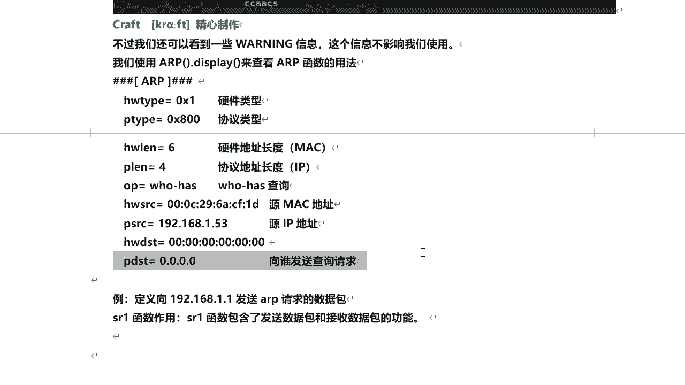
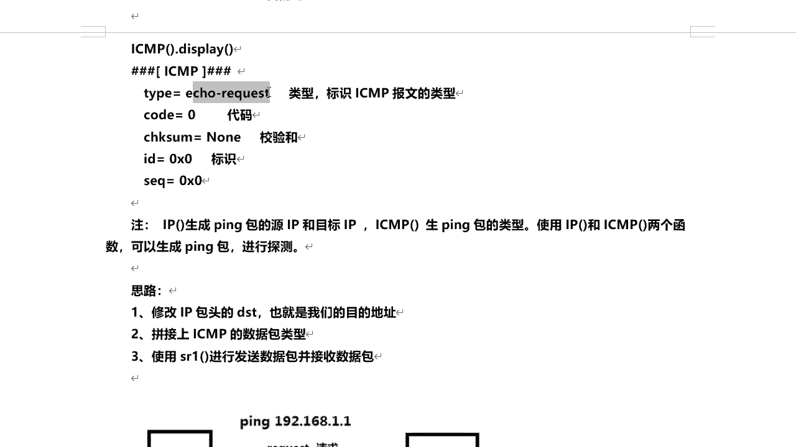
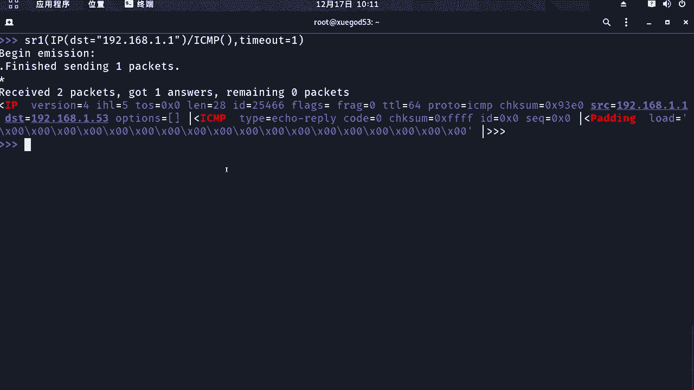
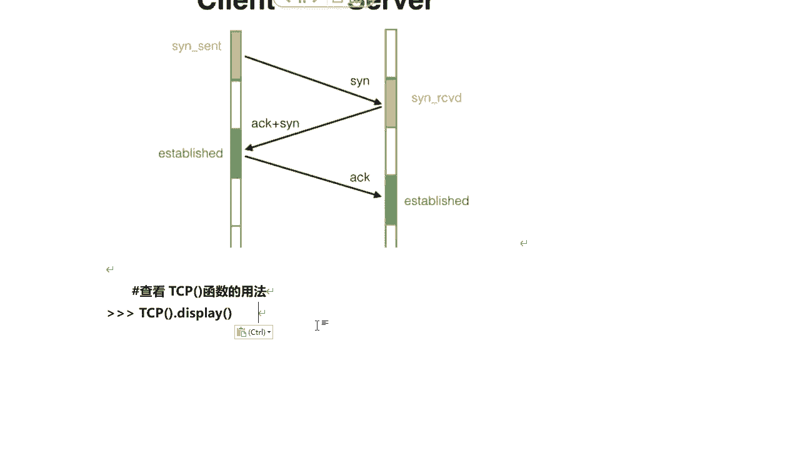
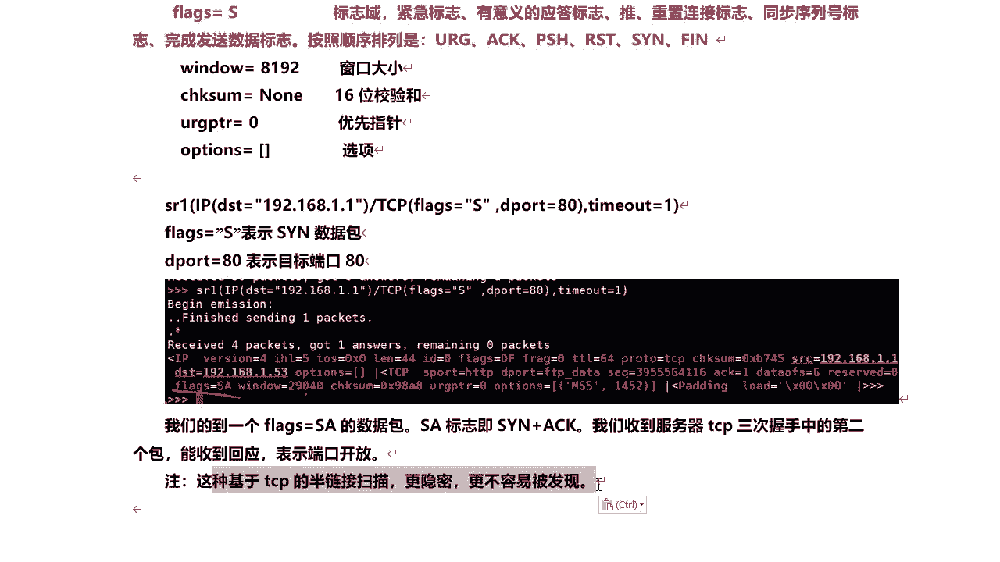

# 课程 P44：使用 Scapy 定制数据包进行高级扫描 🛠️

在本节课中，我们将学习如何使用 Python 库 Scapy 来定制和发送网络数据包，从而实现 ARP、ICMP（Ping）和 TCP SYN 等高级扫描技术。通过手动构建数据包，我们可以更深入地理解网络协议，并执行更灵活、更隐蔽的网络探测。



---

## 什么是 Scapy？🤔



Scapy 是一个功能强大的 Python 程序，它允许用户发送、嗅探、解析和伪造网络数据包。这些功能可以用于制作网络探测、扫描和攻击工具。


既然是 Python 编写的，这意味着只要在 Windows 或 Linux 系统上安装了 Python 环境，就可以使用 Scapy。


---

## 使用 Scapy 定制 ARP 数据包

上一节我们介绍了 Scapy 的基本概念，本节中我们来看看如何使用它定制一个 ARP 协议的数据包。ARP 协议工作在数据链路层，相对比较简单。

首先，我们需要在终端中启动 Scapy 交互环境：

```bash
scapy
```

启动后，会显示版本信息（例如 2.4.3）和 Python 提示符 `>>>`。一些加载时的警告信息通常不影响使用。

在 Scapy 中，我们可以使用 `ARP()` 函数查看 ARP 数据包的默认结构：



```python
ARP().display()
```

执行上述命令会显示 ARP 数据包的所有字段及其默认值。以下是核心字段的含义：
*   **`hwtype`**: 硬件类型，标识链路层协议（例如以太网）。
*   **`ptype`**: 协议类型，标识网络层协议（例如 IP）。
*   **`hwlen`**: 硬件地址长度（MAC 地址长度，6 字节）。
*   **`plen`**: 协议地址长度（IP 地址长度，4 字节）。
*   **`op`**: 操作码，`1` 代表 ARP 请求，`2` 代表 ARP 响应。
*   **`hwsrc`/`psrc`**: 源 MAC 地址和源 IP 地址（默认为本机）。
*   **`hwdst`/`pdst`**: 目标 MAC 地址和目标 IP 地址。发送 ARP 请求时，我们不知道目标 MAC，所以 `hwdst` 通常为空，而 `pdst` 则是我们要查询的目标 IP 地址。

因此，定制一个 ARP 请求包，我们主要需要指定 `pdst`（目标 IP）参数。


Scapy 的 `sr1()` 函数用于发送数据包并接收返回的第一个应答。以下是向网关（假设为 192.168.1.1）发送 ARP 请求的命令：

```python
sr1(ARP(pdst="192.168.1.1"))
```


如果目标在线，我们将收到一个 ARP 响应包。在响应包中，`psrc` 和 `hwsrc` 会变成网关的 IP 和 MAC 地址，这证明我们成功获取了信息。

这种方式比简单的 `arping` 命令更底层，让我们能更精细地控制扫描过程。

要退出 Scapy 交互环境，请输入 `exit()`。

---


## 使用 Scapy 定制 ICMP Ping 包

了解了 ARP 扫描后，我们进一步学习如何定制一个 ICMP Ping 包。Ping 使用的是 ICMP 协议。

首先，我们查看 ICMP 数据包的格式：

```python
ICMP().display()
```

ICMP 包的关键字段包括：
*   **`type`**: 数据包类型，`8` 为请求（Echo Request），`0` 为回复（Echo Reply）。
*   **`code`**: 代码，与类型配合使用。
*   **`chksum`**: 校验和，用于验证数据完整性。
*   **`id` / `seq`**: 标识符和序列号，用于匹配请求与回复。

但 ICMP 包本身不包含 IP 地址信息。因此，我们还需要结合 IP 层。查看 IP 数据包格式：

```python
IP().display()
```

IP 数据包的重要字段很多，对于 Ping 扫描，我们主要关注：
*   **`dst`**: 目的 IP 地址（最关键）。
*   **`src`**: 源 IP 地址（通常自动填充）。
*   **`ttl`**: 生存时间，每经过一个路由器减 1，防止环路。

定制 Ping 包的思路是：组合 `IP()` 和 `ICMP()` 两个层。`IP()` 指定目标地址，`ICMP()` 默认就是 Echo Request 类型。然后使用 `sr1()` 发送。

以下是向网关发送 Ping 请求的示例：

```python
sr1(IP(dst="192.168.1.1")/ICMP(), timeout=2)
```

如果收到回复，在回复包中可以看到 `IP` 层的源地址是网关 IP，并且 `ICMP` 层的 `type` 为 `0`（Echo Reply），这证明 Ping 通了。


通过这种方式，我们能更透彻地理解 Ping 命令背后的网络通信过程。


---



## 使用 Scapy 定制 TCP SYN 请求



最后，我们学习最常用的端口扫描技术之一：TCP SYN 扫描（半连接扫描）。这模拟了 TCP 三次握手的第一步。

首先，查看 TCP 数据包的格式：

```python
TCP().display()
```

TCP 包的关键字段包括：
*   **`sport`**: 源端口（通常随机）。
*   **`dport`**: 目的端口（要扫描的端口）。
*   **`flags`**: 标志位，用于控制连接状态（如 S 代表 SYN，A 代表 ACK，R 代表 RST）。



SYN 扫描的原理是：向目标端口发送一个 SYN 标志置位的 TCP 包。
*   如果端口**开放**，目标会回复 SYN+ACK 包。
*   如果端口**关闭**，目标会回复 RST 包。


这样，我们无需完成整个三次握手，扫描行为更隐蔽。

以下是使用 Scapy 扫描网关 80 端口的命令：

```python
sr1(IP(dst="192.168.1.1")/TCP(dport=80, flags="S"), timeout=2)
```

如果收到回复，检查 `TCP` 层的 `flags` 字段：
*   若为 **`SA`** (SYN-ACK)，则端口开放。
*   若为 **`RA`** 或 **`R`** (RST)，则端口关闭。


例如，扫描一个可能关闭的端口 200：

```python
sr1(IP(dst="192.168.1.1")/TCP(dport=200, flags="S"), timeout=2)
```

此时很可能收到 `flags=RA` 的回复，表明端口不可用。

---

## 总结 📝


本节课中，我们一起学习了使用 Scapy 库进行高级网络扫描的三种核心方法：

1.  **ARP 扫描**：通过定制 ARP 请求包，获取目标 IP 对应的 MAC 地址。
2.  **ICMP Ping 扫描**：通过组合 IP 层和 ICMP 层，手动构造 Ping 包来探测主机存活状态。
3.  **TCP SYN 扫描**：通过发送 SYN 包并分析返回的 flags，判断目标端口的开放状态，实现更隐蔽的半连接扫描。



Scapy 的强大之处在于它提供了从底层构建和分析网络数据包的能力，这不仅能用于安全扫描，也是深入学习网络协议的绝佳工具。