# P45：8.7-【主动信息收集系列】实战2-僵尸扫描 - 一个小小小白帽 - BV1Sy4y1D7qv

好下面呢我们来讲一下了，僵尸扫描啊，那么下面我们来思考一个问题啊，那么做渗透来讲什么是最重要的，对啊，这里头两个字啊，什么思维对，为什么说做渗透思维最重要呢，因为作为渗透来讲，那么技术啊。

那包括那些漏洞啊，就那些是吧，大家学只要认真学都能学会，那么都会了这些技术，那么有做得好的，有做的不好的，关键在于每个人的思维不一样是吧，那么思维变量导致可能有漏洞，能发现有的漏洞啊，发现不了。

或者是进行战斗的时候对吧，你的方式方法对吧，有的呢就能非常有效的去挖掘到劳动，很快的挖掘到漏洞，有的呢就不可以，所以说呢思维对我们做渗透来讲，是非常重要的啊，那么这里呢咱们学习啊僵尸扫描。

它其实它的实用性不是很大，但是这个僵尸扫描这种思维值得大家去学习啊，那么下面我们来看什么是僵尸扫描啊，那么所谓的僵尸扫描，这里呢不得不提叫什么僵尸主机对吧，那么僵尸主机。

那一般来讲呢是指啊感染僵尸程序病毒的，那么从而呢被黑客程序控制的计算机设备，叫僵尸主机，但是呢僵尸扫描中的这个僵尸主义啊，指的是一个闲置的操作系统啊，那么这里的闲置是，这个主机不会主动和任何人通信。

那么大家看到这里啊，那么任何一台计算机，那么你打开之后，它不可避免的啊，他会主动的对吧，即使你不做任何操作，不打开任何应用程序，它也会与外界进行通信，所以说呢对这种计算机呢不太好找啊，不太好。

所以说它的实用性不是很大，而且这个系统中的ip数据包装的id是自增的，那么这个id是什么意思啊，那么这个id是i p i d啊，就是指通信过程中，对指的是同一种ip数据包中的id啊。

那么id它是一个数值型的，那么也就是说，只要这台主机向外发送一个数据包啊，他的id啊就会自增一，每发送一个数据包都会自增一啊，但是现在不是所有的操作系统都都有，这个ip地址，也不是都是自增的啊。

好那么僵尸扫描这种方式呢，它拥有极高的一个隐蔽特性，哎如果要能实施的话，对能很大程度的去隐蔽你自己啊，相对安全一些啊，你要进行攻击的话啊，但是呢实施条件比较苛刻啊，那么差需要满足几个条件啊。

刚刚我们凝缩了啊，再就是说目标网络可以伪造圆对地址进行访问，它允许啊，你可以到源进行访问，再一个呢你选择僵尸主机诶，需要它是在互联网上对是一个闲置的操作系统，而且系统中使用递增的ipad啊。

比如说xp系统，那么它的ipad呢就是自增的啊，那下面我们考了一个问题啊，那么我们使用nmap或者是拼，那么这种这两种啊，它都会与直接与目标进行接触，那么它都属于主动信息收集部分的啊。

那么如何可以不直接与目标主机进行接触，还可以探测出目标主机是否开放端口呢对吧，那么这里头如果不使用僵尸扫描，那我如何能实现呢，那汽车呢这里呢可以使用什么路基对吧，那么通过呢呃肉鸡或者是代理对吧。

那么一般来讲呢，黑客呢可能是如果他为了隐藏自己，他不会用自己的真实的啊机器，去对目标进行探测啊，那么这里呢他就会使用什么手机啊，或者是代理，那比如说呢黑客呢控制了一台啊肉鸡，或者是他通过代理对吧。

连接到肉机啊，或代理，通过代理呢，或者是肉鸡呢，对远程去执行按map来扫描目标主机，那么这样呢他可以去隐藏自己，但是啊前提是他得得带公网啊，或局域网上先拿到了肉鸡啊。

那么僵尸扫描呢它可以不拿到肉粒的权限，只要对方的ip id是自增长的就可以了好吧，所以说呢它和使用周期呢还是不一样的啊，那么下面呢我们来看一下僵尸扫描的原理啊，那么说到僵尸扫描的原理。

那么这里呢我们需要对了解tcp 3次握手啊，那么tcp 3次握手包中，那么其中s y n a c k是三次握手，第二次握手也是第二次包对吧，那我们看这张图啊，再来看一下这个图啊，好的。

那么这图呢就是说a女b对吧，那么我要与你某个端口，比如八零端口建立连接的话，它发送一个s y n请求，建立连接请求我连接你八零端口好吧，那么如果啊对这个端口是开放的啊。

那么它呢会回一个什么s y n加a c k对吧，a c k的确认，我同意你连接了s y呢，就说那你你要连接我八零端口，我同意了，你是不是也得打开一个端口，让我连那对吧，那么所以a呢收到请求之后对吧。

他也打开了一个端口对，然后呢让b距离对吧，那么a c k确认可以没问题，这样他得建立一个稳定的一个连接对吧，那么这是s y n，所以这是s3 加a c k r是tcp 3次过程，第二次握手包啊，好的。

下面呢我们通过一张图啊，来给大家解读一下僵尸扫描它整个的一个原理，那么我们看啊，这个一共是这张图呢，可以分三部分啊，一二啊三呃我们先来分析一下端口开放状态，它的原理啊，那么首先看第一张图啊。

那么这是僵尸主机啊，那么这是黑客好吧，那么首先啊黑客像这样设计啊，发生了一个数据包，大家注意看是s v n加a c k数据包，这个呢是呃tcp 3次握手中第二次包，那么什么情况下会发送这个包呢。

那么只有僵尸机像黑客发送一个s弯，连接请求的时候对吧，他才会回啊，那么此时此时黑客直接向僵尸机发送一个s y，n加s s k，那么僵尸主机就懵了是吧，我没有向你发送连接请求，你为什么给我回这个包啊是吧。

直接就rs断开了啊，那此时将射击是发送一个数据包，通过这种方式可以得到它的初始i p i d值啊，比如说x是一个数值啊，具体是多少对吧，那么咱这就不知道了啊，反正得到一个数值初始的第二张图呢。

唉那么黑客呢对，然后对目标开始来发起来探测啊，那么在注意这里啊，在对目标发起探测之前啊，他把原ip地址伪装成僵尸记的ip地址，那么他去探测目标及某个端口啊，比如说渗透s一点六三啊。

如果目标机这个端口是开放的，他收到一个svn连接请求，那么他会做出一个什么响应对，他会回一个包，回一个s y n加a c k包给谁，原i p地址，但是原i p这里伪装成是僵尸机的ip地址是吧。

那么此时它会给这样目标机，会给僵尸机发送一个s y n加a c k数据包，那么僵尸机收到这样一个数据包，他就懵了是吧，我没有向你发起连接请求，你为什么不发一个这么样的数据播放对吧。

那么此时他又发一个数据包对吧，那么它的ip id值加减啊，加一自增1o好的，那么第三张图呢黑客呢回来了是吧，像僵尸鸡呢对哦，又发生了一个s y n加s k碎片，和第一张图是一样的。

那么此时僵尸接回一个r s t重置断开，那么i s p i d值尺是不是又加一啊，它每发送一个数据包都加一，那么这个呢是端口开放的状态，总共ip i d对吧，将4g的ipad自升级自增二是吧。

那么自当二代表的是什么，它的端口是开放的啊，那么如果目标机这个端口啊，某个端口，比如我看的是三二，这关闭的话啊，那么此时这个目标机它会会吗，会给僵尸机发送数据包吗，不会直接断开了对吧。

那此时的僵尸机还会发出数据包，不会了对吧，这个id会自增一吗，这块不是自增一了对吧，自增零对吧，那最后呢这块是整一整，到最后结果呢是对i p i d自定义，那么通过这个可以判断出。

如果自证二证明目标机的端口是开放的，自增一呢目标机的端口是关闭的啊，那么这是整个一个它的原理啊，好的，那么我们来总结一下的好吧，那么第一张图对吧，攻击机向僵尸机发送s n a s k确认包，然后呢。

僵尸机返回我们r i t数据包关闭连接对吧，i r i t数据包中包含了ip i d这个信息，假设ipad等于x我们得到一个初始值啊，那么三次握手的第一次包呢。

第一个包是sy目标主机收到s y n才会应答，对他返回用s班加a c数据包，它会发这个对吧，那么因为僵尸主机啊没有向我们发送sy请求，所以僵尸主主机返回我们是rs t数据包，关闭连接对吧，那么第一步呢。

知道了僵尸记的ip i d的初始值好好，那么第二步呢我们来看啊，那么攻击者在修改ip头，对s r c有原ip地址为僵尸主机的ip，就是伪装了黑客，把自己的原i p伪装成僵尸记的ip。

那么伪装成僵尸主机的是吧，给目标主机发送s y n请求，目标主机收到这个请求之后啊，如果端口是开放的，就会返回给僵尸机一个s y n加s k数据包，没问题啊，那么僵尸机呢收到这个目标主机发来的。

sy加sk确认报之后对吧，那么注意啊，这个目标机为什么会给僵尸主机，发送这个数据包，因为这个关于课对吧，原ip地址是伪装成僵尸机的，所以说目标记在收到这个请求之后，才会给僵尸主机发送这个数据包。

对s玩家sk啊，然后呢注意啊，当僵尸机收到发来的s8 加s k数据包之后，对吧，因为僵尸机没有给目标机发送s弯请求，所以僵尸主机给目标主义，直接返回了一个r s t数据包，关闭了关闭连接了。

那么这个鼠标表示关闭连接，那么此时江苏主机对外发出的一个数据包，那么它的ip地址就会自增，一是端午开放，好吧对，那么此时i p a d是x加一啊，那么第三张图对第三轮抽出，我们再接着看啊。

那其实在第二步中啊，这黑客他的收获是目标主机端口是开放的对吧，如果目标主机开端口开放那么多，让僵尸主机的ipad呢是自增一增一呃，第三张图啊，我们接下来再给大家总结啊，嗯攻击者呢再次向僵尸主机发送。

s y y加a c k全身包对吧，那么僵尸主义同样向攻击者返回了一个rs st，数据包对代码，此时僵尸主义对外发又发生了一个数据包是吧，所以说僵尸主义i pad啊再次加一。

那此时呢对他的i d呢加几加二啊，然后第四步对我们计算三次通信中的ip i d值，根据ip i d值自身，来判断目标主机端口是开放还是关闭的对吧，如果攻击者啊查看僵尸主机返回的数据包中。

i pad值为x加二，那就证明了是吧，对比在第一部中的ib id值，发现增加了二，那么肯定对吧，结论就是目标主机和僵尸主机进行通信了，既然能通信，就证明目标主机的端口是开放的好吧。

那么这是端口开放的原理，那么同样啊对端口关闭的原理，刚才其实我们已经说了啊，关闭关闭的话，那么第二步第二步，那么僵尸机就不会给目标机发送数据包，此时这里头在ip地址也不会加一对吧。

因为这个目标机端口是开放的，把关闭的关闭的对吧，那么他会直接发什么一个i r s t给僵尸机，能理解吧，因为这里原ip是伪装成僵尸记的ip地址，最终呢它的ip id呢只是加一啊，通过关闭好。

那么我们接着来分析啊，唉因为这块可能有点不太好理解，所以说呢咱们这块给大家再好好说一下的啊，呃端口关闭状态，那么第一张图呢，攻击者向僵尸界发送了一个s y n a c k，确认包是吧。

那么僵尸主机返回我们r i t数据包，关闭链接是吧对啊，因为他没有向黑客发送s弯连接请求，他收到直接收到这么一个军包，所以他直接就关闭了嗯，那么此时数据包中包含了ip i d信息对吧。

你说ipad等于x，那么注意三次握手的第一个包是s弯，目标主机收到s弯才会应答，这个s弯加a c k确认包对吧，那么因为僵尸主机没有向我们发送s班请求，所以僵尸主机返回我们rs d数据包啊，关闭连接。

这是呢第一张图，那么第二张图，这个好不好啊，那攻击者呢修改原ip地址为僵尸主机的ip，伪装成僵尸主机给目标主机来发送了吗，s3 请求目标主义搜到这个请求，那么如果端口是关闭的对吧，那么它会作何反应呢。

就会返回给僵尸主机一个r i t数据包，断开了是吧，那么这样的僵尸主机对吧，将水收到目标机发来的r s t包关闭链接对吧，它就不对外发送数据包啊，那么此时将视机的ip地址呢它不会增好吧，等会关闭的啊。

然后呢第三张图，第三个啊啊我们来看一下了，攻击者呢再次向僵尸主机啊发送了s y n啊，加a c k确认包，那么此时呢僵尸主义同样啊，向攻击者返回了一个r s t书包，那么此时僵尸主机啊。

对外发送了一个数据包对吧，所以说呢僵尸机的i p i g值呢加一啊，加一它的值现在是x加一啊，然后呢，第四步计算三次通讯过程中的i p i d值啊，那么第一张图呢，攻击者查看僵尸主机返回的数据。

包容i p i d值为x加一啊加一，那么攻击者对比第一部中的ipad值为x，发现了他只加了一，那么最后的结论就是说，那肯定目标主机啊和僵尸主机没有进行通信，这就证明目标机的端口是开放的对吧。

把关闭的啊是关闭的好吧，那么这个就是整个是僵尸扫描的，这么一个原理啊，原理这会儿呢，诶大家呢好需要好好理解一下的啊，那么接下来呢我们原理明白了是吧，下面我们来实战进行什么僵尸扫描啊，叫什么。

首先呢我把黑客啊kelly对吧，那么ip原ip呢伪装成僵尸主题的ip，注意啊，那么这里的僵尸主题我们使用xp对xp，他ip一点五四来探测目标机1。63啊，某个端口是开放的还是关闭的好吧，那么注意。

那么这里呢关于这个xp啊，xp系统，那么给大家提供一个链接，大家可以通过这个链接呢去修改一下的，去下载一下载安装下载啊，因为现在有很多人啊都不使用xp系统了，哎那么大家可以通过这个链接去下载啊。

这个xp好，然后呢我们来那么学霸的六三啊，是目标主机ip一点六三，那么首先呢我们确认啊，s h d服务能够正常访问，因为我们要探测的这个端口好吧，然后呢xp安装完成之后要注意啊，一定要把防火墙关闭掉。

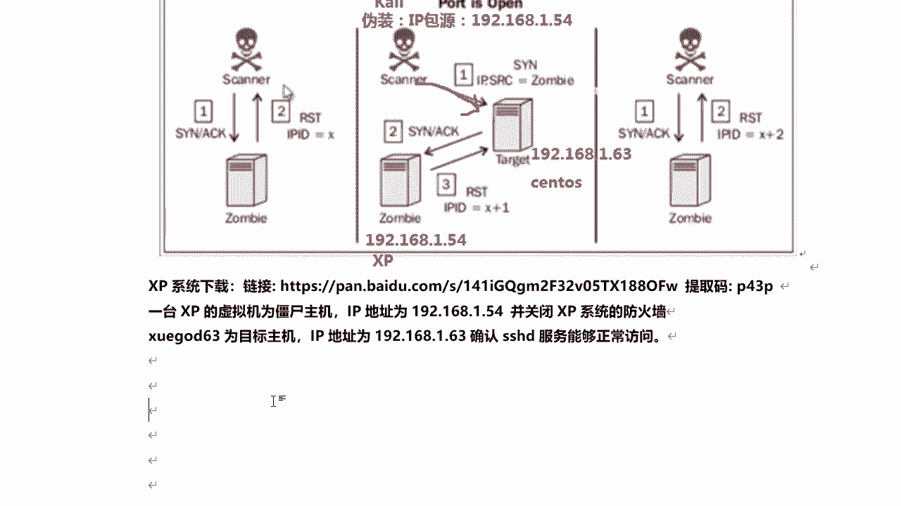

关闭防火墙啊，我们来看xp呢在这里啊，控制面板防火墙状态是关闭的啊，没有问题啊，然后呢现在呢我们就来试试下僵尸扫描，我把这个退出啊，我们这里打开三个窗口对，因为呀我们需要发送三个数据包是吧。

嗯因为我们保证啊整个状态啊，能够正确地判断出来自增一或自增二是吧，对，那我们最可能嗯，尽可能啊快点去发生这三个坐标，然后对结果的ip地址进行什么对比啊，呃这里我说一点啊。

那么有可能啊对最终得到的结果可能不是自二，可能自责三自动四，那原因就是呃僵尸机它呢不是足够闲置的，那么它有可能在你整个探测的过程中是吧，他有对外发送数据包好吧。

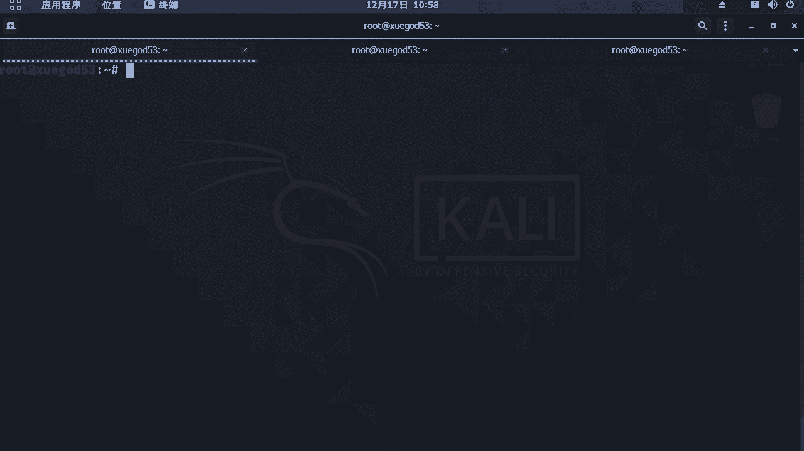

然后呢这里头呢我们来看第一个啊，第一步嗯，第一步呢，首先要给僵尸主机发送一个什么s y n a，c k数据包对吧，那么得到一个他的ip i d的初始值啊，那么注意啊，那么这里头rg 1。

那么它是以定义一个变量啊，并定一个变量它用来接收啊，整个数据包的一个返回的结果，返回的数据包对吧，然后呢，d s t呢表示我们对我们的僵尸主机ip啊，第一张图像。

僵尸主机来发送一个s弯加a c k数据包啊，c啊，depot，45，表示我们向僵尸主义的45端口，发送数据包啊，那么注意啊，为什么是45，其他端口和弦也可以，但只要保证这个端口是开放的就可以啊。

xp主义的45端口一般呢都是开启状态，flag标志位，c表示发送s y n a c k数据包啊。

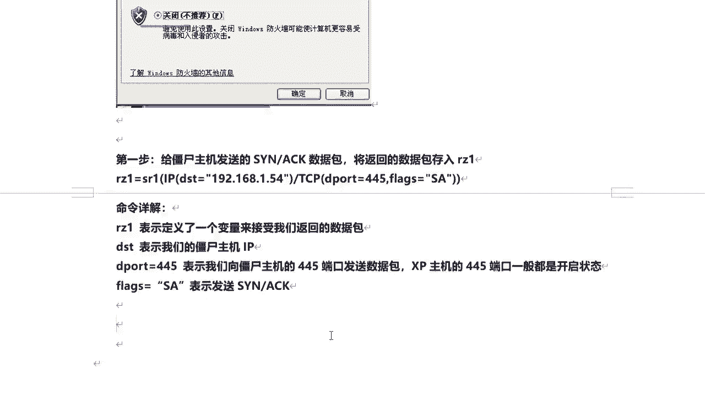

那我们先把这个命令啊，我们先放到这里啊。

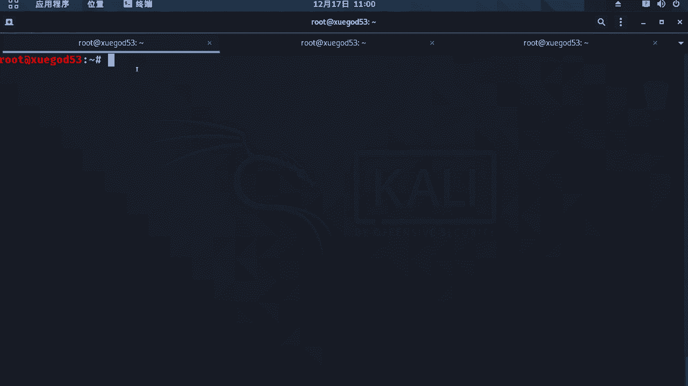

一会去执行啊，一起执行啊，好的，那么这是第一步啊，第一步，然后呢我们来看一下第二部啊，那么第一步就执行完成之后啊，就是我们可以通过这个命令去查看它的响应包，对返回包它的结果啊。

一会儿呢我们来查看第二步呢，来第二步是一个像直接向公积木德基啊，发送数据包对吧，那么攻击机呢，把他的原ip地址改成僵尸主机的ip，然后伪装成僵尸主机，给目标主机发送s y n请求啊。

所以原ip一点五四啊，其实我们这个是攻击1。53，他发起的一个探测请求对吧啊，伪装原ip目标ip呢1。63啊，然后他的deport端口是22端口，超时时间一秒啊一秒啊，然后呢这个呢我们也给它放到这里。

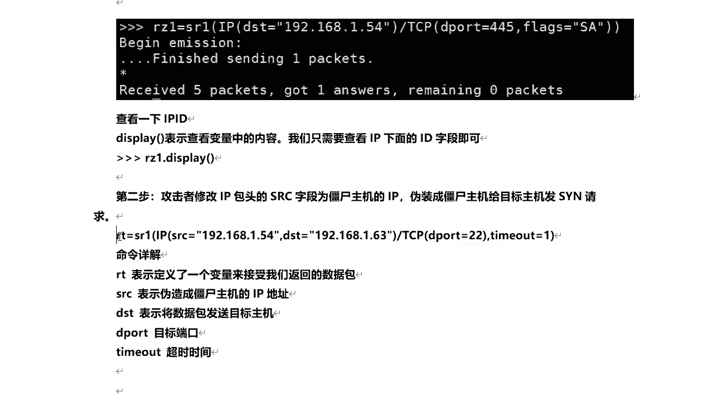

一会去执行一下第二个动作啊。

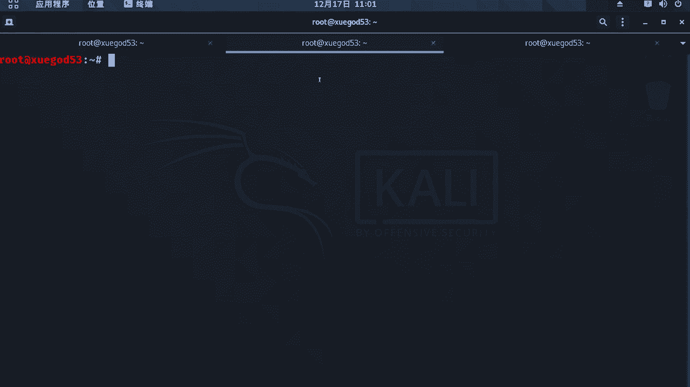

好的，然后呢我们这一步即执行完成之后呢，对我们一样可以看到它的一个响应包对吧，结果啊呃第三步第三步唉，那么是啥，像僵尸主机再次向僵尸主机发送s y n a c k，全线包，来获得他的p i d对吧。

a p i d对，来发送好的，好那么三个状态我们都准备好了对吧，然后接下来呢我们来执行一下的，然后呢查看一下结果好吧。

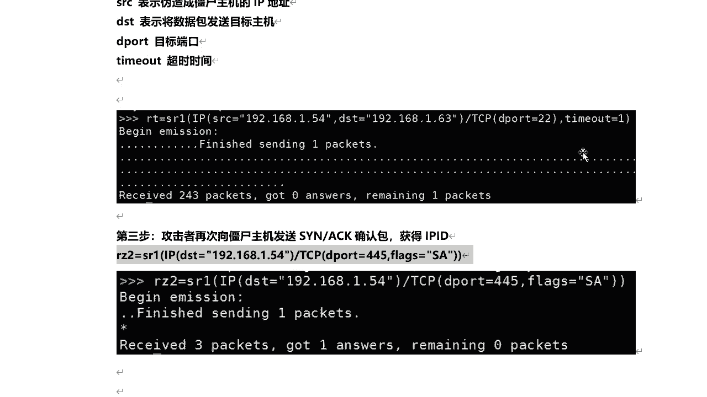

诶第一个是吧，哦这个有语法错误是吧，我们看这里是哪里有错误啊，主括号啊，rg一等于s r e i p d h一点54t cp，这个我们在进入sky是吧，对这个没有进入sky是不行的啊。

这个呢我们来c a p y，这个呢我们进入sky sp版，的翻了一个小小的一个小错误啊，没关系啊，我们来再来一次啊，再来一次好吧，第一步，我先给粘过来好，第二步，然后呢我们来快速执行一下的，啊然后呢来。

来好的，那么注意啊，那么这里为啥没有显示显示结果，因为你把这个响应包啊，结果都放在哪啊，存储在变量里面的下面呢，我们来查看一下二点一点display，对它的结果，那么这里呢我们注意啊。

那么会得到一个i p i d值啊，i d值86好吧，然后呢第二个就是rt。splay，其实我们直接查看最后一个就可以了啊，最后一个这是id 40啊，咱先不用管它，我们看最后一个啊。

r z2 点display，好那么注意看这里id对id是88，那么第一个呢i初始id这是86，那么最终对比呢它是自证二啊，那么自证二呢就代表着目标记的端口是什么，是开放的，好吧对。

直接对比这两个值就可以了啊。

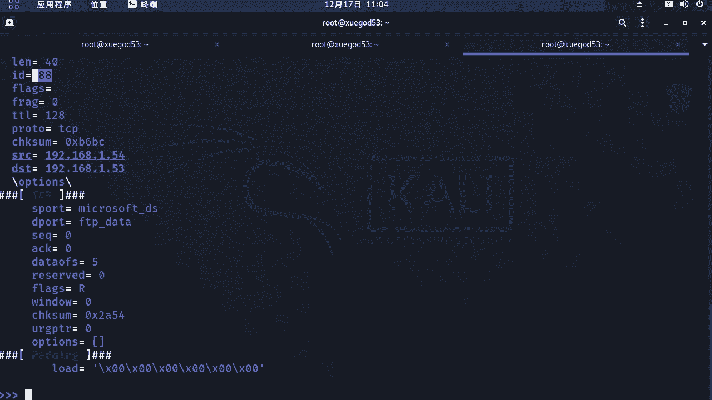

好的我们来把笔记呢给大家整理一下的啊。

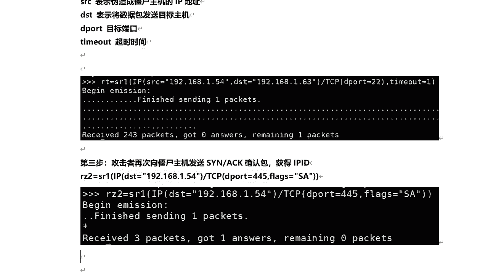

对你直接对比第一个数据包，对第一个它的id值和第二第最后一个啊，对i d值啊，他俩如果差值是二，就证明目标端口是开放的好吧。

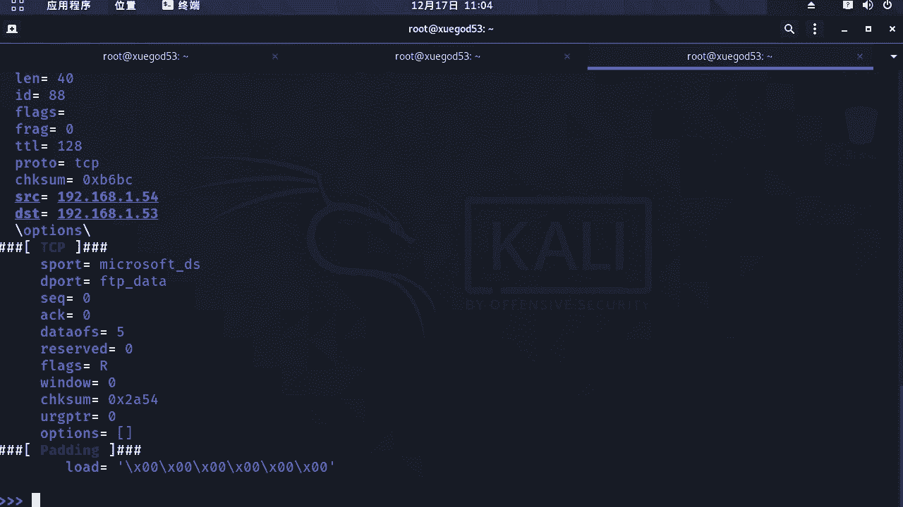

那么这是开放的状态，那么如果是关闭的状态呢，对啊，那么它就是啊自增减啊，对自增一是不是啊，哎那么下面呢我们来给大家演示啊。

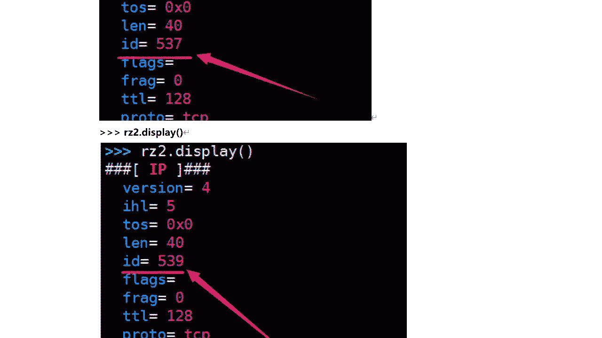

关闭状态是吧，那么这里呢我们来把它清一下的啊，清一下的。

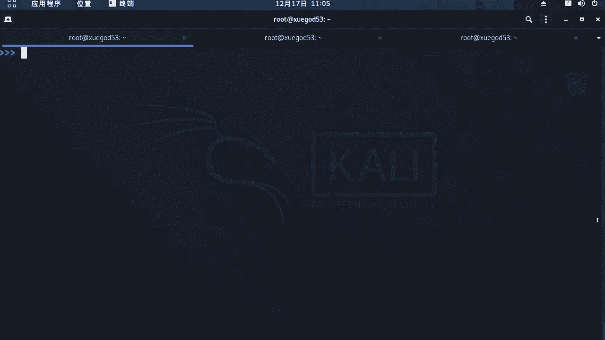

啊同样啊啊那么这里我们来探测一个端口好吧，那么这个端口呢我们来指定一个不存在啊，不存在端口好吧，三个数据包我们来探测呢，呃目标记的三二端口一样啊，发送三个数据包好。

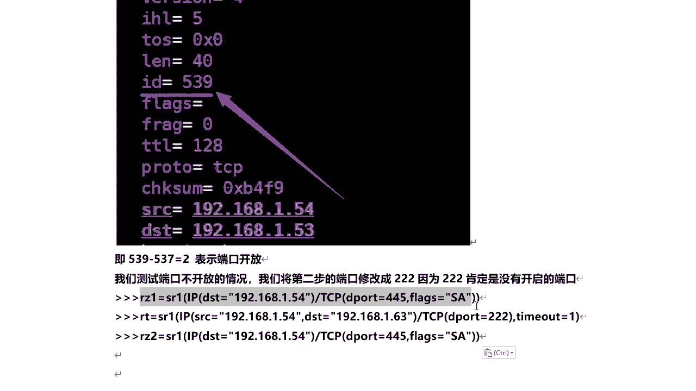

来第一个啊，然后第二个。

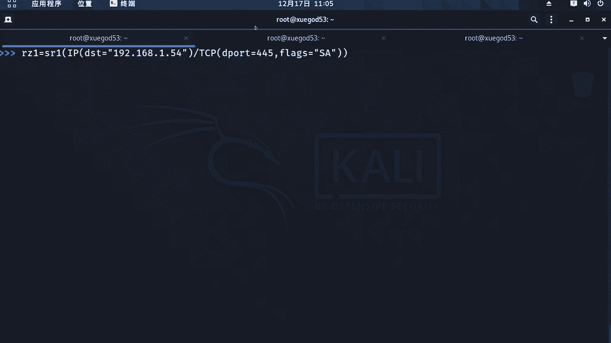

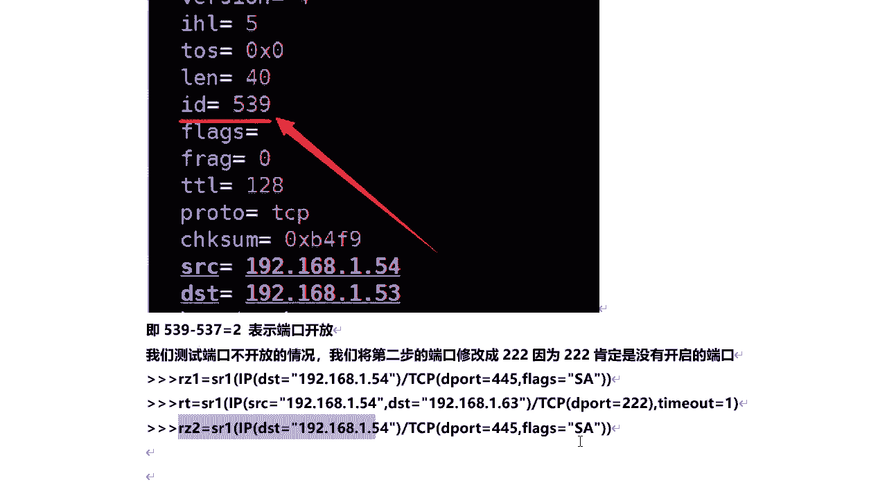

好快速执行一下了啊，好然后我们来看第一个它返回的结果啊，得到一个初始的ip地址，89好吧，来看最后一个rz 2点display，90自增减自增一。

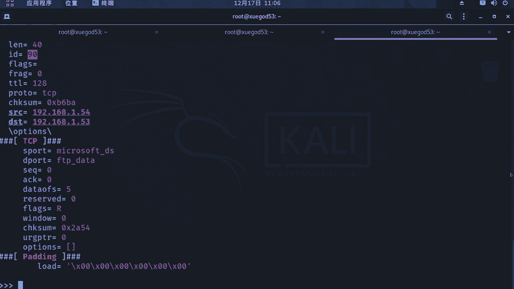

那么就是证明啊，我们这22端口目标记二段，三个二端口是关闭的好吧对，那么通过这个i p a值，我们可以判断出对端口是开放的还是关闭的，好的，那使用这种僵尸扫描啊，对他实际实施起来对吧。

你要想找到一个真正闲置的主机不太容易啊，不太容易好，那么下面呢我们来使用map来进行僵尸扫描好吧，map嗯在使用nmap进行僵尸扫描之前啊，那首先呢我们得来找一台啊僵尸主机对吧。

哎我们比如说我们来扫描我们这个整个局域网，内网段内啊，有哪些机器可以作为僵尸主机啊，扫描1921681点网段中某些机器啊，对哪些机可以作为僵尸主机，那么这里呢可以ml自带的一个脚本啊。

通过他的脚本呢来可以实现来扫描发现啊。

僵尸主机，这里呢我们来推动，好n map，1921681点杠二四网页码，然后呢注意啊，那么这个端口呢指定是1~1024啊，一般来讲，10241~1024都是常用的服务端口，那肯定在这个范围内。

肯定是有开放的好吧，有开放的啊，然后呢杠杠script脚本扫描使用这个脚本好吧，然后把这个结果呢，直接输出到这个a。tx t文件里面，好然后呢我们来看一下结果啊，a。txt，然后呢。

这里啊嗯我们看得到了几个1。1网关哈，这肯定平or zeros ipad值不是支撑的啊，1。2这个ip i d呢是自增的是吧，哎这i p a d是正的是吧，然后呢1。54看啊，看哪里呢，看这里1。

54ipad也是自增的对啊，1。63zero不是自增的，1。53就是我kelly是吧，也不是自增的嗯这里有几台是自增的，那么其中的1。54是五的嗯，xp对吧，要注意啊，那么这台机器是啥对吧。

我好像也不知道啊，那么注意有的它体系虽然是自增的，但不一定做僵尸主机，所以说呢这里需要我们的吗，去试一下的啊，那这1。54xp肯定是可以的啊，然后呢我们来使用nmap来自己行了吗，僵尸扫描啊。

僵尸扫描好，那我把这个退出去啊，好那么这里呢我们的n map目标主机的ip啊，杠小s大i啊，那这个是指定对僵尸记的ip地址，然后呢后面杠p我扫描目标计算哪些端口啊，1~100好吧，然后回车。

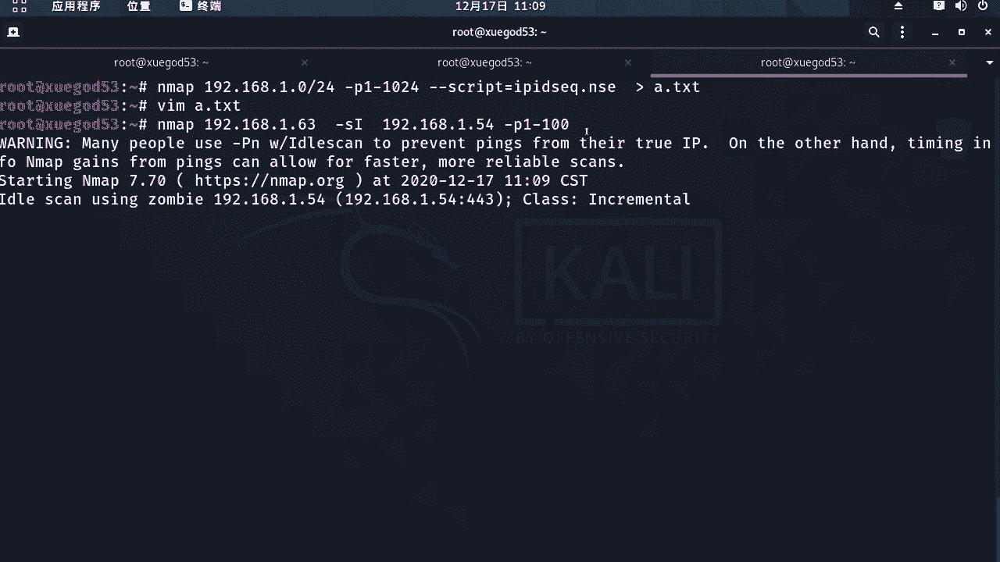

好那么结果已经出来了是吧嗯，我少1。63对，那么哪些端口开放的22端口，八零端口，那么注意啊，那么注意，那么这里他是对这个idol啊，扫描使用的是僵尸记的ip是1。54，哪个端口呢，四三端口好吧对。

然后呢注意，那么这个啊嗯这次使用这个僵尸机，那么我们在探测结果里边还有一个1。12，是不是对我们来看它呢，可不可以啊，啊这个呢不可以是吧，嗯也就是这个四三端口不能被使用是吧，不能被使用啊，好的。

那么你说你探测出它的ip id是自增的，但是不一定可以作为僵尸机，那什么意思啊，i p i d是真的，但是他可能不是足够闲置的，是不是足够闲置的，就它可能是对外发送了吗，数据包。

那么它呢就不能做什么僵尸主机，来进行什么僵尸扫描啊。

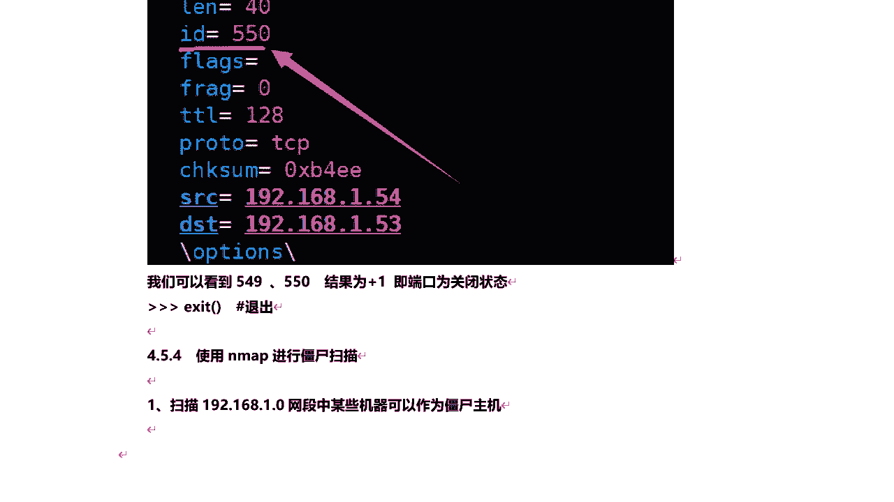

好的，那么这是整个关于僵尸扫描，它的原理和实现的一个过程啊，然后呢咱们最后做个总结好。

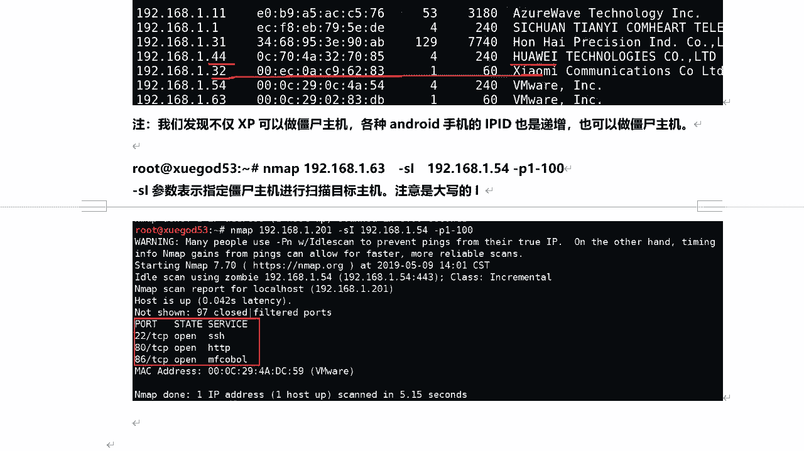

那么这节课呢，咱们主要讲了主动信息收集的原理啊，还有基于拼命令的探测，基于nmap扫描方式啊，最后那两个实战使用sky定制数据包，进行高级扫描。

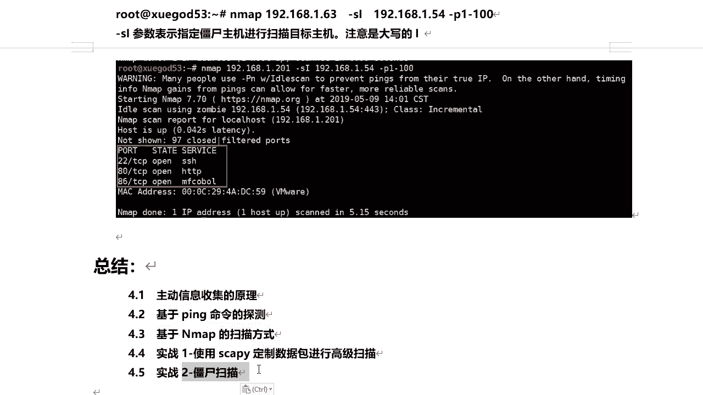