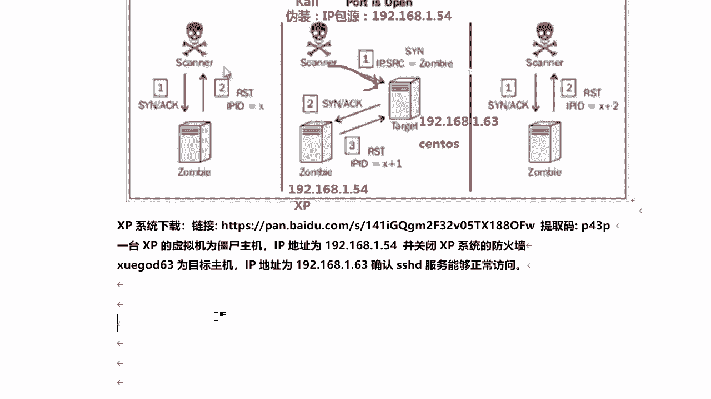
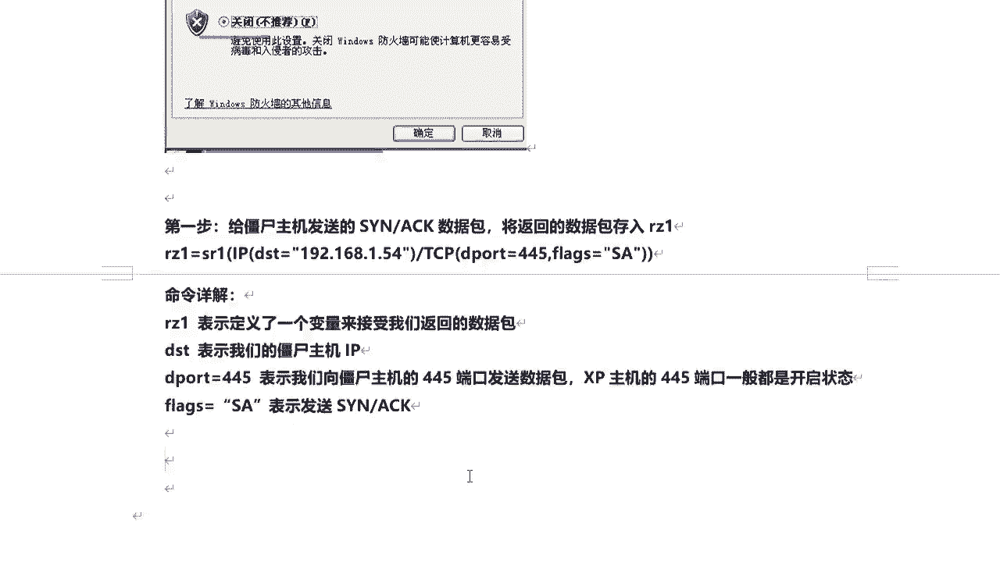
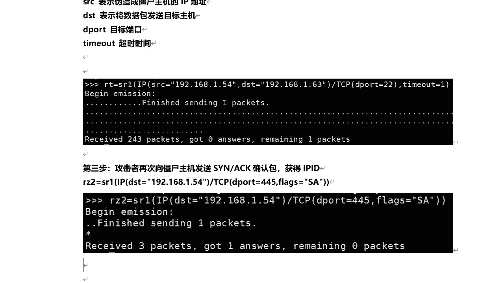
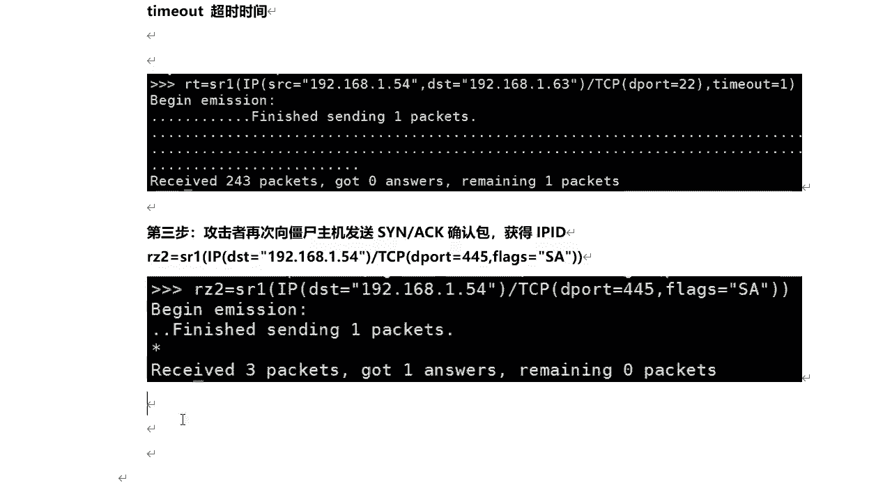
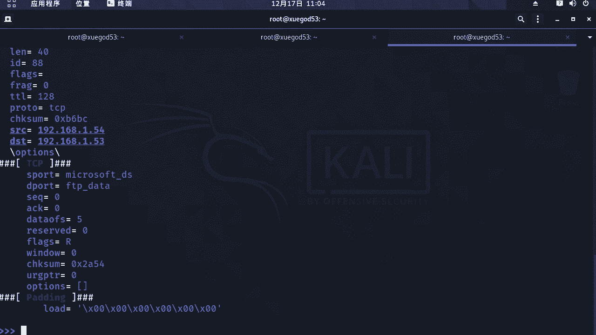
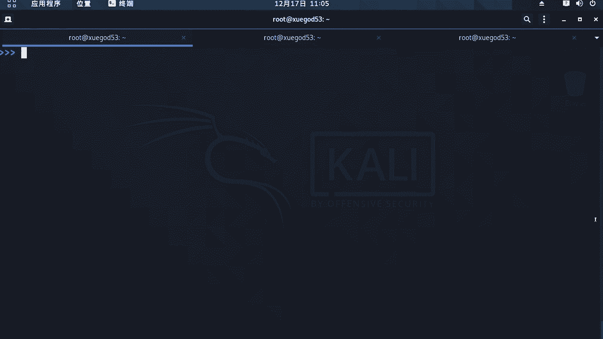
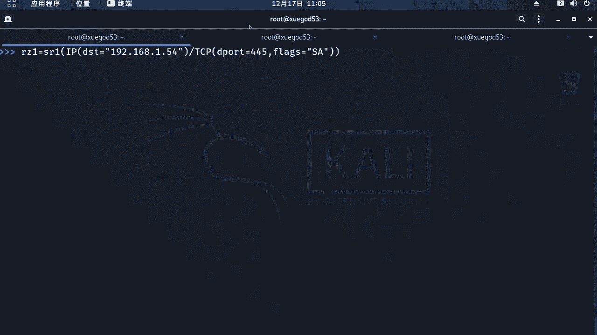
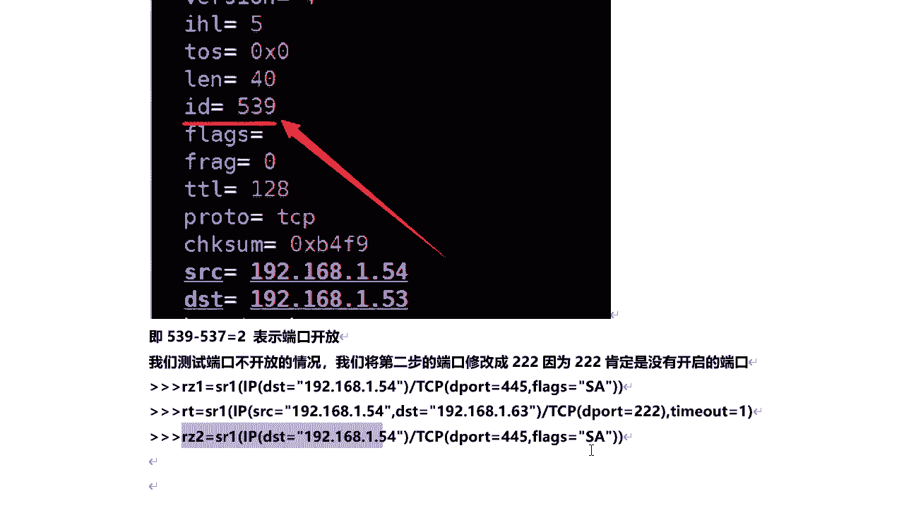
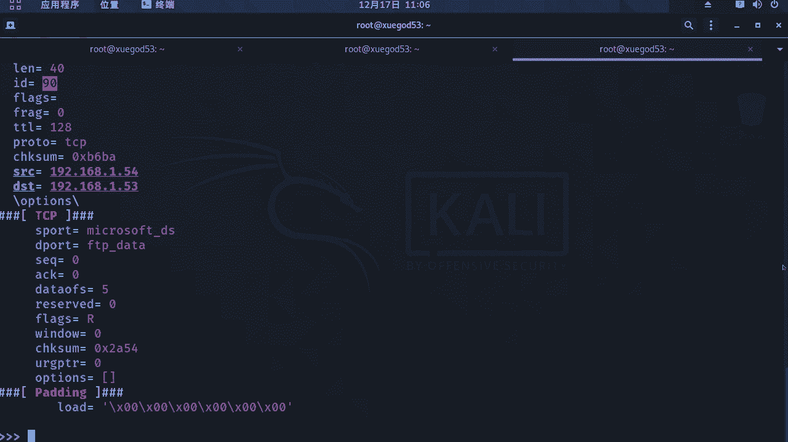
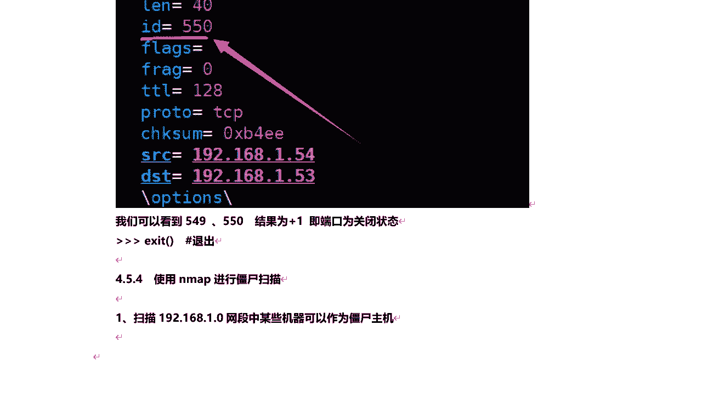

# 课程P45：8.7-【主动信息收集系列】实战2-僵尸扫描 🧟‍♂️

在本节课中，我们将要学习一种特殊的主动信息收集技术——僵尸扫描。这种技术以其极高的隐蔽性著称，但其实现条件也较为苛刻。我们将深入理解其工作原理，并通过实战演示如何使用Scapy和Nmap工具进行僵尸扫描。

## 概述

渗透测试中，思维比技术本身更为重要。僵尸扫描虽然实用性有限，但其背后隐藏的思维模式——如何在不直接接触目标的情况下获取信息——非常值得学习。本节将详细解释什么是僵尸扫描、其工作原理以及如何实施。

## 什么是僵尸扫描？

僵尸扫描是一种利用第三方“僵尸主机”来间接探测目标主机端口状态的扫描技术。这里的“僵尸主机”并非指被恶意软件控制的计算机，而是指一个**闲置的操作系统**。所谓闲置，是指这台主机不会主动与任何其他设备通信。

这种扫描方式拥有极高的隐蔽性，但实施条件比较苛刻，需要满足几个条件：
1.  目标网络允许伪造源IP地址进行访问。
2.  选择的僵尸主机必须是互联网上的一个闲置操作系统。
3.  该僵尸主机操作系统的IP数据包标识字段（IP ID）是递增的，例如Windows XP系统。

## 僵尸扫描的原理

要理解僵尸扫描，首先需要回顾TCP三次握手的过程。在三次握手中，第二次握手的数据包是**SYN+ACK**。僵尸扫描的核心，就是巧妙地利用这个数据包和IP ID的自增特性来推断目标端口状态。

以下是整个过程的原理图解和分析：

### 端口开放状态下的原理

我们将通过三个步骤来演示当目标端口开放时，IP ID的变化。

**第一步：获取僵尸主机初始IP ID**
攻击者向僵尸主机发送一个**SYN+ACK**数据包。由于僵尸主机并未向攻击者发起连接请求，因此它会回复一个**RST**（重置）数据包来关闭这个意外的连接。攻击者可以从这个回复包中获得僵尸主机当前的IP ID值，假设为 **X**。

**第二步：伪装探测目标主机**
攻击者将自己的源IP地址伪装成僵尸主机的IP地址，然后向目标主机的特定端口（例如22端口）发送一个**SYN**连接请求。
*   如果目标主机的该端口是**开放**的，它会按照TCP协议，向请求的源IP（即僵尸主机）回复一个**SYN+ACK**确认包。
*   僵尸主机收到这个来自目标主机的**SYN+ACK**包后，会感到困惑（因为它没有发起请求），于是向目标主机回复一个**RST**包。**每发送一个数据包，僵尸主机的IP ID就会自增1**。因此，在这个交互后，僵尸主机的IP ID变为 **X+1**。

**第三步：再次获取僵尸主机IP ID**
攻击者再次向僵尸主机发送一个**SYN+ACK**数据包。僵尸主机同样会回复一个**RST**包，此时IP ID再次自增1，变为 **X+2**。

**结论分析：**
攻击者对比第一步和第三步获得的IP ID值。初始值为 **X**，最终值为 **X+2**，自增了2。这证明在探测过程中，僵尸主机额外发送了一个数据包（即第二步中回复给目标主机的RST包），从而间接证明目标主机的端口是**开放**的。

### 端口关闭状态下的原理

现在，我们来看当目标端口关闭时的情况。

**第一步：获取僵尸主机初始IP ID**
与开放状态相同，攻击者获得初始IP ID值 **X**。

**第二步：伪装探测目标主机**
攻击者伪装成僵尸主机，向目标主机的关闭端口发送**SYN**请求。
*   由于端口关闭，目标主机会直接向请求的源IP（即僵尸主机）回复一个**RST**包，拒绝连接。
*   僵尸主机收到这个RST包后，不会做出任何响应（因为它没有发起请求，收到RST是正常的结束状态）。因此，僵尸主机的IP ID**没有发生变化**，仍为 **X**。

**第三步：再次获取僵尸主机IP ID**
攻击者再次向僵尸主机发送**SYN+ACK**，僵尸主机回复RST，IP ID自增1，变为 **X+1**。

**结论分析：**
攻击者对比初始值 **X** 和最终值 **X+1**，发现IP ID只自增了1。这说明在探测过程中，僵尸主机没有与目标主机发生额外通信，从而证明目标主机的端口是**关闭**的。

## 实战演示：使用Scapy进行僵尸扫描

理解了原理后，我们通过Scapy工具手动实现僵尸扫描。实验环境如下：
*   攻击机（Kali Linux）：IP 为 192.168.1.53
*   僵尸主机（Windows XP）：IP 为 192.168.1.54 （需关闭防火墙）
*   目标主机：IP 为 192.168.1.63

我们将同时执行三个步骤，并快速对比结果。

### 探测开放端口（22端口）

以下是探测目标主机22端口状态的命令序列：



```python
# 第一步：获取僵尸主机(1.54)初始IP ID，探测其45端口
r1 = sr1(IP(dst=“192.168.1.54”)/TCP(dport=45, flags=“SA”), timeout=2, verbose=0)


# 第二步：伪装成僵尸主机(1.54)，探测目标主机(1.63)的22端口
send(IP(src=“192.168.1.54”, dst=“192.168.1.63”)/TCP(dport=22, flags=“S”), timeout=1, verbose=0)

# 第三步：再次获取僵尸主机当前IP ID
r2 = sr1(IP(dst=“192.168.1.54”)/TCP(dport=45, flags=“SA”), timeout=2, verbose=0)
```



执行后，查看 `r1.display()` 和 `r2.display()` 结果中的IP ID字段。假设初始ID为86，最终ID为88，自增2，则判断目标22端口为**开放**。


### 探测关闭端口（2323端口）


以下是探测一个可能关闭的端口（2323）的命令：


```python
# 步骤同上，仅改变目标端口
r1 = sr1(IP(dst=“192.168.1.54”)/TCP(dport=45, flags=“SA”), timeout=2, verbose=0)
send(IP(src=“192.168.1.54”, dst=“192.168.1.63”)/TCP(dport=2323, flags=“S”), timeout=1, verbose=0)
r2 = sr1(IP(dst=“192.168.1.54”)/TCP(dport=45, flags=“SA”), timeout=2, verbose=0)
```


假设初始ID为89，最终ID为90，自增1，则判断目标2323端口为**关闭**。

## 使用Nmap进行僵尸扫描


手动扫描比较繁琐，Nmap工具内置了僵尸扫描功能。首先，我们需要寻找可用的僵尸主机。





### 发现潜在僵尸主机




使用Nmap脚本扫描局域网，寻找IP ID为递增模式的主机：




```bash
nmap 192.168.1.0/24 -p1-1024 --script=ipidseq.nse -oA a.txt
```







查看结果文件 `a.txt`，寻找输出中包含 `Incremental!` 的IP地址，这些是潜在的僵尸主机。

### 执行Nmap僵尸扫描



找到僵尸主机（例如192.168.1.54）后，使用以下命令进行扫描：

```bash
nmap 192.168.1.63 -sI 192.168.1.54 -p1-100
```

*   `-sI` 参数用于指定僵尸主机的IP地址。
*   该命令会通过僵尸主机192.168.1.54来扫描目标主机192.168.1.63的1到100号端口。


**注意**：并非所有IP ID递增的主机都适合作为僵尸主机。如果主机不够“闲置”（即在扫描期间仍会主动发送其他数据包），会导致IP ID的增量不稳定，从而使扫描结果不准确。

## 总结


本节课中，我们一起学习了主动信息收集中的高级技术——僵尸扫描。我们首先探讨了渗透测试中思维的重要性，然后详细剖析了僵尸扫描利用TCP/IP协议栈和IP ID自增特性的工作原理。通过Scapy工具，我们一步步实现了对目标端口状态的间接探测，并验证了“IP ID自增2则端口开放，自增1则端口关闭”的结论。最后，我们学习了如何使用Nmap自动化地发现僵尸主机并执行扫描。


尽管僵尸扫描的实施条件苛刻，在实际渗透中应用场景有限，但理解其原理对于深化网络协议认知和培养隐蔽测试思维具有重要价值。