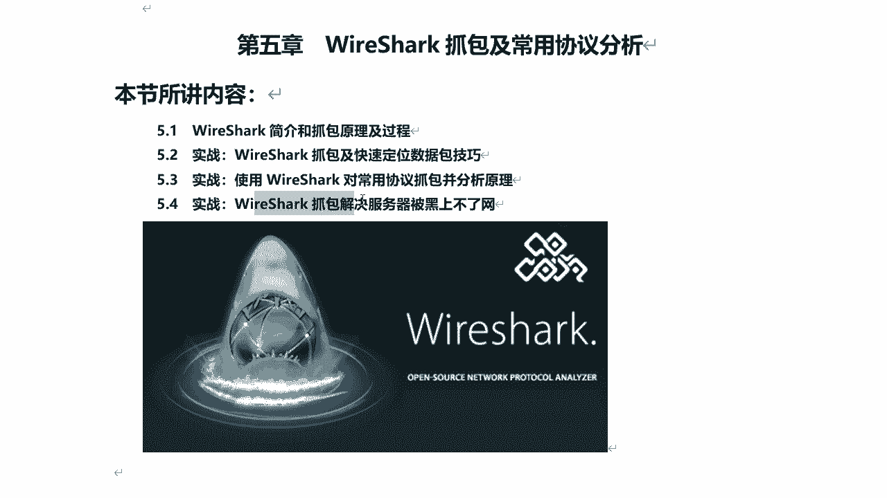
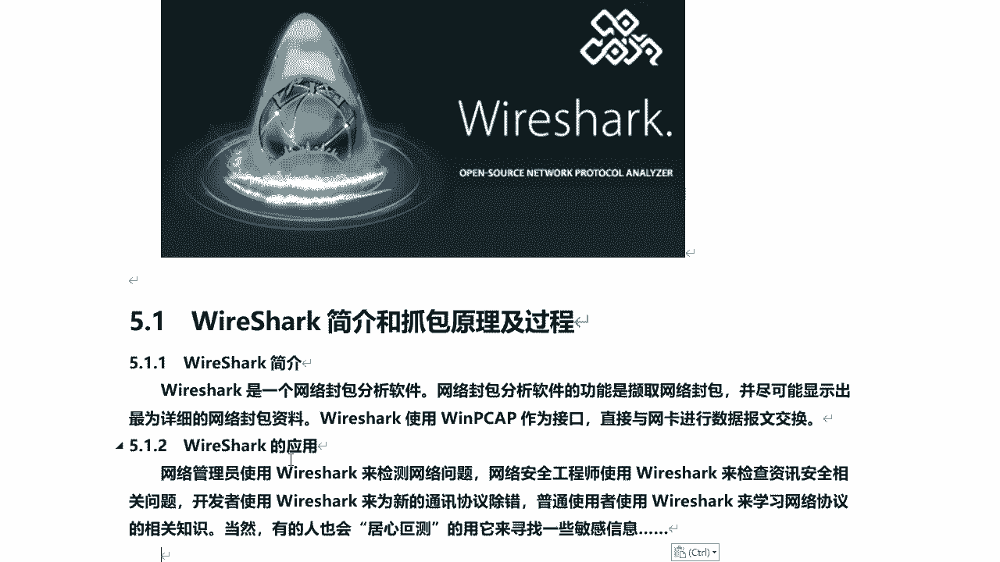
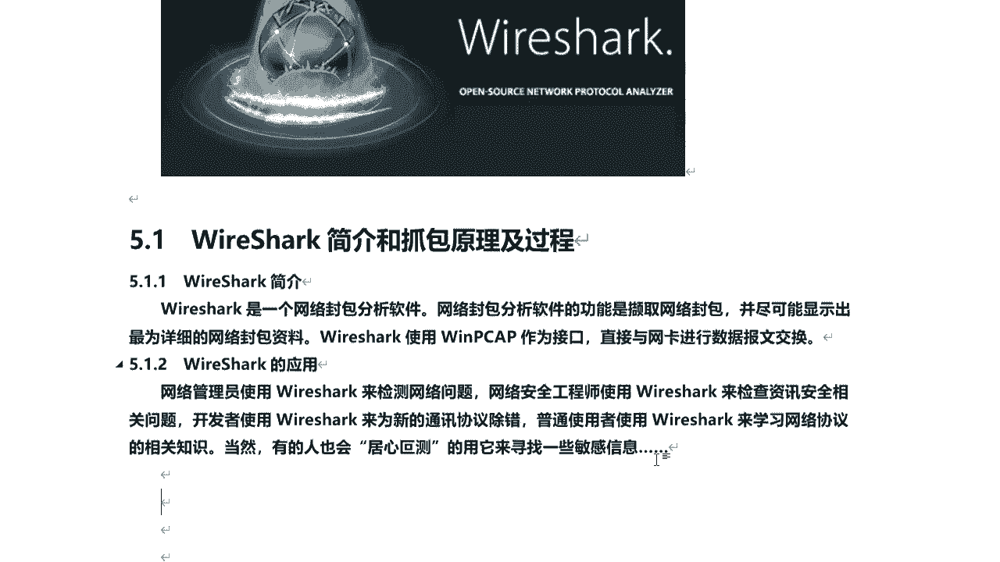
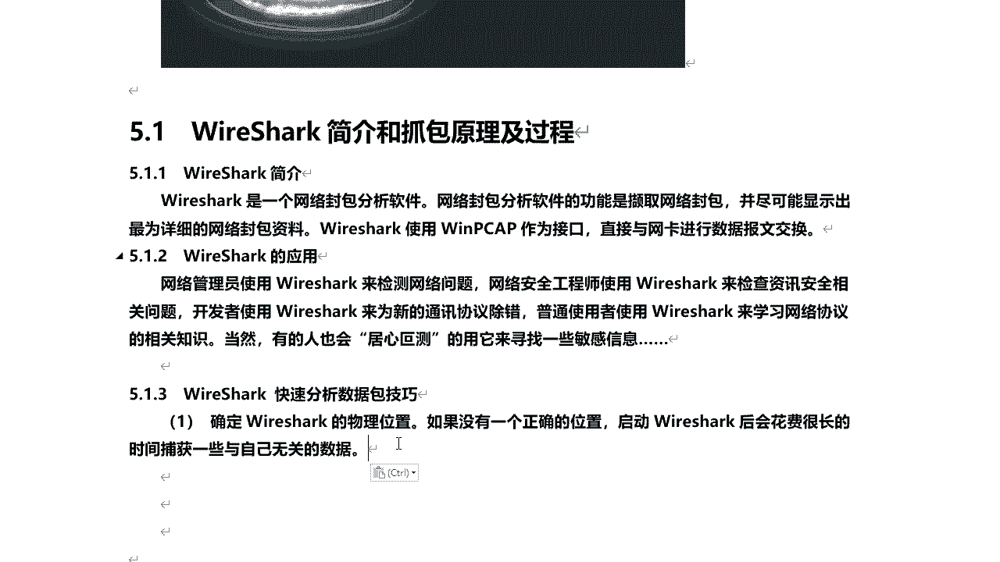
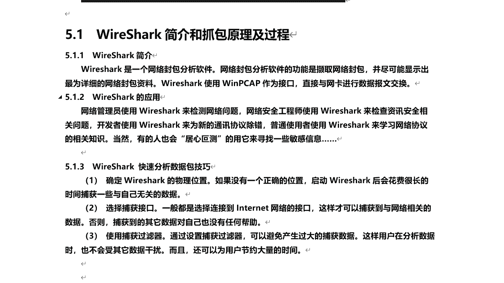
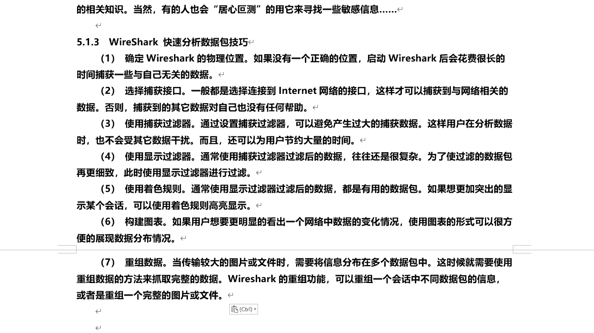

# P46：9.1-【WireShark抓包系列】WireShark简介和抓包原理及过程 - 一个小小小白帽 - BV1Sy4y1D7qv

大家好，我是讲师root，那么今天呢给大家分享一下的visuck，抓包及常用器分析，那么首先呢我们来了解一下visa及抓包原理，还有过程，然后呢咱们接着实战使用via suk。

抓包及快速定位数据包的技巧，然后呢使用visug对常用协议抓包，并分析原理啊。

上不了网的问题，那么下面呢我们先来看一下的visuck，他的简介啊，那么什么是visuck，vsc是一个网络封包分析软件，那么网络封包分析软件的功能呢，是截取网络封包。

并尽可能显示出最详细的一个网络封包资料，巴萨卡的使用wp c a p作为接口哎，直接与网卡进行数据报文交换啊，那么注意，那么这个visuki自带的啊，那么同时呢在他有windows。

在windows下也可以去安装和使用，在windows安装的时候必须得安装它，那在那么也就是在安装这个web sc自动对它安装，这个是吧，wp c a p啊，他以他为作为接口，否则的话你是抓不了包的啊。

好那么下面我们来看visuck的应用都有哪些啊，对用在什么地方。

那么网络管理员呢使用visuck，用来检测网络问题，那么网络安全工程师呢使用visa来检测啊，咨询安全相关问题啊，开发者使用visuck来为新的通讯协议啊，进行除错。

普通省者呢让他来学习网络协议的相关知识，那比如说我们刚刚接触是吧，安全网络安全，那么我们可以通过visa抓包来学习各种网络协议，当然也有人会啊，居心叵测，用它来寻找一些敏感信息，是的，那么既然可以抓包。

那么作为一个明文传输的。

比如说f t p啊，htb啊，那么一些密码啊对吧，账号密码通过visuck也是可以抓出来的，好那下面呢我们来了解一下visuck快速分析啊，数据包的一个技巧啊，那首先去。

首先呢你要想用使用visuck那个，抓取到整个网络的一个数据流量，那首先必须确定它的物理位置啊，如果没有一个正确的位置，那你启动这个virus后，会花费很长时间捕获一些与自己无关的数据。

对你要想捕获什么数据，什么数据包，首先这个物理位置放在什么位置比较关键啊，比较重要，一般的话都会放在什么核心网络区对。

那么比如说出口对，那么它能抓取到整个网络内啊，整个内网啊，甚至外网所有的数据包就流经经过路由网关，出路由的对吧，还有整个局域网内的所有机器的数据流量啊，都可以抓到，那必须得放在核心网络区啊。

另外呢通过选择捕获接口啊，那么这个捕获接口呢，一般啊都是连接到internet网络的一个接口，这样呢才可以捕获到与网络相关的数据啊，那否则捕获到的其他数据啊，对自己没有任何帮助。

所以说这块呢大家一定要注意啊，然后呢第三点呢使用捕获过滤器啊，那么就是通过设置啊，捕获过滤器可以避免产生啊过大的捕获数据啊，那么这样在用户分析数据的时候，也不会受其他数据的干扰。

那么就是说你想捕获什么类型的数据，那么你可以通过设置捕获过滤器，来捕获特定你想要捕获的这些数据啊，那么其他没有用的是吧，一律不补货啊，那么才可以把为用户节省大量的时间。

否则的话你会我国的很多很多很多数据对吧，那么其中就包含对有你想要的，但是大部分都是你不想要的啊。

那么这样的话会浪费很多时间，第四呢当你捕获到很多数据之后，那么通过显示过滤器对吧，对通过它呢就是对数据啊，抓取到的一些数据包进行过滤啊，那么可以更加的细致对吧，能够更明确的sin就是你想要的对。

因为你这个通过捕获过滤器过滤后的数据啊，也是很复杂的，那为了使过滤的数据包啊更细致对吧，能够找到你真正想要的啊，真正想看的数据包，就是使用显示过滤器就可以了啊，那么这是捕获过滤器，是在捕获之前设置的。

显示过滤器，在捕获完进行筛选啊，还有呢可以使用着色规则啊，用的颜色就是通常使用显示过滤器，过滤后的数据啊，都是有用的数据包嗯，那么如果你想突出的啊显示出某个绘画，那么你可以通过颜色规则来高亮显示对吧。

那么你可以通过不同的颜色去标示出来，还有一点很重要，就是说它可以构建什么构建图表啊，通过这种图表的方式啊，能看出一个网络中啊数据的一个变化情况啊，那么另外形图表的形式也可以很方便。

展现什么数据分布情况啊，最后呢他还可以进行数据存重组啊。

这一点呢也很强大啊，那么比如在网络传输过程中啊，当你传输较大的图片或文件的时候，可能需要将信息分布在多个数据包中，也就分片传输啊，那么这个时候就需要使用重组数据的方法，来抓取完整的数据。

那么这个while suck它就具备这个功能，它这个重组功能可以重组啊，是重组一个绘画中不同数据包的信息啊，或者是重组一个完整的图片或文件，那么比如说这张图片很大，那么在传输过程中对吧，它是分辨传输的。

那你visuk抓包的时候可能抓了很多个片，很多段啊，那么当他把这个所有的都接收全了是吧，完全接收了，然后将这些所有分片的对吧，这个数据重新组合成一张完整的图片，这叫重组数据啊。

