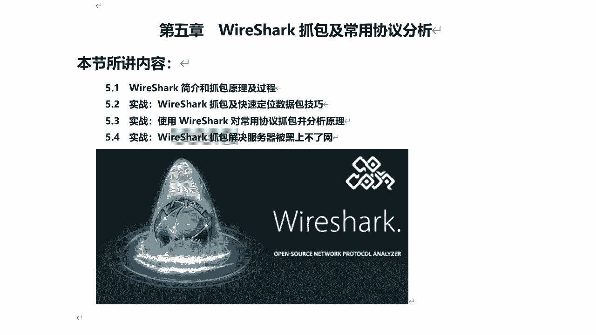
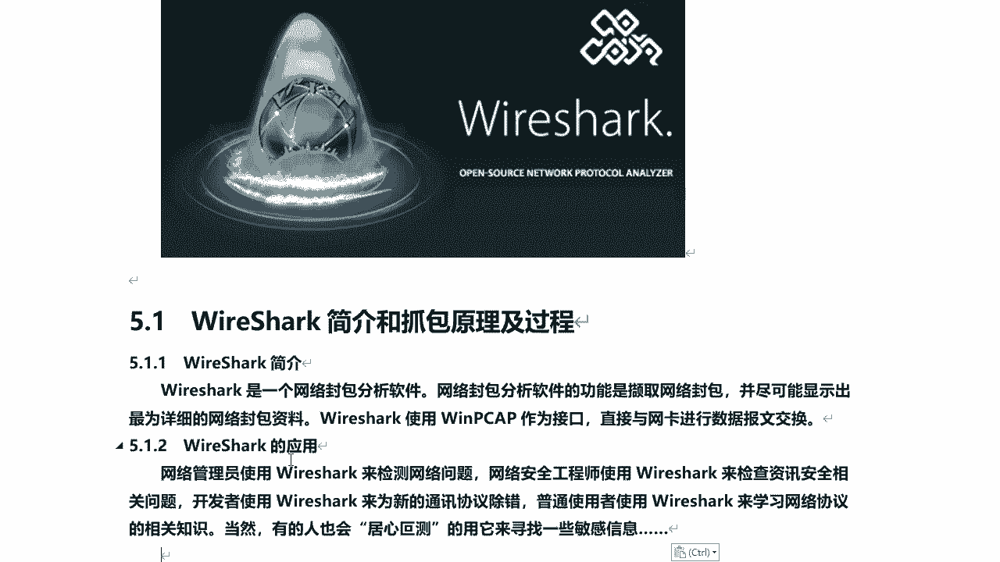
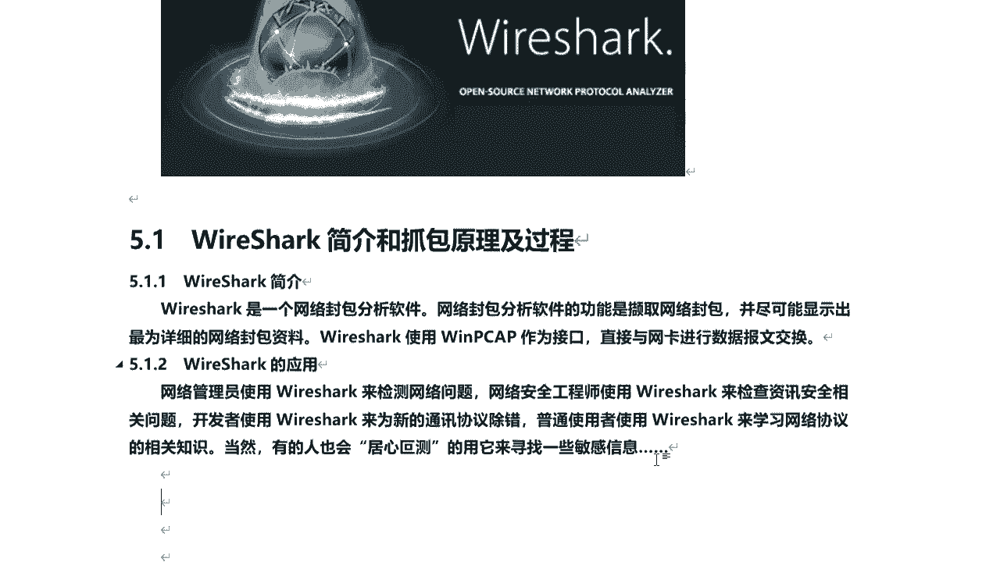
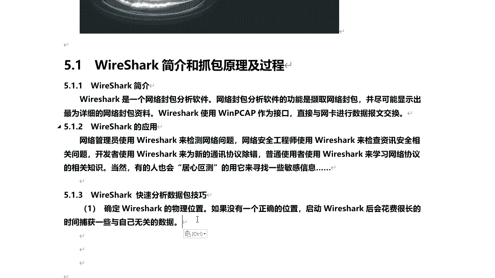
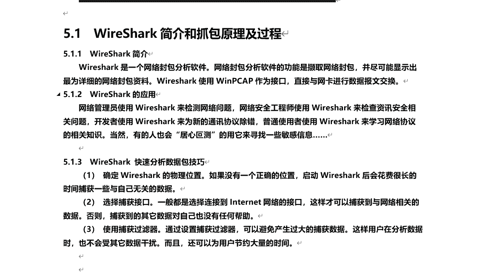
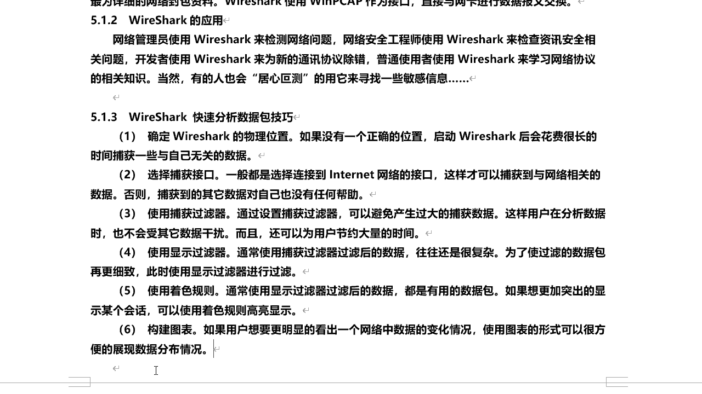
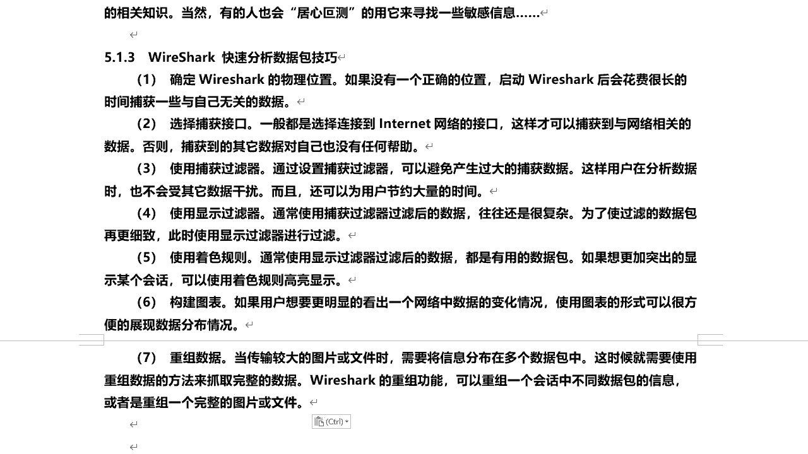

# 课程P46：9.1 - 【WireShark抓包系列】WireShark简介和抓包原理及过程 🕵️

在本节课中，我们将要学习网络封包分析软件WireShark的基本概念、核心抓包原理以及其工作过程。通过学习，你将了解WireShark是什么、它能做什么，以及如何有效地使用它来捕获和分析网络数据。

## WireShark简介 📖

什么是WireShark？WireShark是一个网络封包分析软件。网络封包分析软件的功能是截取网络封包，并尽可能详细地显示网络封包的资料。WireShark使用**WinPcap**作为接口，直接与网卡进行数据报文交换。

需要注意的是，WireShark自带WinPcap。在Windows系统下安装和使用WireShark时，必须安装WinPcap。实际上，在安装WireShark时，它会自动安装WinPcap。WireShark以WinPcap为接口，否则无法抓包。

## WireShark的应用场景 🎯

WireShark被广泛应用于不同领域。

以下是WireShark的主要应用场景：

*   **网络管理**：网络管理员使用WireShark来检测网络问题。
*   **安全分析**：网络安全工程师使用WireShark来检测信息安全相关问题。
*   **协议开发**：开发者使用WireShark来为新的通讯协议进行除错。
*   **协议学习**：普通学习者使用它来学习网络协议的相关知识。
*   **信息探测**：也有人会用它来寻找一些敏感信息。既然可以抓包，那么对于明文传输的协议，例如**FTP**、**HTTP**，其中的账号密码通过WireShark也是可以抓取出来的。

## WireShark快速分析数据包的技巧 ⚡

上一节我们介绍了WireShark的应用，本节中我们来看看如何高效地使用WireShark进行分析。掌握正确的技巧可以极大地提升分析效率。

以下是使用WireShark快速分析数据包的关键技巧：

*   **选择正确位置**：要想使用WireShark抓取到整个网络的数据流量，首先必须确定其物理位置。如果没有一个正确的位置，启动WireShark后会花费很长时间捕获一些与自己无关的数据。一般会将其部署在核心网络区域，例如网络出口，这样可以抓取到流经网关的整个内网甚至外网的所有数据包。
*   **选择捕获接口**：通过选择捕获接口，一般选择连接到Internet网络的接口，这样才可以捕获到与网络相关的数据。否则捕获到的其他数据对自己没有任何帮助。
*   **使用捕获过滤器**：通过设置捕获过滤器，可以避免产生过大的捕获数据文件。这样在用户分析数据时，也不会受其他数据干扰。这意味着你可以只捕获特定类型的数据，为用户节省大量时间。
*   **使用显示过滤器**：当你捕获到很多数据之后，通过显示过滤器可以对已抓取的数据包进行更细致的过滤，从而更明确地找到你想要查看的数据包。捕获过滤器是在捕获之前设置的，而显示过滤器是在捕获完成后进行筛选的。
*   **使用着色规则**：通常使用显示过滤器过滤后的数据都是有用的数据包。如果你想突出显示某个会话，可以通过着色规则来高亮显示，用不同的颜色进行标示。
*   **构建图表**：通过图表的方式，能直观地看出网络中数据的变化情况。图表形式也可以很方便地展现数据分布情况。
*   **重组数据**：这一点也很强大。例如，在网络传输过程中，当传输较大的图片或文件时，可能需要将信息分布在多个数据包中，即分片传输。这时就需要使用重组数据的方法来获取完整的数据。WireShark具备重组功能，可以重组一个会话中不同数据包的信息，或者重组一个完整的图片或文件。

---

本节课中我们一起学习了WireShark的基本定义、其依赖的**WinPcap**接口、广泛的应用场景，以及从选择抓包位置、使用过滤器到数据重组等一系列高效分析数据包的实用技巧。掌握这些基础知识是后续进行实际抓包和分析的前提。