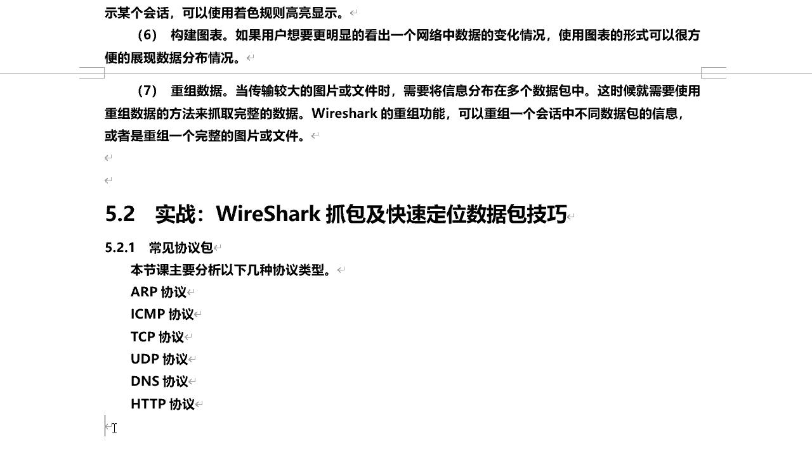
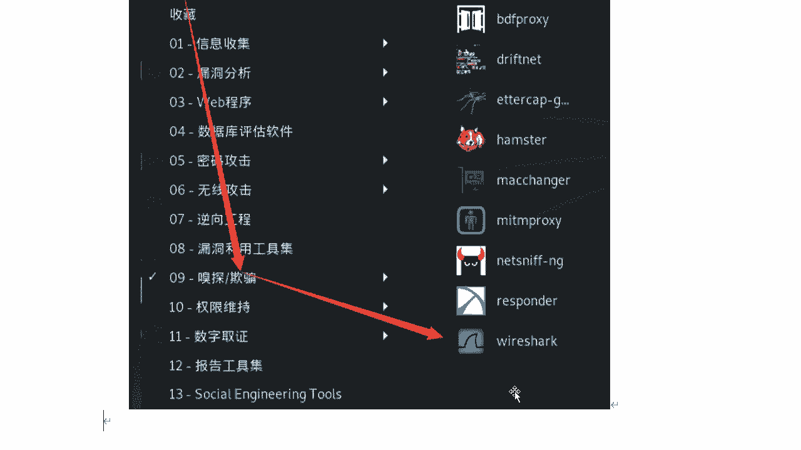
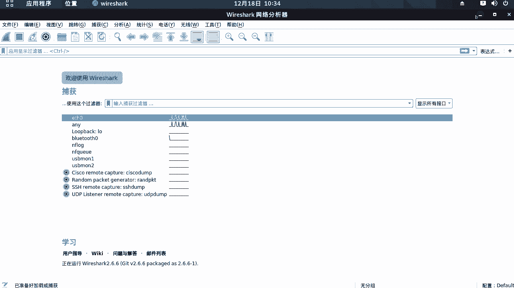
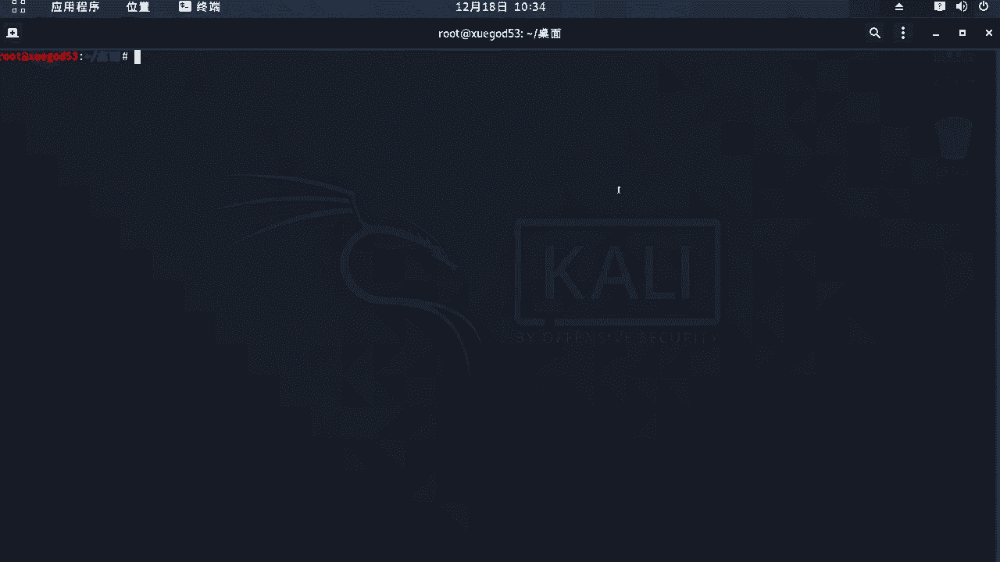
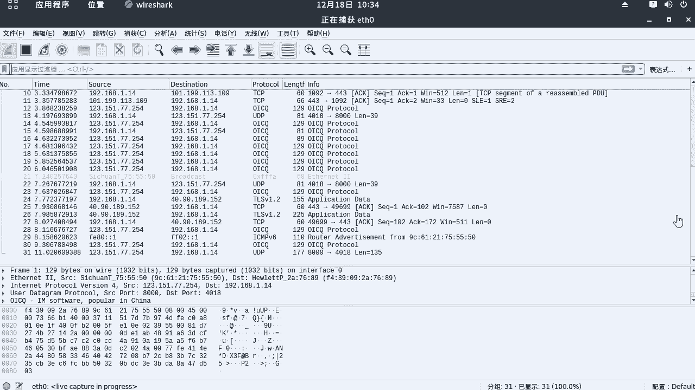
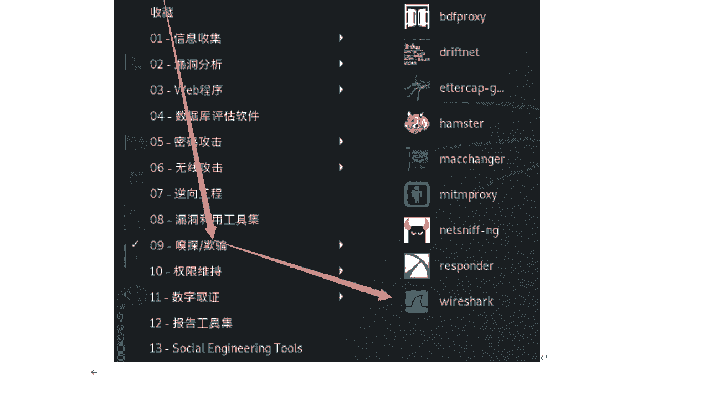
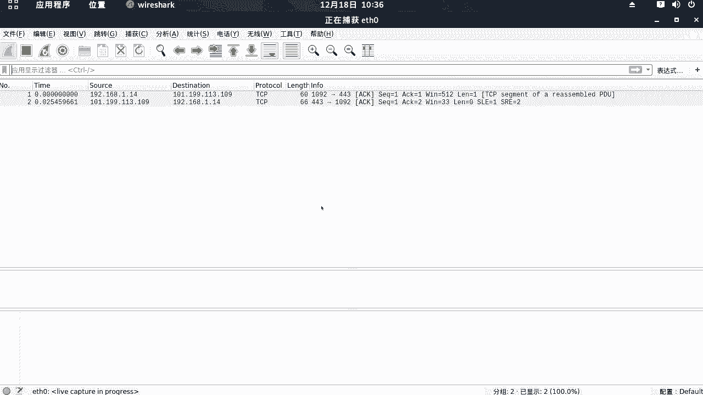

# P47：9.2-【WireShark抓包系列】常见协议包-启动WireShark-混杂模式 - 一个小小小白帽 - BV1Sy4y1D7qv

好，下面呢我们来讲一下visuck，招包及快速定位数据包的技巧啊，然后呢咱们这节课主要针对一些常见的细胞啊，给大家进行讲解啊，那么主要有呢a arp协议。

s m p i t c p u d b d n s和h t t p，也就是这几种常见的西医类型啊，分析给大家来讲解一下的啊，下面呢我们来启动我们的visuck，那么very suck在哪里呢。

我们在开立的它是自带的啊。

那么在应用程序嗅探和欺骗里面的啊，点击这个图标就可以了。

那下面呢我们来启动一下的，好的，那么它呢会出现一个错误提示信息啊，这个呢它是意思就是不建议啊，我们使用root用户去运行，那么这里我们直接点击ok就可以了，然后呢直接选择网卡名称，那么就说这个网卡啊。

对关键是你所有对抓取流量吗，流量本网卡或发送给本网卡的数据包啊，它都会抓取到，那么具体选择哪个呢，我们可以来通过我们的终端啊。

对来看一下的，我们开e的网卡名称啊。

默认的是e t h0 啊，那么这个怎么查看呢，看这里好吧，那所以说那么这里呢，我们来选择第一个e t h0 就可以了，双击这个网卡名称，那么它呢就开始抓包了啊，那么现在呢它大量的数据包就已经产生了。

好吧对，然后呢这里要注意一点啊，对那么下面呢我们来介绍啊。

一种说混杂模式啊，那么在抓包的过程中呢，它是一个概念，混杂模式和普通模式，那么这两个模式啊到底有什么区别，什么是混搭模式，什么是普通模式。

下面呢我们来给大家讲一下的啊，呃那首先来看一下混杂模式，那么所谓的混杂模式啊，就是接收所有经过本网卡的数据包啊，那么这个经过本网卡的数据包啊，包括不是发送给本机的包，也就是说他不会去验证mac地址啊。

另外一种就是普通模式下啊，那网卡呢它只接受发送给本机的包，那么其中就包括广播包啊，然后呢传递给上层程序，其他的包啊一律丢弃啊，普通模式就不是发送给本机的，一律丢弃啊，一般来讲那么混杂模式啊。

它不会影响网卡的一个正常的工作啊，多在呢网络监听工具上去使用，那么下面呢我们打开visuck，默认呢它是混杂模式，那么如何去关闭混搭模式，打开普通模式呢，我们来看一下啊，那么先把这抓包啊停止。

然后呢点击捕获选项，看这里有个打对勾的，在所有接口上使用混杂模式，我们把这个对勾啊去掉，然后呢点击开始，然后继续，我们先不保存它啊，那么此时就进入了普通模式对，那么进入普通模式之后呢。

这里的数据包明显比刚才要少很多，那么也就是现在他只接收发送给本机的数据包，其中包括广播包啊，那么如何去对吧，打开混杂模式呢，那你把这个停止，然后点击捕获选项对吧，你把它对勾再打上，然后开始对。

