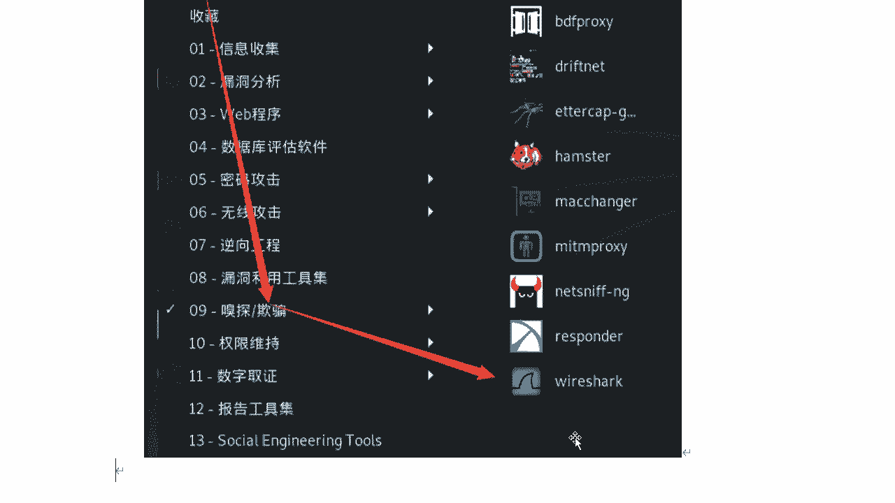
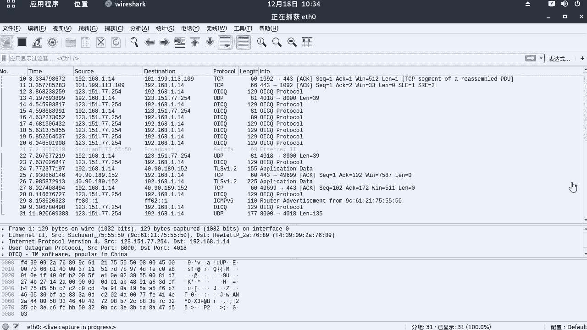
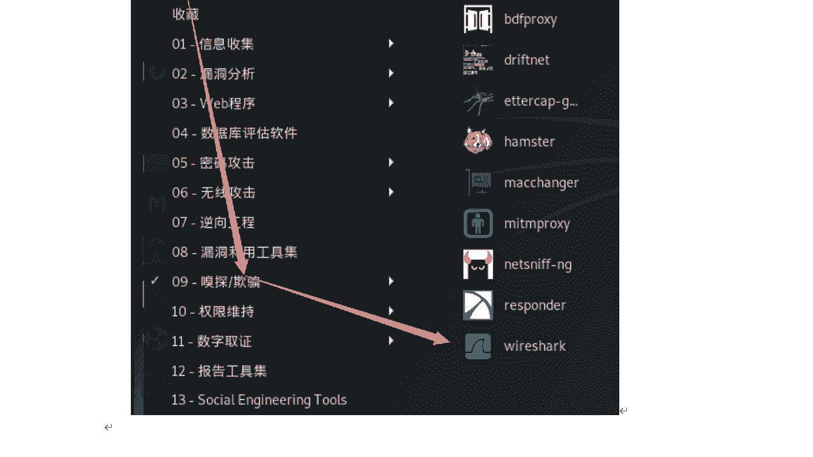
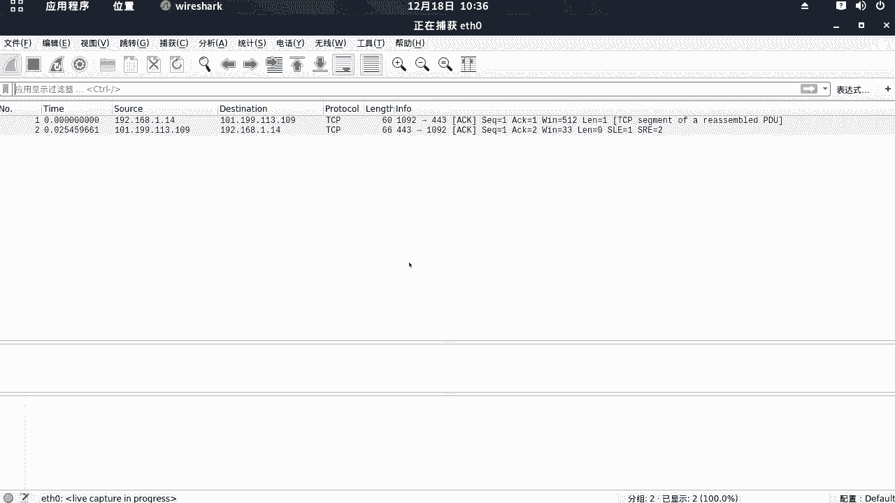

# 课程 P47：9.2 - 【WireShark抓包系列】常见协议包与启动 🚀

在本节课中，我们将学习如何使用WireShark启动抓包，并理解混杂模式与普通模式的核心区别。课程将涵盖常见协议包的介绍以及WireShark的基本操作技巧。

---

## 启动WireShark

下面我们讲解WireShark抓包及快速定位数据包的技巧。本节课主要针对一些常见的协议包进行讲解，主要包括ARP、ICMP、TCP、UDP、DNS和HTTP这几种常见协议类型。

下面我们来启动我们的WireShark。WireShark在Kali Linux中是自带的。

它在“应用程序” -> “嗅探和欺骗”分类里，点击这个图标即可。

下面我们启动它。启动后会出现一个错误提示信息，意思是**不建议使用root用户运行**。这里我们直接点击“OK”即可。

然后需要选择网卡名称。网卡是抓取流量的关键，它会抓取**流经本网卡或发送给本网卡的所有数据包**。

具体选择哪个网卡，我们可以通过终端来查看。

查看Kali Linux的网卡名称。

默认网卡通常是 `eth0`。查看方法如上图所示。

因此，这里我们选择第一个 `eth0` 即可。双击这个网卡名称，WireShark就会开始抓包。

现在，大量的数据包已经开始产生了。

这里需要注意一点。

---

## 理解混杂模式

下面我们来介绍一个概念：**混杂模式**。在抓包过程中，存在混杂模式和普通模式两种模式。这两种模式有什么区别？什么是混杂模式？什么是普通模式？

下面给大家讲解一下。

首先来看**混杂模式**。所谓的混杂模式，就是**接收所有流经本网卡的数据包**。这些数据包包括**不是发送给本机的包**，也就是说，网卡不会去验证MAC地址。

另一种是**普通模式**。在普通模式下，网卡**只接收发送给本机的包**，其中包括广播包，然后传递给上层程序。**其他不是发送给本机的包一律丢弃**。

一般来说，混杂模式不会影响网卡的正常工作，多在网络监听工具上使用。

下面我们打开WireShark。默认情况下，WireShark处于混杂模式。

如何关闭混杂模式，打开普通模式呢？我们来看一下操作。

首先，停止当前的抓包。

然后，点击“捕获” -> “选项”。你会看到一个勾选的选项：“在所有接口上使用混杂模式”。

把这个对勾去掉，然后点击“开始”。弹出的提示框选择不保存。

此时，WireShark就进入了普通模式。

进入普通模式后，界面显示的数据包数量明显比刚才少很多。这是因为现在它只接收发送给本机的数据包（包括广播包）。

如何重新打开混杂模式呢？停止抓包，点击“捕获” -> “选项”，重新勾选“在所有接口上使用混杂模式”，然后点击开始即可。

---

## 总结

本节课中，我们一起学习了如何启动WireShark进行抓包，并深入理解了**混杂模式**与**普通模式**的核心区别。关键点在于：混杂模式会捕获所有流经网卡的数据，而普通模式只捕获目标为本机的数据。这是进行网络流量分析的基础。