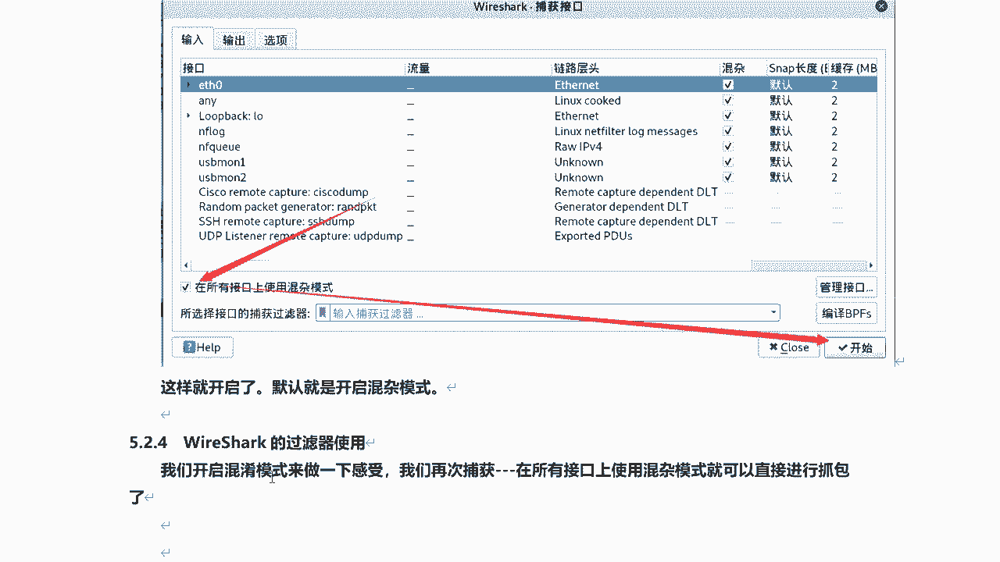
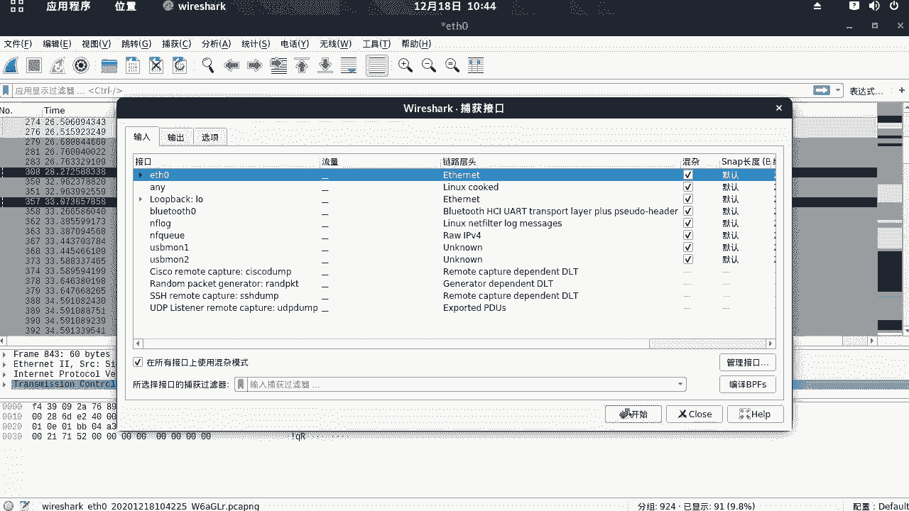
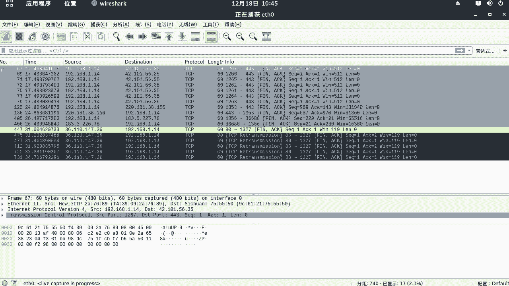
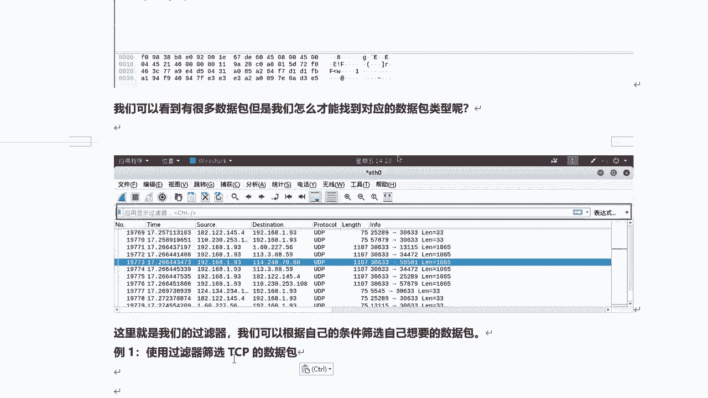
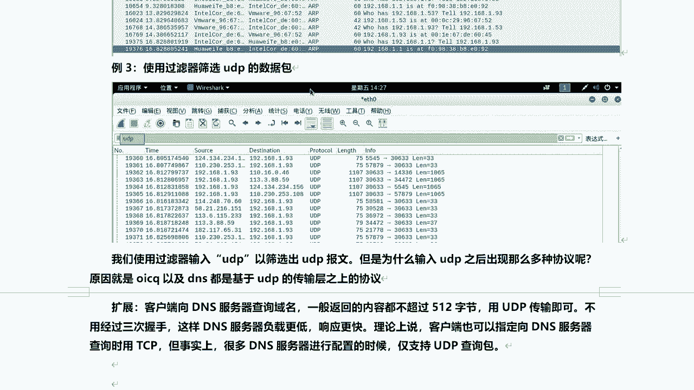
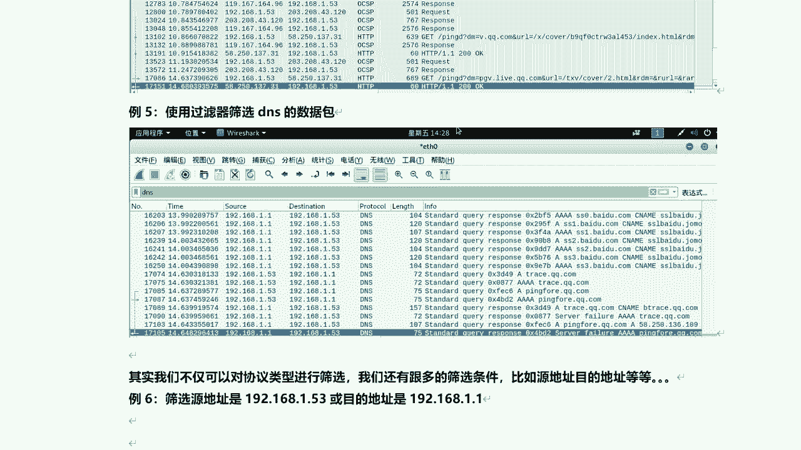
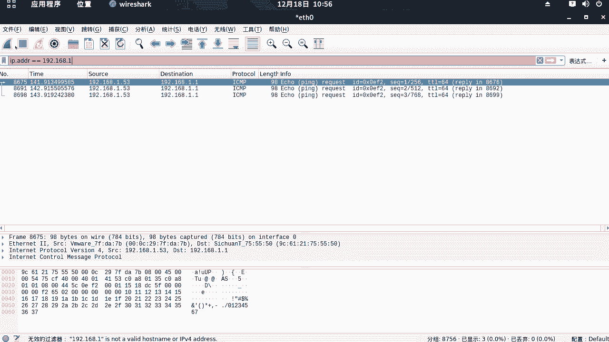
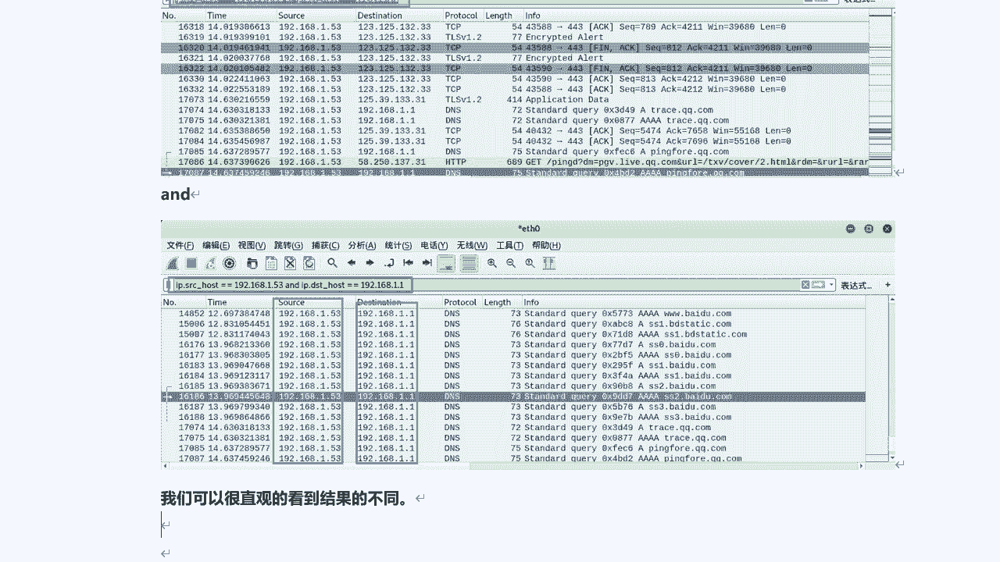

# 课程P48：9.3 - Wireshark过滤器使用指南 🎯

在本节课中，我们将学习Wireshark中过滤器的使用方法。过滤器能帮助我们从海量的网络数据包中，快速筛选出我们感兴趣的部分，是网络分析中至关重要的工具。

## 开启混杂模式与捕获数据包

上一节我们介绍了Wireshark的基本界面，本节中我们来看看如何开始捕获数据包并进行过滤。首先，我们需要确保Wireshark工作在混杂模式下，以便捕获流经本机网卡的所有数据包。

1.  在捕获选项界面，勾选“在所有接口上使用混杂模式”。
2.  点击“开始”按钮，Wireshark将开始捕获数据包。
3.  为了让过滤器有足够的数据进行演示，我们可以在虚拟机中访问一些网站（如百度）或使用`ping`命令测试网络连通性，以生成网络流量。
4.  捕获到一定数量的数据包后，点击“停止”按钮。

现在，主界面中已经充满了各种协议的数据包。接下来，我们将学习如何使用过滤器来精确查找。

## 使用协议过滤器

面对混杂的数据，我们可以通过协议类型进行初步筛选。以下是常用的协议过滤器示例：

*   **筛选TCP协议数据包**：在显示过滤器栏输入 `tcp` 并回车。这将列出所有TCP协议的数据包，其中包含了建立连接的“三次握手”和断开连接的“四次挥手”过程。
*   **筛选特定TCP标志位的数据包**：我们可以进一步筛选具有特定标志位的TCP包。例如，筛选带有`SYN`标志的数据包（通常是三次握手的第一个包），可以使用过滤器：`tcp.flags.syn == 1`。同理，筛选`ACK`包可使用 `tcp.flags.ack == 1`。
*   **筛选ARP协议数据包**：输入 `arp` 并回车，可以查看局域网内的地址解析协议通信。
*   **筛选UDP协议数据包**：输入 `udp` 并回车。值得注意的是，DNS、DHCP等应用层协议也基于UDP，因此筛选结果中也会包含`dns`、`bootp`（DHCP）等协议的数据包。这是因为UDP是它们的传输层基础。
*   **筛选HTTP协议数据包**：输入 `http` 并回车，可以快速定位到网页浏览产生的流量。
*   **筛选DNS协议数据包**：输入 `dns` 并回车，可以查看所有的域名解析请求和响应。

> **知识扩展**：DNS查询通常使用UDP协议，因为查询内容较小，UDP无需建立连接，速度更快，能降低服务器负载。虽然也支持TCP，但很多DNS服务器默认仅配置为响应UDP查询。

## 使用IP地址过滤器

除了按协议筛选，我们经常需要根据数据包的源地址或目的地址进行过滤。Wireshark提供了灵活的IP地址过滤语法。

观察数据包列表，`Source`列代表源IP地址，`Destination`列代表目的IP地址。

以下是几种常见的IP地址过滤方式：

*   **筛选特定源IP的数据包**：使用 `ip.src == 192.168.1.53`。此过滤器会列出所有从IP地址`192.168.1.53`发出的数据包。
*   **筛选特定目的IP的数据包**：使用 `ip.dst == 192.168.1.1`。此过滤器会列出所有发送到IP地址`192.168.1.1`的数据包。
*   **组合条件过滤（逻辑或）**：使用 `or` 连接两个条件。例如，`ip.src == 192.168.1.53 or ip.dst == 192.168.1.1` 会筛选出**源IP是192.168.1.53** 或者 **目的IP是192.168.1.1** 的所有数据包。只要满足其中一个条件，数据包就会被显示。
*   **组合条件过滤（逻辑与）**：使用 `and` 连接两个条件。例如，`ip.src == 192.168.1.53 and ip.dst == 192.168.1.1` 会筛选出**源IP是192.168.1.53** 并且 **目的IP是192.168.1.1** 的数据包。必须同时满足两个条件，结果更为精确。
*   **筛选涉及特定IP的所有数据包（不区分源和目的）**：使用 `ip.addr == 192.168.1.53`。此过滤器会列出所有源IP**或**目的IP是`192.168.1.53`的数据包，相当于 `ip.src == 192.168.1.53 or ip.dst == 192.168.1.53` 的简写。

Wireshark的过滤功能非常强大，以上只是最常用的一部分。在输入时，Wireshark会提供语法提示，大家可以多尝试，组合使用不同的条件来满足具体的分析需求。

---

本节课中我们一起学习了Wireshark过滤器的核心用法。我们掌握了如何开启混杂模式捕获数据，并重点练习了两种主要的过滤方式：**按协议类型过滤**（如tcp, udp, http, dns）和**按IP地址过滤**（使用`ip.src`, `ip.dst`, `ip.addr`及逻辑运算符`and`/`or`）。熟练运用这些过滤器，能极大提升我们在海量网络数据中定位和分析问题的效率。