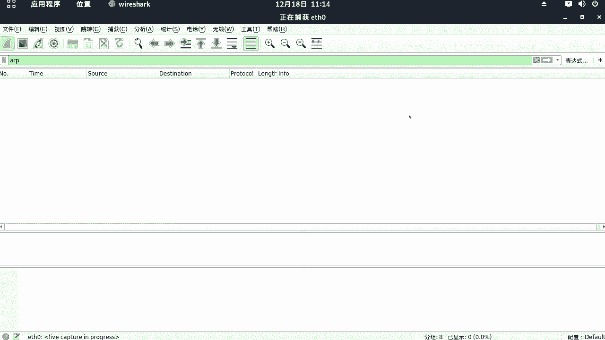
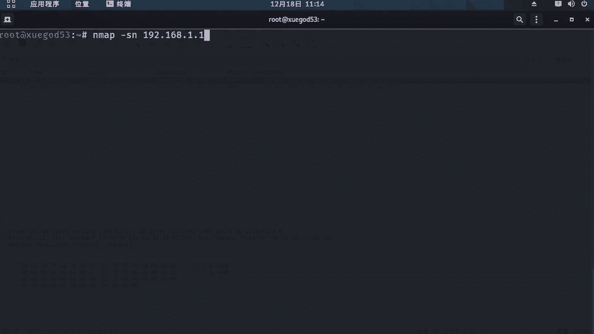
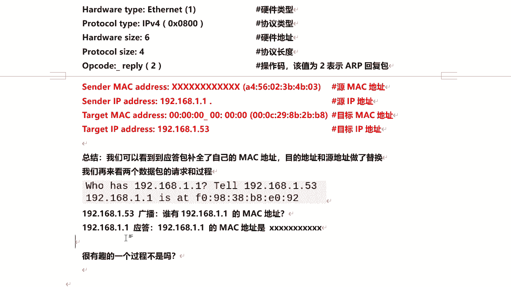

# 课程 P49：9.4 - 【WireShark抓包系列】常用协议分析-ARP协议 🔍

在本节课中，我们将学习如何使用 WireShark 对 ARP 协议进行抓包，并详细分析其工作原理和数据包结构。ARP 协议是网络通信中一个基础且关键的协议，理解它有助于我们深入了解局域网内设备是如何相互寻址的。

---

## 什么是 ARP 协议？

上一节我们介绍了课程目标，本节中我们来看看 ARP 协议是什么。ARP 协议，全称为地址解析协议。它是一个通过解析网络层地址来寻找数据链路层地址的网络传输协议。在 IPv4 网络中，ARP 协议极其重要。

ARP 的核心功能是通过网络地址来定位 MAC 地址。它主要负责将 **IP 地址** 解析成 **MAC 地址**。



---



## 开始抓取 ARP 数据包

了解了 ARP 协议的基本概念后，本节我们开始实践抓包。首先，在进行协议分析时，建议关闭 WireShark 的混杂模式，以避免干扰数据包。

以下是开始抓包的步骤：
1.  打开 WireShark，在捕获选项中去掉“在所有接口上使用混杂模式”的勾选。
2.  在捕获过滤器中输入 `arp`，以便只捕获 ARP 协议的数据包。
3.  点击“开始捕获”按钮。

如何能产生一个 ARP 数据包呢？我们可以使用 `nmap` 工具发送一个基于 ARP 协议的扫描。

在 Kali Linux 中打开终端，输入以下命令：
```bash
nmap -sn 192.168.1.1
```
参数 `-sn` 表示只进行主机发现（Ping 扫描），不扫描端口。这里我们扫描网关地址。

执行命令后，回到 WireShark，即可看到捕获到的 ARP 请求与响应数据包。此时可以停止捕获。

---

## 分析 ARP 数据包

成功捕获到数据包后，本节我们来详细分析它们的结构。我们主要分析两个包：一个请求包和一个响应包。

### 分析 ARP 请求包

第一个数据包是 ARP 请求包。这个请求包是主机 `192.168.1.53` 向局域网内发送的广播包，询问“谁知道 `192.168.1.1`（网关）的 MAC 地址”。

点击该数据包，在详情面板中展开“Address Resolution Protocol (request)”部分，可以看到以下关键字段：

*   **Hardware type**: 硬件类型，标识链路层协议。`1` 代表以太网。
*   **Protocol type**: 协议类型，标识网络层协议。`0x0800` 代表 IPv4。
*   **Hardware size**: 硬件地址长度，即 MAC 地址长度，为 `6` 个字节（48位）。
*   **Protocol size**: 协议地址长度，即 IP 地址长度，为 `4` 个字节（32位）。
*   **Opcode**: 操作码，标识 ARP 数据包类型。`1` 表示请求。
*   **Sender MAC address**: 发送方 MAC 地址，即主机 `192.168.1.53` 的 MAC 地址。
*   **Sender IP address**: 发送方 IP 地址，即 `192.168.1.53`。
*   **Target MAC address**: 目标 MAC 地址。在请求包中，此字段全为 `0` (`00:00:00:00:00:00`)，因为此时还不知道。
*   **Target IP address**: 目标 IP 地址，即 `192.168.1.1`（网关）。

### 分析 ARP 响应包

第二个数据包是 ARP 响应包。这是网关 `192.168.1.1` 在收到请求后，回复给主机 `192.168.1.53` 的单播包。

点击该数据包，查看 ARP 部分，其字段与请求包类似，但有以下关键区别：

*   **Opcode**: 操作码为 `2`，表示响应。
*   **Sender MAC address** 和 **Sender IP address**: 此时变为了网关 `192.168.1.1` 的 MAC 地址和 IP 地址。
*   **Target MAC address** 和 **Target IP address**: 此时变为了最初发起请求的主机 `192.168.1.53` 的 MAC 地址和 IP 地址。

可以看到，响应包中的地址信息与请求包正好互换了。

---

## ARP 协议交互过程总结

本节课中我们一起学习了 ARP 协议的抓包与分析。现在我们来总结一下整个过程。

ARP 协议的工作过程可以概括为“一问一答”：
1.  **广播请求**：主机 A 想知道主机 B（已知其 IP 地址）的 MAC 地址，于是向局域网内发送一个 **广播** ARP 请求包，询问“谁的 IP 地址是 B？”。
2.  **单播响应**：主机 B 收到这个广播请求后，识别出自己的 IP 地址，于是向主机 A 发送一个 **单播** ARP 响应包，告知“我的 IP 地址是 B，我的 MAC 地址是 X”。

在数据包层面：
*   在 **请求包** 中，目标 MAC 地址字段为全零。
*   在 **响应包** 中，这个全零字段被目标主机（即被请求方）自己的 MAC 地址填充，并且发送方与目标方的地址信息完成了互换。



整个过程清晰展示了 ARP 协议如何通过“广播请求，单播回应”的机制，完成从 IP 地址到 MAC 地址的动态解析。