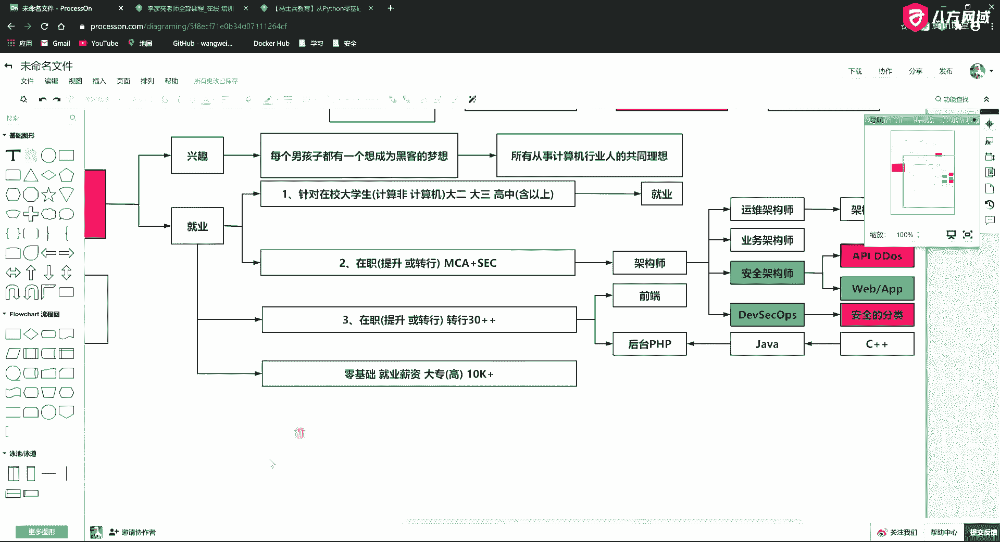
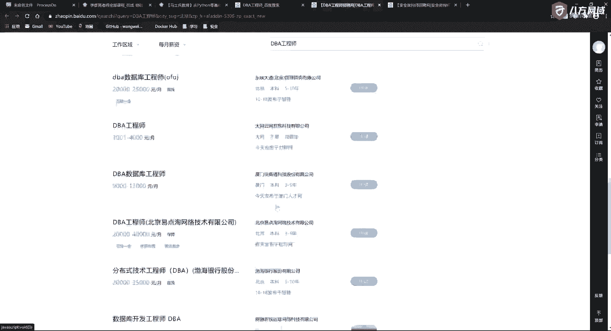

# 课程P5-2.1：网络安全基础 - 安全工程师行业发展与就业趋势 🚀

在本节课中，我们将要学习网络安全行业的整体发展情况以及相关的就业趋势。我们将从行业背景、从业者动机、适合人群以及职业发展路径等多个角度进行剖析，帮助你全面了解这个领域，并找到自己的定位。

---

## 课程安排与学习方式 📚

上一讲我们介绍了课程的整体框架，本节中我们来看看具体的授课方式与课程结构。

我们以后的课程安排如下：
*   首先，会用10到15分钟时间对上一讲的重点内容进行串讲和回顾，并答疑。
*   中间部分讲解本节课的正课内容。
*   课程结尾，会根据内容重要性布置一些作业。

---

## 安全行业的发展与就业趋势 💼

本节我们将聚焦于安全行业本身，探讨其发展现状和未来的就业机会。了解这些信息，有助于你明确学习目标，规划职业道路。

### 学习网络安全的主要动机

人们学习网络安全的动机各不相同，主要可以分为以下几类：

以下是基于不同动机的学习者分类：
1.  **兴趣驱动型**：这部分学习者纯粹出于对技术的热爱和好奇心。兴趣是最好的老师，许多从业者都源于此。
2.  **职业发展型**：这部分学习者旨在升职加薪或寻求新的就业机会。他们学习的目标非常明确，就是为了提升职场竞争力。

### 适合学习网络安全的人群

网络安全是一个包容性较强的领域，对学习者的背景要求相对宽松。

以下是适合学习本课程的主要人群分类：
1.  **在校大学生**：包括计算机和非计算机专业的学生，学历要求高中及以上即可。学历并非学习安全的绝对门槛。
2.  **在职提升人员**：已经从事IT相关工作（如运维、开发），希望向安全架构师或更高层次发展的人员。掌握安全技能能使其在原有架构师（运维架构师、业务架构师）基础上，进阶为**安全架构师**或**全栈架构师**。
3.  **在职转行人员**：希望从其他IT岗位（如前端开发、后端开发）转向安全领域的人员。安全行业经验越丰富越有价值，职业生命周期较长，能有效缓解年龄危机。

### 就业前景与薪资水平

对于网络安全领域的就业前景，我们可以通过市场数据来获得直观认识。

以下是关于就业薪资的客观描述：
*   对于零基础、大专以上学历的求职者，保守估计起薪可达 **10k+**。
*   对于有经验的安全架构师等岗位，薪资范围普遍在 **25k - 70k** 每月。
*   安全行业为许多求职者提供了“换赛道”竞争的机会，可能在某些领域实现弯道超车。

---

## 总结 🎯

本节课中我们一起学习了网络安全行业的概况。我们了解了课程的学习方式，分析了人们学习安全的不同动机，明确了适合学习的人群分类，并探讨了行业的就业前景与薪资水平。安全领域机会广阔，对于不同背景的学习者都敞开了大门。