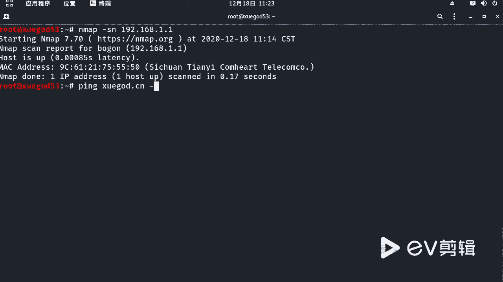
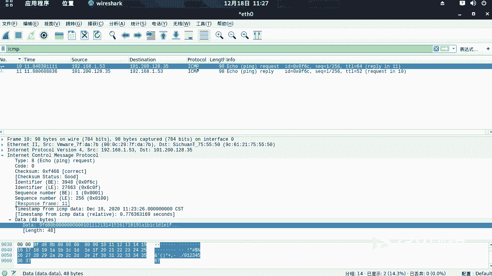

# 课程P50：9.5 - 【WireShark抓包系列】常用协议分析-ICMP协议 🕵️♂️

在本节课中，我们将学习如何使用WireShark抓取并分析ICMP协议的数据包。ICMP协议是网络诊断中常用的协议，理解其数据包结构对于网络分析至关重要。

---

## 如何产生ICMP数据包 🚀

上一节我们介绍了课程目标，本节中我们来看看如何生成用于分析的ICMP数据包。

要产生ICMP协议的数据包，可以使用操作系统的`ping`命令。`ping`命令会发送ICMP Echo Request（回显请求）报文，并等待目标主机返回ICMP Echo Reply（回显应答）报文。

以下是具体操作步骤：
1.  打开命令行终端。
2.  输入命令 `ping 目标域名或IP`，例如 `ping xuega.cn`。
3.  为了便于分析，可以指定只发送一个数据包。在Windows系统中，命令为 `ping -n 1 xuega.cn`；在Linux/macOS系统中，命令为 `ping -c 1 xuega.cn`。

执行`ping`命令后，WireShark中就会捕获到对应的ICMP请求与响应数据包。

---

## 分析ICMP数据包结构 🔍

在成功捕获数据包后，本节我们来详细解析ICMP数据包的结构。一次成功的`ping`会产生一去一回两个数据包，即一个请求包和一个响应包。

### 请求包分析

首先，我们分析ICMP Echo Request（请求包）。

*   **网络层（IP协议）**：数据包基于IP协议。在IP头部中，可以清晰地看到源IP地址（`src`）和目的IP地址（`dst`）。
    *   例如：`src: 192.168.1.53` -> `dst: xuega.cn的IP地址`
*   **传输层（ICMP协议）**：在IP层之下是ICMP协议的详细信息。
    *   **Type（类型）**：该字段值为 **8**，代表这是一个Echo Request（回显请求）包。
    *   **Checksum（校验和）**：用于验证数据包在传输过程中的完整性，状态显示为“Good”表示数据完好。
    *   **Identifier（标识符）** 与 **Sequence Number（序列号）**：这两个字段，连同`Type`和`Checksum`，在请求包和对应的响应包中是完全一致的，用于匹配请求与响应。
*   **数据部分**：包含请求发送的填充数据。

### 响应包分析

接下来，我们查看对应的ICMP Echo Reply（响应包）。

响应包的结构与请求包高度相似，核心区别在于：
*   **Type（类型）**：该字段值为 **0**，代表这是一个Echo Reply（回显应答）包。
*   **IP头部**：源地址和目的地址与请求包相反。
*   **关键字段一致性**：如前所述，`Identifier`和`Sequence Number`字段与请求包中的值一致，确保响应能正确匹配到最初的请求。
*   **数据部分**：响应包会包含请求包中发送的数据的拷贝。

---

## ICMP协议工作流程总结 📝

本节课中我们一起学习了ICMP协议的分析。现在我们来总结其核心工作流程。

ICMP协议的工作过程可以概括为：
1.  源主机（本机）构造一个**Type=8**的ICMP Echo Request数据包并发送出去。
2.  如果目标主机在线且网络通畅，它将收到这个请求包。
3.  目标主机随后构造一个**Type=0**的ICMP Echo Reply数据包作为响应。这个响应包会拷贝请求包中的特定数据（如`Identifier`、`Sequence Number`和填充数据），并将其发回源主机。
4.  源主机收到响应包，通过匹配字段确认这是对自己请求的回复，从而判断网络连通性。

这个过程简单而高效，是网络故障排查中最基础的工具之一。理解`Type 8`（请求）和`Type 0`（响应）这两个核心代码，是掌握ICMP协议分析的关键。