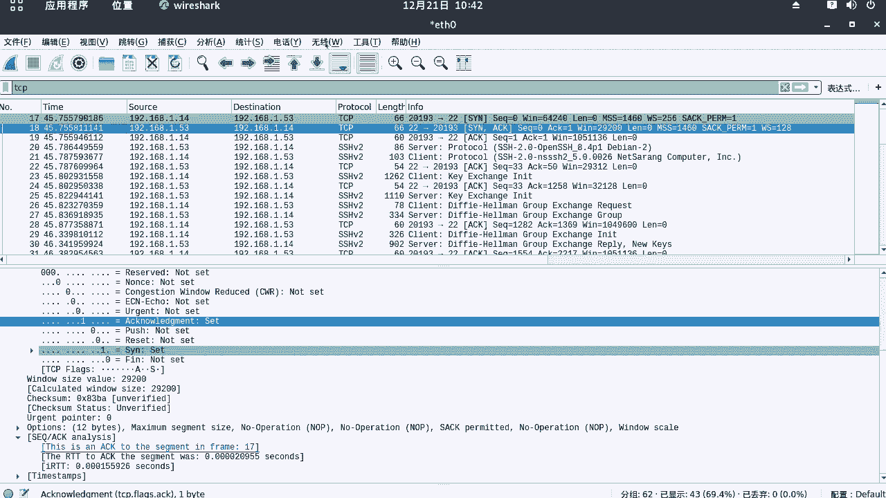
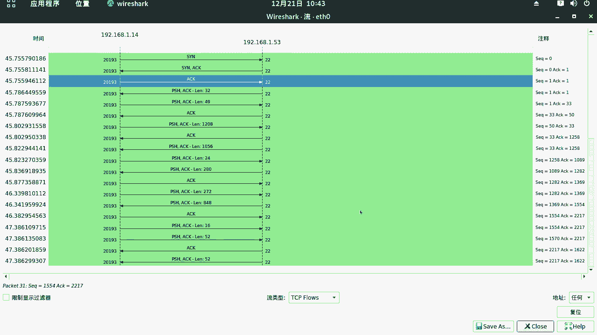
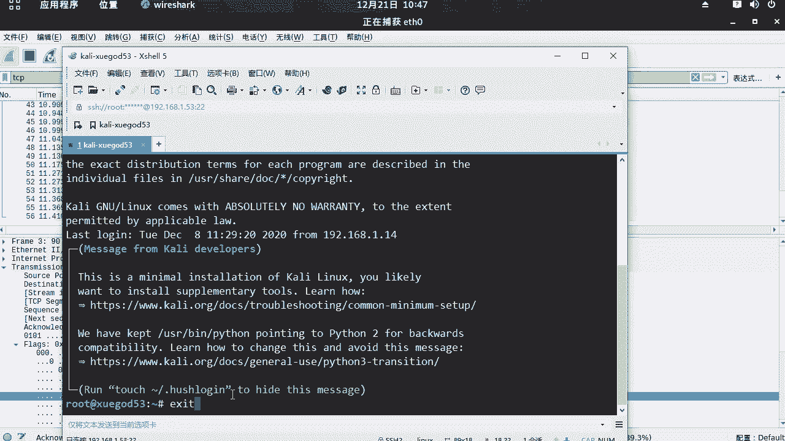
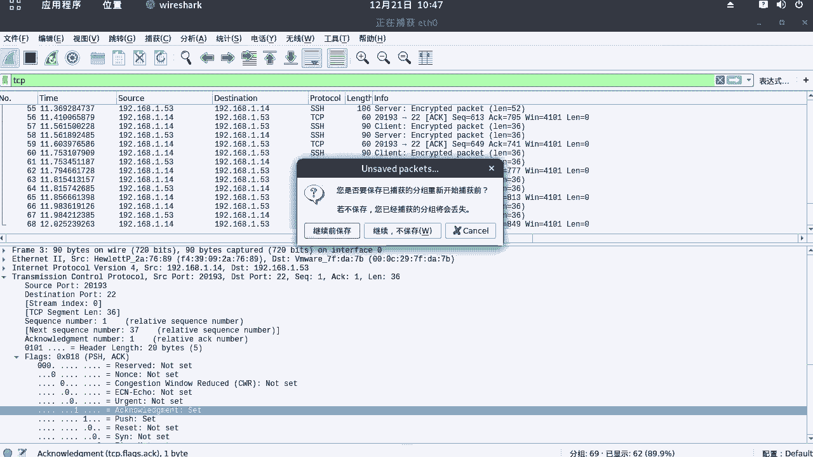
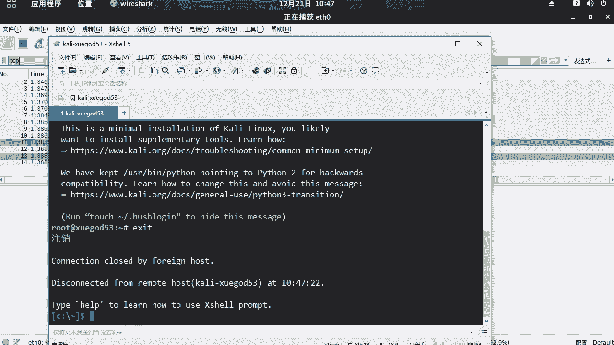
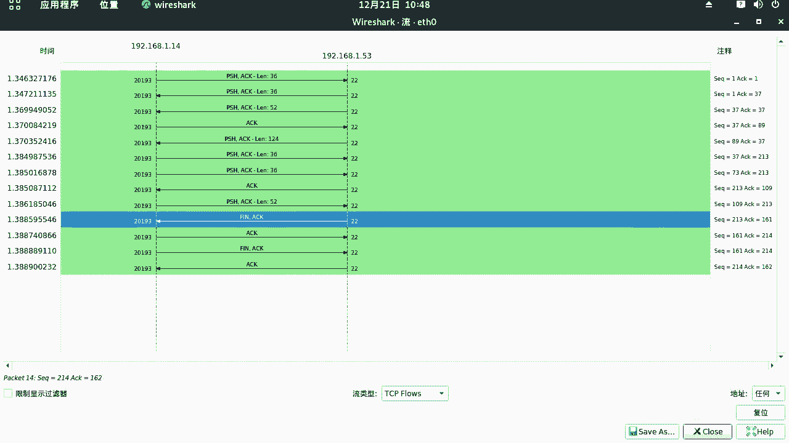
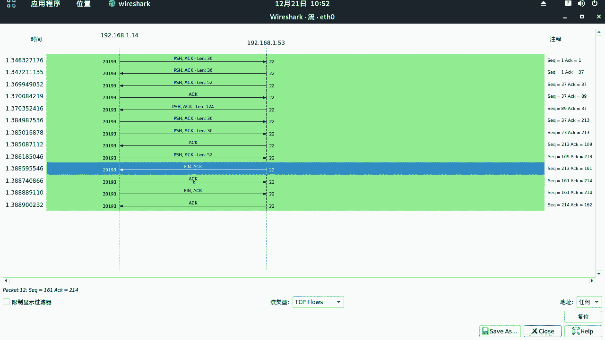
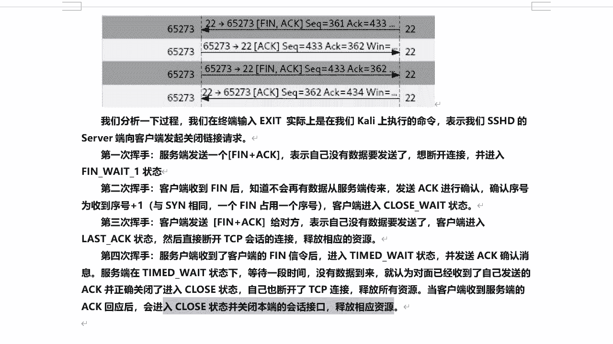

# P51：9.6-【WireShark抓包系列】常用协议分析-TCP协议 - 一个小小小白帽 - BV1Sy4y1D7qv

好下面呢我们来讲一下常用协议分析啊，tcp协议啊，那么说了说到tcp协议啊，那么这个呢也是使用最广泛的啊，全输控制协议，那么它呢也是tcp ip协战中算法最多功能的，也是最繁杂的一个协议。

嗯这里呢我们来考虑一个问题啊，那么基于tcp的应用层协议都有哪些啊，对吧，比如有http i t p s f t p s h协议，还有tonight s m t p p o p协议，这些都是基于什么。

对这些都是基于tcp的应用层协议啊，那么tcp主要是面向连接的啊，那么其中有三次握手啊，四次挥手啊，而且是可靠传输，还可以进行流量控制啊，多路复用等等啊，那么这里呢我们来先来清空一下我们的数据包。

然后筛选tcp来开始抓包啊，我们来打开visuck这块呢，我们来把这个呢停一下啊，tcp重新开始装好，那现在大家考一个问题啊，那么如何去模拟一下的tcp绘画建立啊，对啊在什么情况下会建立tcp连接呢。

那很多情况都有都可以是吧，你打开一个网页，它也会建立，那么这里呢我们用最简单的方式，那么就是用xl好吧，来连接我们的kelly linux，那么这里它会产生一个tcp连接，对三次握手啊。

那么top x sl远程连接开立为捕获到完整的tcp，三次握手的连接，那么这里呢我们来打开tcl好。

那么我们来连一下的啊，连接一下kelly学霸的五三双击。

接受好的。

那么这个呢已经连接成功了，然后我们到will suck里看一下的啊，嗯这里呢我们看啊把它停止下来啊，抓包嗯，这里呢我们来看它整个的链接啊，我们找一下了啊，相关的数据包呃，如果它存在完整的三次握手好吧。

那首先第一次握手就是发生s y n数据包，然后s y a c k a c k，第三个就是吧，是不是，那么这原ip一点一四，也就是说物理机，我呢在物理机通过3s连接到我们的kelly啊，连击谁1。

53开立，然后也就是说20193有物理机呀，打开一个随机高位端口，连接开立的22端口啊，sn连接请求啊，那么当对kelly收到这个连接请求之后呢，同一连接sk确认，那么同时呢他又开始吗。

又发生一个s弯数据包，那么你我同意你连接我的22端口好吧，那么你得允许我连接你的20193，这个端口啊，那么物理机收到这个请求之后呢，回一个s k ok没问题，三次握手成功对吧，那么建立一个稳定的连接。

那么这里呢我们来结合啊，没这个visu做包给大家分析一下的啊，那么每个数据包的含义好不好，这里我们首先看第一个sn tcp啊，c那么这里呢原端口20193，目标端口22是吧，好的我们来打开看一眼啊。

嗯上面呢这个没有什么可说了，原端口目标端口啊，然后呢这个是序列号啊，这个是序列号啊，然后呢下面呢对这个是确认序列号，确认序列号主要看flash这里嗯flash什么标志位啊。

标志呢我们这里发出的是什么类型的数据包，s one set一啊，那么这个一啊是什么意思啊，对那么也就是说啊，谁发送给谁呢，就是呃物理机发送给ky的是吧，那么我要连接谁啊，连接你22端口。

对连接请求sn针对的22端口，这个没有问题啊，好的，然后呢上面呢来再往这看啊，上面这块有一个好啊，这是标志位啊，其他的都是零啊，其他都是零，然后上面这个呢是header啊，头部长度啊。

有这个数据包的头部长度啊，然后呢再往下把它关开，下面那个window size value啊，64240，这是什么windows窗口大小流量控制的，也就是告诉我目标啊，对物理机高速ky。

那么我的windows在机器啊最大的能接受多大流量，这么大流量啊，窗口控制，而下面的是校验核接原盒，主要是控制什么数据包，校验的完整性啊，保证数据包的完整性的，这是呃第一次握手对吧，x y数据包。

然后再往下看s弯加a c k，这是谁回给谁的ky啊，发送给物理机的，那么这里呢注意那么原端口是22，目标端口是20193，那么注意啊，flex就是s弯加a c k，那么我们来看看这里啊。

首先呢这a c k啊是确认是吧，好的，那么就是我确认啊，ok你可以连接我22端口sk确认好吧，那么同时呢这目标端口20193是物理机的，那么我同意你连接我22端口了好吧，那现在我要连接你20193啊。

发出了一个s y n啊，连接请求啊，这么一个关系，大家这会儿要注意，请看清楚啊，你要弄清楚了，他们之间就是互相确认对吧，当都互相确认完之后，ok 3次握手成功建立一个稳定的连接啊，建立文件理解。

那么这里呢我们要看一个这个上面的啊，这个确认号对吧，这是序列号，然后确认号一啊一呢4k呢，加上你去连接开物理一，连接开的时候就是零是吧，对然后呢kelly给你回一个一啊，确认ok没问题，可以连。

而此时呢这个序列是100，这是谁呀，kelly对吧，要连接物理机的这个端口，寻求确认，寻求确认是吧，那么此时我们再来看对第三个啊，第三个a c k好，a c k前面是谁，物理机会给谁呀，会给开立的。

此时的a c k是不是一样对吧，确认sq序列号，这也是一样对吧，都加一了啊，然后呢此时这里注意这个a c k啊，set这个标志是一啊，那么这是第三次握手，第三次握手，那么就ok了。

那么整个链接就建立成功了好吧，然后呢我们再来看从回头从头再看一遍啊，那么这个整个过程来，其实这里知道很多啊，不需要都去了解主要关键的几个s弯，s弯加a s k a c k，这几个需要确认了解一下的。

他们是什么意思啊，就可以了啊，然后呢在第二次握手x y就是ky啊，发给哎物理机啊，这个确认包的时候，那么这里有个s e q a c k对吧，this is a a c k to the segment。

就是一个确认包对，是确认谁的，确认17帧的，也是这次他的好吧，然后这个呢第三次握手呢，你看这里看这里啊，这也是一个确认确认成第18帧的嗯，他确认他的好吧对，然后呢我把笔记给大家整理一下子啊。

这是关于这个tcp协议，关键点啊，几个关键点大家需要明白啊，明白好吧，唉笔记给大家整理一下啊，好的对，这是响应第几针的，第几针的，然后呢a c k等于是确认序号有效对吧。

一然后呢这个呢这是第三个数据包是吧，对第三个数据包a s k等于确认序号加一，上一帧的序号加一啊，s e q等于上一帧的序列序列号，然后flash a c k第三次握手啊，嗯说到这里。

咱们是不是想过那张图是不是对，咱们前面也讲过是吧，那个关于嗯nmap扫描全连接，半连接是不是也涉及到这一块啊，利用的就是tcp 3次握手和两次握手啊，好的，然后接下来我们来看一下它啊。

那么这么我去看整个过程啊，感觉不是很清晰啊，对不对，那么同时呢y shark比较强大的地方，就是还可以通过什么图表，通过的图表的方式啊，把整个连接的过程啊，它显示的更加明确和清晰啊。

下面呢我们来看一下啊，通过这里啊，那在统计有一个流量图啊。

然后我们筛选一下的啊，3a选项的tcp协议啊，呃这里呢我们看1。141。53a这里对嗯，这是1。14向1。53kelly发送一个连接请求，s弯数据包，然后呢kelly回一个s弯加s k好吧。

然后物理机呢又回给开了一个sk连接，建立成功啊，三次握手，那么在这里看的呢很清晰对吧对，这个就是一个t c v键连接的一个过程啊，后面啊后面这些呢就是互相通信的过程了，好吧对，然后呢。

这个时候呢s e q就会根据数据包的大小，然后去改变嗯，这是建立连接啊，那么断开连接呢也就是tcp啊。

四次挥手，那么笔记呢给大家整理到这里，下面呢我们来清空一下数据包啊，看一下断开连接啊是一个什么样的过程，我们在这里来把这个关掉啊，关掉，然后重新开始抓包tcp的哈，好然后呢我们的xcel里面啊。

在这里啊，注意啊，我在这里操作退出excel，那么这是谁操作谁呀，唉啊唉这个怎么突然产生这么多数据包呢。

哦我再重新装一下的啊。

重新装一下的，因为你只要连接它，就会有这个数据包断开。

然后停止，ok然后呢现在我们来看一下的啊，那么这个整个过程这个过程呃是客户端哈啊，来四次挥手啊，那么它是一个怎么一个过程呢，他也是一个互相确认的一个过程好吧，那么这里呢我们来通过这里啊看啊。

f i n a c k a c k a c k是吧，然后f n a s k啊，那么这个就是一个完整的一个四次挥手，四次挥手，这个过程我们来看一下呢，啊嗯啊，来我们通过图表来看一下的吧，好吧，统计啊。

然后呢流量图啊，筛选下的tcb o，那么这里呢我们1。141。53，那么大家现在想一个问题啊，想一个问题对这里啊，那么当你通过插槽啊。

输入asset是谁，谁与谁断开，谁主动断开啊，是不是kelly主动断开与物理机的链接。

因为你当前是在这里执行，是在ky执行的命令好吧，那所以说这里头是首先22端口开了1。5，三，22端口，像物理机的2019车端口发了一个数据包，然后呢1。1450又回一个a c k啊。

那么同时呢他又发一个fn加a c k，最后呢kelly回一个a c k数据包，结束了四次汇总，下面呢我们来分析一下，这四个过程分别都代表的是什么。

好吧对，那么我给大家来解读一下的啊，大家就清楚了啊，我们分析整个过程唉，那么我们在终端啊，对输入excel实际是在我们ky上执行的命令，表示我们的s h d的server端。

向客户端发起了关闭链接请求啊，那么第一次回首服务端发送一个fn加s k，表示自己啊没有数据要发送了好吧，那么想要断开连接并进入一个等待的状态，等待什么等待确认，这样我要与你物理断开连接啊，寻求确认。

如果你确认ok了，那么咱们就直接来断开好吧，因为是这样，那就是说f a n啊，代表就是说然后拆除链接，那么它没有更多的数据要发生发动了对吧，那么我要与你断开，然后a c k呢是学寻求确认啊。

然后第二次我回首，那么此时呢客户端啊收到凯里发生的请求之后，对说到这个断开请求啊，那么知道不会再有数据从服务端发送来了啊，然后发送一个a c k进行确认，对谁给谁回一个kelly，给那个物理机啊。

给kelly回一个a c k确认，那么此时确认序号对为收到的序号加一啊，与s弯相同，那么一个f n占用一个序号，客户端呢进入关闭等待状态。

关闭等待状态，我们来看这里唉那么这里呢凯立断开请求是吧，嗯然后呢这里是s一看左下角啊，左下角左下角s1 q213 a c k161 对吧，哎然后呢回一个呢对，那么它的去向序列号是s1 q加一。

变成214了是吧，左下角啊，左下角这里大家能看到吧，在哪里呢，在这呢左下角这块啊。

左下角，然后这是第二次回收啊，那么第三次回手呢是吧嗯客户端确认啊，可以与服务端建立连接，同时客户端也发生一个f i n加sk给对方，给kelly表示自己也没有数据要发送了啊，然后呢。

客户端呢进入对最后的等待确认状态对吧，然后呢直接断开tcb绘画的连接，释放相应的资源啊，那么此时服务端是不是也收到这么一个请求啊，服务端就是kelly收到啊，物理机啊发送的fn加sk断开连接请求啊。

收到这个请求之后呢，然后进入一个等待动态并发送sk确认消息，服务端在这个状态下等待一段时间，没有数据到来，那么就认为对面已经收到了自己发生的4k，并正确关闭了链接对吧，然后自己呢也断开了链接。

释放所有资源啊，所有资源，那么当客户端收到服务端的a c k回应之后，会进入close关闭状态对吧，关闭本端的绘画机构私网对吧。

释放相应的资源，这里呢就整个就结束了啊，那么这是四次挥手啊，40回头啊，第一次第二次。

第三次，第四次嗯，那么这个呢就是整个的tcp协议的三次挥手，建立连接和四次挥手断开连接。

这整个一个过程啊，我们通过visa抓包啊，对，那么可以很清楚的来看到，整个这个过程是什么样的。

好吧，ok好的。

