# 课程P51：9.6 - 【WireShark抓包系列】常用协议分析-TCP协议 📡

在本节课中，我们将要学习TCP协议的基础知识，并通过WireShark抓包实践，深入理解TCP建立连接的“三次握手”和断开连接的“四次挥手”过程。我们将使用简单的命令模拟连接，并分析每个数据包的关键字段。

---

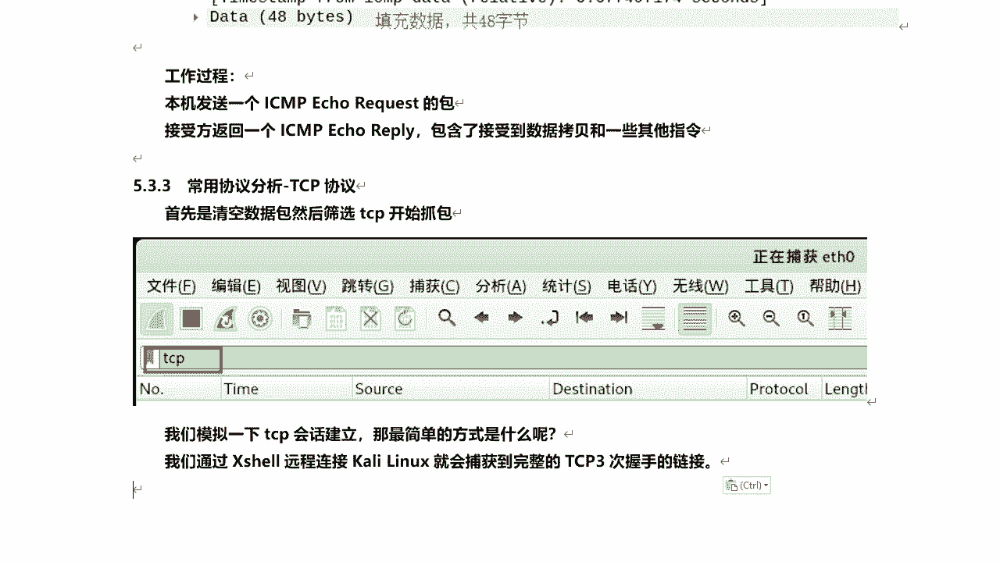

## TCP协议概述

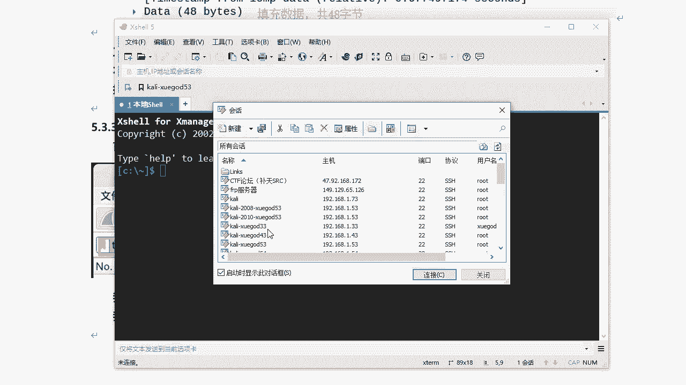

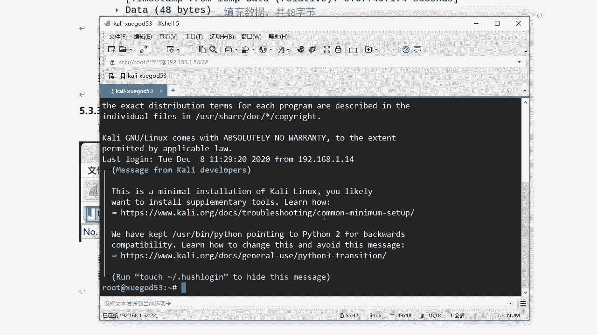

TCP（传输控制协议）是TCP/IP协议族中使用最广泛、功能最复杂的协议之一。它是面向连接的、可靠的传输协议，提供了流量控制、多路复用等机制。

许多应用层协议都基于TCP，例如：
*   HTTP/HTTPS
*   FTP/SFTP
*   SSH
*   Telnet
*   SMTP/POP3

上一节我们介绍了协议分析的基本方法，本节中我们来看看TCP协议的具体通信过程。

---

## 实验准备：捕获TCP数据包

首先，我们需要在WireShark中设置并开始捕获TCP数据包。

1.  在WireShark中清空现有数据包。
2.  在过滤器中输入 `tcp`，然后开始抓包。

为了模拟TCP会话的建立，我们将使用一个简单的操作：通过SSH客户端（如Xshell）远程连接一台Kali Linux主机。这个连接过程必然会触发TCP的三次握手。

---

## TCP三次握手建立连接 🤝

当我们通过SSH客户端连接Kali Linux的22端口时，WireShark会捕获到TCP三次握手的数据包。

以下是三次握手的具体步骤：

**第一次握手 (SYN)**
客户端（本例中为物理机）向服务器（Kali Linux）发送一个SYN报文段，请求建立连接。
*   **关键字段**：
    *   `Flags`: **SYN=1** (连接请求)
    *   `Seq`: 初始序列号 (例如 0)
    *   `Window size`: 通告本机的接收窗口大小，用于流量控制。

**第二次握手 (SYN+ACK)**
服务器收到SYN报文后，同意建立连接，并发送SYN+ACK报文进行确认。
*   **关键字段**：
    *   `Flags`: **SYN=1, ACK=1** (同意连接，并确认收到上一个包)
    *   `Ack`: 值为 **客户端初始序列号(Seq) + 1**
    *   `Seq`: 服务器自己的初始序列号。

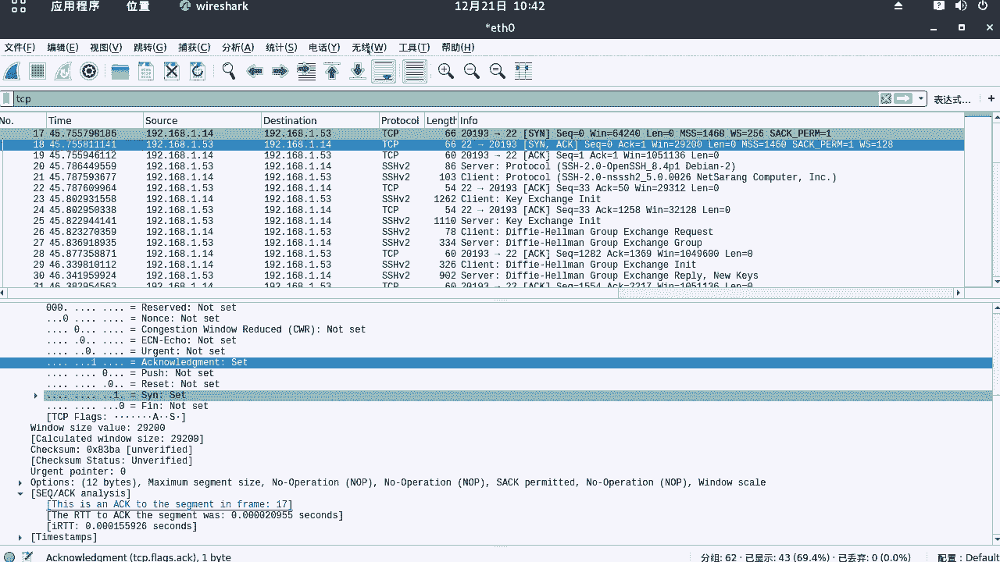

**第三次握手 (ACK)**
客户端收到服务器的SYN+ACK报文后，发送ACK报文进行最终确认。
*   **关键字段**：
    *   `Flags`: **ACK=1**
    *   `Ack`: 值为 **服务器初始序列号(Seq) + 1**
    *   `Seq`: 值为上一次握手服务器回复的Ack值。

至此，一个稳定的TCP连接就建立成功了。我们可以通过WireShark的“统计” -> “流量图”功能，更直观地查看这个握手过程。

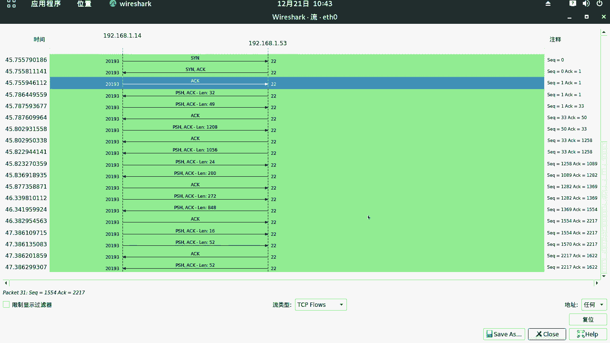

---

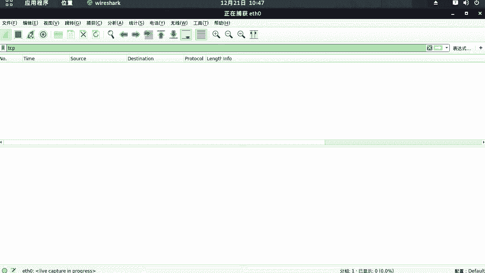

## TCP四次挥手断开连接 👋

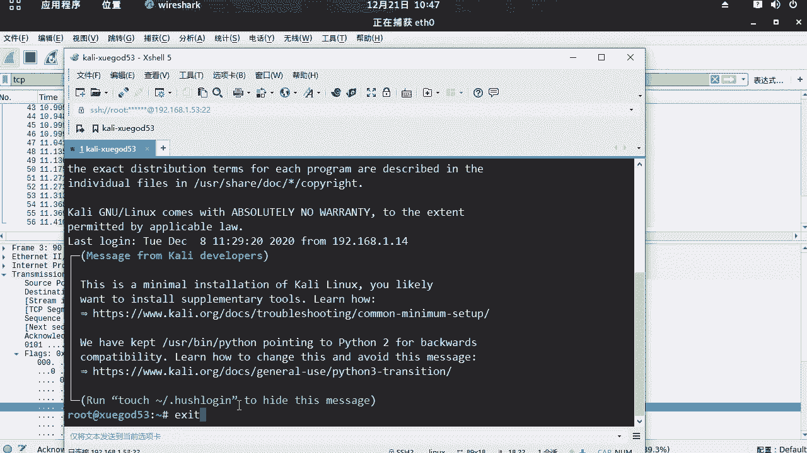

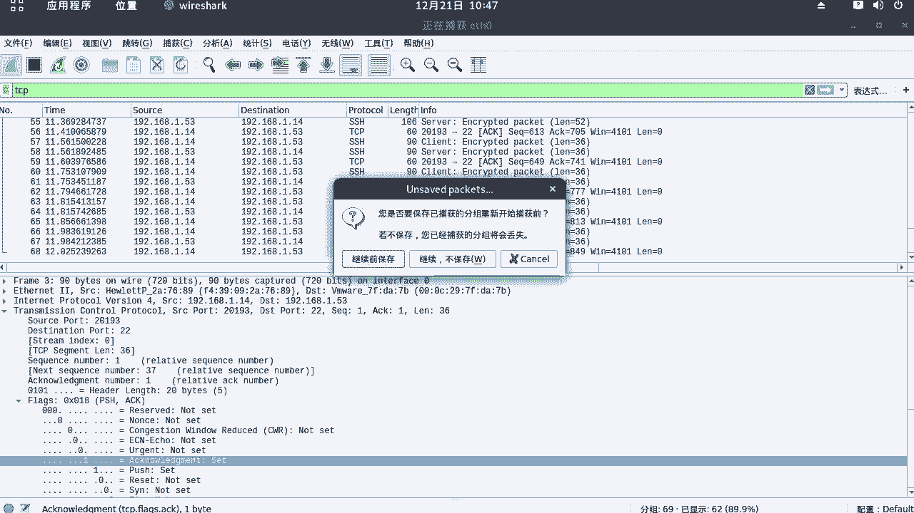

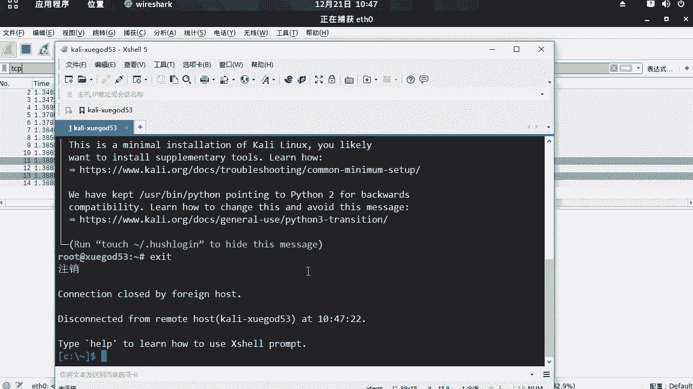

当连接需要终止时（例如关闭SSH会话），会触发TCP的四次挥手过程。

以下是四次挥手的具体步骤：

**第一次挥手 (FIN+ACK)**
主动关闭方（本例中为Kali Linux服务器）发送FIN+ACK报文，表示自己没有数据要发送了，请求关闭连接。
*   **关键字段**：
    *   `Flags`: **FIN=1, ACK=1**

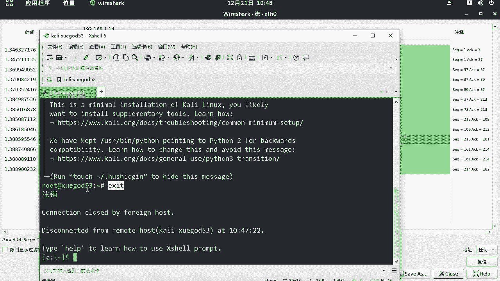

**第二次挥手 (ACK)**
被动关闭方（客户端）收到FIN报文后，发送ACK报文进行确认。
*   **关键字段**：
    *   `Flags`: **ACK=1**
    *   `Ack`: 值为 **收到的FIN报文的序列号(Seq) + 1**

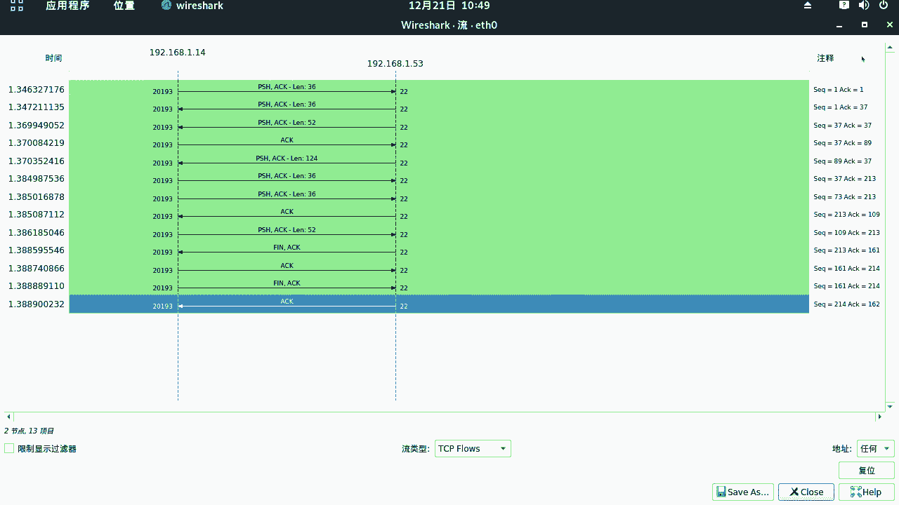

**第三次挥手 (FIN+ACK)**
被动关闭方在完成数据发送后，也发送一个FIN+ACK报文，表示自己也没有数据要发送了。
*   **关键字段**：
    *   `Flags`: **FIN=1, ACK=1**

**第四次挥手 (ACK)**
主动关闭方收到FIN报文后，发送最终的ACK报文进行确认。
*   **关键字段**：
    *   `Flags`: **ACK=1**
    *   `Ack`: 值为 **收到的FIN报文的序列号(Seq) + 1**

等待一段时间后，双方都会关闭连接并释放资源。同样，我们可以在WireShark的流量图中清晰地看到这四个步骤。

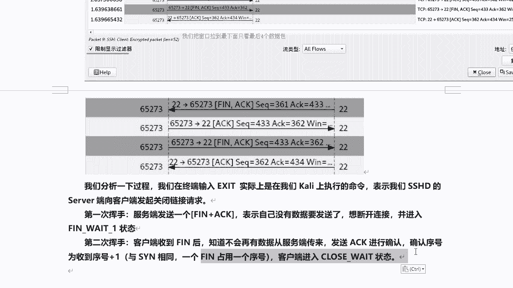

---

## 核心概念与字段总结

在本节中，我们一起学习了TCP连接管理的核心机制。以下是需要掌握的关键点：

**关键标志位 (Flags)**
*   **SYN**: 同步序列号，用于发起连接。
*   **ACK**: 确认，表示确认号字段有效。
*   **FIN**: 终止，用于释放连接。

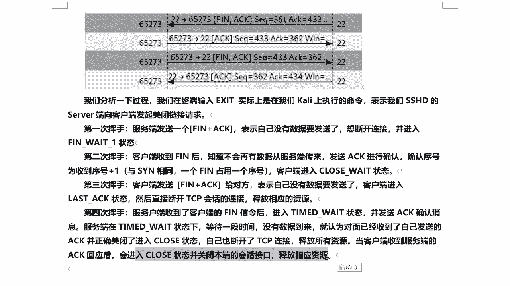

**关键字段**
*   **序列号 (Sequence Number)**: 标识发送的数据字节流。
*   **确认号 (Acknowledgment Number)**: 期望收到的下一个字节的序列号，计算公式为 `Ack = 收到的Seq + 数据长度`。在握手阶段，即使没有数据，SYN和FIN标志也会消耗一个序列号，因此确认号需要 `+1`。
*   **窗口大小 (Window Size)**: 用于流量控制，告知对方本端的接收能力。

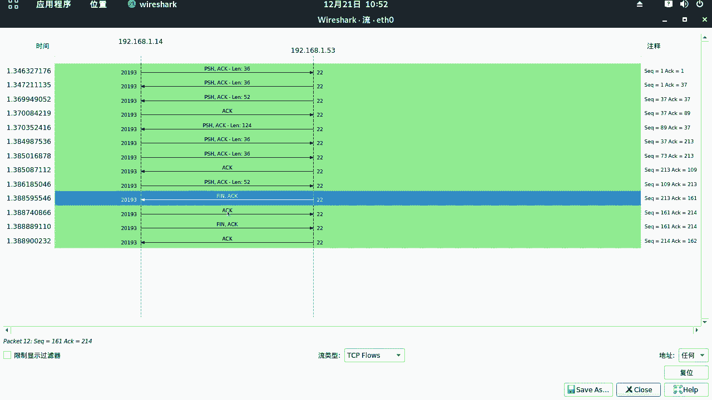

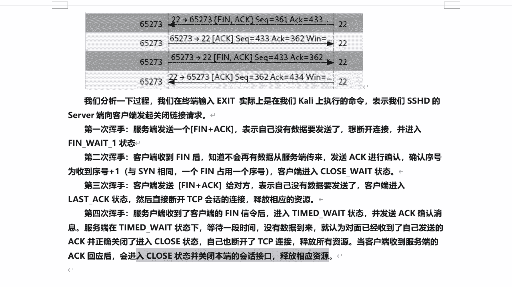

---

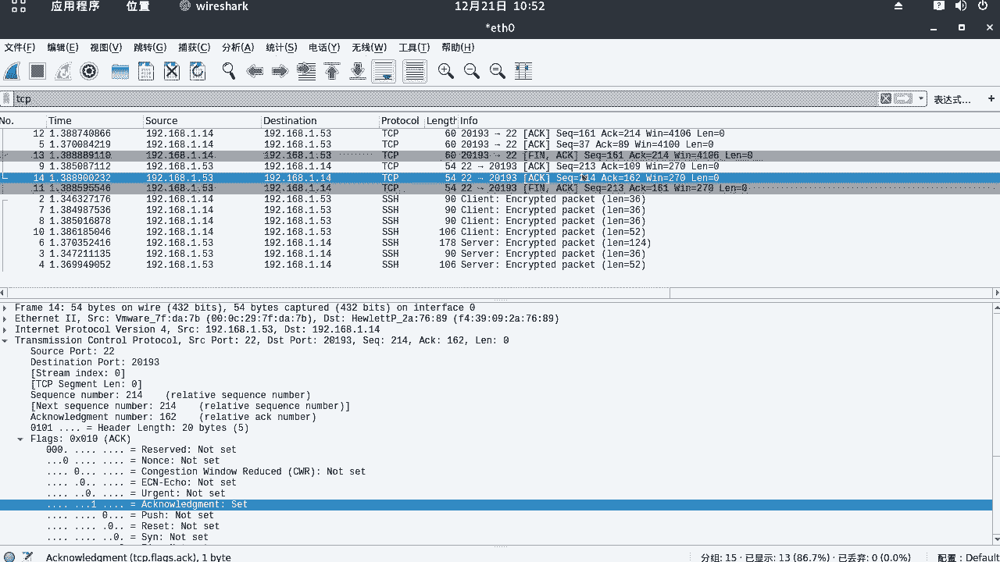

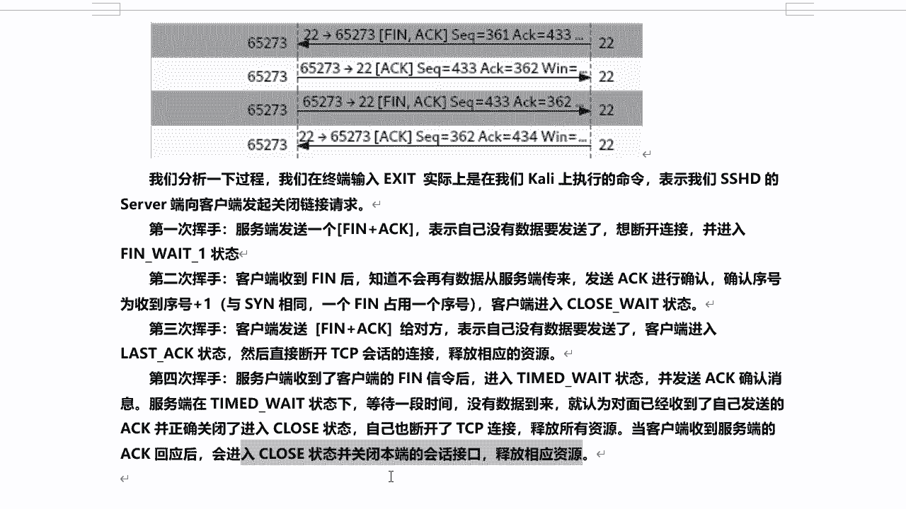

本节课中，我们通过WireShark实战分析了TCP协议的三次握手和四次挥手过程。理解这些基础报文交互，是学习网络协议分析、进行网络故障排查乃至安全攻防（如SYN Flood攻击原理）的重要基石。