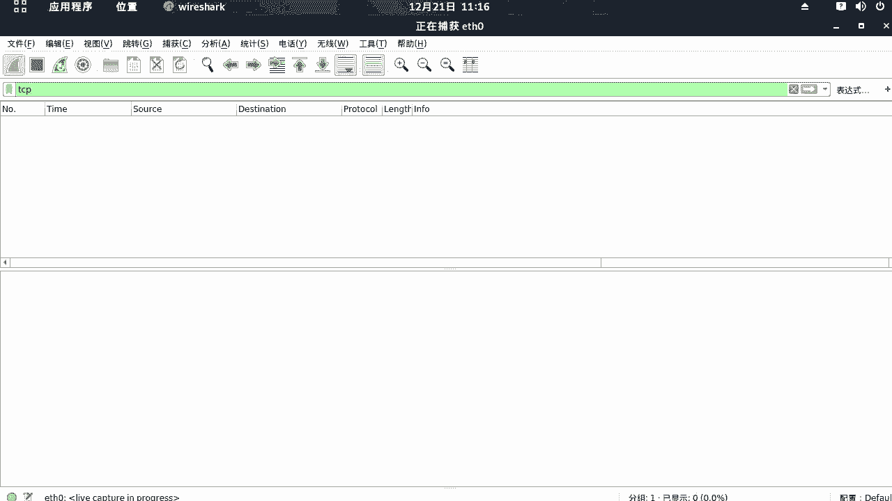
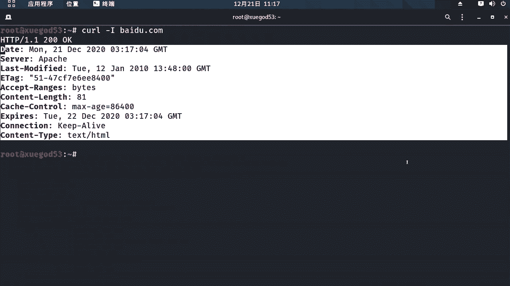
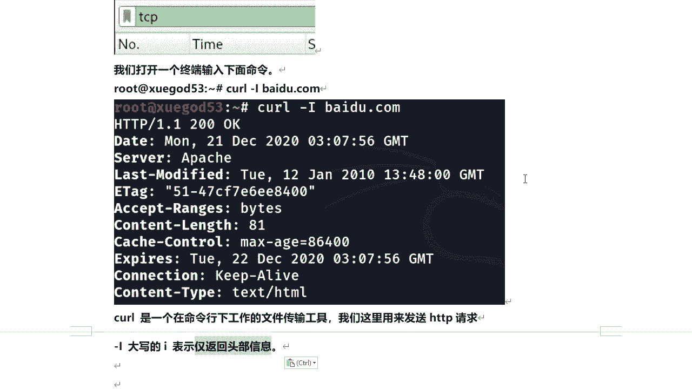
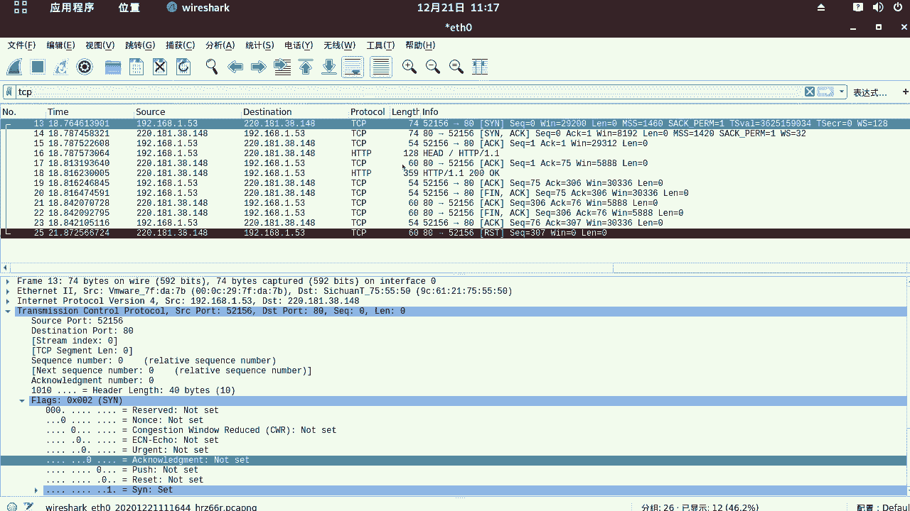

# 课程P52：9.7 - 【WireShark抓包系列】常用协议分析-HTTP协议 🕵️♂️

在本节课中，我们将学习如何使用WireShark抓取和分析HTTP协议的数据包。HTTP是Web通信的基础，理解其数据包结构对于网络分析和安全学习至关重要。

---

## 准备工作与抓包设置

上一节我们介绍了TCP协议的分析，本节中我们来看看其上层应用协议——HTTP。首先，我们需要在WireShark中设置过滤器来捕获HTTP相关的流量。



因为HTTP协议建立在TCP协议之上，所以我们可以使用 `tcp` 过滤器，它也会包含HTTP协议的数据包。

在WireShark中设置过滤器为 `tcp`，然后开始抓包。


---



## 生成HTTP流量

有多种方式可以生成HTTP流量用于抓包分析，例如使用浏览器访问网站。这里，我们使用一个命令行工具 `curl` 来发送一个HTTP请求。

打开一个终端，输入以下命令：
```bash
curl -I www.baidu.com
```
这个命令会向百度服务器发送一个HTTP HEAD请求。参数 `-I` 表示仅获取服务器的响应头部信息，而不下载完整的页面内容。


命令执行后，服务器会返回百度的HTTP头部信息。此时，在WireShark中停止抓包，以避免产生过多无关数据包干扰分析。

`curl` 是一个在命令行下工作的文件传输工具，我们用它来发送HTTP请求，从而产生可供分析的HTTP协议数据包。



---

## 分析抓取的数据包

停止抓包后，我们来看WireShark捕获到的数据。




在数据包列表中，我们可以清晰地看到TCP连接建立的“三次握手”和连接关闭的“四次挥手”过程。


其中，第4个和第6个数据包就是我们要分析的HTTP协议数据包。

以下是整个通信过程的逐步分析：

1.  **客户端发送HTTP请求**：客户端（我们的机器）向服务器（百度）发送了一个HTTP HEAD请求。
2.  **服务器确认请求**：服务器收到请求后，回复了一个TCP ACK包进行确认。
3.  **服务器返回HTTP响应**：确认完成后，服务器将HTTP的头部信息（状态码为200 OK）返回给客户端。
4.  **客户端确认响应**：客户端收到服务器的HTTP响应后，发送一个TCP ACK包告知服务器已收到信息。
5.  **连接关闭**：数据传输完毕后，客户端发起FIN/ACK，进入“四次挥手”流程以断开TCP连接。

这个过程完整展示了TCP连接下HTTP协议的“建立连接 -> 数据传输 -> 关闭连接”生命周期。

---

## 查看HTTP流

为了更清晰地查看HTTP协议的请求和响应内容，我们可以使用WireShark的“追踪流”功能。

在代表HTTP请求或响应的数据包上右键，选择 **“追踪流” -> “HTTP流”**。

在弹出的窗口中，你会看到纯文本格式的HTTP对话：
*   上半部分（红色）是客户端发送的 `HEAD` 请求。
*   下半部分（蓝色）是服务器返回的响应头部信息。

通过这种方式，可以直观地看到一次完整的HTTP“请求-响应”交互。

---

## 总结

本节课中，我们一起学习了HTTP协议的基础抓包与分析。

我们首先使用 `curl -I` 命令生成HTTP流量，然后在WireShark中通过TCP过滤器捕获数据包。通过分析数据包序列，我们观察了在TCP连接基础上HTTP协议的通信过程，包括请求、响应及连接状态管理。最后，利用“追踪HTTP流”功能，我们清晰地查看了协议交互的原始内容。

掌握这些方法，是进一步分析Web应用行为和排查网络问题的重要基础。