# P53：9.8-【WireShark抓包系列】实战：WireShark抓包解决服务器被黑上不了网 - 一个小小小白帽 - BV1Sy4y1D7qv

好下面呢我们来讲一个实战啊，那么通过via萨克抓包啊，解决服务器被黑三不料网的问题啊，那么现在有这么一个场景，就是服务器啊，白黑了上不了网，那么可以拼种网关，但是呢不能上网啊，那么神秘原因导致呢。

我们这里来模拟一个场景，修改主机的ttl值为一啊，那么下面的方式呢我们临时来修改啊，内核参数好。

我们来执行一下它呃，那么注意了这里啊，那么linux系统默认提交值是64啊，这里呢我们临时将它修改为一啊。

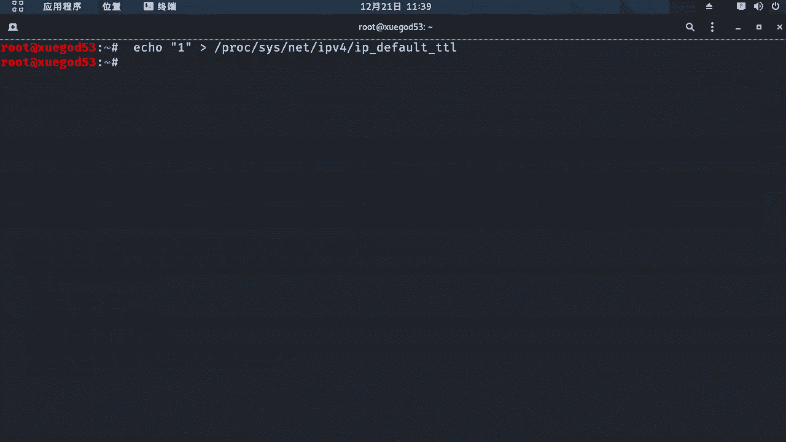

那么咱们的什么是t t l值啊，我们来扩展一下的好吧，那么t t l它是数据报文的一个生存周期啊，默认呢linux操作系统它的是64啊，对提交值每经过一个路由节点ttl值减一嗯，当t r值为零的时候。

说明目标地址啊不可达，并返回一个time to leave，嗯那么这里它的作用是什么啊，t t l主要是为了防止数据包啊，无限制在公网中转发啊，我们来测试一下结果啊。

嗯这里呢我们来拼一下的网关啊，1921681。1发送一个数据包，那么此时我们能平等网关啊是吧，那么这代表着什么网是通的，没有问题，内网是通的是吧，但是呢如果现在我们来拼一下了，我们的啊，外网。

比如说我们来拼一下学霸的要c。

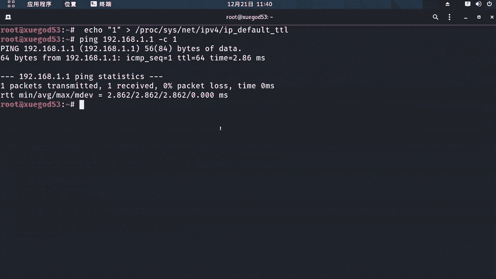

那么此时呢他会提着time to live对吧，生存超过超过生存时间了，那么这个什么意思，那你就代表着你上不了网啊，可以拼通网关，但是上不了网，那么这个对啊，那么此时你应该想到一个问题。

那什么ttl值好吧，那么这里呢我们来判断一下呢。

对吧，嗯目标啊之前经受过多少个网络设备，那一般来讲是根据目标返回给我们的t r值，来判断的，因为我们发送的数据包是看不到的，所以呢只能通过什么这个t t l值来判断好。

下面呢我们来通过visuck抓包来分析一下的啊，那么这个原因到底是什么，好吧嗯。

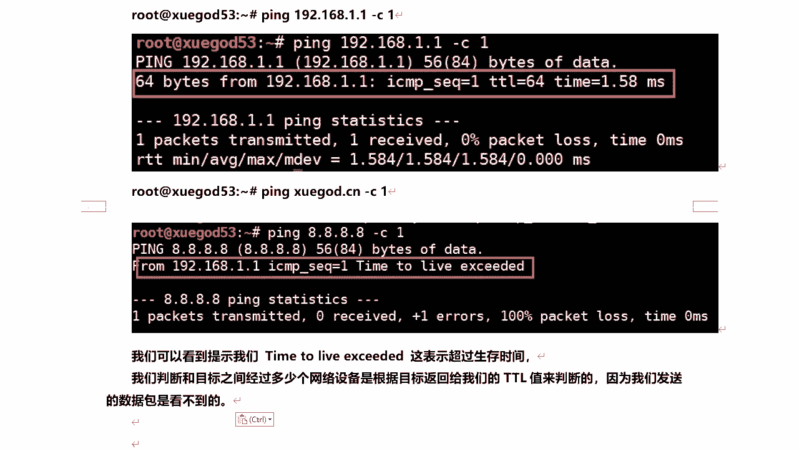

我们这里呢来筛选一下的very suck a，这里呢拼是吧，那么筛选i c m p协议，然后呢抓取下的数据包啊。

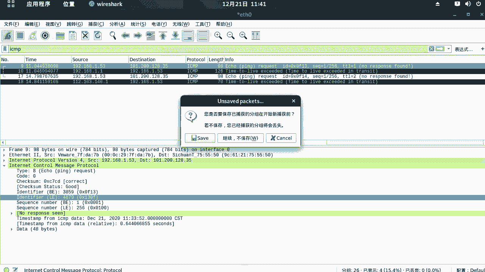

然后呢我们再开启，我们再重新来拼一下，学个啊点cn，然后通过这个jb我们来看一下的啊。

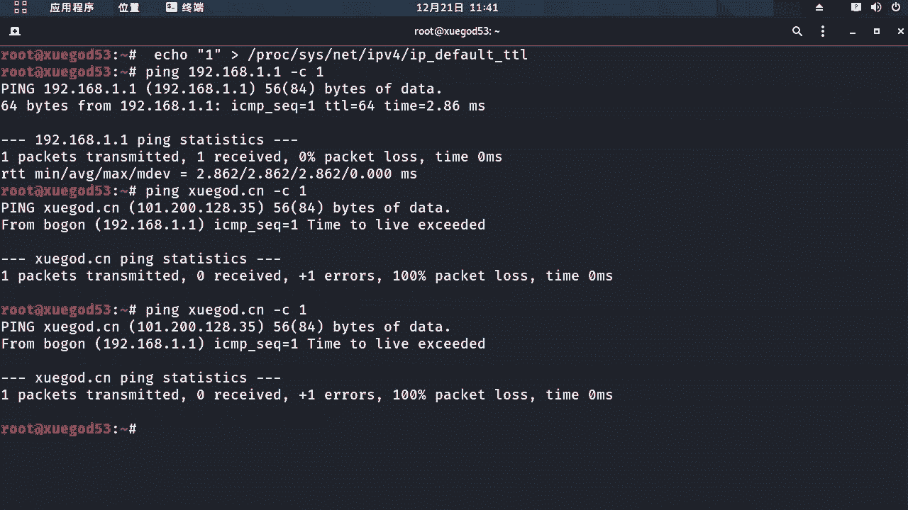

对那么这里呢首先呢开里对吧，拼一下学神啊对吧，sugc a p地址是这个request，然后注意这个第二个响应包是谁，不是学霸的这个ip响应的对，是网关响应的对，为什么是网关呢。

而且它提示time to live，那么time to leave，那么就是超过生存时间了，那么to live，那么这是网关对吧，我们搜到是网关返回给我们的数据包，那么告诉过我们什么数据包生存时间对吧。

已经超过了数据包生存线，然后数据包被丢弃了啊。

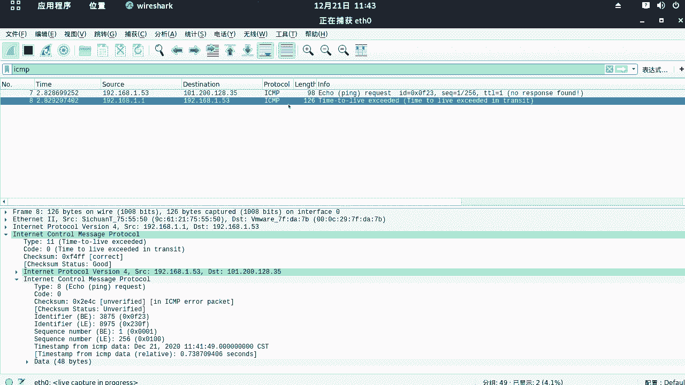

那么这是ttl值为一，那么此时如果我把t下车再改一下的，比如说我改成二呢对吧，我们再通过visa抓包来看一下的结果。

哎我们再拼一下，学成就高的cn，那时候我们来看这里这个是吧，第二个数据包啊，学1。53啊，那么拼啊，学神学get sn请求包request，那么此时我们收到了一个响应包，这个ip呢不是网关的下。

又另外一个ip，但是呢他也不是学神返回给我们的对吧，那么这样我们对比一下，前后第一个t d值为一和a2 ，那么它的对这个地址对吧，收到数据包是谁，原地址是不一样了，这样变成了第二个数。

变成了t r值为二的时候，它的原地址变成了140。1了，那么就证明啊，数据包在网络中已经到达了，下一个网络设备才被丢弃的，那么由此我们可以判断出我们的运营商网关呢，就是这个好吧。

然后但是呢并没有到达目标主机啊，好那么我们来恢复一下我们的这个ttl值啊。

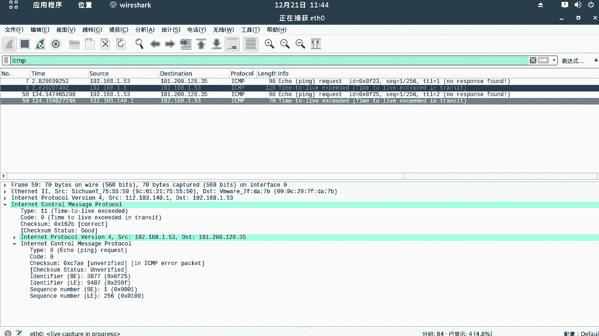

那么默认提交值是64是吧。

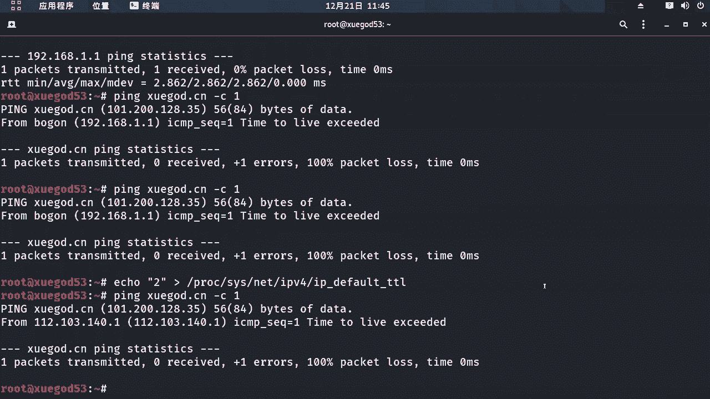

我们给它恢复，然后呢我们再来拼一下了，雪糕的cn，好这回呢可以变通了是吧，我们再来看，这是请求包响应包请求发送给1288。35，就学点cn的ip地址，那么此时收到的响应包源ip地址是谁啊。

也是学神的ip地址，那么此时呢一切正常了好吧，那么这里呢我们来看啊。

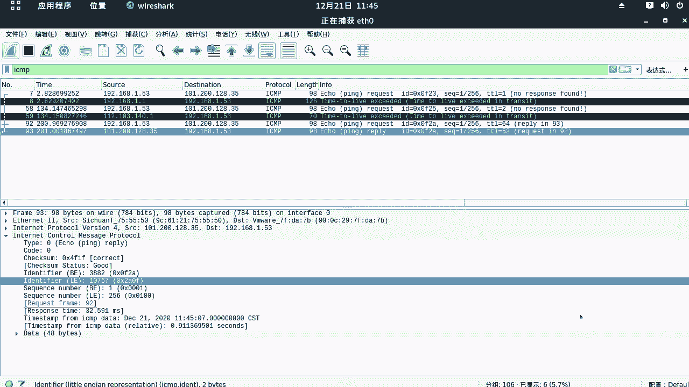

呃它返回给我们的t t值对，那么这里是多少呢，52嗯，它默认的t r值是64是吧，那么这里返回52啊，那么意味着什么，对啊好吧，那么就是我们的tr值需要大于啊，64-52。

那么也就12才可以访问到学尬的点cn啊，那么通过这个tl值呢，我们也可以判断出它中间啊，经过了多少个网络设备，是不是，那我们把笔记本给大家整理到这里啊。

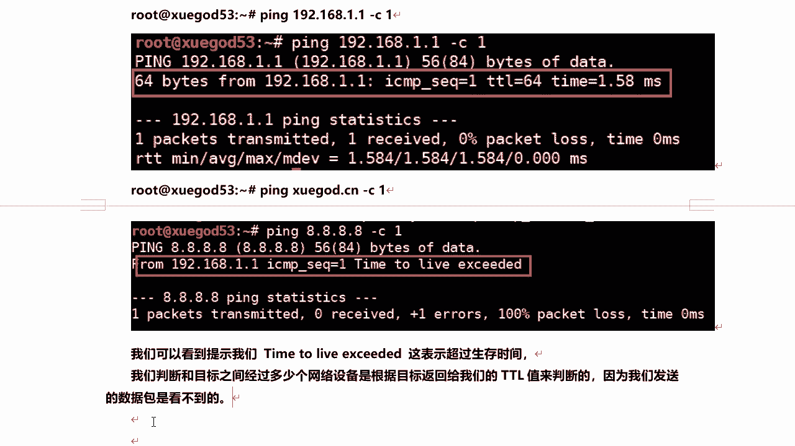

那么也就是通过这个啊，想要最终啊这个是学霸的cn返回给我们的啊，t t r值是52呃，kelly默认提下这是64好吧，通过这个数值呢，我们可以判断出中间经过了多少个网络设备啊。

64-52有12个网络设备，那么也就是这个我们的t2 值必须得大于它对，那么你才可以访问到大于多少，大于12，你才可以访问到什么，学到了点cn，否则的话是防不了的啊。

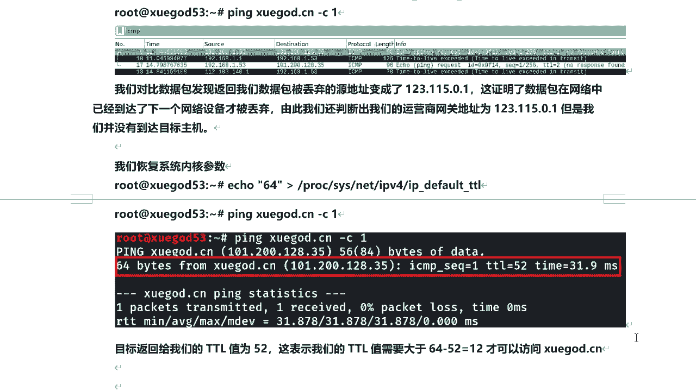

那么通过这种方式我们就解决了是吧，他上不了网的问题，现在呢我们就可以来冰冻外网了啊，另外呢给大家介绍一个小工具啊，那么mt 2，那么这个m t r工具可以检测，我们到达目标网络之间。

所有经过的网络设备的一个网络质量问题啊，默认的这个开店呢它是没有安装的，我们需要手动去装一下的好吧，手动安装一下的p t insult杠y mt 2。

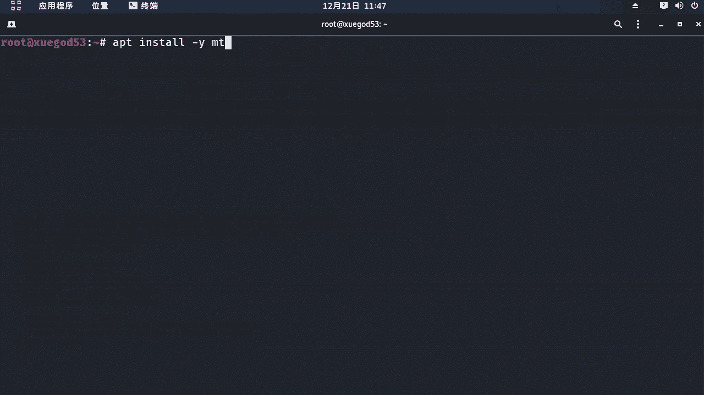

然后那么这个工具啊安装完成之后呢，比如说，那么我们来检测到达雪干点c n，所有节点的通讯资料，我们就可以通过这个命令来去查看mtr空格。

跟上域名或者ip就可以了啊，我们稍微等一会儿啊，那么这个安装完成之后呢，我们来测试一下吧，稍等，我再打开一个终端啊，他正常看啊，他现在还没结束，会计算好了，已经结束了啊，那不用了嗯，mtr啊。

学尬的点cn，那么它会打开一个图形化界面，好吧对，那么我们看那么这里经过了多少个节点啊，12345678 90 11 12到达学生是吧，那么中间标红的地方是吧，这个loss丢包率百分之百。

那么就这几个节点啊，网络质量一般啊，对啊他不是很好，是不是好的，那么也就是他经过多少跳啊，12跳到达了目标机啊，那么这里呢我们来还一样的啊，唉我把这个截下图。

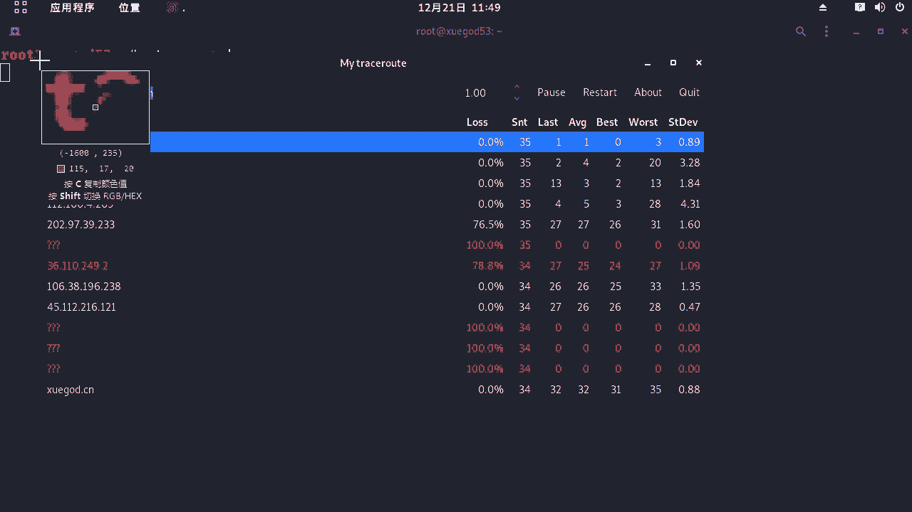

好那么放到这里。

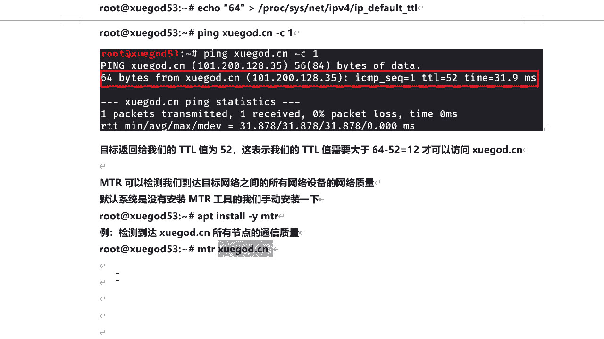

那么比如说你通过这个和这个工具啊，其实挺好啊，那么它呢可以检测经过中间啊，每哪个网络设备它在网络质量不好啊，那么其他的你看这个图看啊，其他都还可以啊，0%丢包率，这是丢包率啊，0%。

那么这几个节点就不太好了啊。

他不是很稳定对吧，他有人看有时候时好时坏的啊，但是整个就说明，有的时候你会发现一个网站打开比较慢是吧，那么你可以通过这个方程看哪块出问题了是吧，那他这个没有返回ip，那么有可能这块对吧。

网络质量不好好吧。

那么这是mtr这个工具，然后最后我们来总结一下的啊，那么我们这节课呢好那么学习了哪些内容，给大家讲了visug简介及招标原理和过程，然后呢通过实战来讲解，vs抓包及快速定位数据包的技巧。

然后使用了visuck对常用协议对吧，抓包并分析原理，最后呢我们通过一个实战来讲解，通过威尔萨克抓包解决服务器被黑。

