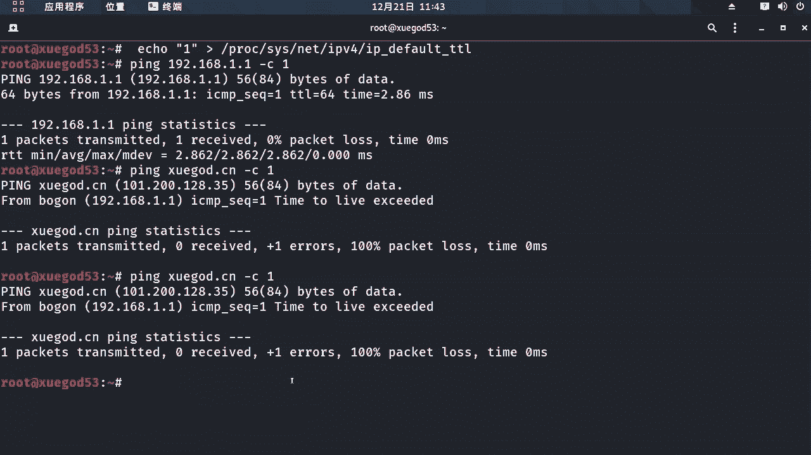

# P53：9.8-【WireShark抓包系列】实战：WireShark抓包解决服务器被黑上不了网 🕵️♂️

在本节课中，我们将学习如何利用WireShark抓包分析技术，诊断并解决一个典型的服务器网络故障：服务器可以连通网关但无法访问外网。我们将通过模拟一个TTL值被篡改的场景，一步步分析问题根源。


## 概述与问题场景

服务器被黑后无法上网，具体表现为可以`ping`通网关，但无法访问外部网络。我们需要找出导致此问题的根本原因。

我们通过修改主机的TTL值为1来模拟此故障场景。以下是临时修改Linux内核参数的方法：


```
sysctl -w net.ipv4.ip_default_ttl=1
```


Linux系统默认的TTL值是64，上述命令将其临时修改为1。


## 理解TTL（生存时间）🔍

上一节我们设置了故障场景，本节中我们来深入了解一下核心概念TTL。


TTL是IP数据包的一个生存周期字段。其主要作用是**防止数据包在互联网中无限循环转发**。每个操作系统有默认的初始TTL值，Linux系统通常为64。


数据包每经过一个路由器（即“跳”），其TTL值就会**减1**。当TTL值减为0时，当前路由器会丢弃该数据包，并向源地址发送一个 **`ICMP Time Exceeded`** 消息。


## 故障现象测试

以下是测试修改TTL值后的网络连通性：


首先，我们测试内网连通性，`ping`网关地址：
```
ping 192.168.1.1
```
此时可以`ping`通网关，说明内网链路正常。



接着，我们测试外网连通性，`ping`一个外部域名：
```
ping xuegod.cn
```
此时会收到 **`Time to live exceeded`** 的响应，这直接导致了无法上网。这个现象提示我们，问题可能与TTL值有关。

## 使用WireShark抓包分析 🧰

上一节我们观察到了故障现象，本节中我们使用WireShark抓包来深入分析具体原因。


我们在WireShark中设置过滤器为 `icmp`，然后再次执行 `ping xuegod.cn` 命令并捕获数据包。


以下是抓包结果的关键分析：
1.  第一个数据包是向 `xuegod.cn` 的IP地址发送的 `ICMP Echo Request`。
2.  第二个响应数据包的**源IP地址是本机网关**，而非目标服务器。其内容为 **`ICMP Time Exceeded`**。

这个结果明确显示：我们发出的数据包在到达第一个路由器（即网关）时，TTL值就从1减为0，因此被网关丢弃并返回了超时错误。


## 对比实验：TTL=2 的情况

为了进一步验证，我们将TTL值临时修改为2：
```
sysctl -w net.ipv4.ip_default_ttl=2
```
再次使用WireShark抓包并 `ping xuegod.cn`。


以下是抓包结果的对比：
*   当TTL=1时，`ICMP Time Exceeded` 响应来自网关 (`192.168.1.1`)。
*   当TTL=2时，`ICMP Time Exceeded` 响应来自另一个IP地址 (`140.x.x.1`)。

这证明数据包在TTL=2时，成功通过了本地网关，在到达**第二个网络设备**时才因TTL耗尽被丢弃。这帮助我们判断出运营商的网关地址。


## 问题解决与TTL恢复

分析清楚原因后，我们将TTL值恢复为默认值以解决问题：
```
sysctl -w net.ipv4.ip_default_ttl=64
```
恢复后，再次 `ping xuegod.cn`，可以成功收到来自目标服务器的 `ICMP Echo Reply`，网络恢复正常。


## 通过TTL判断网络路径 🌐


上一节我们解决了问题，本节中我们来看看如何利用TTL值进行简单的网络诊断。

在正常的响应中，服务器返回的数据包带有其初始TTL值。例如，`xuegod.cn` 返回的数据包TTL值为52。
已知Linux服务器的默认TTL为64，那么可以推断数据包从源到目标经过了：**`64 - 52 = 12`** 个路由节点（跳）。

这意味着，要成功访问该服务器，我们发出的数据包TTL值必须大于12。这个原理可以帮助我们快速判断网络可达性所需的最小TTL值。


## 扩展工具：MTR网络诊断

除了手动分析，我们还可以使用 `mtr` 工具，它集成了 `traceroute` 和 `ping` 的功能，能持续检测到目标主机路径上所有节点的网络质量。


以下是安装和使用方法：
1.  安装mtr：
    ```
    yum install -y mtr
    ```
2.  使用mtr检测到目标域名的路径：
    ```
    mtr xuegod.cn
    ```
    mtr会启动一个动态界面，显示途径的所有跃点、丢包率、延迟等信息。图中标红或丢包率高的节点，可能就是网络瓶颈或问题所在。例如，路径显示经过12跳到达目标，与之前TTL推算的结果一致。


## 总结 📝

本节课中我们一起学习了：
1.  **问题定位**：通过“能ping通网关但无法上网”的现象，联想到TTL值可能被篡改。
2.  **原理回顾**：理解了TTL（生存时间）的作用是防止数据包无限转发，每经过一跳减1，归零则被丢弃。
3.  **抓包实战**：使用WireShark捕获ICMP数据包，通过分析 `ICMP Time Exceeded` 报文的来源，精确定位数据包是在哪一跳被丢弃的，从而验证了TTL值过小是故障原因。
4.  **解决方案**：将系统的TTL值恢复为正常值（如64）。
5.  **诊断技巧**：学会了通过返回数据包的TTL值推算经过的网络跳数。
6.  **工具扩展**：介绍了 `mtr` 这个强大的网络路径质量诊断工具。


通过这个实战案例，我们掌握了利用WireShark分析网络层问题的一种有效思路和方法。