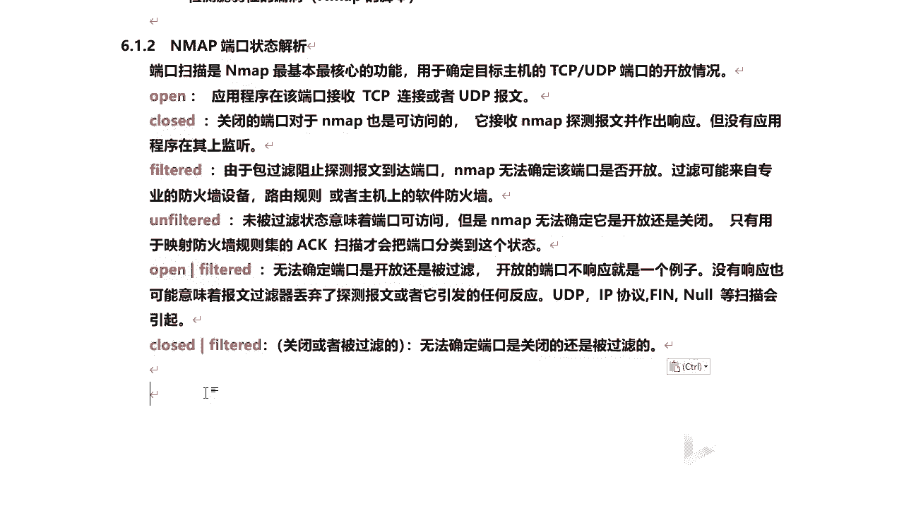

# P54：10.1-【漏洞扫描工具系列】NMAP概述及端口状态解析 - 一个小小小白帽 - BV1Sy4y1D7qv

大家好，我是讲师root，那么今天给大家讲一下的n map，高级使用技巧和漏洞，所没有发现，那么首先呢我们来讲一下imax高级使用技巧，接下来呢我们使用dnmb啊，实现分布式集群啊扫描。

最后呢我们来讲一下nas啊，漏洞检测啊，nas安装以及漏洞检测，那么我们先来看一下它n map的高级使用技巧，那么n map啊，它是一个网络探测和安全啊，扫描程序啊。

那么系统管理者和个人可以使用这个软件，扫描大型的网络，获取那台主机正在运行，以及提供什么服务等信息，可以说它是一款非常强大的一个工具啊，那么作为一个渗透测试人员来讲，n map是必须要会用的啊。

它能支持多种的扫描技术啊，比如说udp扫描啊，tcp connect扫描t c b s n，也就半开扫描l tb代理反向标志，s m p扫描f i n a c k还有圣诞树s弯扫描，还有nt扫描等等。

那么各种不同类型的扫描，对它的原理啊是不一样的，方式也是不一样的，那么同时呢还可以探测操作系统的类型，还有各种服务的类型以及版本啊，那么n map主要用于啊，那么它的技术啊对主要用于以下方面。

可以实现这些功能检测啊，存网络上的存活主机也是主机发现啊，还有检测主机上开放的端口啊，对端口发现或者枚举，还有检测相应的端口服务发现的软件版本啊，就是说每个端口对应的是什么服务啊。

那么这个服务的版本啊是什么版本，还有检测操作系统硬件地址啊，以及软件版本等等啊，还有检测脆弱性的漏洞，那么也同时可以注意什么安全审计啊，漏洞检测啊，那么还可以进行密码包括等等相关的技术啊。

还有更强大的就是，它可以就是基于脚本进行扫描啊，那么可以你自己啊，如果有一定开发能力的话，它本身利用的是l u v语言啊，你可以自己去定制属于自己的啊，或适合自己的一个脚本扫描脚本啊。

然后进行扫描可谓是非常强大啊，这个呢后期呢大家可以去研究一下的啊，然后呢咱们主要针对他这个端口啊，他最著名的功能就是端口扫描好吧，然后呢扫描目标即将开放了哪些端口，每个端口对应的什么服务。

以及这个服务它对应的什么版本啊，通过这个版本，那么你可以这个服务这个版本啊，那么可以发现对，看它有没有什么漏洞啊等等哦，我们来看，那么它的端口啊，扫描对，那你其他一般来讲根据返回的啊，端口状态来判断啊。

判断他这个目标机的端口是开放的还是关闭的，或者是其他的多种状态啊，登录扫描是mp最基本最基本最核心的功能，那么uni呢确定目标主机的tcb啊，ud p端口的一个开放状况，那首先第一种状态是open。

那么这种状态就是说啊应用程序啊，在该端口接收tcp或连接或者是ud p报文啊，它是开放的，打开的close，关闭的灯火主要是对于nmb式也是可以访问的，他接收呢nmap探测报文并制作出响应。

但是呢没有应应用程序在其上监听，那么这种关闭的也没有什么可利用的是吧，呃fty，那么这个就是由于啊，包对过滤阻止或探测报文啊，到达端口map无法确定该端口是否开放，也就是被防火墙过滤了啊。

那过滤可能来自么专业的防火墙设备，路由规则或者是主机上软件防护箱等等都可以，那么也处于返回，如果发生这种状态，你不能来判断端口可能是开放的，也可能是关闭的，都有可能啊，还有呢没有被过滤的unfilty。

那么就是未被过滤状态意味着端口可访问，但是n map无法确定它是开放还是关闭，那么只有用于映射防火墙规则集的a c k扫描，才会把端口分类到这个状态，那么也就是说你不使用这个对扫描。

那么一般不会有这个状态，那这种也很少用啊，呃再一open或者是filty啊，无法确定端口是开放还是过滤的，就开放的或者是过滤的，被过滤的，开放的端口呢不响应就是一个例子，虽然端口开放。

但它没有给你响应啊，那你介绍这个状态，你说判断它开放才关闭呢，无法判断对吧，没有响应的，也可能意味着豹纹过滤器丢弃的探测报文，或者是它引发的任何反应，那么udp啊，ip协议啊。

还有fn now这些类型的扫描会引起啊，产生这种状态，要注注意啊，这几种啊扫描类型会返回这种状态，最后一种的呢，closed filter就是关闭或者是被过滤的，那么这种状态就是无法确定端口。

是关闭还是被过滤的，你确定不了啊，那么这样的话就可以推，具体通过什么其他的方式啊，然后呢去来进一步的做一下判断啊。

那么这是mp端口状态一些解析啊。