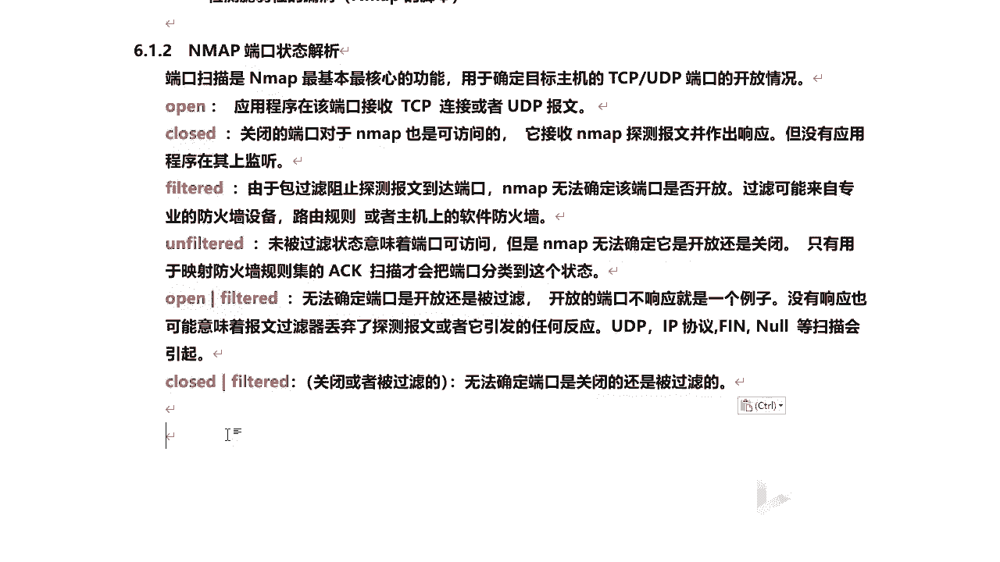

# 课程 P54：10.1 - 【漏洞扫描工具系列】NMAP概述及端口状态解析 🔍

在本节课中，我们将要学习网络扫描工具 NMAP 的核心概念、高级使用技巧，并重点解析其端口扫描功能返回的各种端口状态。理解这些状态是进行有效网络探测和安全评估的基础。

## NMAP 概述 🛠️

NMAP 是一款网络探测和安全扫描程序。系统管理员和个人可以使用这款软件扫描大型网络，以获取哪些主机正在运行以及它们提供了哪些服务等信息。对于渗透测试人员而言，NM**AP 是必须掌握的工具**。

它支持多种扫描技术，例如：
*   UDP 扫描
*   TCP Connect 扫描
*   TCP SYN 扫描（半开扫描）
*   以及 FIN、ACK、圣诞树、NULL 扫描等。

同时，NMAP 还能探测目标主机的操作系统类型、服务类型及其版本号。

## NMAP 的主要功能 📋

以下是 NMAP 主要用于实现的几个核心功能：

1.  **主机发现**：检测网络上存活的主机。
2.  **端口扫描与枚举**：检测主机上开放的端口。
3.  **服务与版本检测**：识别开放端口对应的服务及其软件版本。
4.  **操作系统检测**：推测目标主机的操作系统和硬件地址。
5.  **漏洞检测**：利用脚本引擎发现脆弱性漏洞。
6.  **高级功能**：支持基于 Lua 语言的脚本编写，允许用户定制专属的扫描脚本，功能非常强大。

## 端口状态解析 🎯

上一节我们介绍了 NMAP 的多种功能，本节中我们重点来看看其最著名和核心的功能——端口扫描。通过扫描，我们可以确定目标主机开放了哪些端口，每个端口对应什么服务及版本，进而分析潜在的安全风险。扫描结果会根据不同的响应，将端口状态分为以下几类：

以下是 NMAP 端口扫描可能返回的几种状态及其含义：

*   **`open` (开放)**
    应用程序正在该端口监听，并准备接收 TCP 连接或 UDP 报文。这是最直接可利用的状态。

*   **`closed` (关闭)**
    端口是可访问的（即主机在线），NMAP 的探测报文能够到达并收到响应，但没有应用程序在此端口上监听。通常没有直接利用价值。

*   **`filtered` (被过滤)**
    由于防火墙、数据包过滤规则等原因，探测报文被阻止，无法到达目标端口。NMAP 无法确定该端口是开放还是关闭。状态返回为 `filtered` 时，端口可能开放也可能关闭。

*   **`unfiltered` (未被过滤)**
    端口可以访问，但 NMAP 无法确定其是开放还是关闭。只有用于探测防火墙规则的 **ACK 扫描** 才会将端口归为此类，其他扫描方式很少见到此状态。

*   **`open|filtered` (开放或被过滤)**
    无法确定端口是开放还是被过滤。当开放的端口不响应探测时，或探测报文被过滤器丢弃而未引发任何响应时，会产生此状态。**UDP、IP 协议、FIN 和 NULL 扫描** 等方式可能返回此状态。

*   **`closed|filtered` (关闭或被过滤)**
    无法确定端口是关闭还是被过滤。需要结合其他扫描方式或技术进行进一步判断。

## 总结 📝

本节课中，我们一起学习了网络扫描利器 NMAP 的基本概述、核心功能以及端口扫描返回的各种状态解析。理解 `open`、`closed`、`filtered` 等状态的含义，是准确分析扫描结果、评估目标网络状况的关键第一步。掌握这些基础知识，将为后续学习更高级的扫描技巧和漏洞利用打下坚实的基础。