# P55：10.2-【漏洞扫描工具系列】NMAP语法及示例 🛠️

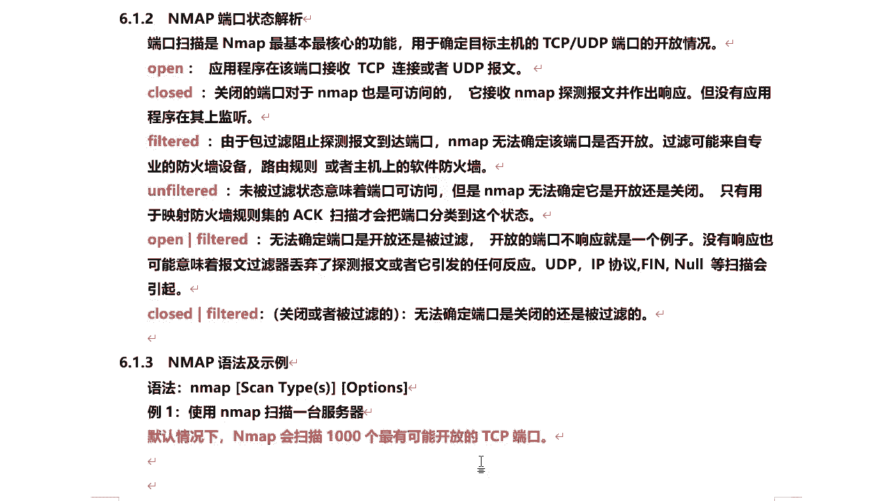

在本节课中，我们将要学习网络扫描工具NMAP的基本语法和一些常用示例。我们将从最简单的扫描开始，逐步介绍端口扫描、操作系统探测、隐蔽扫描等高级功能，帮助你理解如何利用NMAP进行网络探测和信息收集。

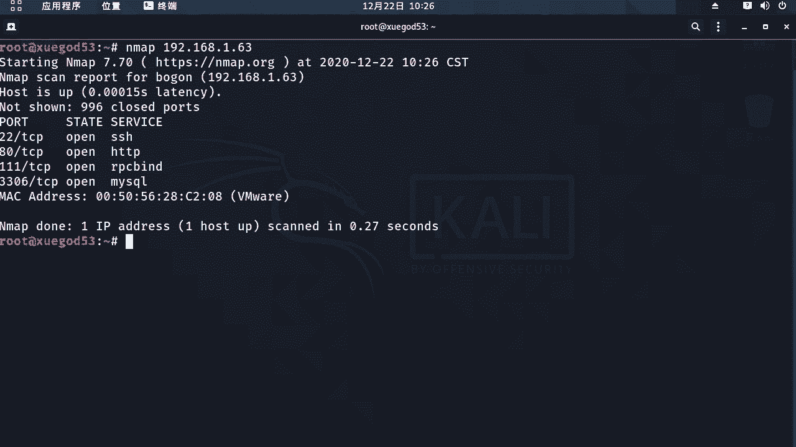

## NMAP基本语法


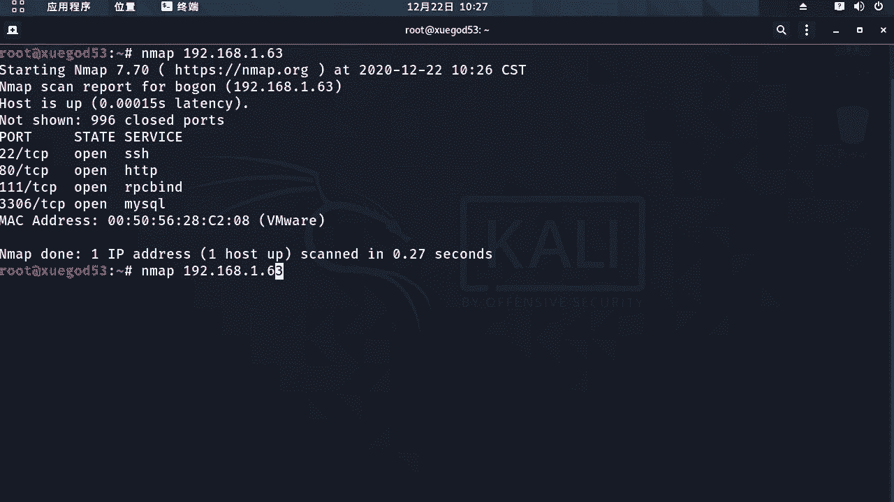

NMAP的语法结构很简单，基本格式为 `nmap [扫描类型] [其他参数] [目标]`。扫描类型和其他参数决定了NMAP的行为。


以下是NMAP命令的基本结构：
```bash
nmap [扫描类型选项] [其他选项] [目标域名或IP地址]
```


## 基础扫描示例

上一节我们介绍了NMAP的基本语法，本节中我们来看看如何执行一次最简单的扫描。

使用NMAP扫描一台服务器时，只需在命令后跟上服务器的域名或IP地址即可。默认情况下，NMAP会扫描目标主机上1000个最有可能开放的TCP端口。


```bash
nmap 192.168.1.63
```
执行上述命令后，NMAP会列出目标主机开放的端口。例如，它可能检测出22、80、111和3306这几个端口是开放的。

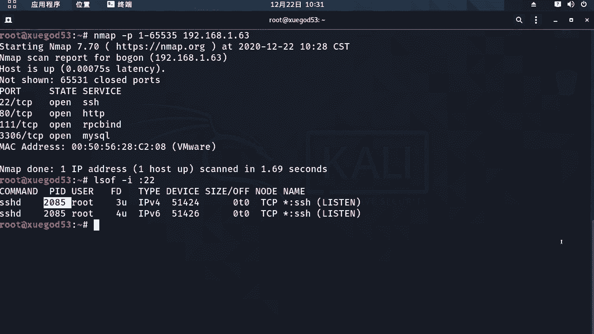

## 详细扫描与全端口扫描

基础扫描只能看到结果。如果我们想了解扫描过程中的详细信息，或者担心常规扫描会遗漏非常用端口，就需要使用其他参数。

以下是两种更详细的扫描方式：

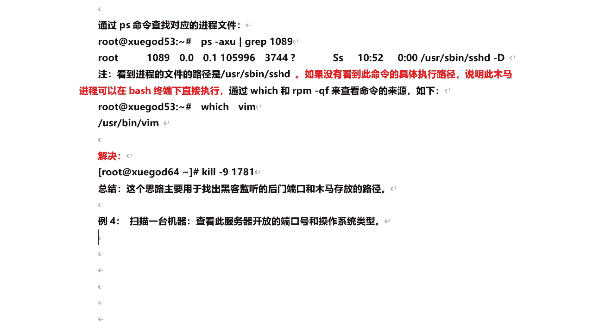

*   **显示冗余信息**：使用 `-v` 参数可以让NMAP显示扫描过程中的细节信息。
    ```bash
    nmap -v 192.168.1.63
    ```
*   **全端口扫描**：使用 `-p` 参数指定端口范围，可以扫描所有65535个端口，确保没有遗漏。
    ```bash
    nmap -p 1-65535 192.168.1.63
    ```
    全端口扫描速度较慢，但能发现所有开放的端口，包括那些高位端口。

在生产环境中，为了安全，应该只开启正在提供服务的端口，并关闭所有不需要的服务，以防止被黑客利用。

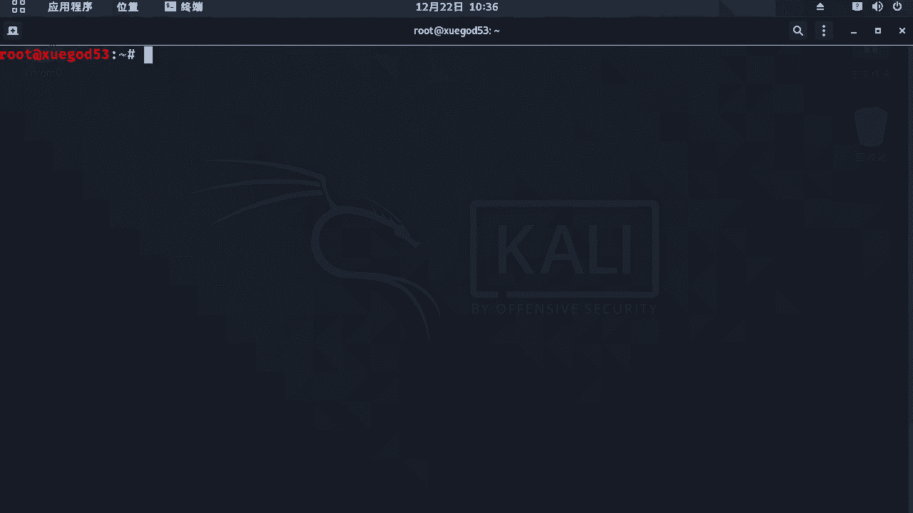

## 识别与处理未知服务

当我们扫描发现一个不认识的开放端口时，需要判断它是否是正常服务或潜在的后门。

以下是排查未知服务的思路：

1.  **查看端口对应进程**：在目标主机上使用 `lsof -i :端口号` 命令，查看是哪个进程在使用该端口。
2.  **定位进程文件**：根据查到的进程ID (PID)，使用 `ps aux | grep PID` 或 `ls -l /proc/PID/exe` 命令，找到该进程对应的可执行文件路径。
3.  **判断与处理**：如果确认该文件是不认识的恶意程序（木马），可以先使用 `kill -9 PID` 命令结束进程，然后删除对应的文件。

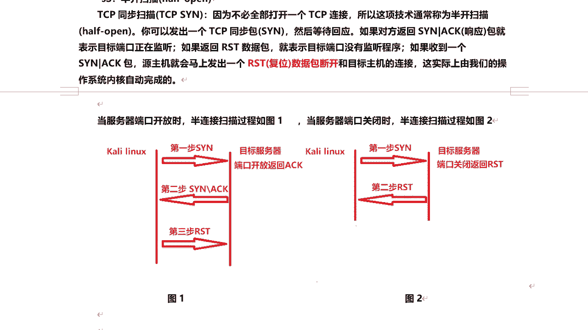


这种思路可以帮助我们找出黑客监听的后门端口和木马存放的路径。

## 操作系统类型探测


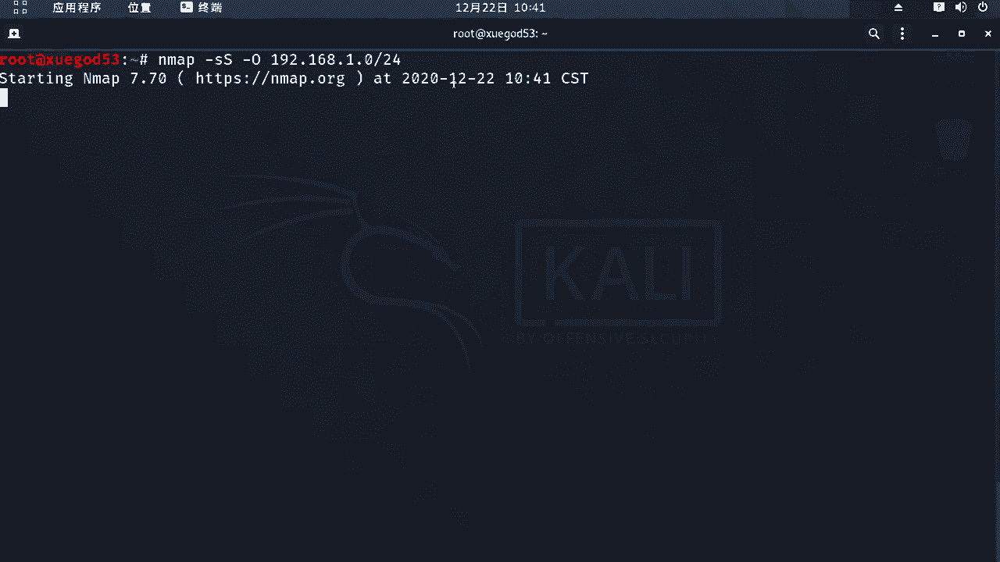

除了扫描端口，NMAP还能探测目标主机的操作系统类型。这是通过将扫描得到的“指纹”信息与内置的数据库进行比对来实现的。

使用 `-O` 参数可以启用操作系统检测功能。同时，我们常结合 `-sS` 参数进行半开扫描，以减少在目标主机上留下日志记录。

```bash
nmap -sS -O 192.168.1.63
```
命令执行后，NMAP会给出对操作系统类型的猜测，例如“Running: Linux 3.X|4.X”。探测结果不一定百分之百准确，但能提供一个重要的参考方向。

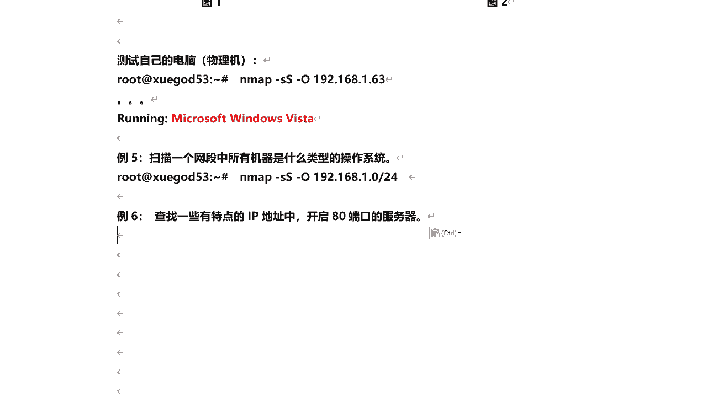

**半开扫描原理**：它只完成TCP三次握手的前两次。客户端发送SYN包，如果目标端口开放，会回复SYN-ACK，此时客户端直接发送RST断开连接，而不完成第三次握手。这样避免了建立完整连接，更为隐蔽。


## 扫描网段与特定服务

NMAP的强大之处在于它能批量扫描一个网段，并筛选出提供特定服务的主机。

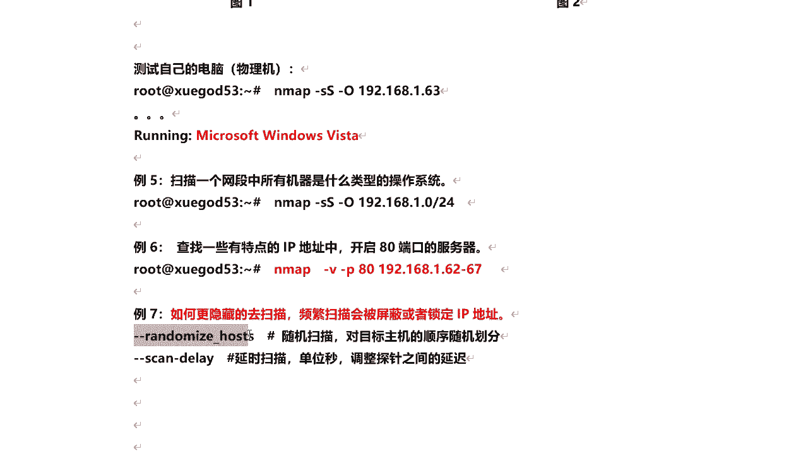

以下是两个相关的应用示例：


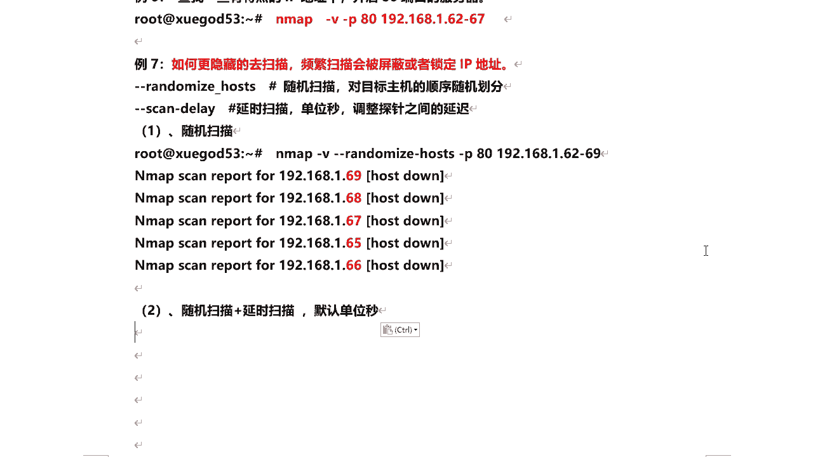

*   **扫描整个网段的操作系统**：通过指定CIDR格式的网段，可以探测该网段内所有存活主机的操作系统类型。
    ```bash
    nmap -sS -O 192.168.1.0/24
    ```
*   **查找网段内开放特定端口的主机**：例如，查找网段内所有开放了80端口（Web服务）的主机。
    ```bash
    nmap -v -p 80 192.168.1.62-67
    ```


## 隐蔽扫描技巧


直接、快速的扫描容易被目标的防火墙或入侵检测系统发现并屏蔽IP地址。因此，在实际渗透测试中，需要采用一些隐蔽技巧。

以下是两种常用的隐蔽扫描参数：


*   **随机扫描**：使用 `--randomize-hosts` 参数，NMAP会随机打乱目标主机的扫描顺序，而不是按顺序逐个扫描。
*   **延时扫描**：使用 `--scan-delay` 参数（单位：毫秒或秒），可以设置每发送一个探测包之间的时间间隔，从而降低扫描速度，避免触发警报。
    ```bash
    nmap --randomize-hosts --scan-delay 3000ms -p 80 192.168.1.62-69
    ```

此外，还可以使用通配符来指定扫描范围。例如，`192.168.1.*` 表示扫描 `192.168.1.1` 到 `192.168.1.254` 的所有IP地址。但需注意，大范围的扫描非常耗时，且需谨慎使用。

---


本节课中我们一起学习了NMAP工具的核心用法。我们从最基本的扫描命令开始，逐步掌握了显示详细信息、进行全端口扫描、探测操作系统、批量扫描网段以及使用随机化和延时参数进行隐蔽扫描等技能。理解这些语法和示例，是进行有效网络探测和安全评估的重要基础。记住，工具的使用应始终遵守法律和道德规范。