# P56：10.3-【漏洞扫描工具系列】图形界面zenmap的使用 - 一个小小小白帽 - BV1Sy4y1D7qv

好那么下面呢我们来看一下图形化界面的n map，也就是增map的使用啊，那么三倍从nmap呢，我们需要自己去手写一些命令相关一些参数啊，比如有的可能是记不住吧，或者对吧，那么真map呢图形化的。

那只需要图形化操作啊，去选选点一点啊，设置下就可以了，那么这个呢还是也是比较方便的啊。

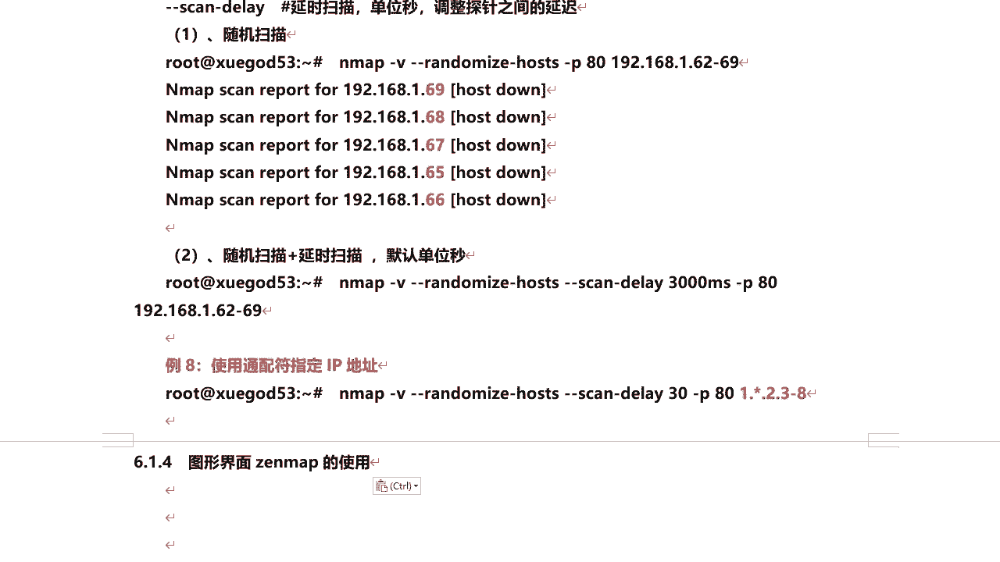

如果不喜欢命令行下的，那么同学们可以来使用这种，那么在map在windows下面也可以去安装安装，安装完之后呢也是图形化的，windows也可以进行操作，那么它属于信息收集部分啊。

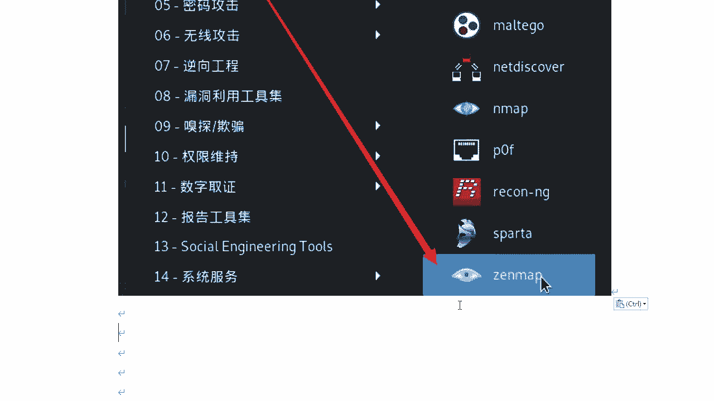

真map，那么我们来启动一下它开立啊，在开立里面我们应用程序信息收集，然后来the map啊，这里头啊来摩用是吗啊，这里没有没有关系啊，这是这是n map啊，这不是好的，那这样我们来看啊，它跑哪里去了。

唉我们搜下啊，the map是吧，在这啊，as root，好稍等啊，那么打开它是一个这么个界面，我们把它放大一下的啊，嗯这个界面呢首先啊我们看在这里呢输入目标，那么你要扫描谁，比如说我要扫描去gc好吧。

然后呢右侧这块呢它提供了一些嗯，系统自带的一些配置啊，对那每项配置都是没意思，那么也就是一会呢给大家详细讲一下的，每一种不同配置，它扫描的一些参数都是不一样的，当你想选择这个不同配置项啊，更改的时候。

左侧这块命令它会自动生成一个命令，来自动生成命令，你看每个配置它相关的命令都是不一样的，不一样的啊，那么其实我们正常使用命令行的话是吧，直接是手写这些明星，那在这里呢它会自动生成啊。

然后呢选择配件证件这个配置项之后啊，自带的配置项，然后我们直接点击扫描诶，稍等啊，那这个在这里啊，n map输出，它会把整个扫描的一个结果和过程呢，直接输出出来了啊，那么探测出它开发了哪些端口啊。

目标主机是否是存活的啊，那么这里他要去扫啊是吧，1000个端口默认的啊，ok那么扫描结束之后呢，那么通过这里可以看到整个扫描结果啊，呃这里开放哪个端口，每个端口对应什么服务器。

这个服务对应的版本啊啊下面呢还有这些啊，对它检测出来了呃，目标主机使用的方法啊，method啊，支持gade head和post啊，那么这种方式，那么还有其他的，比如put呀，delete对吧。

那其他一些方法可能如果有其他的方法的话，比如说put或delete，那么可能会对包机啊来进行一些啊，有漏洞啊，那几个方法有漏洞可以对墨基金来渗透啊，攻击ng相关的版本是吧，然后呢他的title啊。

ok这些端口的状态等等相关信息啊，好那么还有端口主机嗯，点击这里呢，可以看到它所有开放或被过滤的端口，扫描出来端口啊，对应的协议状态服务以及对应的版本。

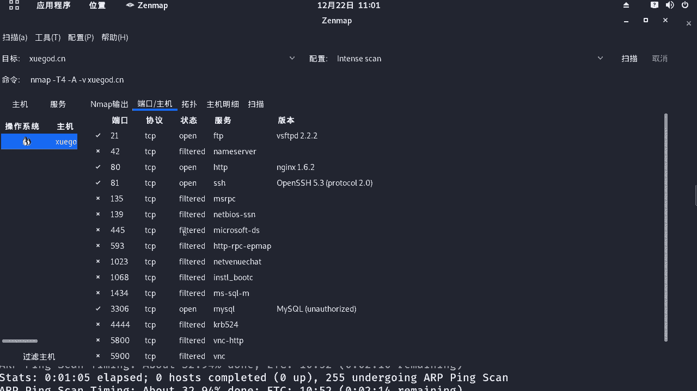

还有拓扑图对吧，那么这个拓扑图呢是什么意思。

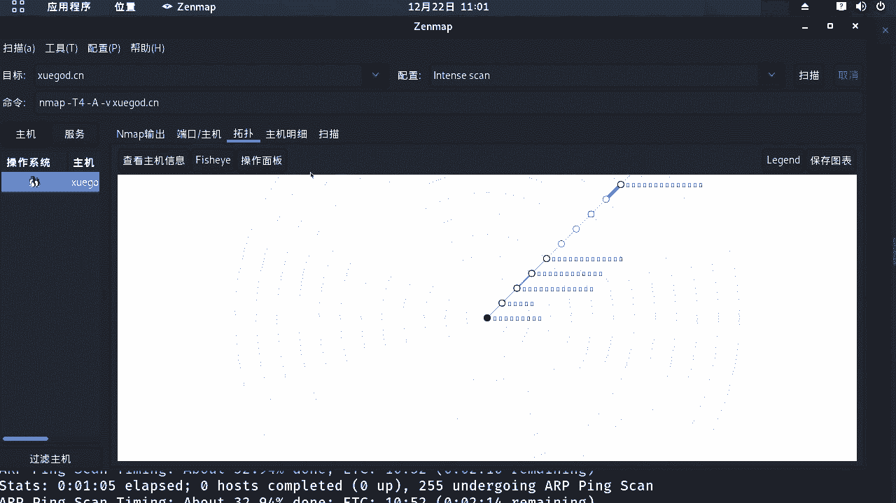

当你去扫描啊，注意啊注意我们看这里，他这里扫出来它有个trace root是吧，路由跟踪啊是吧，哎默认他自己带个路由跟踪，对，他在等你去扫这个学生的时候对吧，从你当前本机到达学生站点。

中间经过了多少个网络设备对吧，通过这个拓扑图是吧，也可能列出来，也可以列出来，还有一些主机名系是吧，那主机当前的状态是开放的，端口多少个固定端口，多少个未开放端口多少个，一扫描多少个什么。

之前上线的ip地址，还有它的操作系统linux 2。6，经营晰度95%已经可以了是吧嗯，还有一些扫描这些呢它的记忆，你扫描每次扫描它都会生成这个命令，这个当然这个没有不保存啊。

当然你可以把它保存起来也可以啊，那左侧的服务呢对它会列出啊，每个端口对应的什么服务啊，然后主机对吧，那你扫描的是谁啊，学霸的cn啊，那你每次扫描呢，它这里在这里都会生成一条记录。

当然你可以把它保存起来啊，也没有问题啊，那么这是关于啊真map啊，这map那么这里呢注意啊这个配置啊，呃系统默认提供了这些配置，那当然您可以点击这里，比如说我选择它，我现在选的是这一项啊。

那么我点击配置编辑，选中的配置编辑，谁编辑这个配置是吧，就是他那么你可以来设置它的参数，看这里都可以进行设置啊，扫描是吧，你这个我点中了，选中了它会自动看到了吗，这里头对它会自动减个参数。

然后呢你可以对现有的配置啊进行修改，那么你也可以自己创建，除了这些之外，你感觉这些都不适合你，怎么办，点击配置新的配置或者命令好吧，那么这里呢先起个名称，给你的配置起个名称啊，比如说a啊，然后呢扫描。

那么我基于什么扫描啊，系统版本，你这对吧，这些我都选上是吧，哎然后呢你打出知道大勾是吧，它会自动生成命令，不需要你去写，然后呢拼呢是吧，那扫描之前不拼主机啊等等。

我们可以去选a c k s y呢脚本扫描是吧，你使用哪些脚本进行扫描啊，诶是吧，很强大，每个脚本都什么意思，你点击的时候，右侧会给相关的一些对吧，提示啊，说明嗯，那你可以往里添加啊，还有目标对吧。

那么你可以在扫描过程中，比如进行批量扫描的时候，可以排除某些主机我不扫它吧，例外等等，还有语言，其他定时，这些都可以进行设置，那么比如说我们这个是吧，我新建一个我就这么少了好吧，然后点击保存更改。

保存更改之后呢，那我们在这里头会不会又生成一个是吧，哎就a这是我们的配置自定义的，那我点击扫描呢，会按照我自己设定的这个配置文件啊，配置选项也就是这个好吧，哎去扫描目标，其实我们在整个渗透测试过程中。

不可避免，可能会自己去定一些扫描方式和扫描规则，那么通过这种自map呢可以图形化的是吧，哎去设置，不用去记忆那些命令i还得查是吧，也很方便，那其实你在这里生成这个命令之后，你把它复制到这个开利终端啊。

开启终端，然后你去执行。

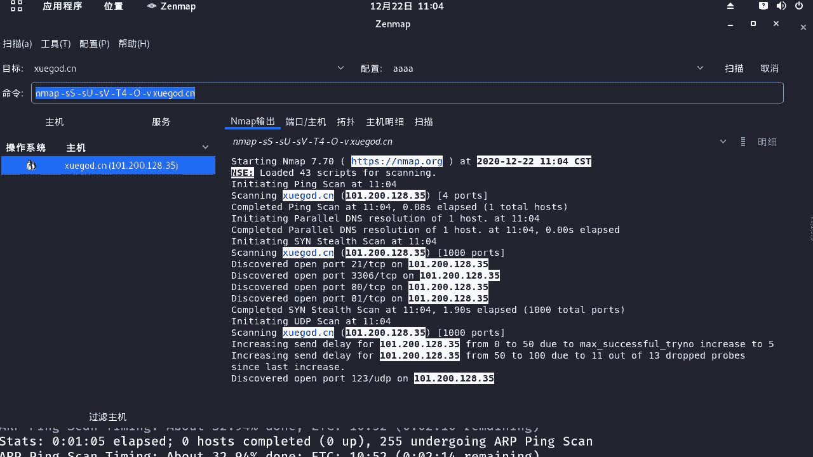

其实得出的结果呢都是一样的好吧，然后呢下面呢我们针对的一些嗯选项呢。

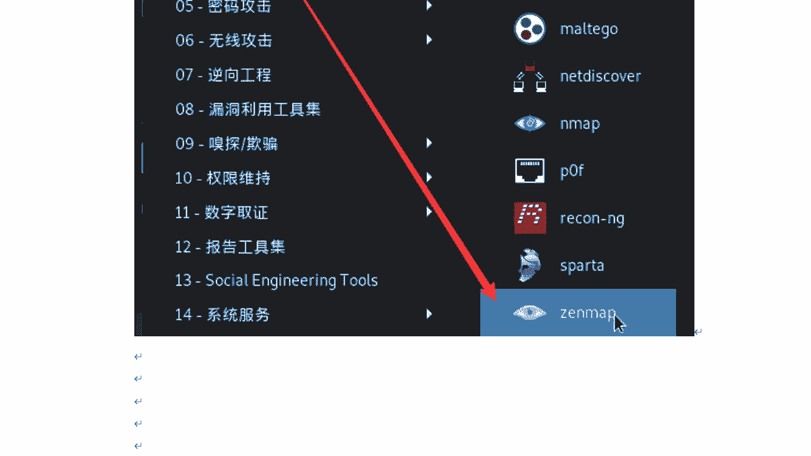

给大家来讲一下的啊，那么它默认自带的一些配置啊，都代表的是什么意思好吧，那默认这里呢我们来看嗯，嗯杠t大t4 杠大a杠小v，那么杠大a呢表示是完全扫描，完全扫描。

意味着它会对操作系统和软件版本号进行检测，并对目标进行吹输入端路由探测啊，那么杠大o呢，这个参数呢它是仅识别目标操作系统，你指甲它的话并不弱，软件版本它能检测和路由弹射。

但是杠大a它呢不仅会进行操作系统的探测，还会进行软件版本号检测啊，也进行路由跟踪，杠大t4 大t指定是什么程序啊，使用的时序，那么它呢一共有六个级别，0~5啊，那么也就是级别越高，数字越大。

它的扫描速度也就越快，但呢扫描速度越快呢，也容易被防火墙或i d s检测并屏蔽掉啊，那就是在整个网络通信状况良好的情况下，推荐使用第四啊，居中的就可以了啊，不要太慢太快也不要太慢啊。

杠小v呢就表示显示冗余的信息，就是在整个扫描过程中，它会把整个扫描的细节啊显示出来啊，让用户呢了解当前的一个扫描状态。

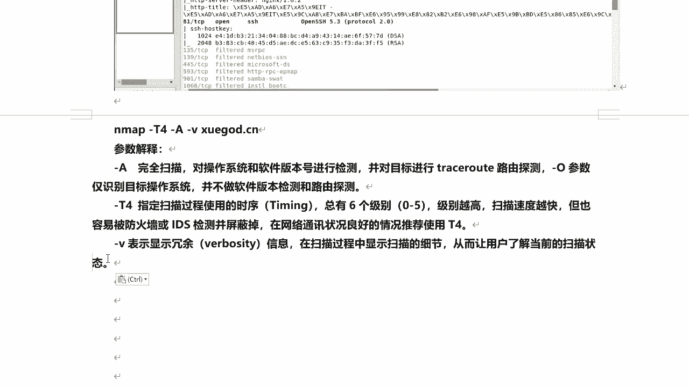

好的嗯，关于这个nmb它自带的啊。

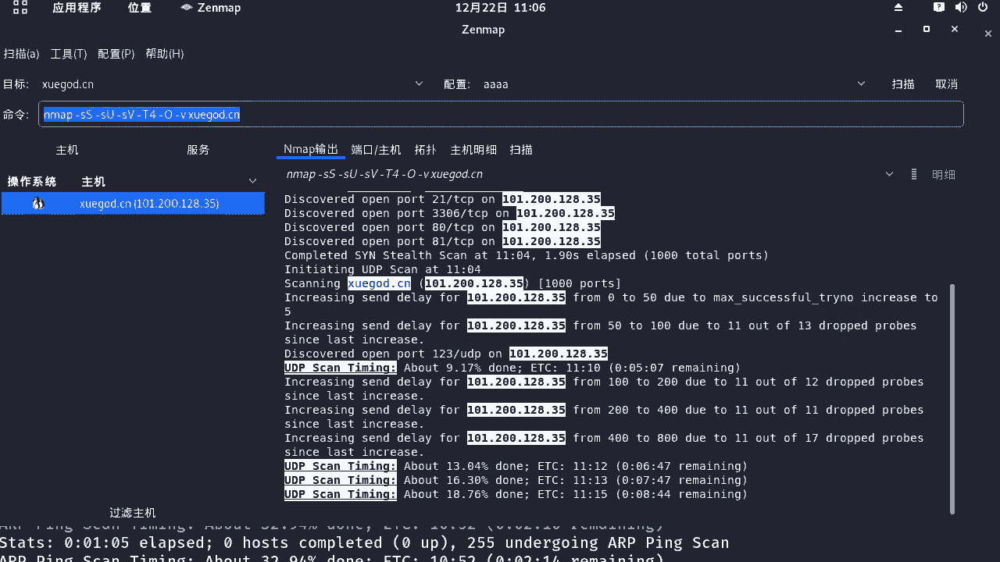

就是这些啊自带的配置文件配置啊，那么都是什么意思呢，下面给大家一个一个去介绍一下吧，好吧，那这个我们需要了解一下了，第一种嗯，第一种呢叫他这个，一般来说它这种第一种方式啊，它可以满足一般的扫描是吧。

杠大t4 加快计执行速度，杠a检测操作系统及版本探测啊，那么小v呢显示详细的一个输出信息啊，一般都可以满足啊，第二种方式啊，不一样了啊，第二种方式，那么就是这个第二种这里的啊，就是他这第二种啊。

杠小s i s t e t t p s弯曲半开扫描，杠小s u u d p扫描，就同时听这个探测啊，杠d4 指定扫描时序对吧，速度杠大a啊进行了全面扫描，然后杠小v显示详细的一些细节啊。

那么第三三种方式啊，第三种方式，那么它这里呢进行一个全登录扫描是吧，对然后这个应该是65535对吧，不能到6536，杠大t4 啊，杠a杠v这和上面都一样了，就扫描啊，所有tcb端口范围在1~65535。

视图扫描所有端口的开放情况，这样这种呢对全端口扫描，而且还有全面扫描，这种速度就比较慢了，是不是哎这里注意要杠小p音，它可以指定端口的范围啊，那么这里呢额外给大家说一下，就是你可以用杠p杠这种方式。

后面不加这个范围也是全能够扫描啊，杠p杠怎么加，杠p杠也是全全能够扫描啊，这个大家了解一下，这个还是比较简单的是吧，嗯下面呢我们看第四种方式，第四种呢是杠大pn，那非拼音扫描对非平就是不平啊。

当然针对他呢，还有第五种拼少哇，那平常呢杠小s这个拼少，优点呢就是它呃速度比较快啊，不检测端口，但是呢容易被防火墙屏蔽，导致了无扫描结果啊，杠小s n啥是拼扫，那么第六个啊，quick scar啊。

quick是快的意思吧，快速的扫描杠大f啊，注意啊，那么这种快速扫描，它一般的话只检测常规的100个端口，对100个端口啊，不是1000个了，这是快速扫描吗，非常快啊，好我们再来看第七种嗯。

快速扫描的加强模式啊，比快速还要快是吧，杠小s是服务探测探测端口机版本对吧，对应的服务的版本，杠大o呢开始探测目标系统的操作系统类型，刚刚version late设定侦测的等级为二啊。

二那么他的这种方式呢更快一些啊，那么第八种啊，那么就是啥trace root啊，quick trish root，杠小s n p少对吧，不检测端口，然后呢，这个值这种方式其实就是实现一个路由跟踪，好吧。

对关闭端口扫描显示本机到达目标，对目标机中间所经过的所有的网络节点，和网络硬件设备啊，那么第九种呢就是常规扫描，常规扫描呢就是我们的n map。

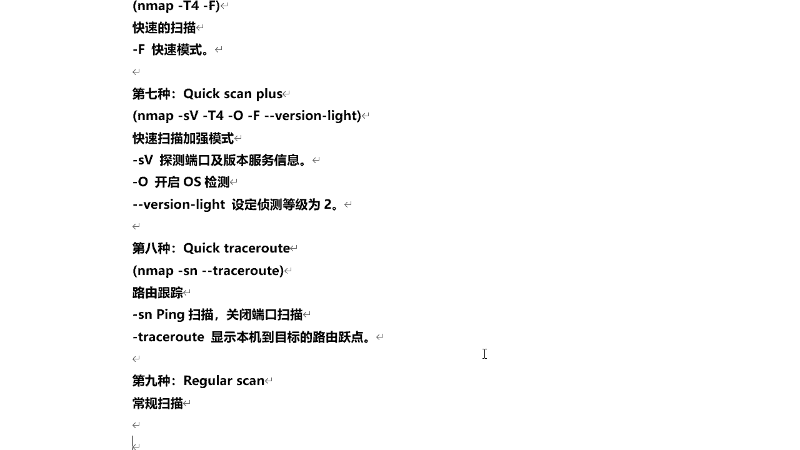

后面直接上跟上的目标，第九种常规扫描是吧。

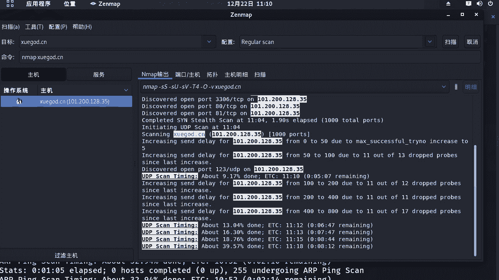

这属于常规的，然后第十种呢就比较厉害了，那么它属于慢速的全面扫描啊，把所有的相关参数都加上了，而且所有的脚本扫描都加上了是吧，这种呢比较慢，也比较全面好吧，那么这是关于z map啊。

它的使用方式和一些他自带的一些石种啊好吧，配置脚本的说明啊，大家呢要学会的自己去自定义它的配置啊。

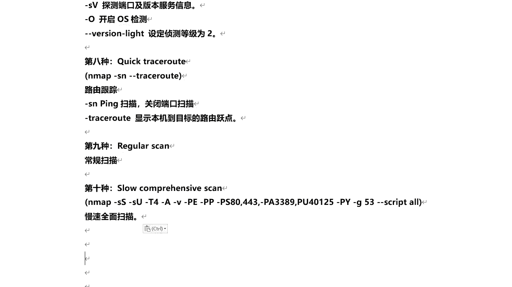

自定义配置在这里对吧，可以新建配置文件好吧。

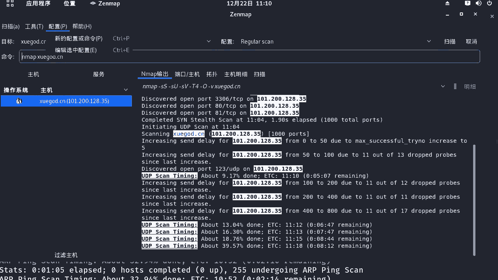