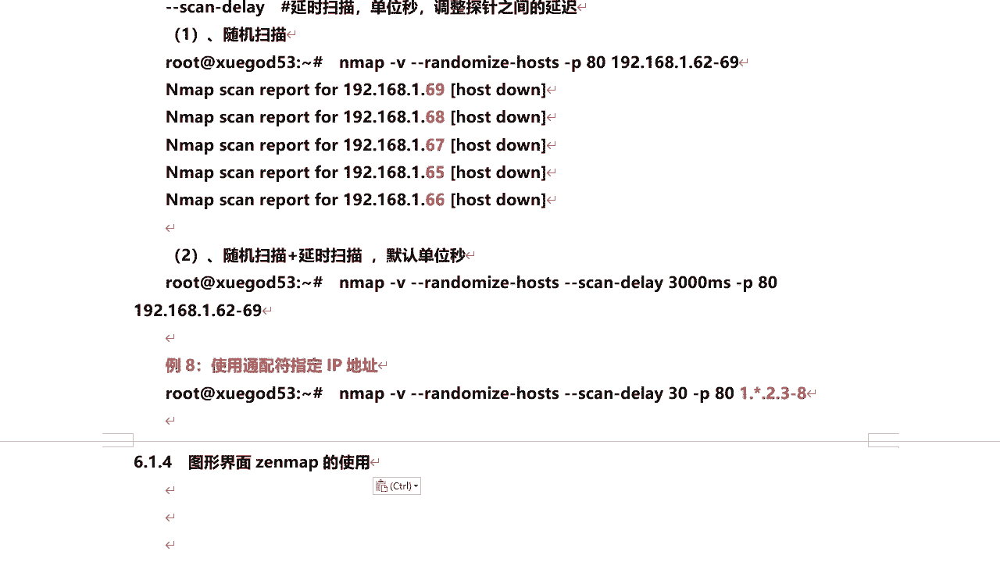
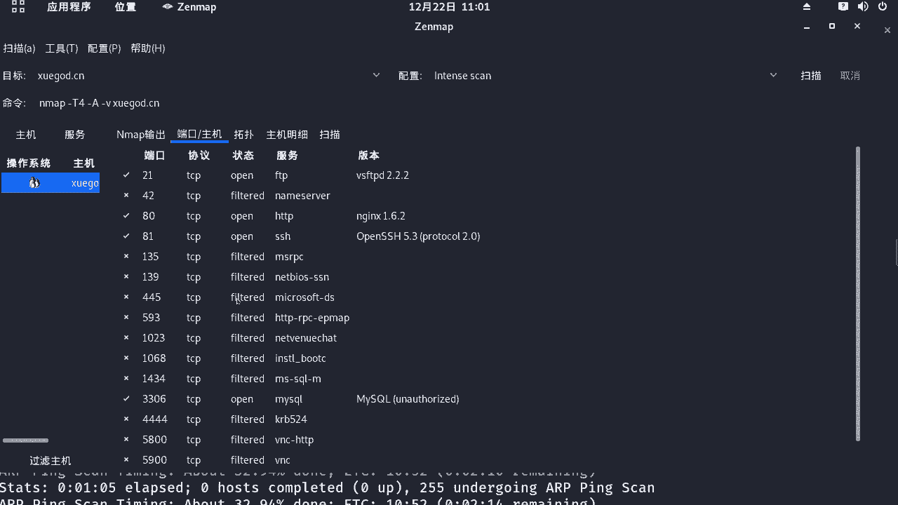
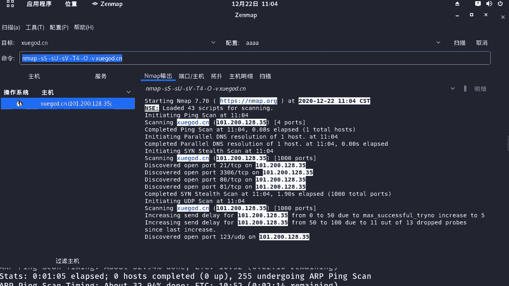
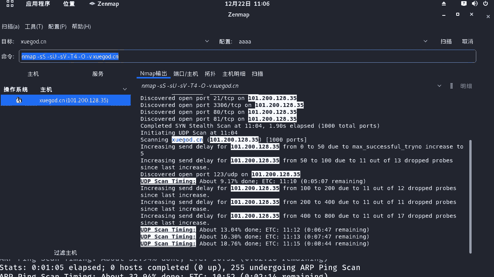
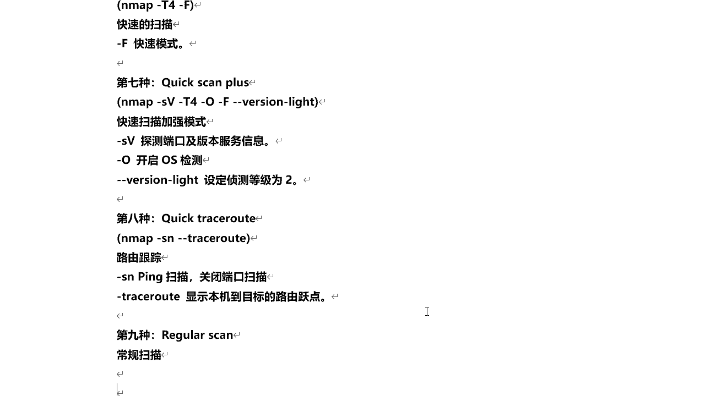

# 课程 P56：10.3 - 【漏洞扫描工具系列】图形界面 Zenmap 的使用 🔍



在本节课中，我们将要学习图形化漏洞扫描工具 Zenmap 的使用。Zenmap 是 Nmap 的图形界面版本，它通过直观的点击和选择来配置扫描参数，避免了记忆复杂命令的麻烦，尤其适合初学者和偏好图形化操作的用户。我们将介绍其界面、基本操作、以及如何利用其内置和自定义配置进行高效扫描。

---


## 启动与界面介绍 🖥️

上一节我们介绍了命令行下的 Nmap，本节中我们来看看其图形界面 Zenmap 如何启动和操作。

在 Kali Linux 中，可以通过“应用程序” -> “信息收集” -> “Zenmap”来启动它。启动后，你会看到如下主界面。


界面主要分为几个区域：
*   **目标输入框**：在此处输入要扫描的目标，例如 `www.xueba.cn`。
*   **配置文件选择区**：右侧提供了多种预设的扫描配置。
*   **命令显示区**：当你选择不同的配置文件时，此处会自动生成对应的 Nmap 命令行。
*   **扫描控制区**：点击“扫描”按钮即可开始扫描。

选择任意一个预设配置（如“Intense scan”），在目标框输入地址，然后点击“扫描”。扫描过程和结果会实时显示在下方窗口。


扫描结束后，你可以通过多个标签页查看详细信息：
*   **Nmap 输出**：显示完整的扫描命令和文本结果。
*   **端口/主机**：以列表形式展示所有扫描到的端口及其状态、服务、版本。
*   **拓扑**：图形化显示从本机到目标主机的路由追踪路径。
*   **主机详情**：显示主机的操作系统猜测、开放端口数量等综合信息。
*   **扫描**：记录本次扫描的历史。




---

## 创建与编辑自定义配置 ⚙️

了解了基本扫描流程后，我们来看看如何创建符合自己需求的扫描配置。

Zenmap 的强大之处在于允许用户自定义扫描策略。你可以修改现有配置，也可以完全新建一个。

以下是操作步骤：
1.  点击顶部菜单栏的“配置” -> “新建配置或命令”。
2.  在弹出的窗口中，为你的配置起一个名字，例如 `My_Scan`。
3.  在多个选项卡中勾选你需要的扫描选项（如“扫描”选项卡中的“-sS”、“-sU”，“脚本”选项卡中的特定脚本）。
4.  每勾选一个选项，下方的“命令”输入框会自动更新对应的命令行参数。
5.  配置完成后，点击“保存更改”。



保存后，你自定义的配置就会出现在右侧的配置文件下拉列表中。选择它并点击扫描，Zenmap 就会按照你设定的规则执行。

此外，你也可以直接编辑现有的配置。选中一个配置后，点击“配置” -> “编辑选中的配置”，即可进行调整。


**核心概念提示**：在自定义配置时，你实际上是在组合 Nmap 的命令行参数。Zenmap 生成的命令可以直接复制到终端中执行，效果完全相同。例如，一个快速扫描加服务版本探测的命令可能如下：
```bash
nmap -sV -T4 www.target.com
```


---


## 内置配置文件详解 📋

Zenmap 预设了多种扫描配置，理解它们各自代表的意义，能帮助你快速选择合适的扫描方式。

以下是 Zenmap 主要内置配置文件的说明：

**1. 激烈扫描 (Intense scan)**
这是最常用的扫描之一，能提供较为全面的信息。
*   **对应命令**：`nmap -T4 -A -v`
*   **参数解释**：
    *   `-T4`：设定扫描速度为第4级（共0-5级），速度与隐蔽性平衡。
    *   `-A`：启用操作系统检测、版本检测、脚本扫描和路由追踪。
    *   `-v`：显示详细输出。


**2. 激烈扫描加 UDP (Intense scan plus UDP)**
在激烈扫描的基础上，增加了 UDP 端口扫描。
*   **对应命令**：`nmap -sS -sU -T4 -A -v`
*   **参数解释**：
    *   `-sS`：TCP SYN 扫描（半开扫描）。
    *   `-sU`：UDP 端口扫描。



**3. 激烈扫描所有 TCP 端口 (Intense scan, all TCP ports)**
扫描所有 65535 个 TCP 端口，非常全面但耗时较长。
*   **对应命令**：`nmap -p 1-65535 -T4 -A -v`
*   **参数解释**：
    *   `-p 1-65535`：指定扫描端口范围为 1 到 65535。

**4.  Ping 扫描 (Ping scan)**
仅用于探测主机是否在线，不扫描端口。
*   **对应命令**：`nmap -sn`
*   **参数解释**：
    *   `-sn`：仅进行 Ping 扫描（主机发现）。

**5. 快速扫描 (Quick scan)**
只扫描最常见的 100 个端口，速度极快。
*   **对应命令**：`nmap -T4 -F`
*   **参数解释**：
    *   `-F`：快速模式，扫描端口数减少。

**6. 快速扫描加强版 (Quick scan plus)**
在快速扫描基础上，增加服务版本探测。
*   **对应命令**：`nmap -sV -T4 -O -F --version-light`
*   **参数解释**：
    *   `-sV`：探测服务版本。
    *   `-O`：启用操作系统检测。
    *   `--version-light`：设定为轻量级版本检测。

**7. 路由跟踪 (Quick traceroute)**
主要用来进行路由追踪，显示数据包经过的网络节点。
*   **对应命令**：`nmap -sn --traceroute`
*   **参数解释**：
    *   `--traceroute`：显示到目标主机的路由跳数。

**8. 常规扫描 (Regular scan)**
相当于不带任何参数的默认 Nmap 扫描。
*   **对应命令**：`nmap`
*   **参数解释**：默认扫描前 1000 个 TCP 端口。

**9. 慢速全面扫描 (Slow comprehensive scan)**
启用最全面的检测选项，包括所有脚本，速度最慢但信息最全。
*   **对应命令**：`nmap -sS -sU -T4 -A -v -PE -PP -PS80,443 -PA3389 -PU40125 -PY -g 53 --script “default or (discovery and safe)”`
*   **参数解释**：组合了多种主机发现技术和安全脚本，进行深度探测。





---

## 总结 📝


本节课中我们一起学习了图形化漏洞扫描工具 Zenmap 的核心使用方法。


我们首先启动了 Zenmap 并熟悉了其操作界面，了解了如何通过选择目标、配置文件并点击扫描来执行一次基本的探测。接着，我们深入探讨了如何根据个人需求创建和编辑自定义扫描配置，这让我们能灵活地组合各种 Nmap 参数而无需记忆命令。最后，我们详细解读了 Zenmap 内置的多种预设配置文件，从快速的 Ping 扫描到全面的“慢速全面扫描”，理解了每种配置背后的命令参数和适用场景。


记住，Zenmap 是 Nmap 命令的图形化封装，其核心依然是 Nmap 的强大功能。掌握 Zenmap 能让你更高效地进行信息收集，为后续的渗透测试步骤打下坚实基础。


