# P57：10.4-【漏洞扫描工具系列】实战：DNMAP分布式集群执行大量扫描任务 - 一个小小小白帽 - BV1Sy4y1D7qv

好下面呢我们来讲一下的dn map，分布式集群执行大量的一个扫描任务啊，那么比如说有用场景，就是我们要同时对几百台啊，甚至更多的目标主机使用nmap进行扫描的时候。

那么如果假如说我们直接使用nmap是吧，一台机继续扫，那么可能会很慢，那么这里呢我们就可以使用dn map啊，分布式对吧，使用多台机器对吧，同时对这些目标呢进行扫描啊。

那么这样的话它速度相当于比较快一些啊，那么什么是dn map呢，那么这里我们来了解一下的啊，啊dn map是一个用python写的，进行分布式扫描的nmap扫描框架啊。

我们可以使用dmp来通过多个机器啊，多台机发起一个大规模的扫描，它主要是采用c s结构啊，执行大量的扫描任务时候非常便捷，而且扫描结果呢可以统一管理，那么这里所谓统一管理呢，就是说我们来看一个结构图啊。

那比如说我们来模拟一个场景，这里呢我们使用四台机器好吧，那其中呢这里有一个服务端，对啊，四代卡里啊，对那个在进行分布式大规模扫描，这是d n m b的server端，比如在北京好吧。

那么另外三台客户端呢分别在上海啊，南京啊，美国啊，那么他们之间只要能够往互相通就可以了，能联通就可以了，然后这里呢我们有一个n map命令文件，这个命令文件里呢，那么他写好了啊。

各种啊nmap扫描的命令啊，同时对于多台主机，比如几百台主机，几百条命令，然后呢由收入端对吧，嗯去分发给各个客户端去执行扫描啊，那么扫描成功之后呢，这个客户端会将这个扫描结果啊，统一发送给服务端。

那么这就是所有的扫描结果，都会在服务端进行存储，那首先呢这个服务端需要开启，然后各个每个客户端连接到服务端，连接成功之后，然后呢它会自动的对服务端，自动地将这些命令，通过一定机制分发给每个客户端。

然后执行扫描任务啊，这是大概这个原理啊，原理那首先呢呃用户呢在服务端啊，需要设定好n map的执行的命令，然后呢，d n m m呢会自动的分配给客户端进行扫描，并将扫描结果提交给服务端啊。

就是dnmb的收入端，d n map呢它有两个可执行文件啊，这里大家要注意，那么分别是dnmap clint客户端和dnmap server，服务端，在进行一个分布式的nmap扫描之前。

我们可以使用dmp server来生成一个dmp的服务端，然后在其他机器用d n m p clint，有时候客户端啊进行连接对吧，使用这个命令连接到dmp的服务端，然后就能进行分布式的nmap扫描了哦。

那具体他怎么去执行呢，啊那么我们下面呢来给大家讲解一下的，这里呢我们可以直接使用kelly，因为它自带啊dn map好吧，对自带的那首先呢生成一个证书文件啊，在服务端生成一个证书。

因为客户端在连接服务端的时候，需要使用这个证书啊，嗯不是所有的客户端都能随便的去连接到啊，服务端的啊，不是所有的客户端啊都能随便连接到服务端的，因为dn map自带的用于t l s连接的啊。

p n文件证书啊太过久远，那么所以说必须要重新生成一个证书啊，客户端和服务器才能正常的连接好，那么下面我们通过一条命令，来生成一下这个证书，那么这条命令呢相对比较长一些啊。

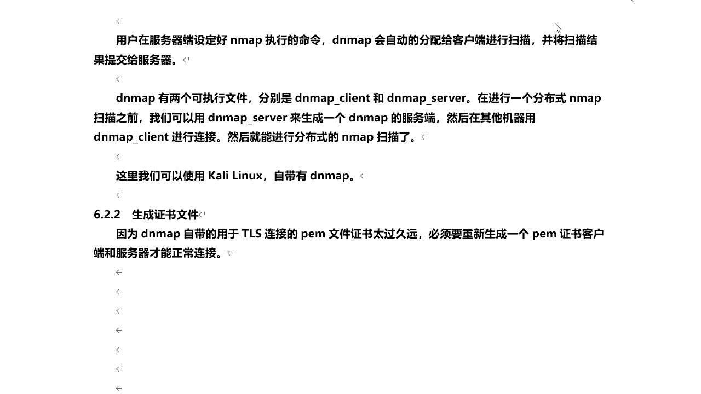

我们来再把这个关闭掉啊。

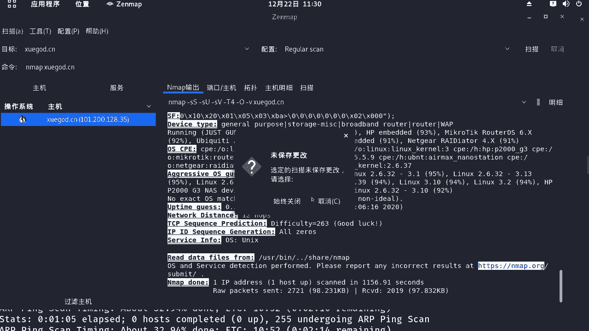

关闭好的，来执行一下这条命令呃，这里需要输入一些相关信息啊，那么输入国家啊，代号cn好吧，这里随便填就可以了，北京，然后所在的城市啊，那么这个是昌平学神所在，就在昌平区啊，然后呢这个组织名称学尬的好吧。

所在行业i t it，然后呢它的名称主子需要点cn your name email地址啊，这随便填就可以了，比如root and 163点com好吧，这一天这样的话呢我们ios看一下的啊。

那么在这里会生成两个证书文件，server。p e m和k。pm啊，一个sk，然后呢我们可以去查看啊，这个这两个证书文件生成之后呢，下面呢我们需要做一个操作好吧，我把这个笔记本给大家整理到这里啊。

嗯将新生成的私钥，也就k。pm追加到45点pm证书后面啊，那么这里呢怎么去追加呢，我们可以通过一条linuming啊，太获取这个文件里的内容啊，410，然后两个大号追加到server。pm里面。

这样呢这个证书呢我们就生成完了好吧，生成完成之后呢，下面呢我们来创建一个n map命令，唉，那么这n map命令文件呢，也就是需要各个客户端去执行的啊，我们创建一个文本文件nmap。tt。

然后呢将这些命令好吧，给它粘贴进去。

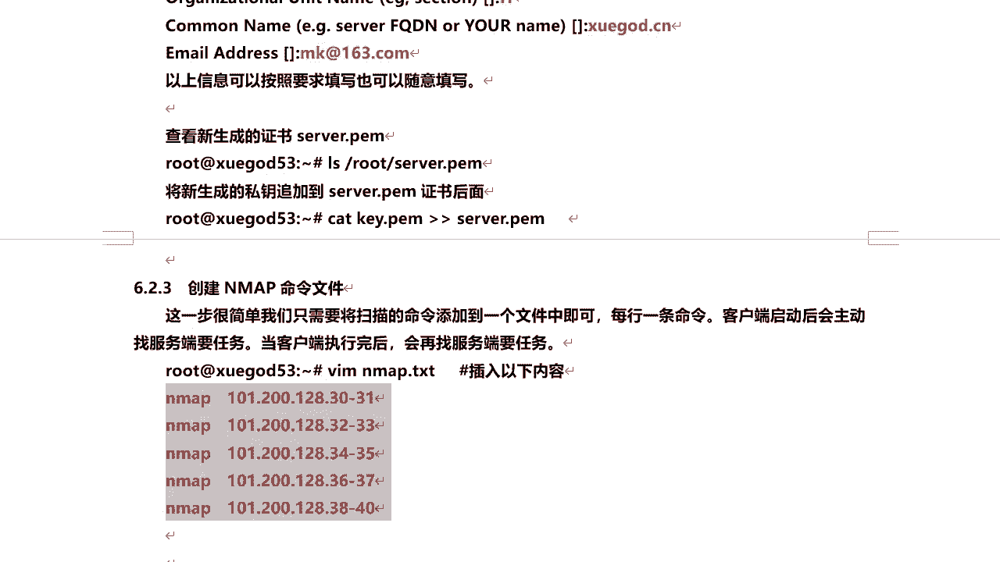

tmd，当然我这是都是常规扫描哈，嗯当然你可以去配置啊各个参数嗯，你比如说要想进行服务发现啊，或者操作系统探测啊，加上一些杠大o啊等等一些参数就可以了啊，嗯注意每个命令啊，这个是扫描这个ip是吧。

30~3132到三三这一个ip地址范围啊，我们将这个命令文件保存一下啊。

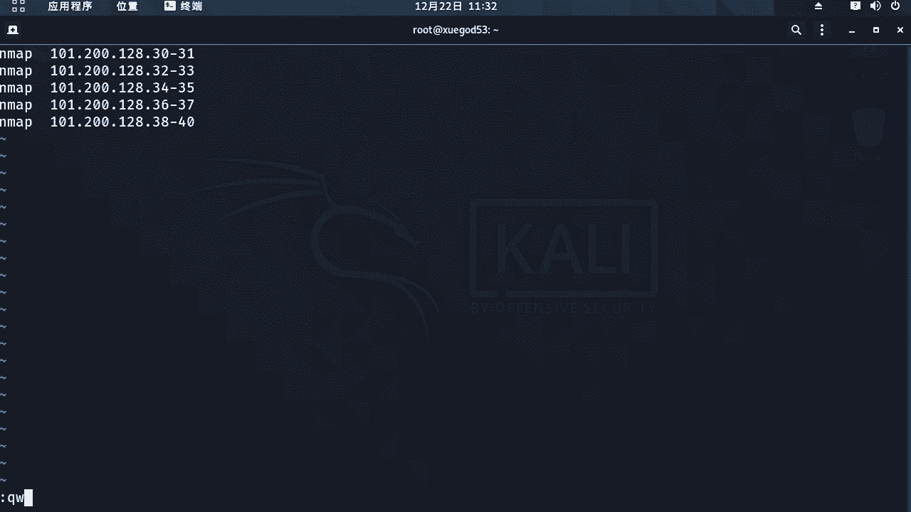

冒号wq命令文件有了，那么接下来呢，我们先要启动dnmap的服务端是吧，对启动它嗯注意那么这里的格式啊，需要使用几个参数嗯，使用d n map下面server启动d n m p的服务端啊，杠f啊。

跟一个特定的要执行的，就待会要执行的nmap命令的文件，然后杠大批呢跟一个用于t l s连接的pm文件，就是一个证书啊，默认呢咱们使用刚刚生成的一个server。pm啊，这个就可以了，然后呢我们来。

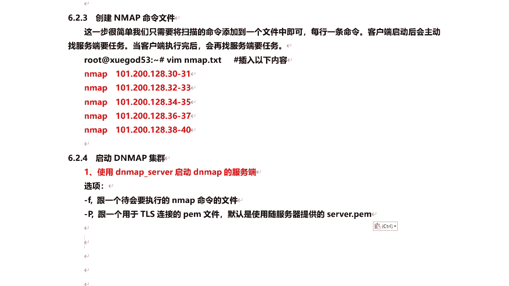

这个dmp在哪个目录下面啊，在这里头对我们的user bdm下面的server杠f，指定命令文件，要执行的命令文件杠大批指定证书回车啊，那么这里呢我就服务端已经开启了。

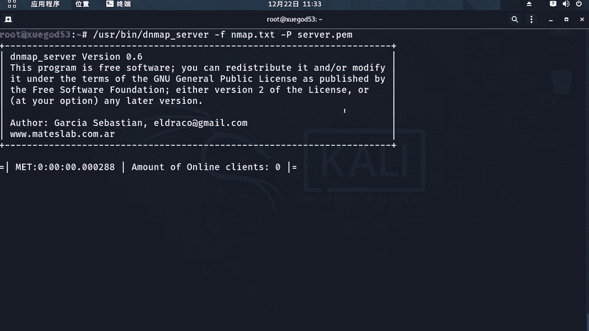

然后呢为了演示啊，我这里的启动两个啊。

看看我在启动两个kelly，给大家看看效果啊，对客户端忘启动了是吧，当然如果你的物理机啊配置比较低啊，那么你不能同时开启这么多虚拟机的话。

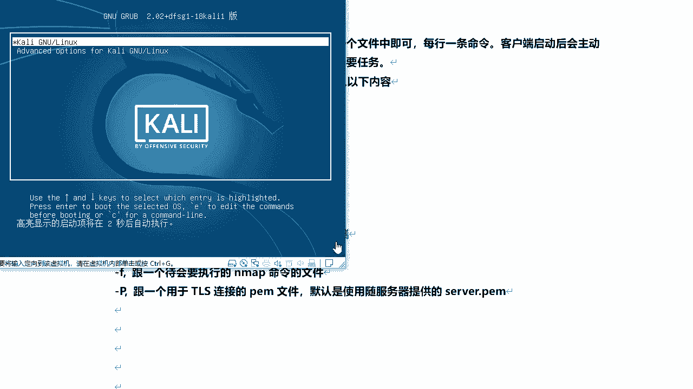

你在一台开立啊对吧，同时运行客户端和服务端也是可以的啊。

可以的，我们稍微等一下这样的这个开利启动一下的，然后呢在这里呢我先打开几个终端啊，对然后呢同时去连接一下的，把它小点啊，它现在显示啊，我们看啊，这里头啊嗯一共是在线的客户端，一共零个。

因为现在没有客户端连接上来是吧，那我再打开两个终端，一会儿等那两台开裂啊，开启之后呢，我使用它在这里去连接一下的，这样的话我们看那个效果更明显一些，更直观一些啊，然后再打开一个终端，往下一点啊。

呃这里我就不再开了啊，开两台大家看看效果就可以了啊，当然可以，它的客户端数量没有限制啊，如果你要执行的任务比较多，那就开多台客户端就可以了啊，对多台都可以啊，这个开利启动了545，稍微等一会儿。

那我们先把这个命令型啊，s h192。168。1。54是吧，然后这个是，192。168。1。5，等这两台aki啊，启动成功之后啊，我们来连一下的。

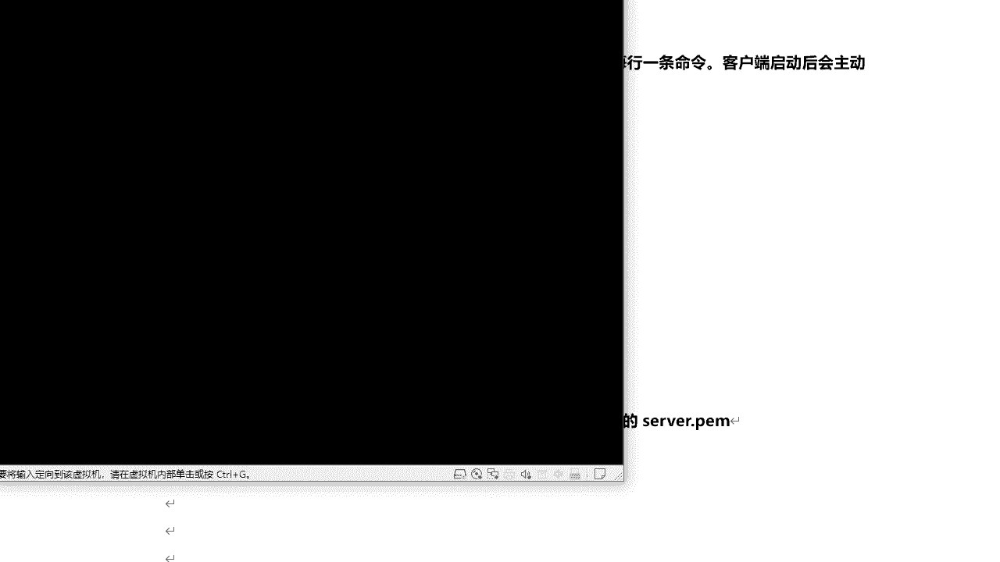

注意啊，那么这个dmp server端它启动成功之后，他呢就处于监听状态啊，那么如果啊，那么这个各客户端，那么去通过ip地址啊，连接到连接谁啊，通过连接我们的dmc服务端的ip是吧，连接成功之后呢，对。

那么这里呢会显示出来有几个后端，连接成功了啊，那这里呢趁着他那个最后还没启动起来啊，好的我们可以看一下它它监听的端口啊，night state对他监听端口是46001啊，杠a n t o p啊。

我们c选项的460好，那么看4601，那么它呢已经处于监听状态了，这是python写的程序啊，ok那么这个是零点，零点是针对他可以接受啊，对来自任意ip的连接。

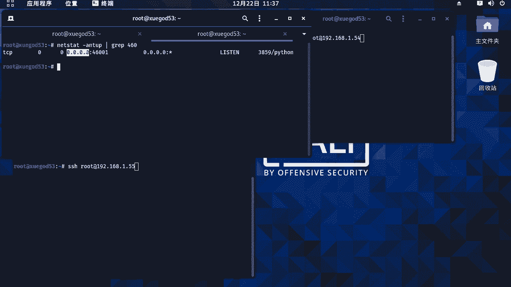

好我们看启动下了吗，ok登录一下的啊，123456，这个呢也启动起来了是吧，好那么我们在这里呢也连接一下啊。

1。54回车，密码123456，好的连接成功了，那么这个我也连下了123456，好t连接功能好呢，下面呢我们使用dnmb的客厅端对吧，来启动dni p的多个客户端好，那么这个怎么去连接呢，对那么注意啊。

嗯使用dnmap clean的这个参数好吧，哎，那么因为服务端的端口是默认呢，是46001啊，用杠小s来指定d n m b服务端的地址，杠p对吧，是dmi服务的端口号，默认的是46001啊。

那么就说这里我不指定它默认是401，如果假设dn map服务端的端口啊，不是46001，不是默认的，那么你需要使用杠p去指定啊去进行，那么这里呢我们再来分别连连接一下的。

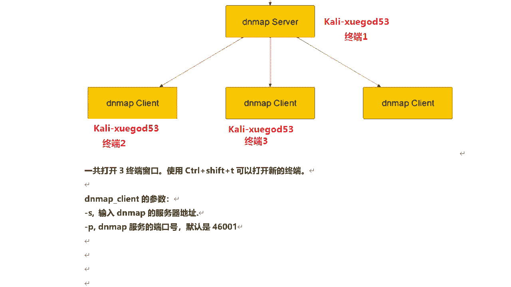

嗯嗯也是在usb啊，dmf clint杠s是dmf服务端的ip地址，这个呢我先不执行啊，对为什么呢，因为我执行一键连接成功之后，对它呢自动就是分配任务给他了，那我要都复制过来，然后快速的连接一下的啊。

然后呢我们看这里，啊稍等，好那么已经连上来了吧，1。541。55啊，连接上来了，然后呢这块开始执行了是吧，对扫描扫描注意啊，嗯多台客户端连接服务端，他执行这个扫描任务肯定不会重复的啊。

因为这个服务端会根据一定的机制，自动分配任务给每个客户端去执行，执行完成之后，他会把结果发送给服务端，那么注意这里已经执行完了，waiting for more command，等待更多的命令。

等待更多的命令，好吧对，那么每台客户端都执行了哪些扫描任务啊，那你看这些都不都列出来了吗，对吧，这个呢也列出来啊，这个执行的两条，这个用了三条哈，因为先启动它很快一些啊，然后呢这块儿我们看啊。

呃报告出来是吧，然后呢这次这个客户端是吧，完成了几个啊，三个这个客户端完成了两个the online online在线的在线，也就是说这个客户端现在正处于连接状态，如果断开了这块就显示离线了啊。

然后当前几个对两个客户端，那比如说这个执行完了是吧，那我把它关掉是吧，来停一下的，好那么这块呢也会显示他的状态，当前在线几个一个有这个对吧，还连接呢好的，那么这个呢整个是dn map的一个扫描过程啊。

我们就把它关闭掉吧，然后回到这里，他既然说明完了，那么整个的结果呢我们它都会在存储在哪里啊，存储在这个服务端服务端，然后呢这个服务端我也停下了啊，l s我们看嗯这里呢会生成一个文件啊，叫d n map。

tt。d n map trees，这个文件我们来打开一下它是什么，来看它是要命令啊，什么意思呢，也就是服务端啊，当它分配给某个客户端一个命令任务，让他执行完这个之后，它会自动把它存储在这个文件里面。

当它分配下一个任务的时候，会去读取这个文件，看看上一次分配是哪个任务对吧，这样的话就避免了他不会去重复啊，分配给不同客户端，相同的任务，也通过它来控制这个文件好，那我们退出，那么扫描结果在哪里呢。

扫描结果在这里，n map results啊，我们切换到这个目录，我们来看一共是我们几个命令文件，有几条命令啊，一共是六条对吧，那么就是分别生成六条命令，每个命令呢单独一个文件去存储，它的一个扫描结果。

我们打开其中的一个来看它的结果，和我们正常使用nmap扫描的结果是一样的对吧，哎这样的话我们可以统一去管理对吧，它的整个扫描结果好的。

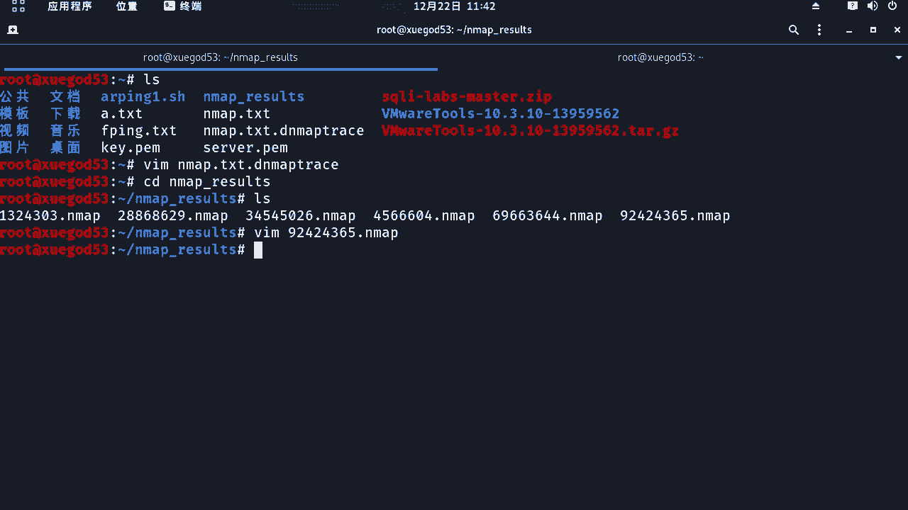

那么这个呢就是dnmap好吧，分布式集群扫描，然后呢我把这个笔记呢给大家整理一下的哦，啊其实这个我们需要了解啊，当如果你在实际工作中啊，做渗透测试的时候，需要啊，比如说大规模的扫描是吧，使用nmap。

那么可以来采用dn map这种方式啊，好吧。

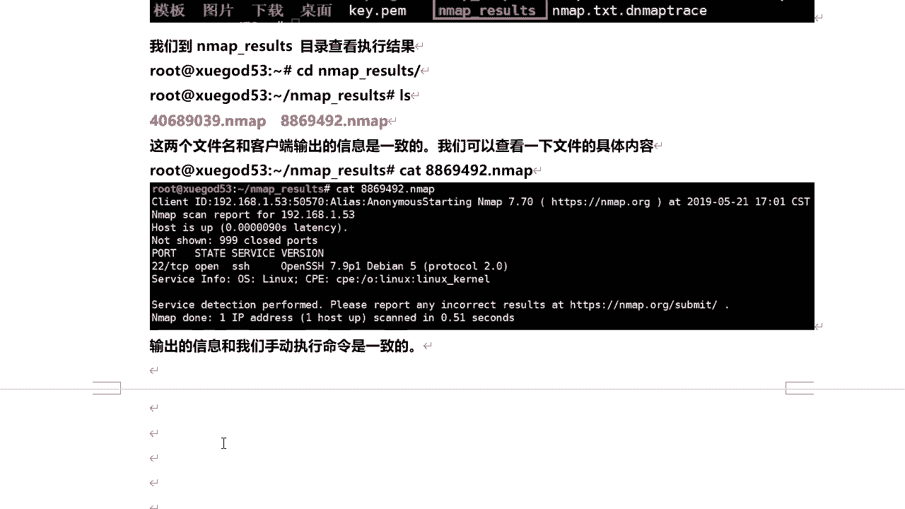