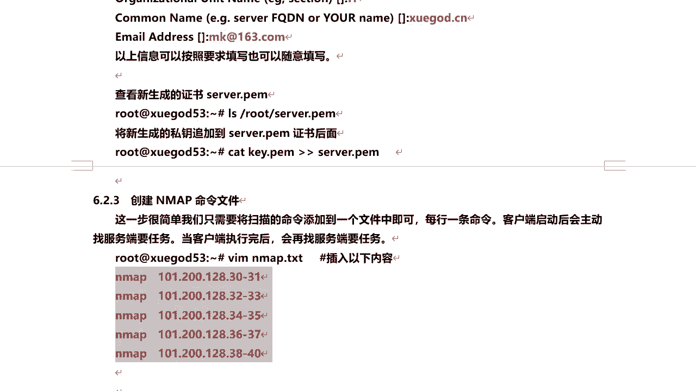
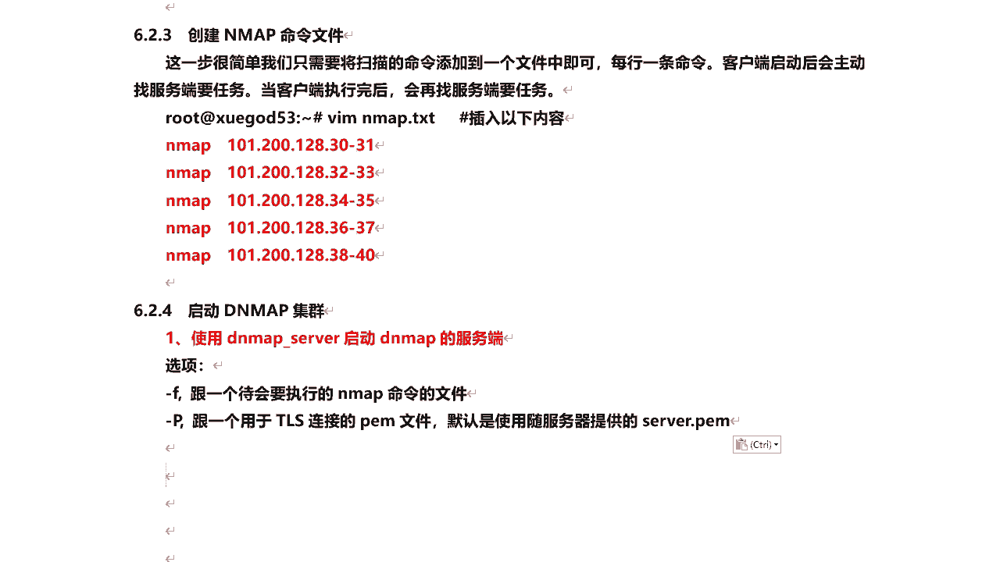
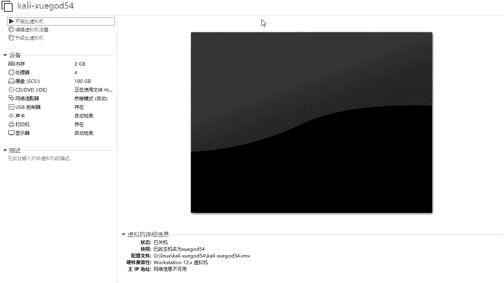
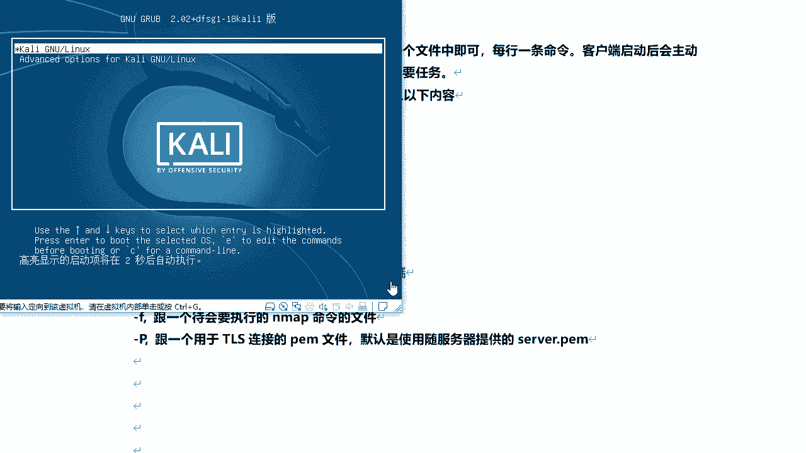
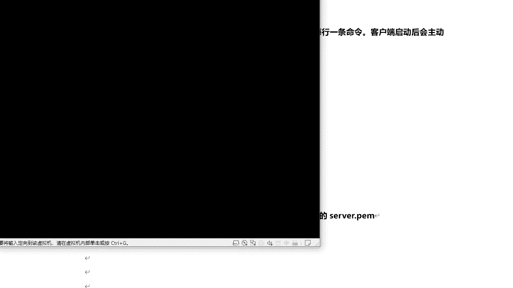
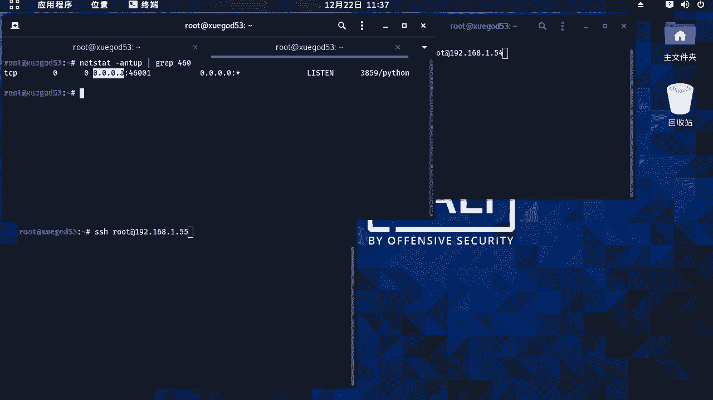
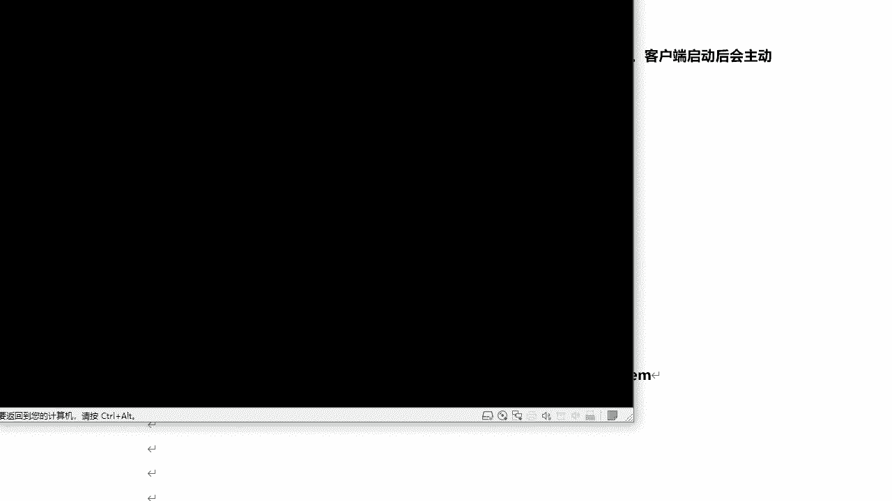
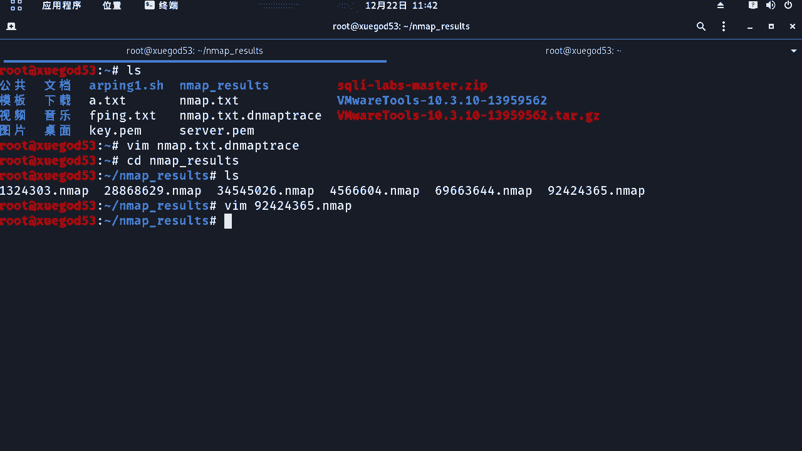

# 课程 P57：10.4 - 【漏洞扫描工具系列】实战：DNMAP分布式集群执行大量扫描任务 🚀

在本节课中，我们将要学习如何使用 DNMAP 工具进行分布式集群扫描，以高效地执行大量 Nmap 扫描任务。我们将从 DNMAP 的基本概念讲起，逐步演示其服务端与客户端的配置、连接以及任务执行的全过程。

## 概述

当我们需要同时对数百台甚至更多目标主机进行 Nmap 扫描时，单台机器顺序执行会非常缓慢。DNMAP 是一个用 Python 编写的分布式 Nmap 扫描框架，它采用客户端-服务器（C/S）架构，能够协调多台机器同时执行扫描任务，并将结果统一管理，从而显著提升扫描效率。

## 什么是 DNMAP？ 🤔

DNMAP 是一个用于进行分布式扫描的 Nmap 扫描框架。它允许我们通过多台机器发起大规模扫描。其核心是 C/S 结构，在执行大量扫描任务时非常便捷，并且扫描结果可以统一管理。

为了理解其工作原理，我们可以模拟一个场景：假设有一台位于北京的服务器（DNMAP Server），以及三台分布在上海、南京和美国的客户端（DNMAP Client）。只要网络互通，服务器就可以将一个包含数百条 Nmap 扫描命令的文件，分发给各个客户端去执行。客户端完成扫描后，会将结果统一发送回服务器进行存储。

## DNMAP 的组成


DNMAP 包含两个可执行文件：
*   `dnmap_client`：客户端程序。
*   `dnmap_server`：服务端程序。

在进行分布式扫描前，我们需要先在一台机器上启动 `dnmap_server` 生成服务端，然后在其他机器上使用 `dnmap_client` 连接到该服务端。

上一节我们介绍了 DNMAP 的基本概念和组成，本节中我们来看看如何具体配置和使用它。



## 实战：配置与使用 DNMAP

以下是在 Kali Linux 中配置和使用 DNMAP 的完整步骤。Kali Linux 系统已自带 DNMAP 工具。


### 1. 生成 TLS 连接证书



首先，需要在服务端生成证书文件，因为客户端连接服务端时需要 TLS 认证。DNMAP 自带的证书文件过于陈旧，必须重新生成。




执行以下命令生成新证书：
```bash
openssl req -new -newkey rsa:4096 -days 365 -nodes -x509 -subj “/C=CN/ST=Beijing/L=Changping/O=XueShen/OU=IT/CN=xueshen.cn/emailAddress=root@163.com” -keyout key.pem -out server.pem
```
执行过程中，需要输入一些信息（如国家、城市、组织等），可按示例填写或随意填写。




生成证书后，需要将私钥文件的内容追加到证书文件后面：
```bash
cat key.pem >> server.pem
```
现在，我们得到了 `server.pem` 和 `key.pem` 两个文件，其中 `server.pem` 是合并后的证书，将用于服务端。

### 2. 创建 Nmap 命令文件

接下来，创建一个文本文件（例如 `nmap.txt`），其中包含需要客户端执行的所有 Nmap 扫描命令。



以下是命令文件内容示例：
```
nmap -sS -p 80 192.168.1.30-33
nmap -sV 192.168.1.100
nmap -O 192.168.1.200
```
每个命令占一行。你可以根据需要添加各种 Nmap 参数，如服务发现（-sV）或操作系统探测（-O）。保存该文件。

### 3. 启动 DNMAP 服务端



在服务端机器上，使用以下命令启动 DNMAP 服务端：
```bash
dnmap_server -f nmap.txt -c server.pem
```
*   `-f nmap.txt`：指定包含 Nmap 命令的文件。
*   `-c server.pem`：指定 TLS 连接使用的证书文件。



服务端启动后，会监听默认的 46001 端口，等待客户端连接。

### 4. 启动 DNMAP 客户端并连接


在每台客户端机器上，使用以下命令连接到 DNMAP 服务端：
```bash
dnmap_client -s 192.168.1.100 -p 46001
```
*   `-s 192.168.1.100`：指定 DNMAP 服务端的 IP 地址。
*   `-p 46001`：指定服务端的端口（如果使用默认端口，可省略 `-p` 参数）。

当客户端成功连接后，服务端会按照一定机制自动将 `nmap.txt` 文件中的命令任务分发给各个客户端执行。

### 5. 查看扫描过程与结果

在服务端控制台，你可以看到在线的客户端数量以及任务分配状态。每个客户端执行完分配的任务后，会将结果发送回服务端。

所有扫描结果会统一存储在服务端的一个目录中（例如 `nmap_results/`），每个命令的扫描结果对应一个独立的文件。你可以像查看普通 Nmap 扫描结果一样查看这些文件。

此外，服务端还会生成一个 `dnmap.txt.dnmap` 状态文件，用于记录任务分配进度，确保不会将同一任务重复分配给不同的客户端。



## 总结


本节课中我们一起学习了 DNMAP 分布式扫描工具。我们了解了其 C/S 架构的工作原理，并逐步实践了从生成证书、创建扫描命令、启动服务端到连接客户端并执行任务的完整流程。通过 DNMAP，我们可以有效地利用多台机器并行执行大规模的 Nmap 扫描，并将结果集中管理，这在实战渗透测试或大规模网络资产探测中非常有用。