# P58：10.5-【漏洞扫描工具系列】NESSUS安装配置 - 一个小小小白帽 - BV1Sy4y1D7qv

好下面呢我们来讲一下的啊，漏洞扫描工具啊，nas的好吧，它的安装以及基于它我们对一些操作系统啊，或者说web站点进行漏洞检测好，那么下面我们先来了解一下啊这个工具啊，那么nas啊。

他是1998年他的创办人呢是啊，四个人展开了一项名为nas的一个计划，那么他计划目的呢，是希望能为互联网社群提供一个免费威力强大，更新频繁并且简易实用的一个远端系统，安全扫描城市啊，就扫描工具嘛。

2002年的时候呢，这个人呢他俩创办了一个名为对这么一个机构，在第三版的nasa释放之时啊，该机构收回了nasa的版权与它的源代码啊，原本呢是开放源代码的啊，并注册了nice。

o r g成为该机构的一个网站，目前呢这个机构位于美国啊马尼亚州，马里兰州的哥伦比亚哇，呃由于这个nas啊，他的占内存比较大啊，所以说呢在做这个实验啊，安装的时候啊，或使用nas的时候啊。

建议版的开裂内存调大一点啊，调到6g到8g，当然了，你要根据你实际物理机的内存来定，如果你物理机啊内存只有八个g，你要调整八个g，那就跑不起来了是吧，那就开了占满整个内存了是吧，那我这里呢是开了四个g。

我这里就不调了好吧，那我直接就默认四个g了好吧，然后呢修改内存怎么去修改啊，那么在编辑虚拟配置里边啊，这里头把内存改一下就可以了，那么也就是需要把这个虚拟关掉。

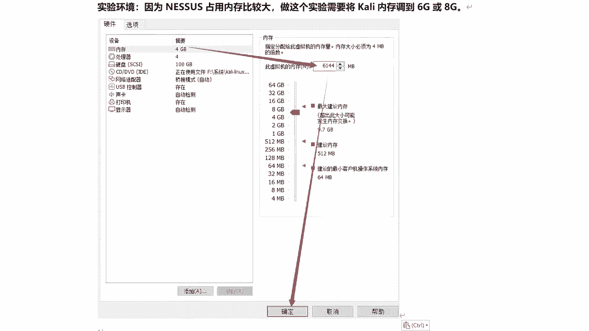

右键设置。

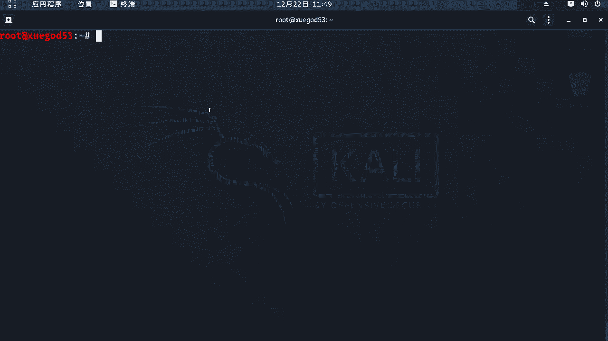

在那个在这里是吧，修改就可以了，当然我开的开机肯定修改不了的啊。

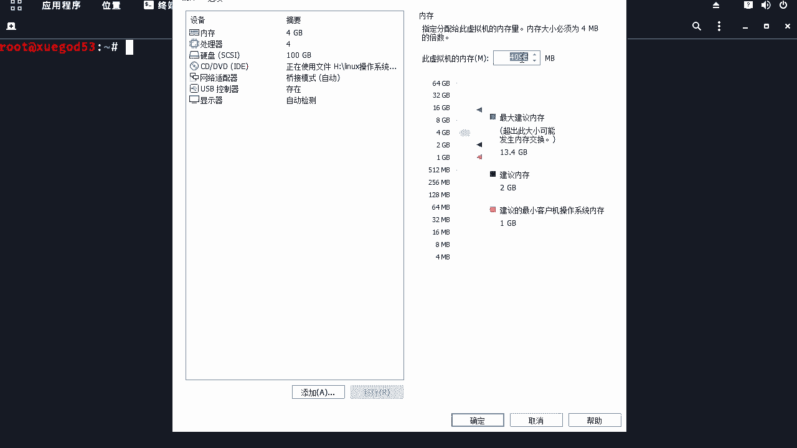

得将虚拟关掉之后，修改完成之后，然后再重新开机就可以了啊。

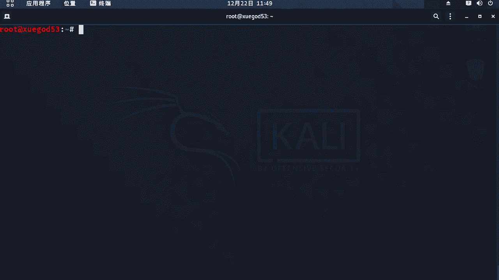

可群集，然后呢下面呢我们来看nas它的下载地址，在这里头嗯这里呢它我们看啊，打开看一眼他的最新版本啊，是多少来着，现在看看最新版本到多少了啊，8。13是吧，那么这里呢提供了各个平台的啊，比如红帽的啊。

rpm申通s的是吧，还有d e b debug系统的ky，那么kelly里面安装个肯定下载什么，这个和这种格式的软件包安装包，因为ky呢是基于debt deband的软件呢，它的软件包啊。

后缀格式就是点d e b的是吧，唉8。13。1啊，那么这里呢除了linux系统下面，它还提供了windows下面的版本啊，对windows下面也可以安装windows server。

20082012啊等等，这些都可以，是好的，还有下面还有提供七点二七点几的版本啊，再往下就没有了啊，历史版本啊，就这些嗯这里呢嗯其实每个版本啊功能越新，它版本越新呢，它可能功能相对于更强大一些。

嗯那么它的一些插件库啊，你可能是也越新一些，那么有些漏洞老版本检测不出来的，那么新版本呢它可能检测出来好吧，嗯这里呢我给大家演示安装它的嗯，比较老的版本啊，6。126。12，为什么要讲这个版本呢。

这个版本在官方可能是已经没有了，好吧没有了嗯，这里有个问题就是说啊因为nas啊从七版本开始，现在到8。13是吧，增加了远程调用的认证，那么msf有mate supply啊，调用nas会报错。

那么也就是在mate里面有关于nas的一个有插件啊，提供了一套方法，通过这些方法可以去通过命令来调用来操作，nice啊，比如说去创建扫描任务啊，执行扫描啊对吧，导出扫描报告啊等等啊。

那么这样的话有什么好处呢，那么也就是可以直接通过命令调用nas，将它扫描结果直接就存储在那mate pride里面，然后呢利用mate pride针对这些扫描出来的漏洞，那么可以进行直接验证啊和利用啊。

那所以说我们选择下载6。12这个版本的，64位第1b包，因为它呢是可以这个版本啊，注意这个版本是可以通过my meat supply，来直接调用的，嗯高于这个版本是不可以的。

因为它增加了远程调用的认证啊，如果大家呢后期要考虑到啊，要想通关metal split来操作nas，那么建议大家去安装这个版本啊，一会有我也会给大家演示这个版本的安装，那么至于其他版本的安装方式。

基本上都是一样的，大同小异，好吧对，那么如果你不考虑啊，以后假如我不打算使用matter supply去调用的nas，那无所谓了，你可以安装最新版本啊，好吧，现在任何一个版本都可以啊，都可以。

然后呢我们来安装和配置一下nas呃，首先呢我们将那个nas安装包上传到开立好吧，使用tcl啊，那么我们来打开我的tcl。

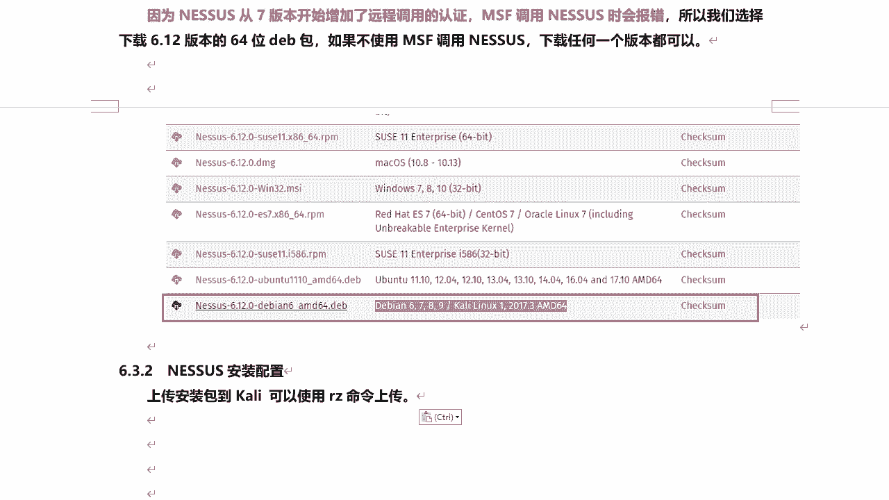

连接到学霸的午餐。

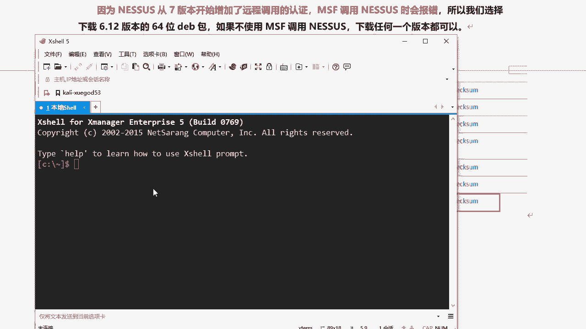

好的嗯，连接上来之后呢，我看我的nas啊，在哪阿里安装包啊，是用rz命令啊，rz，6。12，这个呢在这个课程资料已经给大家了啊，自己你自己下可能会下载不到啊，找不到。

嗯同时呢我将这个有个插件包啊也传上来啊，这个插件包啊是个压缩包，不要解压不要解压啊，什么这个插件包是干什么用的，也就是说在我们进行对外部站点或系统啊，进行各种漏洞扫描的时候，需要用到里边的插件。

如果没有插件，你扫描不了好吧，那么这里提供了各种不同的插件，扫描不同的类型的操作系统啊，不同的漏洞啊，那么提供了一些脚本啊，好吧，来我们来这里传一下它啊，这个一共是200多兆啊。

当然这个插件包呢大家也可以在一会啊，我们在对nas进行激活的时候啊，那么也可以它会生成一个链接，通过那个链接地址呢去下载呢，也可以，那那通过那个链接下载呢，肯定是最新的材料包啊。

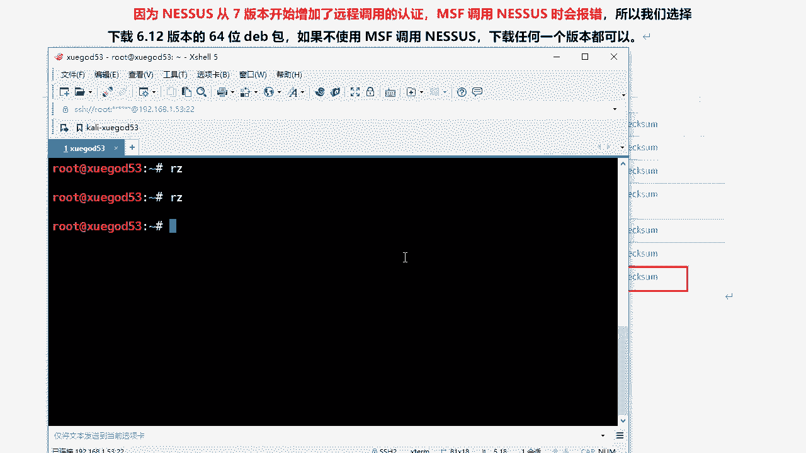

好那么传进去之后呢，我们来来到penny嗯，刚刚传上去的是这个好吧，然后插件包呢是这个我们来安装一下的好吧，点d e b的啊，那么这个怎么安装啊，用什么命令呢，用d p k g d p k g杠i。

然后后面跟上这个软件包的名称就可以了，我稍微等等啊，好的，然后呢看下面啊，告诉你啊，你可以启动nas，通过什么，通过这种方式去启动啊，这个命令ok啊，没问题啊，复制一下的啊，记住这个命令啊。

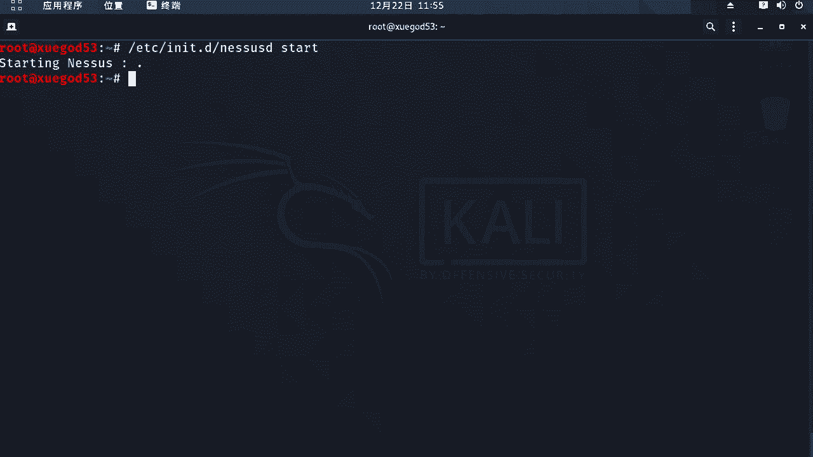

好那么现在已经启动起来了啊，然后呢我把这个相关的一些需要执行命令啊，我们给他整理到笔记里面，然后注意啊，那么这个呢需要通过谷歌浏览器去打开啊，那么其他浏览器浏览器可能打不开这个链接。

而且这是一个htb s啊，注意然后呢跟着开眼里的ip地址，冒号8834，它是运行在8834这个端口好吧，那么我们来谷歌浏览器啊，我们访问一下了，啊那么这个是我的是我代理的事儿啊，好的来嗯。

你的连接不是私密，因为访问hg p s是吧，点击高级不用管它啊，然后呢点击继续前往啊，然后呢到这一步了，注意那么使用谷歌浏览器，因为它是英文的啊，那么咱们可以注意它进行翻译啊对吧。

但是我这里还是比较喜欢用英文看英文的啊，continue continue啊，肯定就是让你去设置账号好吧，让你去设置账号，那么我们可以通过翻译过来啊，让你创建一个账号，就为了使用此扫描仪啊。

必须创建一个管理账户，该用户可以完全控制上面一对吧，能够创建删除用户停止运行啊，注意啊，这个叫你创建，那么这个账户名称可以随意去创建啊对吧，a d m，那我们用户名就用的曼好吧，管理员123456。

密码要简单一点，然后呢简介继续继续呢，到这步呢需要我们去激活啊，那么这个激活码是多少对吧，不知道是吧啊，注意啊，嗯那么它注册呢有家庭版啊，这种各种不同的版本是吧，那默认就是家庭的。

那么我这里选择离线激活啊，对因为在线激活啊，那它会在线去下载这个插件包啊，那必要那非常非常慢的啊，离线记过这种方式相对快一点，因为参加包呢我已经提供给大家了好吧，那么当你点击离线激活的时候呢。

会出现这么一个框啊，那么这个怎么去操作呢，注意啊，那么在整个过程中，那么它呢会存在有些坑，所以说呢大家呢一定要注意认真听了好吧，只要大家认真听了，按照老师的方式去操作，肯定是不会有问题的好吧，那么注意。

那么我们来把机啊给大家整理一下了啊，首先哎我的谷歌在哪里，这里是吧，这个码一会要用到是吧，我们先复制一下它啊，然后呢来点单击这里啊，单单击这里，让他按住ctrl键，让它单独弹出，弹出一个窗口。

那么有在打开这个链接的时候，可能会出现一种问题，就是你打不开，等了半天啊，春秋界面啊，那么这个呢我们先等等啊，看看他什么状态啊，对嗯这里咱们不等了，我看你把它复制出来来复制出来啊，我们放在这里啊。

这htp的是吧，哦你把它加个s，如果打不开的话，把它加个s，然后呢我们再来，啊出现这种错误了，出现这种错误，不要慌不要慌，能把它关闭掉，重新再打开一个窗口，加上s啊，it s再打开对。

那么这样呢就可以打开了，诶很快是吧，然后回到这里呢，我们把这一串啊哎复制一下的，它是用来生成激活码的啊，放在这里头好吧，然后下面这段啊，这下面的是激活码啊，激活码这个呢怎么获取呢。

啊那么我们可以通过一个地址来去获取一下的，申请一下激活码啊，大家注意，它会把激活码直接发送到你的邮箱里头，打开之后呢，名字姓氏随便贴，贴什么都可以，但邮箱不要随便啊，填写你自己的邮箱啊。

大家会把激活码发送给你邮箱，我们来访问一下这个链接啊，好来申请下来激活码好吧，来，随便填啊，对随便要说随便到底有多随便啊，想多随便就多随便是吧，我们这么听下来，然后呢输入我的邮箱，qq邮箱。

然后这块勾选表示同意注册，好，thank you是吧，他提示这个了是吧，感谢你注册nas啊，那我注册成功了是吧，那么登录邮箱来查看一下的，啊说错了是吧，然后呢我们来看啊，哪个是dig是吧。

no reply，不需要回复啊，点击激活码在这里呢看到吗，就是这一串啊，复制一下的，复制到哪里啊，复制到这里，粘贴到这里，点击提交，4号灯，好那么此时呢进入在这个界面下面。

这一串呢就是我们需要用的复制到这里，然后点击继续就可以了，将离线进行初始化啊，那么这个初始化呢稍微等一会儿就好了啊，它就会进入到登录界面就可以登录了，但是呢现在还不能使用啊，很快那么这个账号密码呢。

就输入刚刚我们设置那个管理员账号啊，那就是在比如说嗯你们单位啊，比如单位在使用这个nas的时候，那可能有一个管理员，下面呢，每一个渗透测试人员单独创建一个普通账号啊，自己去管理自己的扫描任务。

每个人只能看到自己的扫描任务，但是管理员呢可以看到所有人的扫描任务，和扫描的结果统一进行管理啊，我们登录进来啊，对那么这里呢就是现在可以去扫描了吗，对还有一个工作需要做，就安装一些扫描插件啊。

那么我们看这里上面有个链接啊，通过这个链接呢可以下载啊，他最新的插件直接点击它可以去下载啊，这里我就不下载了，那么它整个下载过程还是比较慢的好吧，ok然后呢，我们嗯直接呢这个插件之前我已经下载好了啊。

那么也是2020年的，也是比较新的啊，比较新的，最近这个财经节目更新啊，不太清楚，没有关系啊，我就使用自己课程资料里的，然后呢下面呢这个我们先放到这里头好吧，然后呢笔记呢给大家整理下来。

因为插件如果你不安装，那么你无法进行扫描啊，对你扫描不出来结果吧，嗯还有一点要注意，就是他这个激活码发到邮箱，这激活码也只能用一次啊，对用一次的时候就失效了啊，如果你在安装的话，需要再次去申请好吧。

然后呢我们把下载好的插件啊，刚刚已经传到了kly里面对吧，就是这个文件，我们通过这条命令呢来来进行安装。

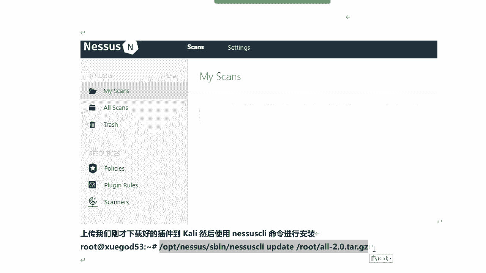

嗯这个得稍微等一会儿啊，嗯这个插件啊，这个等一会安装完成之后呢。

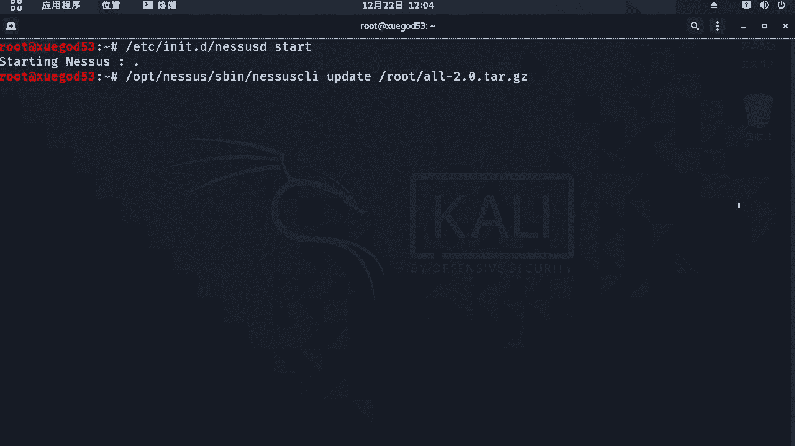

重启下net，然后客户端啊，对那么它呢需要初始化啊，那么这个得需要等，如果你的内存大一点，可能会快一点啊，半个小时一个小时，那么有的啊配置比较低的话啊，甚至可能需要等更长时间，一个小时两个小时。

那么都有可能，这个等待过程是比较慢的。

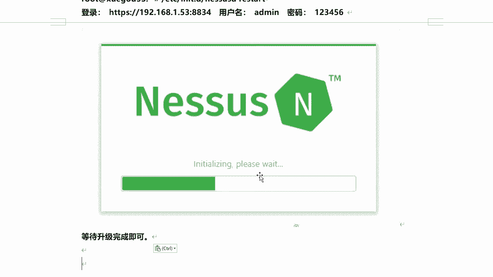

最慢的，我们先看看这里啊，好他把这个已经成功了是吧啊，这个还是比较快的哈，比较快的，然后呢，我们重启一下nas，重启restart好吧，这是启动重启restart，关闭。

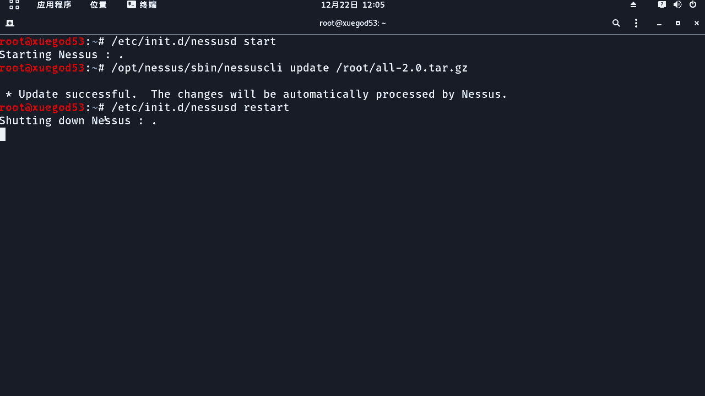

然后启动，然后呢回到我们的浏览器这里面，然后呢这里我们刷新一下的啊，好的啊，进入到这个界面啊，那初始化啊，玻璃兹wet进行等待，那么这个过程很长，所以说这里就不等了，让他慢慢去运行，好吧，对。

等大概有留半个小时或一个小时啊，甚至可能时间会更长啊，注意啊，在整个等待的过程啊，需要耐心，他走很慢啊，嘴巴走到这儿了，诶停了不动了，你千万不要去动，等就是等好吧，这一点大家一定要注意。

就是等等到它完成为止，不要做任何操作啊，这里呢就需要有一定的耐心等待它，这个插件初始化安装完成之后，我们就可以来登录到nas，然后进行一些扫描了。

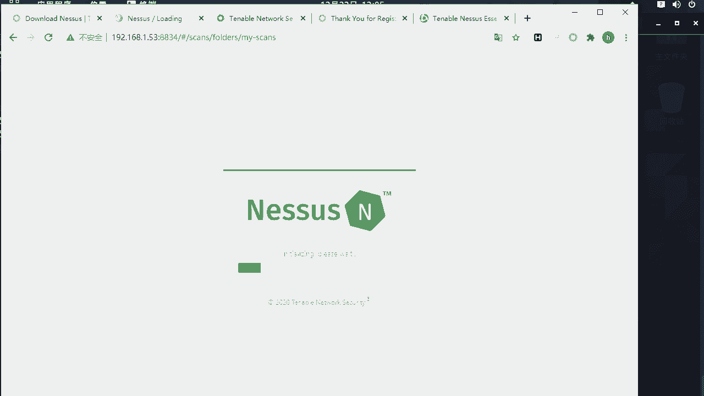