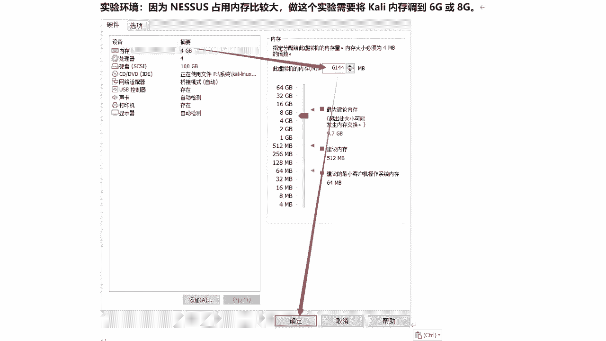
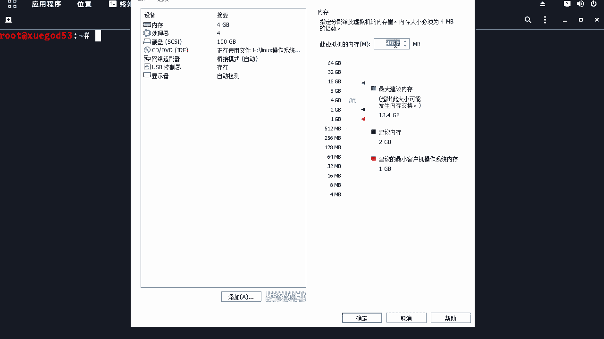
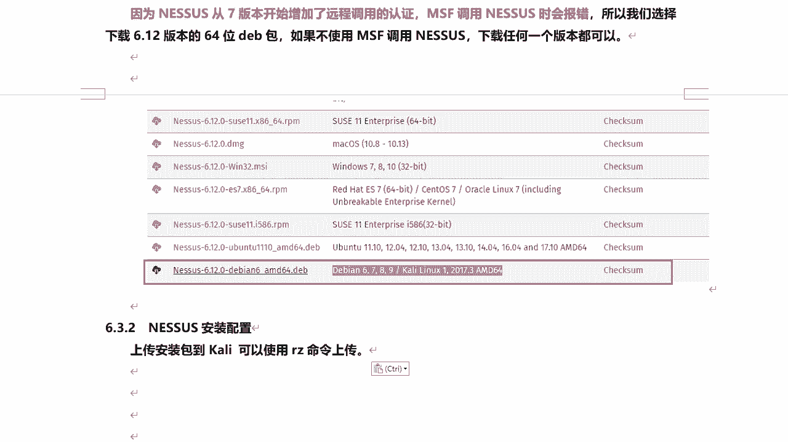
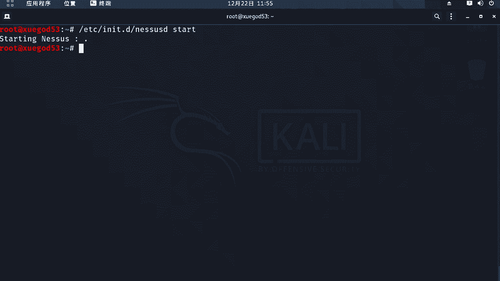
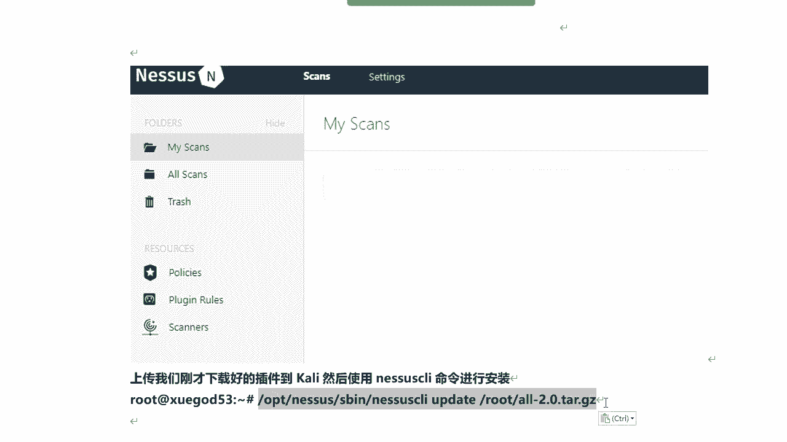
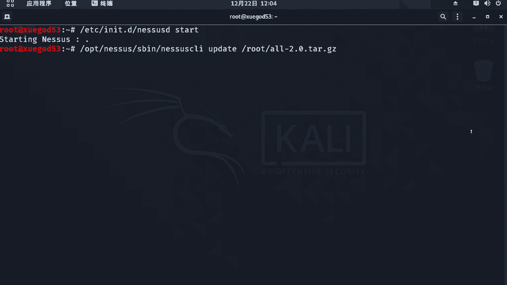
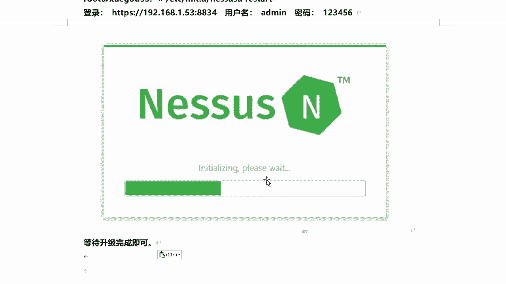
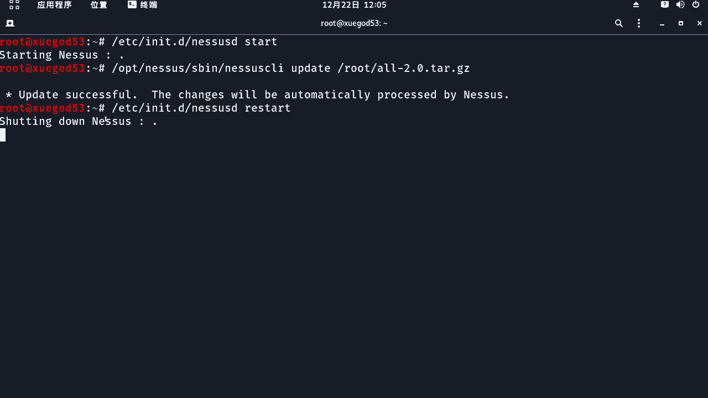
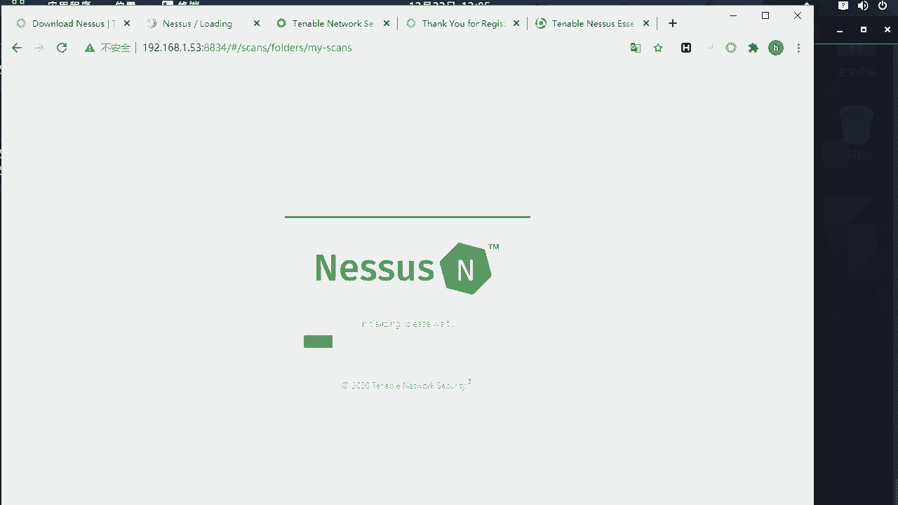

# 课程P58：10.5-【漏洞扫描工具系列】NESSUS安装配置 🛠️

在本节课中，我们将学习漏洞扫描工具Nessus的安装与配置过程。我们将从了解其背景开始，逐步完成软件下载、安装、激活以及插件初始化，最终使其能够对操作系统或Web站点进行漏洞检测。

## Nessus简介






Nessus是一款功能强大的远程系统安全扫描工具。它最初于1998年由四人团队发起，旨在为互联网社区提供一个免费、强大、更新频繁且易于使用的扫描工具。


2002年，其创始人成立了Tenable Network Security机构。在Nessus第三版发布时，该机构收回了Nessus的版权与源代码，并将其注册为官方网站。目前该机构位于美国马里兰州的哥伦比亚。

## 环境准备与内存调整

由于Nessus运行时占用内存较大，建议在安装和使用前，将虚拟机内存调整至6GB到8GB。具体调整需根据物理机的实际内存容量来决定，避免因分配过多内存导致主机运行缓慢。

以下是调整虚拟机内存的步骤：
1.  关闭虚拟机。
2.  右键点击虚拟机，选择“设置”。
3.  在设置界面中找到内存选项，修改为所需大小。
4.  保存设置并重新启动虚拟机。

## 下载Nessus安装包

Nessus官方网站提供了适用于多个平台的安装包，包括Linux（RPM/DEB格式）和Windows系统。版本越新，其功能通常越强大，插件库也越新，能检测出更多老版本无法发现的漏洞。




在本教程中，我们将安装6.12.1版本的DEB包。选择此版本的原因是：从Nessus 7.0版本开始，增加了远程调用认证，导致Metasploit框架中的相关插件无法直接调用新版Nessus。而6.12.1版本可以与Metasploit无缝集成，便于通过命令自动化执行扫描任务和导出报告。

如果你不考虑使用Metasploit调用Nessus，则可以安装任意最新版本。


## 安装与启动Nessus



上一节我们介绍了如何选择版本，本节中我们来看看具体的安装步骤。

首先，使用终端工具（如Xshell）连接到Kali Linux系统，并将Nessus安装包和插件包上传至系统。

以下是安装过程的核心命令：
```bash
# 使用dpkg命令安装.deb格式的软件包
dpkg -i Nessus-6.12.1-debian6_amd64.deb

# 安装完成后，使用以下命令启动Nessus服务
/etc/init.d/nessusd start
```
启动成功后，Nessus服务将运行在8834端口。

## 初始配置与激活

服务启动后，需要通过Google Chrome浏览器访问 `https://<你的Kali_IP>:8834` 进行初始配置。其他浏览器可能无法正常访问。

访问后，按以下步骤操作：
1.  忽略浏览器关于HTTPS证书的警告，继续访问。
2.  根据提示创建一个管理员账户（用户名和密码可自行设定）。
3.  进入激活环节时，选择“离线激活”。

离线激活需要获取激活码，流程如下：
1.  复制页面上提供的“挑战码”。
2.  在浏览器新标签页中访问Tenable官方的激活码申请页面。
3.  填写姓名和有效的电子邮箱（激活码将发送至此邮箱）。
4.  登录邮箱，查收并复制收到的激活码。
5.  回到Nessus激活页面，分别粘贴“挑战码”和“激活码”，完成激活。

请注意，每个激活码通常只能使用一次。

## 安装扫描插件

激活完成后，即可登录Nessus Web界面。但此时还不能立即进行扫描，需要先安装漏洞扫描插件。

插件可以通过Web界面提供的链接在线下载，但速度较慢。因此，我们使用课前准备好的插件包进行离线安装。





以下是安装插件的命令：
```bash
# 进入插件包所在目录，执行安装命令
/opt/nessus/sbin/nessuscli update all-2.0.tar.gz
```
插件安装过程可能较长，需要耐心等待，期间请勿进行其他操作或中断进程。



安装完成后，重启Nessus服务以使插件生效：
```bash
# 重启Nessus服务
/etc/init.d/nessusd restart
```
服务重启后，再次通过浏览器访问Nessus。系统会进行插件初始化，这个过程同样需要较长时间（可能半小时到数小时），请务必耐心等待直至完成。



## 总结



本节课中我们一起学习了Nessus漏洞扫描工具的完整安装与配置流程。我们了解了Nessus的背景，完成了环境准备、软件安装、服务启动、离线激活以及核心插件的安装。配置完成后，Nessus便具备了基本的漏洞扫描能力，为后续对目标系统或Web应用进行安全检测打下了基础。记住，插件的初始化过程需要耐心等待，这是成功使用Nessus的关键一步。