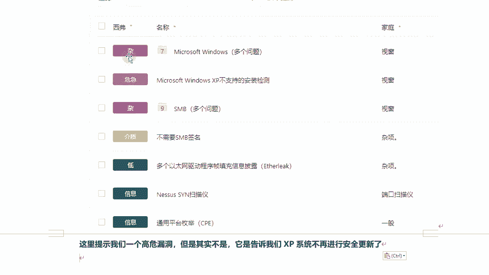
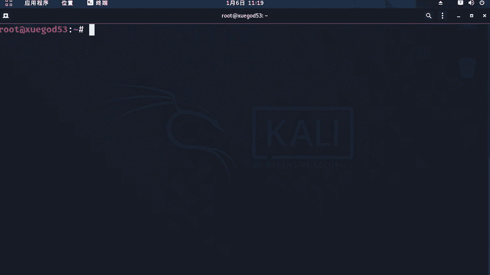
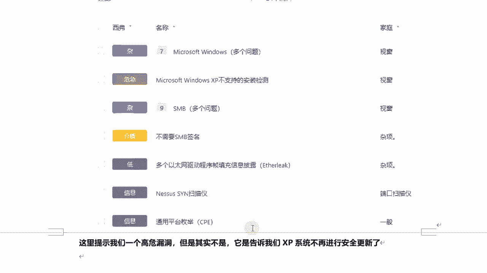

# P59：10.6-【漏洞扫描工具系列】配置扫描Windows主机 - 一个小小小白帽 - BV1Sy4y1D7qv

好下面呢我们来实战一下啊，使用nas来扫描windows主机啊，那么这里呢我们开启一台xp，他ip地址是1。54啊，那我先登录一下的nasa啊，账号是admin，密码是123456呃。

在正式配置扫描这个xp之前，我先简单跟大家说一下啊，那么这里的调教成来改成英文的吧，还是中文看着有点别扭呃，点击这里settings啊，那么这里有个用户啊，那么这是我们刚刚安装的时候，创建的管理员账号。

那么这里咱可以去添加新建用户，你可以添加用户，可以添加普通用户和管理员，那么管理员用户呢，他可以看到所有的扫描任务啊，那么普通用户呢他只能管理诶，看到自己的创建的扫描任务啊，那也是针对一个公司内部。

那么可能有很多个渗透测试人员对吧，那么每个人单独配置一个普通账号，在这里呢去创建扫描任务，他只能去管理对吧，看到自己创建的扫描任务，管理员可以看到所有的这是用户管理，那么还有一些其他的一些相关一些设置。

高级设置，还有设置代理对，那么这个nasa可以挂代理去守啊，守目标还可以设置s m tp server，那么这是邮件服务器啊，那主要是用来就是设置一些定时的啊，计划扫描任务，然后扫描完成之后呢。

通过邮件的形式发送到某个邮箱啊，这是邮件服务器发邮件用的，那么这是setting设置的相关信息，about是关于这个nas当前的版本啊，相关的一些信息啊，那么通过这里呢也可以去手动去升级nas啊。

好那下面呢我们来创建一个扫描任务啊，点击scarce，那么左侧可以看到是我的扫描任务，和所有扫描任务，这是垃圾箱啊，好的那下面呢我们来看new scar，创建新的扫描任务。

这里呢我们要扫描一台windows主机啊，那么lady主机当然也可以去扫描啊，我们这里呢是创建扫描，这里有很多模板，我们可以去选择，那么注意啊，那么这里有upgrade这个字样。

标记的是需要升级付费才能使用这个模板，那其他这个都可以免费使用，我们点击高级扫描，然后首先呢，我们来设定一个扫描的任务的名称啊，那么这里我们要扫描xp是吧。

那么我们可以设置x p下面s c a n car，然后这关于扫描任务的描述可写可不写，然后这个folders文件夹，你这个扫描任务放在哪里对吧，那where is my gans放在这个文件夹下面啊。

当然你可以创建就是不同的扫描任务，可以放在不同的文件夹里面，这个文件夹是可以创建的啊，然后target是什么目标，那么注意，那么这个目标可以是一个ip地址，也可以是i p p地址段。

那么看这里有个默认的啊，提示也可以扫描一个范围，也可以是域名对吧，也可以是多个目标，中间呢用逗号去间隔就可以了啊，或者是呢在这里呢可以设置上，把多个目标写在一个文本文件里面，点击at fi哎。

那么文文件里是一行一个一行一个多个域名，一行一个对吧，然后点击号把这个文件添加进来也可以，那么这里呢我只扫描一个目标，我直接设定1。54，好那么设定完目标之后呢，我们这里再往下看，这个是什么。

这是计划任务啊，计划任务就是说啊默认啊只扫描一次，那么你可以设定对吧，每天每周每月或每年，然后什么时间具体时间啊，去自动开启这个扫描啊，那下面正常正常一个网站啊，公司内部。

那么他肯定会不定期的或者是定期的，或每天或每几天进行一下扫描，看看这个网站有什么漏洞，对不对，你可以可以通过这种计划任务，那么去完成，然后再往下的一个这个是通知啊，那么这个是什么意思。

就是说它自动扫描结束之后啊，对我们人不用去实时的看着他，只要扫描完成之后，他就会把扫描报告自动发送到这个邮箱，发送到哪个邮箱呢，可以在这里设置设置，前提你得先配置好s m t b server。

否则话它发送不了邮件啊，主要是邮件通知功能用来接收扫描结果的啊，然后呢再往下看，这有个report report，这是什么关于扫描报告的设置啊，有设置扫描结果，那么这个首先第一个选项。

那这个选项表示是否启用覆盖模式，显示更详细的信息，那么也就是说如果你的磁盘空间有限对吧，将尽可能在报告中提供较少的信息啊，否则呢会覆盖导致整个磁盘空间不足，那么因为每次扫描都会把报告。

存储在你的本地硬盘里面，是不是如果硬盘通关不是不是很大的话，你可以点动它，对提供较少的信息，当报告的信息啊，尽可能多时将会呢提供有关插件的详细信息啊，然后呢接下这第二项这一项什么意思呢。

这项是这表示是否启用显示缺少的，被替代的修补程序，那么这个允许用户啊去配置nas啊，那么要包括或者在扫描，包括中删除被取代的一些修补程序信息啊，那么接下来都是关于一个扫描报告啊，那么大家如果看不懂的话。

可以把它翻译成中文对吧，哎这种方式呢能看一下的啊，能够更清晰，但是这个翻译中文的翻译不是很准确啊，然后这个关于这个是允许用户编辑扫描结果，是否允许打勾，是允许，然后呢通过其dns名称指定主机。

然后呢显示响应拼的主机，显示无法访问的主机，那么也就这些是在最终扫描结果报告里面，是否体现啊，自我体现好吧，然后呢我还是把它翻译成英文的吧，好那么这是关于扫描报告。

然后接下来我们看的discover发现啊，主机发现啊，默认啊，我们来看第一个主机发泄，拼远程主机是否启用拼主机功能啊，这个注意，然后下面有个两个设置啊，默认第一个呢是打对勾了是吧。

test the local是拼啊，表示对目标主机啊进行扫描时啊，是否也对本机进行扫描啊，这项默认是启用的，你要不想启用，可以把它对勾去掉，第二项呢是啥，表示快速的进行网络发现啊。

那么快速的进行网络发现，可以绕过一些额外的测试，那些测试不是很全面，那么在通常情况下，如果nas受到主机想要拼请求啊，将会再次进行额外的测试，那么确认呢这个显然是否是来自目标主机啊。

或者是一个代理或者是负载均衡器，这样的话能够更加准确的保证，扫描结果的一个准确性啊，这是这个选项的意思啊，这个选项然后再拼音方法，那么这个是探测方式啊，那么也就是说在这里啊。

用户可以定制主机的探测方式啊，比如说通过a r p r c c p呀，i c m p等等啊，那么一共是四种探测方式，分别是a r p tcp s m p和udp，那么其中啊这a r p拼。

它仅适用于局域网本地网络啊，那么tcp p呢主要是用来探测什么目标，开放的端口啊，samp这个呢拼主要向远程主机发生拼命令，如果目标返回一个s m p不可达，说明什么，目标主机是关闭的，不是存活的啊。

那么ud p呢它是一种不可靠的通信协议，一般情况下它不用于远程探测，这要注意，还有下面的一些是关于特殊主机的探测，那么特殊主题音质也包含两个，一个是扫描什么网络打印机啊。

然后呢这个是扫描这个neware host啊，好这是比较特殊的情况，一般呢我用不上这两个啊，最后一个是网络唤醒，网络唤醒主机，网络唤醒主机，也就是说当啊，呃目标主机用户长时间不进行操作的时候啊。

那么计算机会进入休眠或待机状态，那么这样的话肯定会影响整个这个扫描啊，那么此时呢可以什么网络唤醒主机，并对它们进行了吗，扫描发现大部分啊计算机啊都自带了啊，都自带了一种电源管理功能。

那么如果存在网络活动，有网络活动，那么允许设备将操作系统，从待机或休眠模式唤醒，那么这是wake up对网络唤醒功能好，接下来我们再往下看，下一个是端口扫描啊，那么端口扫描呢第一项啊，第一项。

那么这里可以设定你端口扫描的一个范围好吧，那么这个呢这个这句这句对英文表示，是否将不扫描的端口状态设为关闭啊，那么默认对，那么这是不选中的啊，那么你可以选中，根据实际情况去选啊。

然后这个是端口扫描的范围啊，默认是default表示扫描啊，嗯在nas服务文件中啊，大约4790个常见的端口啊，那么如果你这里设置为all a l l的话，表示扫描所有的端口，全端口扫描。

那么全能高手呢就是1~65535啊，那一般情况下为了确保不错过对吧，不落下某个端口，那么有的目标机可能是将一些常见的端口，改为高位端口，那么你可以把它改成all进存全端口扫描，这样更全面一些啊。

当然你可以指定一个端口的范围，然后中间呢使用什么用连字符分隔，比如说你要指定一个不连续范围的端口的话，那么可以使用逗号来分隔，那么这里比如说全部端口扫描是哦，那你可以指定，比如说嗯八零啊，二幺对吧。

二二啊，或者是3306唉，这些不连续端口这么去写也可以啊，好吧，或者是呢，你可以还可以指定端口的tcp或udp协议啊，可以使用大写的t或大写u来表示，那比如说啊tcp协议啊，对1~1024端口。

那么这里我们可以这么写，大写题，冒号一杠1024，扫描目标主义的tcp端口，1~1024啊，啊这几种写法呢大家呢熟悉就可以了啊，还有udp端口啊，冒号一杠1024，这些都可以这么去设置啊。

或者是一个端口范围1~1024也可以啊，好那么接下来呢我们往下看啊，这是本地端口枚举枚举方式啊，那默认提供了五种啊，那么第一个呢表示什么s h h啊，那么这种呢它比较适合于什么linux系统啊。

但是这种的它需要什么，需要身份验证凭据，还有w mi啊，还有snp服务，还有第四个，第四个，这个是如果本地没端口枚举失败，但如果选中的话，如果本地端口枚举失败，则只能运行网络端口扫描器。

否则的话依靠本地端口枚举啊，这个是牛肉选中的话啊，第四个呢，最后一个，这个是通过本地端口民警去验证开放的tcp啊，端口啊，这几个选项呢就是每个选项大概什么意思啊，给大家解读一下了，实际跟我说。

你可以根据实际情况去选择使用哪个，或者不使用哪个，然后最后一个这是网络端口枚举，对网络端口扫描方式好吧，那么前面咱们这块想了是吧，如果这是本地端口枚举选，如果本地端口枚举失败，它使用网络端口是吧。

对网络端口扫描器，这个呢就是网络端口扫描啊，然后呢默认呢选择是通过s y n啊，那么这里呢有什么tcp s y，还有u d p啊，那么s y n表示的是使用tcb x y方式。

扫描目标上开放的tcp端口，那么sn这种扫描是常用的端口扫描，那么可以绕过防火墙的拦截，那么也叫半连接扫描好吧，对三次握手揉入办理，你怎么都是通过吗，呃tcp 3次握中，前两次握手完成前两次嗯。

这种方式呢不容易被发现，也不会在目标机留下痕迹，也可以绕过防火墙的拦截啊，那么tcp上这个扫描的是啥，就是全连接扫描，那udp方式对，这种方式主要用于扫描目标机上，开放的ud p端口啊。

当用户选择使用tc p s y n扫描方式时，还可以设置防御防火墙自动探测，自动探测，那么也就是说这个啊自动探测这一选项好吧，那么当用户启用这个功能之后，可以设置三种探测方式啊，碳等方式。

就是说如果啊目标机有防御，有防火墙对吧，那么它可以设着防御防火墙探测，探测它的防火墙，第一种方式啊是用柔性探测方式，然后第二种呢是用硬性探测方式，最后呢是不对防火墙进行探测啊。

当然你这个不选它就不进行下面这个探测了啊，好吧，当然你要想探测目标防火墙也可以去选择它，好的，那么这是关于这一个是啊端口扫描，还有呢这下面是服务发现好吧，呃服务发现咱们这里呢默认啊。

这里头可以设置端口服务探测的s s l，还有t l s服务探测好吧，那么下面介绍了每种方式的一个含义啊，来，那么首先呢我们来看一下它这里第一个啊，那么第一个这是什么意思呢。

第一个是表示对所有端口上运行的服务，进行探测啊，所有端口和运输，那一般俩这默认都是选中的啊，我们都会对所有开放的端口，它运行什么服务进行探测，然后第二个呢。

这个是表示对s s l t l s服务进行探测，i t p s是吧，哎然后呢这里呢去设置什么，这里去设置探测s s l t l s的端口范围啊，那么这个配置像提供了两个选项。

两个选项分别是第一个是no noon ssl tls pose，还有所有的，那么第一个呢是什么意思，表示对已知的s s l t l s的端口进行探测，all呢是所有端口把默认的是第一个。

也是对已知的啊ssl端口进行探测，好吧对，那么如果你选择的是第一个，那么启用这个该用的呢，建议选择所有好吧，注意这里如果再启用它了，建议选择所有对所有端口呢，来进行探测一下的好吧。

然后呢接下来呢我们再往下看，那么这个啊第一个这个识别在x啊，x代表示一个天数s天内到期的ssl证书啊，默认的是60天好吧对，那么就说i t p s嘛，他得需要有证书吗，在多少天内到期的。

那么也可以检测出来，然后这一项呢是什么意思呢，对这个是设置是否列举所有ssl，或者说t l s密码，启用这个功能之后呢，nas将忽略ssl服务的密码列表，并通过尝试属，使用所有可能的密码来建立连接啊。

然后呢，这个呢表示这一选项是否启用cl l，c r l检查啊，那么这是关于服务发现里面的，我们大概了解一下的啊，然后呢我们接着再往下看，这是关于一些扫描精度的对吧，那么扫描精度这里呢吗，包括几个选项。

好吧呃包含三部分漏洞扫描选项，那么首先看第一个对，第一个是是否覆盖正常的精确度啊，然后呢第二第二个呢，这里头这个选项呢是避免潜在的假情报，然后这个是显示甲在潜在的假情报，什么意思。

就是你在漏洞扫描的时候，可能会存在误少或者是漏扫好吧，然后呢你这里可以去控制是否显示可能的对吧，误扫或者是漏扫结果啊，然后呢我们再往下来看一下的啊，那么这里头这个选项。

这个选项呢是否表示的是是否实现彻底的测试，默认是没有选中的哈，那彻底测试什么情况呢，在某些情况下，这种扫描可能会导致更多的网络，网络流量或者和分析，那需要注意的是，更彻底的扫描将具有侵入性。

对目标机那可能会破坏网络呀对啊，那么也可能会使目标肌瘫痪呢，所以说这块要谨慎，同时呢也可能会有更好的一个审核结果连，那么以这种访问说，可能你的扫描结果更精确了对吧。

但也有可能对目标肌呢造成什么造成损伤啊，比如说使服务崩溃了，那么它具有侵入性好吧，然后呢这个ok再往下看啊，这个是用来设置防病毒的宽限期的好吧，防病毒扩散器，然后s m t p。

那么这里主要用来设置如何扫描啊，狱中所有正在运行的s m tp服务啊，扫描域中所运行的sm tp服务，这个nas啊，将通过指定的第三方域进行邮件中继服务啊，那么这里呢可能用的是相对少一些。

我就不给大家说了，好吧哎那么这个呃设置也比较简单啊，再往下看到有个web application，那么这个主要是针对外部应用进行扫描的啊，然后咱们这里主要是扫描是windows主机。

这个这里先不给大家说了啊，那么windows啊，那么注意啊，那么这里头这个windows表示什么呢，对那么通过这里呢我们可以去设置啊，关于这个报告信息对吧对啊。

那么这里头主要是如果目标机是windows系统，你可以去启用设置，这个可以试试这个这个表示是否启用请求，sm b域名相关信息，下面呢可以针对预用户或者本地用户，进行枚举啊，那么这个id呢就是用户的id。

其实id和终止id，那么当然这个id可以去改啊，那一般普通用户的id都是从1000开始的，就是每局目标windows主机的账号啊，账号啊，然后呢这是关于z一项，然后呢我们下面看一下，可以单手。

这是主要凭证啊，主要设置凭证，那么这里头大家要注意一点，那么就是有些windows主机，它可能需要呃登录之后对吧，需要有账号和密码，那么我们在这里呢可以来进行设置一下的啊，那比如这里又涉及到很多啊。

哎比如说这些都有啊，啊这是亚马是亚马逊的还是啥，来关闭到windows主机，然后数据库的好不好，主机那么s n m p的，s h的，还有windows的，那比如说我们目标主机是windows。

我们可以点击它，那么在右侧呢，你可以设置目标主机的账号和密码，登录的账号和密码啊，那么他这个认证方式有几种啊，对一共的四种，那一般来讲常用的是password在认证方式，然后输入目标记的账号密码。

那么如果是存在域的话，再输入它的域就可以了啊，然后凭证登录呃，那么也就是说啊，呃如果你需要扫描windows上主机有没有恶意软件，那么你就需要添加什么添加凭证啊，那这里呢我们就不添加了啊。

不需要添加好吧，然后再往这样看，这是插件啊，那么这个插件呢，那你在你对目标主机进行扫描的时候啊，那么扫描目标主义有什么漏洞，那么他将会通过各种插件对吧，去进行扫好吧，哎那么你点击某个插件呢，这是插件组。

就分组它下面有多少个插件，那么可以点击右侧可以查看到啊，那比如说啊，那么我们扫描的是目标主机是windows啊，那么比如说先看这里啊，这是关于生成s，那么我肯定用不到这个组件，这个插件对吧。

我可以把它进行掉，不使用它好吧，那么让它下面所有的都会被对吧，禁用掉，稍等啊，它下面比较多，你点击单击它会加载它，下面所有子弹都会被禁用是吧，比如这个我不想用啊，我dns我不想探测，ok啊。

你可以把它禁用f tp呢，假如目标并没有，我可以把它禁用，ok禁用就可以了，他就不使用这个插件进行探测了啊，那或者是比如说那么这是关于debt，也不需要对数据库呢也不需要好吧，那么这个后门呢。

比如说我点击啊这下面某个子插件诶，这个这个我不需要啊，好吧，不需要，那我给它进行掉就可以了啊，注意啊，那么这里你点击进行时，把沙曼这个这个啊，它下面所有的插件都禁用了啊。

然后你也可以点击进入某个某个插件，也可以点击啊，比如说点击它下面某个插件给它进行掉也可以，然后呢我们所有的都设置完成之后，然后呢最后呢我们点击save啊，直接保存啊，保存我们的扫描任务。

然后点击啊这个开始进行扫描，对然后呢我们可以点击看啊，嗯他已经发现有漏洞了是吧，但是都是info啊，稍等一会啊，等扫描完成之后呢，在这里我们可以看到通过nas啊，扫描目标机xt对吧，它都存在哪些漏洞。

好的，然后呢笔记呢我给大家整理一下的啊，关于这个漏洞扫描工具啊，nas啊啊，还有大家就是客户啊都得去尝试好吧对，那你不同的测试，然后呢根据看看他的扫描结果啊，有什么不一样，好那你扫描完成之后。

那么这里会显示出每个漏洞的等级啊，危险等级都会显示通过不同颜色不同的标记啊。

然后呢我们来看看我们的扫描结果，完事没有啊。

啊除了一个等级比较高的哈，这个是等级最高的啊，m s09 杠001啊，running诶，正在进行扫描，没扫描完了，点击host可以看目标主机是吧，是1。54，然后呢这里也可以看出漏洞的数量。

等级从高到低是吧，这个等级是最高的，从上往下啊，好也是已经完成了啊，那么这里呢我们可以看到啊，扫描出这些结果，然后比如点击进去之后呢，我可以查看这关于这个漏洞的详细的一个描述，好吧。

对详细的描述这个漏洞，然后呢如何去解决，解决方案是什么对吧，哎然后呢还有关于这个漏洞相关的信息，可以通过这个地址去查看啊，然后呢它是针对哪个哪个端口的什么协议啊，还有使用哪个插件进行扫描的插件。

版本什么类型是吧，对属于哪个分组的这个插件啊，好的然后这个词是关于使用nas啊，对windows主机进行扫描好吧。

