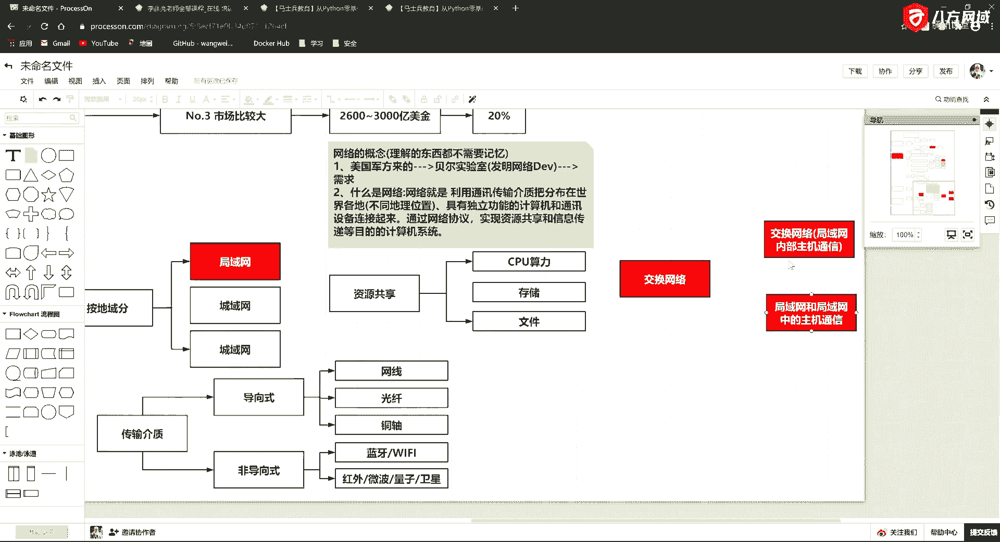
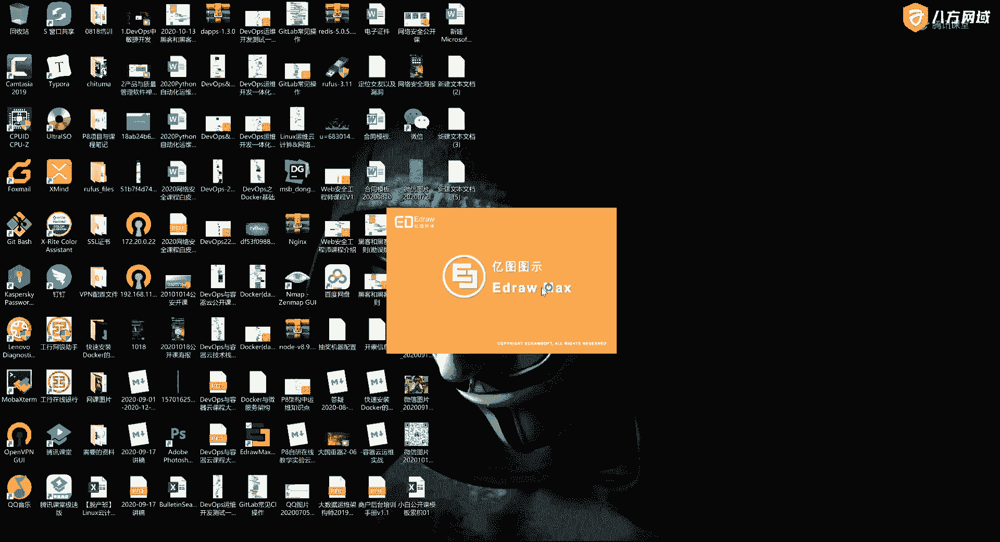
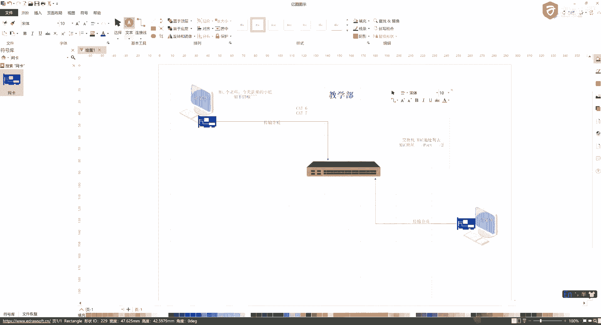
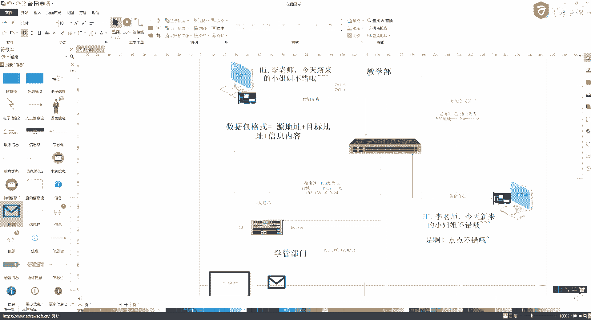

# P6：2.2-网络安全基础-网络安全信息基础知识 - 一个小小小白帽 - BV1Sy4y1D7qv

计算机网络啊，好那我们学网络呢，我们得先搞清楚一个东西，就是网络的概念啊，说啥是网络呀，啊我们再把网络的概念解决完了，好这个呢我给各位大佬来解释一下啊，第一我们怎么去记忆啊，这个学习的方法怎么去记忆。

第一你记住我说过的一句话啊，凡是理解的东西都不需要记忆，啊凡是理解的东西都不需要记忆啊，比如我现在问你1+1=2，你马上你就不用打课本，你马上你就反映出来，你告诉我等于二，对吧哎那为啥呢。

因为你理解了啊，就是它简单啊，所以这个东西叫理解的东西，就不需要记忆，好那我们看看怎么去理解啊，那么网络的由来它是由什么啊，它是由美国军方来的，唉所以以后人家再问你啥是网络的时候，你也先按照我这思路。

你想他是咋来的啊，美国军方来的，美国军方呢有一个著名的实验室，叫贝尔实验室啊，这个实验室可不得了啊，这个实验室牛逼大了啊，这个实验室它诞生了unix系统，诞生了c语言，还诞生了网络。

所以最早呢这个网络就是美国军方嫌，想解决的一个问题啊，那么那时候美苏争霸的时候，这两家都想互相摧毁啊，这个美国军方呢就想找一波的这个科学家，在这研究说呀，鸡蛋不能放在一个篮子里头，万一人家一颗导弹过来。

啵儿把你这指挥中心打没了是吧，哎那我不就完犊子了吗是吧，你们能不能想一个办法解决，说这个如果我这个指挥中心被摧毁了，我这些数据和这些资料，能够快速的转移到其他地方啊，然后在那还可以接着指挥。

其实最早就是解决这个问题的啊，所以呢这帮科学家呢就开始去做，那叫发明吧，方面包啊，那么基于这个原型的这个需求啊，这个东西就是美国军方提了一个需求，好这帮人哈，就相当于是各位啊。

你这个开发者你要干这件事啊，所以网络的概念呢实际上就是，什么是网络啊，网络就是，利用，通讯介质，啥叫通讯介入啊，它也叫传输介质，通过传输介质，这个传输介质我们拿出来给大家讲一下啊，传输介质呢好理解。

它分为两大类，第一种呢叫导向式，啊第二种呢叫非导向式，所以呢我们要从介质的这个类型去分，就可以分为导向式的和非导向式，啊那么导向式的呢有哪些呢，就是我们常见的这些啊，看得见摸得着的，那什么叫导向式。

就是看得见摸得着啊，比如说我们常见的网线，唉这个就是导向式的啊，我们看到的光纤，同轴电缆啊，啊这些了啊，都是我们所说的导向式，那么有导向式的，是不是还有非导向式的是吧。

唉非导向式的呢就是这种我看不见摸不着的，看不见摸不着，比如说大家见到我们这个蓝牙，啊蓝牙，户外微波啊，我这写不下了，我就写在一块儿了啊，量子通讯对吧，哎还有我们所说的卫星是吧。

哎等这些东西你看不见摸不着的啊，还有呢我们所说的，比如说wifi，啊就这种无线网络，这种都是非导向式，好所以接着回来啊，我们围绕着上一个话题啊，围绕坏的说啥是网络呀，先利用通讯介质。

通讯介质就指的是这些，这就是传输介质，说你的计算机要么拿个网线根插上，就像我们到公司这种有线网是吧，唉要么你弄一个wifi，要么你认为发射站灯上卫星，然后啪再下来有接收站能接受，总而言之，言而总之。

不管是导向式的还是非导向式的，首先要有一个充分必要条件，这个充分必要条件就是通讯介质啊，啊然后利用这个通讯介质干啥呢，把，分布在世界各地，啊这是老百姓讲话叫世界各地啊，那如果写成文绉绉的呢。

那就是不同地理位置，唉你这个在美国东部，然后那个跑一个美国西部是吧，哎这地儿啊，那么利用传输介质啊，通讯的传输介质，把分布在世界各个各地的不同地理位置的，具有独立功能的，计算机，和通讯设备连接起来。

实现资源共享，和信息传递，到目的的计算仪器，这东西就不叫网络啊，那么这里呢有一个概念是吧，有个概念我还得给你说一说啊，那这里头又出现一个玩意儿，叫做资源共享，这个东西也得解释一下，资源共享。

当有同学问了说，老师这个资源共享，我就是共享的那些种子吗，不是比如说你的cpu，也叫你的算力，对吧，哎你的存储，啊你的存储以及你的文件，好吧，实际上这前边呢还可以再加上一个了啊。

那你是咋实现的资源共享和信息传递，那实际上就是通过网络协议，唉通过网络协议实现资源共享和信息传递的啊，这样的一套计算机系统，那么这个东西就是网络啊，那发展到现在呢，就是我们大家所说的这个互联网。

好那这个网络我们知道了网络这个东西呢，它还可以去细分啊，网络还可以去分类，好网络呢分类呢我们常见的就是按照地域分，好这个东西呢我们分为什么呢，我们分为局域网，局域网呢是什么呢。

就比如说是我们这个公司内部啊，唉公司内部格，局域网，第二个呢分为成语网，比如北京是吧，哎咱们整个北京的网络啊，整个昌平区的网络就可以叫冲绿网，还有一个呢就是广域网。

就是我们所说的internet这个互联网啊，就是广域网全球范围内都可以进行访问啊，所以这个是我们将来简单的说了一些，网络和网络的划分，好网络和网络的划分，那么在这个局域网，平时呢也是我们主要研究的啊。

一个方向就是大家以后会遇到这种情况，就是我们研究局域网啊，局网内部，那么局域网呢这里头就涉及到网络啊，网络类型，这里的交换就会有一个内容叫做交换网络，交换网络，好啊，这个交换网络呢也是我们在学习网络。

较为常见的啊，第一种，局域网内部，主机通讯，局域网和局域网中的主机模式。

那这就涉及到这两个，那么这样的网络呢，我们还给大家画一画啊，我看我这个电脑装没装嗯，我这里头没有四颗模拟器啊，没事拿，拿这个这个这个这个这个意图给大家画一个啊。

好我们说交换网络啊，比如说我这有一个电脑，这有一个电脑啊，这边有个电脑，那这里头我们是在哪儿呢，我们在，教学部，啊这是一个其中一个部门叫教学部，那么教学部内部呢，它是构成了一个小型的局域网啊对吧。

我们都在一个局域网内，有说这是谁呢，这是黄老师，啊这是真的，这是我唉李老师，黄老师，好吧，这，这两个老师呢要通讯啊，要聊天，他要想跟我说哈，比如说跟我说句话吧，李老师，今天新来的小姐姐不错哦。

诶他要想跟我说句话啊，这两台电脑计算机之间要进行通讯，那怎么办，好那我们就得需要一个设备啊，这个设备就是这个玩意儿啊，交换机，然后他的这台电脑啊，需要一个，工作设备得有一个网卡。

我这台电脑也得有一个网卡啊，这个网卡呢在这叫做什么呢，叫做调制解调器啊，那么它有两个作用，一个叫调制，一个叫解调啊，回头后来我们再讲网络，讲o i7 层网络模型，讲最底层的物理啊，物理层的时候啊。

这时候我还会再给你讲网卡，所以今天呢由于时间原因，我不展开讲，这是我们在后边的网络里的，还会有啊，今天呢我就简单的把这个模型简单给大家说说，好吧，唉让你对网络呢有一个理解，当然了，有一些有经验的老鸟。

他会啊，当然对于一些小白来说，他不知道什么是网络是吧，哎就是能上网就行了，那么你你这个黄老师，你这要有一个网线，好黄老师呢，这通过一个网线连接在交换机上，那这个东西，这个网线刚才说了，叫做什么。

传输介质，这个网线还可以继续细分是几类线啊，比如说我们通常线见到的都是六类线以上，如果你这个网速想达到百兆，至少要是六类线才行呢啊，所以一般都是六类或超六类的线啊，见到会比较多。

这样的话能保证你达到百兆，那你要想达到千兆呢，那你至少要使用啊七类线啊，至少是七类，你才能达到千兆的这个速度，所以呢这个网线也不是瞎选的啊，所以这会有几类啊，我们用对吧，cat 6对不对，cat 7啊。

那你要用万兆的话，那就是八类线啊，就是更好的这些线等等等等啊，这简单的给大家说说，这是网线的一些标准啊，这位零基础的人说的，那么呢我对吧，你看我得跟他在一个办公室，对不对，唉好。

我也得拿一个传输介质连接在这个交换机上，这个东西就是刚才我们说的传输介质，好传输介质，然后呢这个交换机呢它是有原理的啊，交换机它是有原理的，那么交换机呢它会有一个。

它会有一个交换机里头会保存的一个列表啊，这个东西叫什么呢，叫mac地址，mac地址列表，那么它的作用呢，就是我拿mac地址去对应一个具体的端口，比如说这块儿啊，上边可能是1号口，这下边是2号口。

拿你的mac地址，对应一个以交换机上的一个端口，比如说李老师这个机器啊，他有一个mac地址，这个mac地址呢叫什么呢啊叫做物理地址，我们每一块网卡在出厂的时候，物理地址都是唯一的啊。

它会这个根据每个不同的厂商，给你去分配一个mac地址，那么这个mac地址呢，我们在自己的这个电脑上也是可以去查看的。

你看我这里头有很多的网卡是吧，比如这个吧，我查看一下状态点详细信息，在这个详细信息，这这就会有一个物理地址啊，这个物理地址呢它是用16进制数来表示的，那么有一共有几位呢。

一啊1234562个16进制数为一组，一共有六组，每一组之间用横线给你隔开啊，261 12也就是一共是12个啊，16进制的字符在这里就表示了，你在这里可以看到的这个地址是唯一的，那么与物理地址相对应的。

还有一个地址就是我们看到的这种ip地址，它也叫逻辑地址，那么逻辑地址是可以发生改变的，那你的物理地址是不能变的啊，所以在这，那么它会在我们这个列表中一相对应啊，比如说我们拿一个啊，好吧唉这是一组。

对不对，唉它对应的是2号口，那么当黄老师给我发嗨，李老师今天新来了一个小姐姐，还不错哟，啊她给我发这个信息的时候，这个信息呢，好这个信息呢就会有一个封包啊，这个封包呢就会有一个原地址，有一个目标地址。

然后有一个我传输的这个信息，那么它会被我们的设备啊，就是你这个网卡对不对，你看这小灯在亮了，对不对，那么通过网卡的时候，他会把你看到的这个本地化的这个，你看到的本地化的一个数据给你转化成二进制。

然后通过二进制给你转化成电信号，通过网线传过来啊，那么它在走的时候是这样的啊，刚才哈字有点小是吧，这样的话呢就会有，数据包组合式，这个数据包格式呢就是原地址加上目标地址，加上信息啊。

内容也就是我们所说的这个data，好这样的就是一个数据包啊，这个数据包就在这里头，那么这个原地址是谁，原地址就是黄老师啊，他这台计算机的地址，目标地址是目标地址，就是我这台计算机的地址。

然后这个信息内容就是这句话啊，唉就是这句话，好这条数据在我们的网络中，通过传输介质在这走走走走走走走走走走走，诶，传过这个交换机到交换机的时候呢，他就会把这个数据拆开拆拆开拆开以后呢。

它会获取到我们这样的数据包格式，那么他就会在我的这个列表中去寻找，这个目标地址，在不在你这个交换机的列表中啊，拆开了以后发现我这台的mac地址在这个列表中，而且就是2号端口，ok。

那么这个交换机就会通过这个端口，给我传输过来，当我这个网卡接到你这个数据包的时候，我再通过你拆包一层一层拆开，拆开以后显示到我这个电脑上，啊同样这个道理再回去，这就是我们局域网内部啊的一个这样的一个。

交换的问题啊，那么还有一种方式呢，就是他现在又发了一条消息啊，又发了一条消息，他发给另外一个地址啊，发给另外一个地址，说如果呀他还想找我，他还用找我，但是我把网线拔了，我把网线拔了。

那么这时候交换机在他把这个消息发过来以后，我说我尽量说的简单一点啊，你说的专业性不是特别特别强，我们说的这个这个更白话一点，让大家这个零基础的同学能够简单易懂啊，能够搞清楚这个原理。

稍后呢我们会再去讲啊，这个交换机呢很有意思啊，你就记住这个交换机有个东西叫广播域啊，啥意思呀，就是相当于跟大喇叭一样，我们小时候都比如说你你在农村是吧，你这个有个大喇叭啊，这个村长每天老广播啊。

谁谁谁又给这个这个隔壁王寡妇，这个这个这个这个这张寡妇是吧，就挑水了啊，这老踹寡妇门啊，老是有这种大喇叭广播对吧，要不就说这个村东头老王家隔壁邻居那条狗啊，这就丢了啊，被谁宰了，吃肉了啊。

那可能是这个事，所以如果说黄老师来找我啊，说我这台设备的mac地址没有在你这个交换机中，这个信息来，好这个信息又来了啊，来了以后呢，通过交换机交换机一找你这里头的目标地址啊。

目标地址在这个交换机这个mac地址列表中，没有没有怎么办，这时候交换机就跟刚才我说的啊，你得找人啊，找谁呢，找广播玉，找广播玉干嘛，找村长，让村长开着大喇叭给你广播啊，村东头老王家，村东头老王家。

老王家老王家啊，唉对马上到这个这个这个大队来一趟，马上到大队来一趟啊，就是在这广播全网找，我把这个交换机的每一个这里的这个接口啊，每一个开始构轮询一遍啊啊哎去找，如果广播哈，就在这广播，那这样的话呢。

这个交换机呢还会就会带来一个问题啊，就是说比如说我也在这里头，广播找的这个人可能也没有，那么这时候就会可能造成什么呢，有很多人对吧，唉在这里同时交换数据的时候，需要通过广播的这种形式来完成。

那这时候就可能造成广播风暴啊，所以今天我们先简单提一嘴啊，其实到后边还可以，据说啊我们甚至可以用广播风暴啊，利用交换机的这个特点，利用广播风暴啊，就造成网络攻击对吧，因为你也广播，我也广播啊。

到底听谁的，是不是，那如果你这个网络中设备比较多，那这时候你这个网卡是不是一直要接收数据，对吧，哎时间长了时间长了，你这个网卡一直工作一直工作一直工作唉，就可能造成了你的网卡啊烧坏了。

同时这个广播风暴会造成你大量的计算机，系统的资源的消耗啊，你网卡要不断的来接收数据，接收数据是不是要存在内存中对吧，然后要cpu去调这个东西去解压它，所以你还要占据cpu的资源。

内存资源甚至会造成你cpu百分之百，好，cpu完之百，那比如说我们经过一条拼命令，我们就可以通过死亡之拼啊，就造成这种情况啊，还可以造成广播风暴，广播风暴呢就会造成设备损毁等等等等，这样的情况。

所以呢单单从简单的这种交换网络啊，就可以造成这种网络中存在的问题啊，还会造成整个网络缓慢，好就大家都慢对吧，唉因为你所有的网卡你都在接收，那么关于网卡的这块呢，我们后期的话讲网络的时候也会再给他讲啊。

网卡还有他的工作模式，比如说有这个双工的模式是吧，哎还有半双工的模式啊，你像我们的无线网卡和无线网卡就是有区别的，那为什么我们用有线网同学会感觉比较快呢，啊说我们上网插个有线的话，你觉得比较快。

因为有线网卡的时候，它的工作原理它是全双工模式啊，什么叫双工模式，就是你嗯能说的时候你也能听，啊你说的同时你也能听，也就是你上传的同时你也能在下载，这就是一个典型的双攻模式啊，那么还有一些呢是什么呢。

还有一些是半双工的啊，你比如说我们无线网卡拉为啥慢呢对吧，无线网卡曼的时候，就是比如他下来的时候不能上传啊，他只能干一个事儿，好吧，唉，这就是为什么我们感觉到无线网，它会没有有线网快的。

一个一个一个一个一个原因啊，所以这一块的话呢，我们简单的通过这个给大家去说一说，还还我还得压一会儿时间啊，还得压一会儿时间，先跟大家说一下，因为这个交换网络简单的跟大家说一下是吧，底下这个既然我们提了。

我们也给大家说一说，好吧，嗯专武大概十分钟左右啊，说完了，您就这个洗衣机也可以在二睡好吧，唉那么局域网和局域网的通信，那这个在我们这里头应该怎么去表现呢，啊好我把这个挪挪这儿了，唉挪不挪，差不多吧。

再来一个吧啊，好比如说我这又一部门啊，那这个部门是什么呢，这个部门就是这个这个这个呃血管啊，油管部门就是点点他们那个部门，哎他们哪个部门，然后呢他们部门呢有很多的小姐姐，啊这些姐姐他们部门呢也有交换机。

那么如果我们这个教学的部门说，我们这里黄老师哈跟我说了，人家点点不错，黄老师要想把这条信息告诉点点说，李老师说你不错啊，那么这就涉及到两个网络之间的通信，那么他们之间应该如何来处理。

那么这时候就多了一个东西啊，那就是局域网和局域网之间的通信呢，就需要通过路由器啊这个东西来进行，好，好比如说这是公司的主路由，然后呢你这个交换机，会有一根线接到这儿，我这个交换机会有一根线接到这儿。

那么如果黄老师啊，教学部门的想跟血管部门呢，这些老师想沟通，这是谁呢，点点的电脑pc啊，开了一个445端口对吧，然后如果黄老师想把这个信息，啊他想给点点发一个信是吧，好这个信息呢跟刚才一样，好从这走啊。

到这个交换机，交换机呢会把这条消息刚才说了，如果他去找啊，在哪个端口就直接转发给他，那发言他们没有没有，ok他就往这边去广播啊，广播走走走走走，走到这个路由，路由会判断啊。

路由会判断说你发送的这个数据包啊，这个地址是在我这个网络的左边这一部分，还是在下边的一部分啊，那么他发现呢，你发的这个数据点烟的这个这个信息，这个目标的地址是在我下边这个地来。

ok那他就帮你转发转发过来，再次通过交换机交换机再找mac地址列表，然后转发给点点啊，说李老师说你不错，好，那这就涉及到了你交换机和路由器，这二者的区别，我简单说一下啊，交换机呢它是二层设备啊。

那么这个东西呢，对应的是我们osi 7层网络模型里的第二层，好回头我们后边会说啊，今天呢简单的聊一下啊，那么路由器呢这东西呢我们称之为三层啊，三层设备，那现在你对二层三层可能没有概念，但是没关系。

你先知道他是这么叫的，我给你说一说路由器的原理是什么，路由器的原理实际上跟他很类似，你这里头是mac地址，这个路由器呢实际上呢，它里头也会有一个啊，就是路由路由表，那实际上就是ip地址的列表。

好ip地址列表，然后呢它也有端口，端口呢就对应了一个玉，那么这个东西的作用呢，第一个呢它可以起到比如说我消息转发对吧，陆游陆游嘛，就相当于你走了迷路了，你问隔壁老大爷，你说就这麦当劳怎么读是吧。

他告诉你往南往南往北往北，是不是唉告诉你这个东西，那么这个ip地址呢就会在这里头去写啊，比如说我们上面这个教学部，这个ip地址可以是192168。1，零点杠二四是吧，在这个网站的。

那么我下边这个这个部门呢，我这个ip地址呢可能我是啊，比如172老sorry，192。168。一二点杠二四，那这时候你就会发现它上面是一个ip地址段，下边是一个ip地址段啊，那如果你这条消息刚才我说了。

这条消息，通过这走走走走，他要找的是19216810段的，那他可就可以直接给你去转发啊，直接就给你去转发，那如果说他在，他就能判断是在你这个网络这边对吧哈，但如果你发的这个是1921812点啊。

到这路由器，我觉得啊他不在我上边，他在我下边，他就把他给你弄到这啊对吧，唉，然后交换机再给你做到这它这么一个过程啊，所以呢这个路由器的作用啊，就相当于是一个网关的作用啊，什么叫网关。

就跟大家门你们家那门一样，那它能够从一个网段进入到另外一个网段啊，起到这个作用，第二个呢就是刚才我们说了，如果说我找不到啊，说他找的这个人找不到，这交换机没有的时候，他是不是得经过这个广播风暴啊，是吧。

哎你这哇哇喊哇哇喊，这个广播风暴就会从这个口也会到陆游，陆游一看，说这个东西我找不着，找不着这条消息他就给丢了，他不会把这个广播哈，沿着另外一条啊这个线路传到这边。

所以说他也能够阻断广播风暴的一个作用啊，那么我们通过我们安全的一些学习，比如说我们在路由上也可以做很多事啊，比如说我们家里头可以通过a r p协议对吧，哎路由啊，比如说以后我们再学习的话怎么办。

这个比如说你黄老师是不是给我告密了啊，说李老师说点进还不错，是不是，这时候我们就可以通过我们的技术，让点点断网啊，黄毛这个信息发过去，点点收不到，啊点点收不到对吧，唉，然后呢我们还可以比如说对吧。

断网了以后欺骗他啊，告诉我这不是我说的，我们给他发一条啊，说黄老师说他好综艺诶，对吧，唉这些都是我们可以在网络中去做的，一些事儿哈，这个就是关于我们网络中，我们简单的给大家介绍了，两个非常小型的网络哈。

那么以后呢，在这里呢我们还会再继续给大家介绍，所以这里到底是怎么组成的对吧，路由里头的，比如说静态路由列表啊，以及动态路由协议是吧，静态路由协议，动态路由协议，怎么着往路由里头去加一条信息啊。

这些东西都可以通过网络里头的知识去完成它，而且这里还涉及到很多的网络协议啊，好吧这个一口气说到快十点半了哈，大家也得这个睡觉是吧，陪家人哈好，那我们这一讲呢就先给大家说到这儿啊，就先给大家说到这。

那么到后边儿啊，我们会有越来越多的内容，就是从我们的深度啊，广度啊，以及我们的知识量上会有一个爆炸式的增长，所以呢大家在前几节课有一个慢慢的适应，包括我们讲课的风格啊。

所以到后边的话呢嗯慢慢的就可以去适应了，那么这个作图软件呢叫意图图示啊，你可以找他专业吧，我们这就是收费这个付费的对吧啊，它包括画一些架构图，会画我们的圆形图，流程图啊，以及我们网络拓扑图啊。

都可以使用它，好了，那这个我们今儿呢就说到这，如果有问题的朋友呢，到时候你也可以在这个微信群里的，我们再去聊啊，没关系嗯，直播间这个呢我们就先说到这儿好吧，然后我们下次课程再见。

