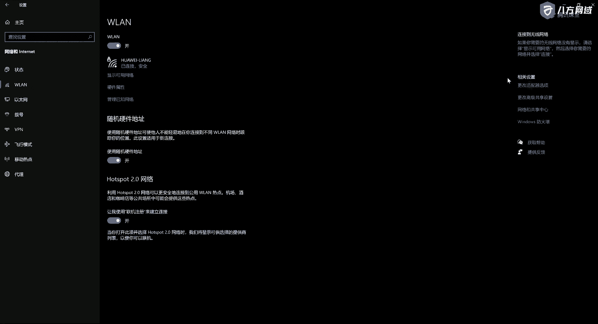
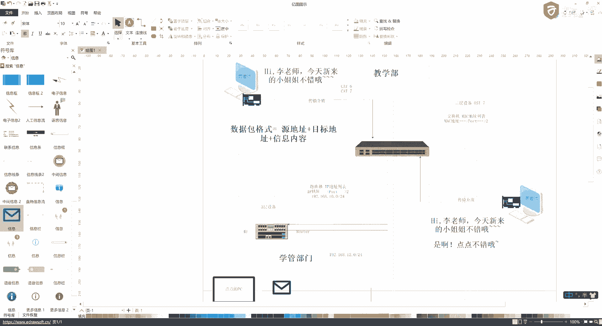

# 网络安全基础课程 P6：2.2 - 网络基础概念与通信原理 🌐

在本节课中，我们将学习计算机网络的基础概念，包括网络的定义、分类以及局域网内部和局域网之间的通信原理。我们将通过简单的比喻和图示，帮助你理解数据包是如何在网络中传输的。

---

## 网络的定义与由来

上一节我们介绍了课程的整体框架，本节中我们来看看网络到底是什么。

网络的概念源于美国军方的需求。在美苏争霸时期，美国军方希望解决指挥中心被摧毁后，数据和指挥能力能快速转移到其他地方的问题。基于这个需求，科学家们开始了研究。

网络的定义是：利用通信介质（也称为传输介质），将分布在世界各地不同地理位置、具有独立功能的计算机和通信设备连接起来，通过网络协议实现资源共享和信息传递的计算机系统。

通信介质分为两大类：
*   **导向式传输介质**：看得见、摸得着的物理线路，例如网线、光纤、同轴电缆。
*   **非导向式传输介质**：看不见、摸不着的无线信号，例如蓝牙、Wi-Fi、卫星通信。


资源共享指的是共享计算机的算力（CPU）、存储空间以及文件等资源。


---

## 网络的分类

理解了网络是什么之后，我们来看看网络有哪些常见的分类方式。

网络通常按照覆盖的地理范围进行分类，主要分为以下三种：
*   **局域网**：覆盖范围较小，例如一个公司、一栋大楼或一个家庭内部的网络。
*   **城域网**：覆盖范围为一个城市，例如整个北京市或某个区的网络。
*   **广域网**：覆盖范围最广，可以跨越国家或大洲，我们常说的互联网就是最大的广域网。

在网络安全学习中，我们主要关注的是**局域网**内部的通信和安全问题。




---

## 局域网内的通信：交换网络

接下来，我们深入了解一下局域网内部计算机是如何通信的。这涉及到**交换网络**的概念。

假设在一个公司部门（如教学部）内有两台电脑需要通信。它们通过网线连接到一个中心设备——**交换机**上。

以下是通信过程的关键组件和步骤：

1.  **网卡**：每台电脑都配有网卡（调制解调器），负责将电脑中的数据转换为可以通过网线传输的电信号，反之亦然。网卡拥有全球唯一的**物理地址（MAC地址）**，格式如 `AA-BB-CC-DD-EE-FF`。
2.  **数据包**：当一台电脑（如黄老师的电脑）向另一台电脑（如李老师的电脑）发送消息时，信息会被封装成一个**数据包**。数据包的基本格式为：
    ```
    源MAC地址 + 目标MAC地址 + 数据内容
    ```
3.  **交换机的工作**：交换机内部维护着一个 **MAC地址表**，记录了哪个MAC地址连接在它的哪个物理端口上。
    *   当数据包到达交换机后，交换机会查看数据包中的**目标MAC地址**。
    *   然后它在自己的MAC地址表中查找这个地址。
    *   如果找到，交换机就将数据包**仅从对应的端口**转发出去，直接送达目标电脑。
    *   如果找不到，交换机会进行**广播**，即向除接收端口外的所有端口发送这个数据包，询问“谁是这个MAC地址？”。

**广播风暴**：如果网络中广播过多，所有设备都需要处理这些广播包，会大量消耗网络带宽和设备资源（CPU、内存），导致网络变慢甚至设备瘫痪，这就形成了广播风暴。广播风暴本身也可以被利用为一种网络攻击手段。

**网卡工作模式**：
*   **全双工**：可以同时进行发送和接收（如常见的有线网卡），效率高。
*   **半双工**：同一时间只能进行发送**或**接收（如一些无线网卡），效率相对较低。这也是有线网络通常感觉比无线网络快的原因之一。

---

## 局域网之间的通信：路由网络

现在，我们来看看不同局域网之间（例如公司不同部门之间）的计算机如何通信。这需要一个新的设备——**路由器**。

假设教学部的黄老师想给销售部的点点发送一条消息。他们的电脑分别连接在不同的交换机上，而这两个交换机又都连接到了公司的**主路由器**。

以下是跨局域网通信的过程：

1.  黄老师电脑的数据包首先到达教学部的交换机。
2.  交换机发现目标MAC地址不在本局域网内，于是将数据包转发给它的上级设备——**路由器**。
3.  路由器是**三层设备**，它查看数据包中的**目标IP地址**（逻辑地址，如 `192.168.2.10`）。
4.  路由器内部维护着一张 **路由表**，记录了去往不同IP地址段应该走哪个端口。
5.  路由器判断目标IP地址属于销售部的网络段，于是将数据包从对应端口转发给销售部的交换机。
6.  销售部的交换机收到后，再通过查找MAC地址表，将数据包最终转发给点点同学的电脑。

**路由器的作用**：
*   **网关**：连接不同的网络段，实现跨网段通信，就像连接两个房间的门。
*   **隔离广播域**：路由器不会转发广播包，因此它能将广播风暴限制在一个局域网内，防止其扩散到整个网络。

从安全角度看，在网络层（路由器）我们可以实施多种控制，例如：
*   通过策略阻断特定IP地址的访问（让某个部门断网）。
*   进行ARP欺骗，篡改或伪造网络中的通信信息。

---

## 总结与工具推荐

本节课中我们一起学习了网络的基础知识。我们从网络的定义和由来开始，了解了网络是利用通信介质连接计算机以实现资源共享的系统。接着，我们学习了网络的分类，特别是局域网。然后，我们深入探讨了**局域网内部的交换通信原理**（依赖MAC地址和交换机），以及**局域网之间的路由通信原理**（依赖IP地址和路由器）。我们还提到了广播风暴、网卡工作模式等概念，并简单触及了这些原理在网络安全中的应用场景。

最后，推荐一款绘制网络拓扑图的工具：**亿图图示**。它可以用来绘制架构图、流程图、网络拓扑图等，非常适合学习和工作使用。



---
**本节课中我们一起学习了：**
1.  网络的定义与核心组成（通信介质、资源共享）。
2.  网络按范围的分类（局域网、城域网、广域网）。
3.  局域网内基于MAC地址和交换机的通信机制。
4.  跨局域网基于IP地址和路由器的通信机制。
5.  广播风暴、网卡模式等基础概念及其安全意义。