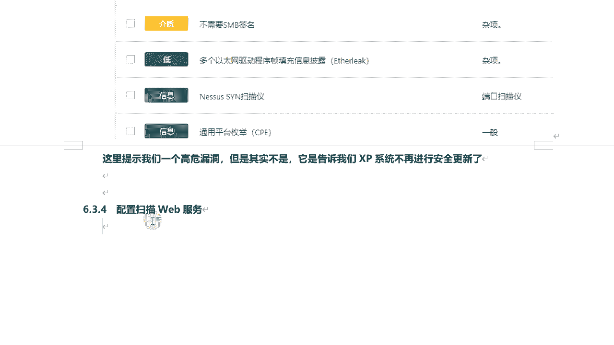
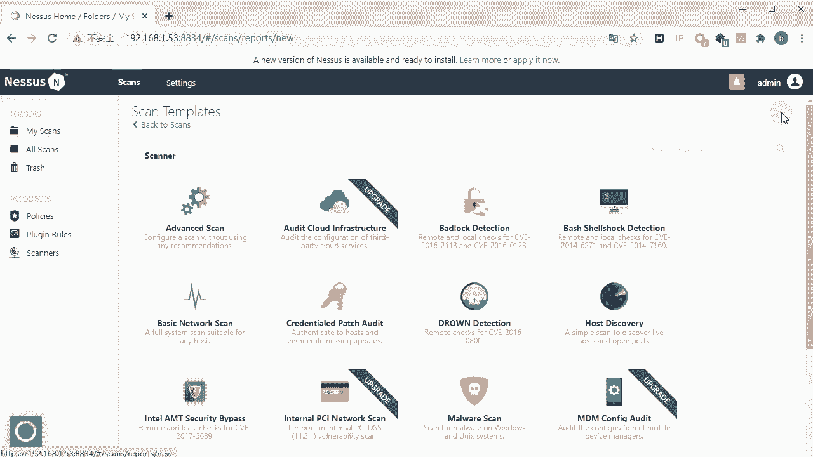
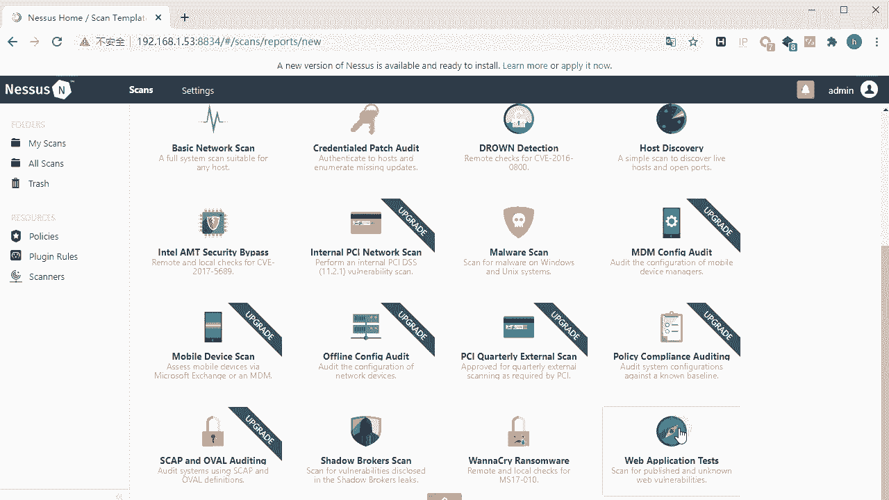
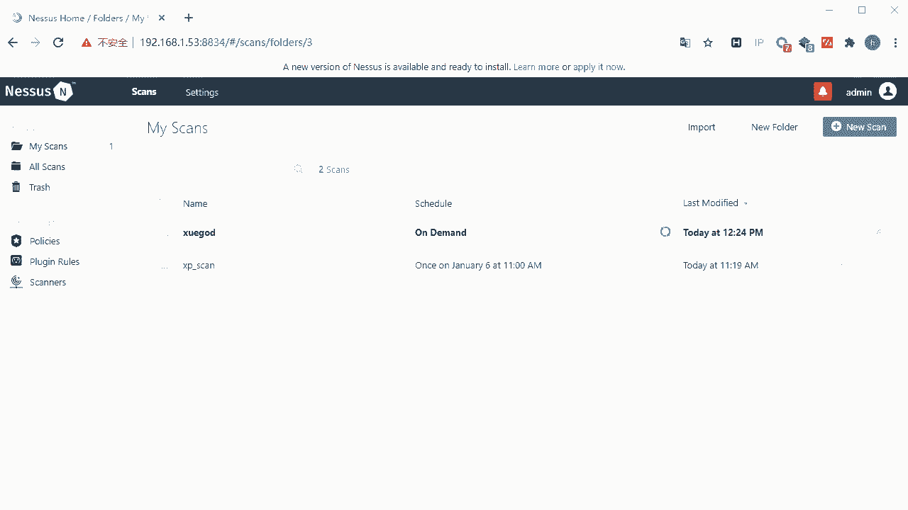
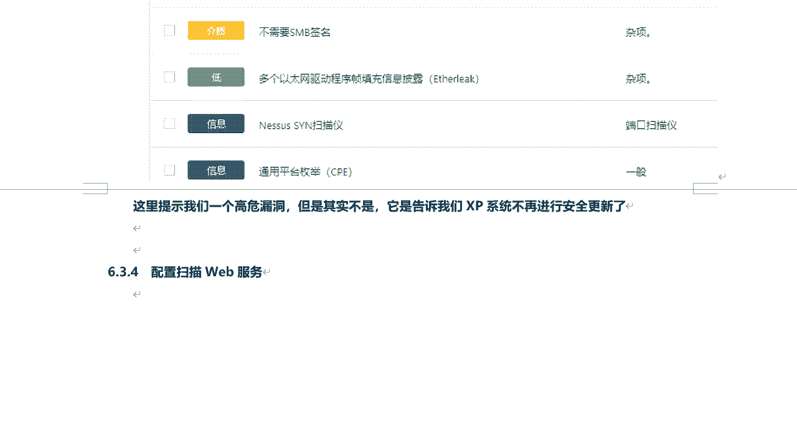
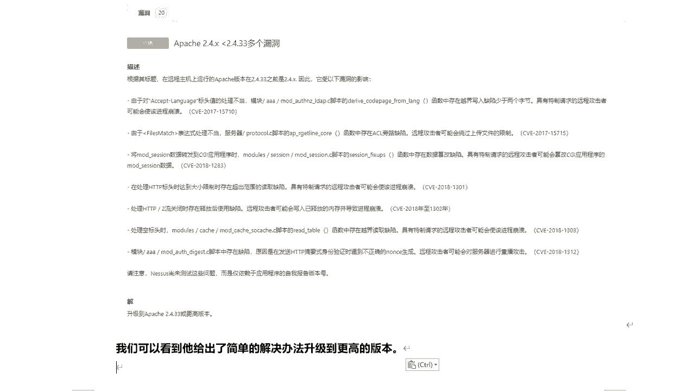
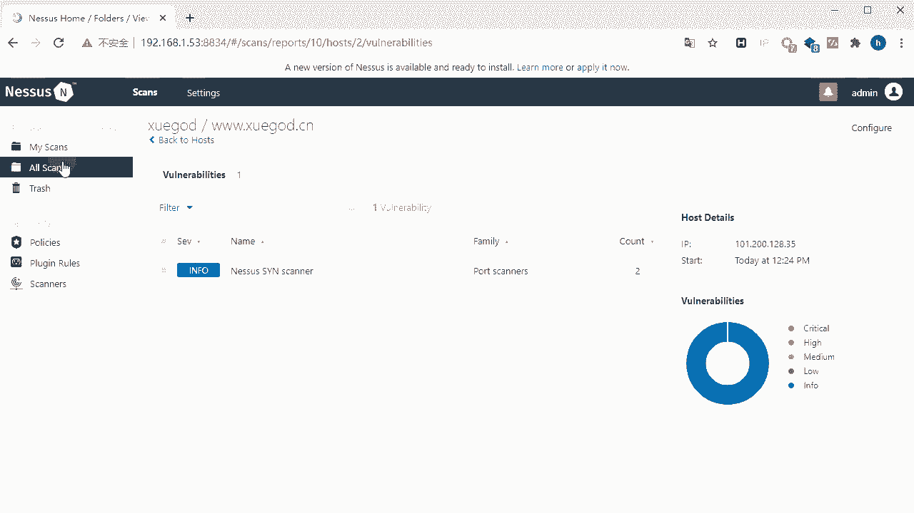
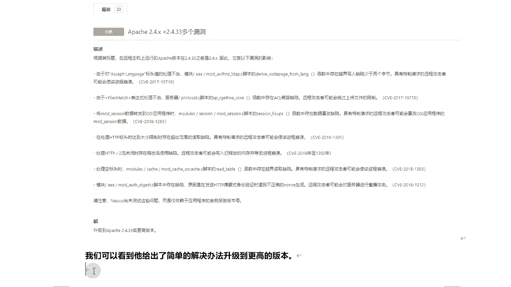
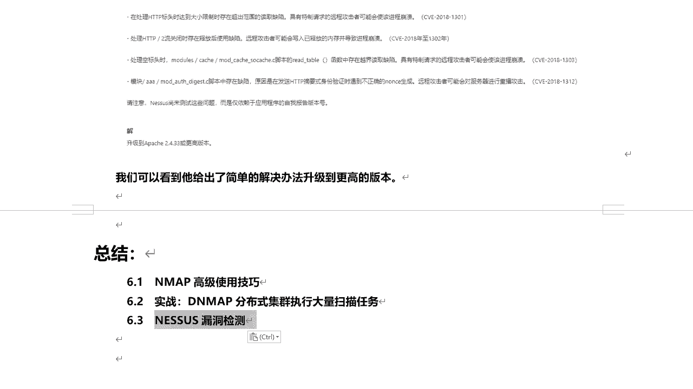

# 课程P60：10.7 - 【漏洞扫描工具系列】配置扫描Web服务 🔍

在本节课中，我们将学习如何使用Nessus漏洞扫描工具，针对Web服务进行详细的配置扫描。我们将从创建扫描任务开始，逐步讲解扫描模板选择、目标设置、端口扫描选项以及Web应用程序测试的各项高级参数配置，确保初学者能够理解并掌握完整的Web漏洞扫描流程。

---

## 新建扫描任务

上一节我们介绍了Nessus的基本概念，本节中我们来看看如何创建一个针对Web服务的扫描任务。

首先，在Nessus界面中点击“New Scan”来新建一个扫描任务。

## 选择扫描模板

在扫描模板选择界面，我们需要选择最后一个模板：**Web Application Test**。

点击该模板后，进入任务配置页面。

## 配置基本设置

以下是配置扫描任务的基本步骤：

1.  **命名与目标**：为扫描任务起一个名称，例如“xueg_w”。在目标地址栏中，填入要扫描的网站地址，例如 `www.xueg.cn`。
2.  **计划与通知**：可以设置计划任务和扫描结果通知，本节课中我们暂不设置。
3.  **主机发现**：默认是常规端口扫描。通常，我们会选择进行全端口扫描（1-65535）。

## 配置Web应用扫描选项

接下来，我们重点配置Web应用程序扫描的相关选项。这些设置决定了扫描的深度、广度和精确性。

### 扫描策略选择

默认选项是“快速扫描所有Web漏洞”。此外还有“扫描已知的Web漏洞”和另一种“扫描所有Web漏洞”的选项。在实际操作中，可以对同一站点尝试不同选项，以对比扫描结果的差异。

选择“自定义”选项后，可以进入更详细的设置。

### 通用设置

在通用设置中，主要针对扫描的精确性进行调整。

*   **覆盖常规警告**：此选项下有两个子项。
    *   **避免潜在的错误警报**：选中后，Nessus会过滤掉可能产生误报的漏洞，不在报告中显示。
    *   **显示潜在的误报**：即使某些漏洞可能是误报，也会在结果中显示出来。本节课中我们不选择此项。
*   **执行彻底测试**：这种测试方式更为深入，但可能会影响目标网络或显著降低扫描速度。

### Web应用程序设置

以下是Web应用程序扫描的核心配置项：

*   **用户代理**：这是一个标识客户端（如浏览器）信息的字符串。修改它可以伪装请求来源，避免被目标服务器的防火墙识别为扫描工具而封锁。例如，可以将其修改为常见浏览器的标识。
    *   **代码示例**：`Mozilla/5.0 (Windows NT 10.0; Win64; x64) AppleWebKit/537.36`
*   **网络爬虫**：用于自动抓取网站页面信息。
    *   **起始页面**：指定爬虫开始抓取的第一个页面。
    *   **排除页面**：指定在爬行过程中不扫描的页面（例如登录/退出页面，扫描它们可能导致会话中断）。
    *   **最大页面数**：限制爬虫抓取的总页面数，默认是1000页。
    *   **爬行深度**：限制从起始页面点击链接进入的层级深度，默认是6层。
    *   **跟随动态生成页面**：启用后，爬虫会尝试跟随由不同参数生成的动态页面进行抓取。

### 测试方法设置

以下是关于测试方法的详细配置：

*   **HTTP登录失败处理**：如果目标网站需要登录后才能扫描，此选项决定登录失败后是否终止Web应用测试。
*   **尝试所有HTTP方法**：Nessus默认主要使用GET方法扫描，启用此项后会尝试使用POST等其他方法。
*   **尝试HTTP参数污染**：测试在GET传参时，使用同名参数（参数污染）可能引发的漏洞。
*   **测试嵌入式Web服务器**：对网站中可能嵌入的其他Web服务进行测试。
*   **表单测试策略**：针对网站中的表单（如留言板、登录框）进行测试的方式。
    *   **测试随机成对的参数**：使用Nessus随机生成的参数对进行提交测试。
    *   **测试所有成对的参数**：测试所有可能的参数组合，更精确但速度较慢。
    *   **测试随机组合的多个参数**：测试三个或更多参数的随机组合，更彻底但速度更慢。
    *   **测试参数的所有组合**：测试攻击字符串与所有有效输入变量的可能组合，最全面也最耗时。
*   **发现漏洞后的行为**：
    *   **找到一个漏洞后停止扫描该页面**：默认行为。
    *   **每个参数发现一个漏洞后停止扫描**：针对每个输入点，找到一个漏洞即停止。
    *   **查找所有漏洞**：无论是否找到漏洞，都继续进行完整扫描。为了全面性，建议选择此项。
*   **远程文件包含URL**：如果目标存在远程文件包含漏洞，可在此指定攻击者希望包含的远程文件URL（例如一句话木马）。
*   **测试时间限制**：设置Web应用程序测试的总时间（单位：分钟），默认是5分钟。超时后扫描自动停止。

### 认证设置

对于需要登录后才能扫描的网站（例如DVWA靶场），需要在此配置凭证。

*   **认证方式**：默认通过HTTP表单登录（HTTP login form）。
*   **登录信息**：需要填写用户名、密码、登录页面URL、表单提交的URL（action）、以及登录使用的字段名（通常为`username`和`password`）。
*   **登录验证**：需要指定登录成功后，响应页面中包含的某个唯一标识字符串（例如“Welcome”或“Logout”），用于Nessus判断认证是否成功。
*   **高级选项**：
    *   **认证尝试延迟**：在每次登录尝试间加入延迟，避免触发目标账户的锁定机制。
    *   **跟随重定向**：如果登录后服务器返回3xx重定向代码，Nessus会跟随跳转。
    *   **在HTTP头中匹配**：选中后，Nessus会在HTTP响应头（Header）中搜索认证状态标识，而不是在网页内容（Body）中搜索。
    *   **忽略大小写匹配**：使正则表达式匹配对大小写不敏感。

完成所有配置后，点击“Save”保存任务，然后点击“Launch”启动扫描。

## 查看扫描结果

扫描开始后，可以进入扫描任务查看实时结果和进度。以示例网站 `www.xueg.cn` 为例，扫描结果显示其不存在安全漏洞，仅检测到开放的21端口（FTP）和80端口（HTTP），这属于正常情况。

---

## 课程总结 📝

本节课中我们一起学习了使用Nessus配置和进行Web服务漏洞扫描的完整流程。

我们首先创建了一个新的扫描任务，并选择了专门的Web应用测试模板。随后，详细讲解了目标设置、端口扫描范围以及最关键的Web应用程序扫描配置，包括爬虫设置、各种测试方法、漏洞发现策略以及针对需要认证的网站的凭证配置。

通过本课的学习，你应该能够独立配置Nessus，对目标Web服务执行一次全面、定制的漏洞扫描，并理解各项参数对扫描结果的影响。

