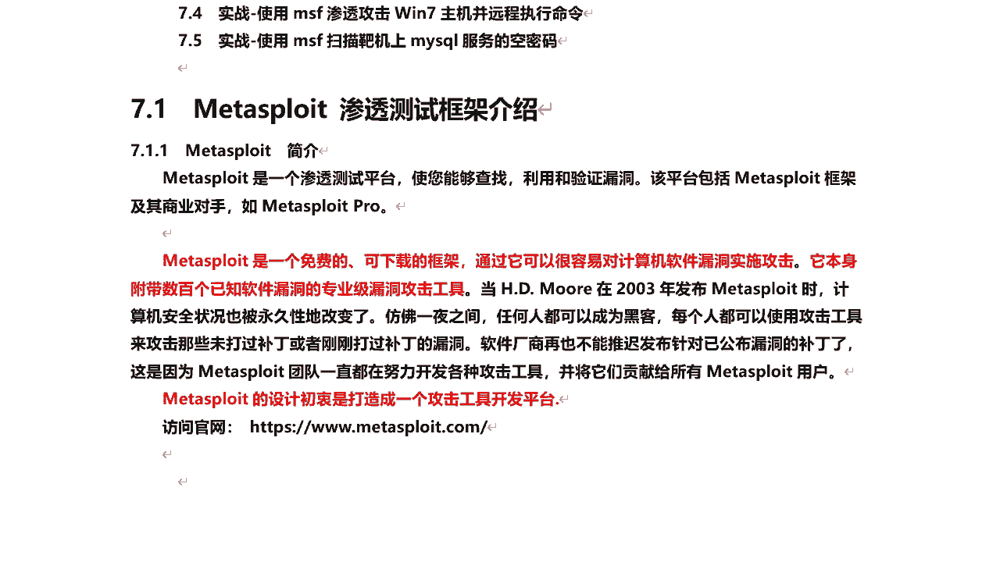
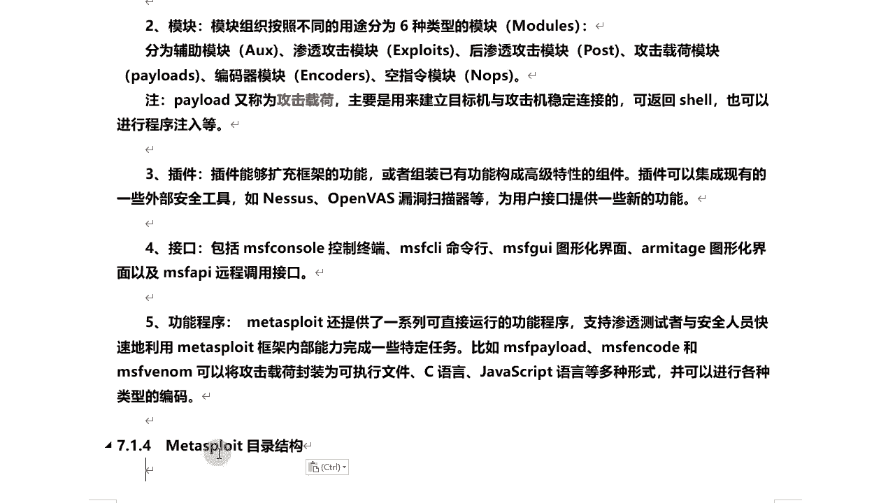
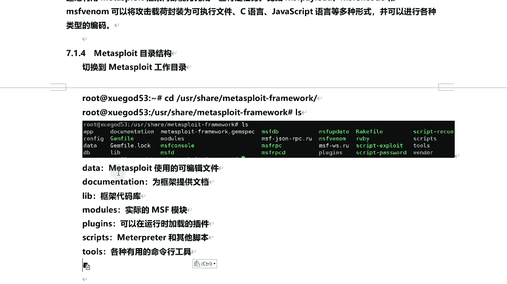

# 课程P61：Metasploit渗透测试框架介绍 🛠️

在本节课中，我们将学习Metasploit渗透测试框架的基本概念、结构和使用方法。Metasploit是一个强大的平台，用于发现、利用和验证软件漏洞。通过本教程，你将了解其核心组件、版本差异以及基本操作流程。

## 框架概述与版本对比



Metasploit是一个渗透测试平台，它能够帮助安全人员查找、利用和验证漏洞。该平台主要包含两个版本：商业版（Metasploit Pro）和社区版（开源免费版）。Kali Linux系统自带的是社区版。


商业版提供更多高级功能，例如网页界面管理、自动化任务链、渗透测试报告生成以及更强的免杀（逃避杀毒软件）能力。用户可以免费试用商业版14天。社区版虽然功能相对较少，但已包含足够多的模块和工具，足以满足学习和基础渗透测试的需求。

## 框架结构与核心组件

上一节我们介绍了Metasploit的版本，本节中我们来看看它的核心架构。Metasploit框架的结构可以概括为基础库、核心模块和功能接口。

以下是其核心组成部分的简要说明：

*   **基础库**：
    *   **Rex**：框架最底层的组件，负责处理基础的网络套接字、协议实现和日志等功能。
    *   **Framework Core**：在Rex之上，为所有上层模块和插件提供交互接口。
    *   **Framework Base**：对Core库的扩展，提供了更简化的接口，主要用于支持用户界面与框架功能的调用。

*   **六大核心模块**：
    *   **Exploit（渗透攻击模块）**：用于利用目标系统的已知漏洞。
    *   **Auxiliary（辅助模块）**：用于执行信息收集、扫描和模糊测试等任务。
    *   **Post（后渗透攻击模块）**：在成功利用漏洞并获得目标系统访问权限后，用于进行进一步的渗透操作。
    *   **Payload（攻击载荷）**：在漏洞利用成功后，在目标系统上执行的代码，用于建立连接或执行特定操作。其本质是后门或木马程序。
    *   **Encoder（编码器模块）**：对Payload进行编码，以绕过杀毒软件的检测（免杀）。
    *   **NOP（空指令模块）**：提高Payload的稳定性和可靠性。

*   **其他组件**：
    *   **插件**：用于集成第三方工具（如Nessus、OpenVAS）到Metasploit框架中。
    *   **接口**：用户与框架交互的方式，最常用的是`msfconsole`命令行接口。
    *   **功能程序**：如`msfvenom`，用于生成各种Payload（木马程序）。

## 目录结构解析

了解了框架的逻辑结构后，我们来看看它在文件系统中的实际组织方式。Metasploit框架在Kali Linux中的默认安装路径是 `/usr/share/metasploit-framework`。

以下是几个关键目录的说明：




*   **`/modules/`**：这是最重要的目录，存放了所有核心模块。其子目录直接对应六大模块，例如 `exploits/`、`auxiliary/`、`payloads/` 等。
*   **`/lib/`**：包含框架的Ruby语言库文件。
*   **`/plugins/`**：存放可以在运行时加载的插件。
*   **`/scripts/`**：包含Meterpreter及其他脚本。
*   **`/tools/`**：包含各种有用的命令行工具。

你可以通过终端进入该目录进行查看：
```bash
cd /usr/share/metasploit-framework
ls -la
```

## 总结




本节课中，我们一起学习了Metasploit渗透测试框架的基础知识。我们首先对比了其商业版与社区版的区别，然后深入探讨了框架的核心架构，包括基础库（Rex, Core, Base）、六大核心模块（Exploit, Auxiliary, Post, Payload, Encoder, NOP）以及其他功能组件。最后，我们浏览了框架在文件系统中的主要目录结构。掌握这些基础知识是后续进行实战渗透测试的前提。