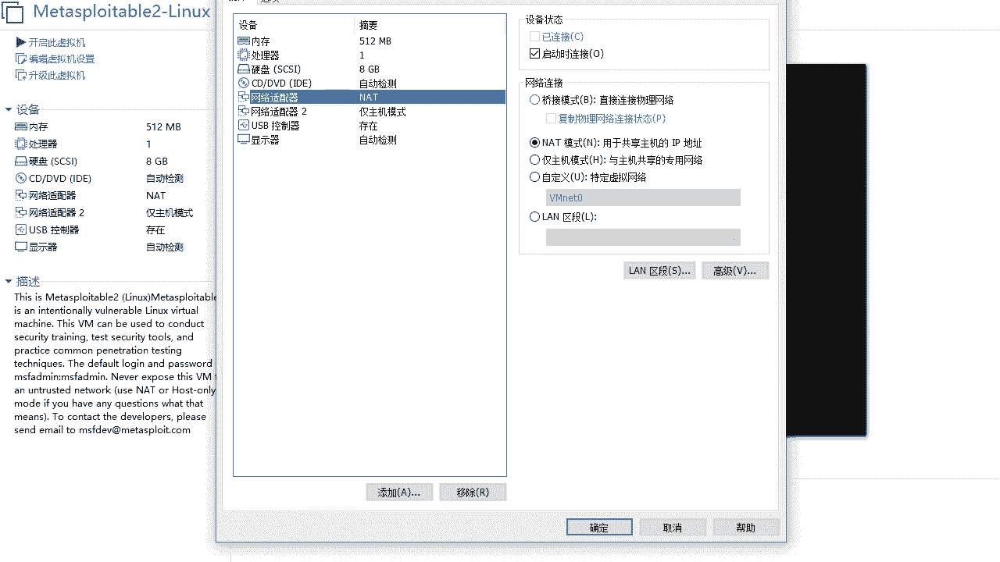
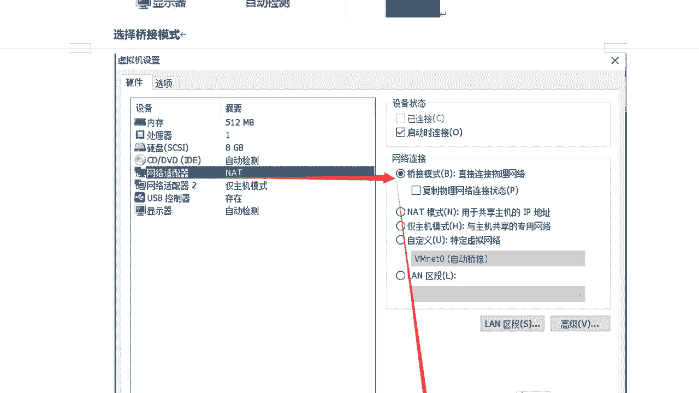
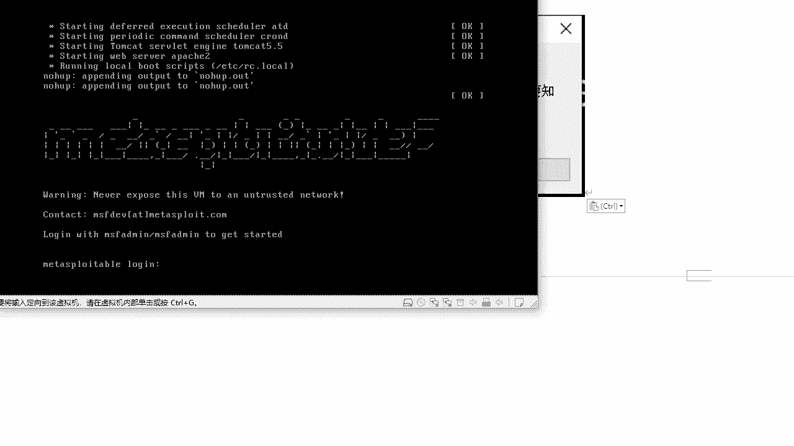
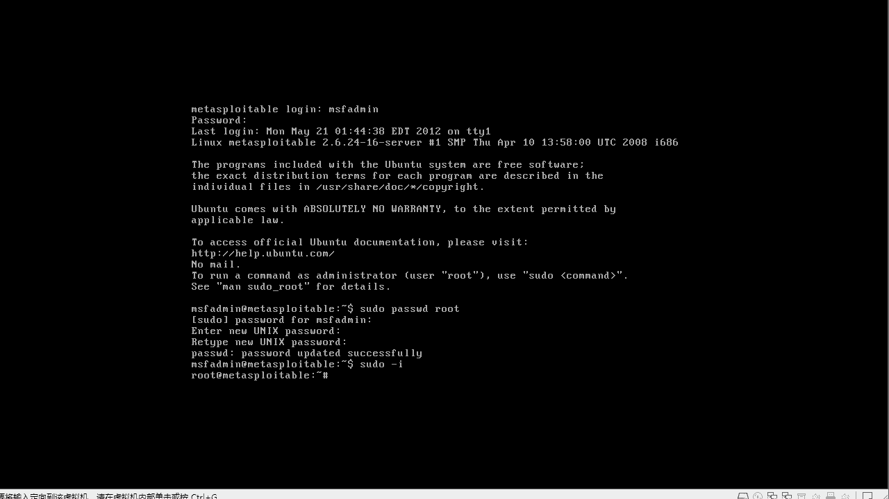
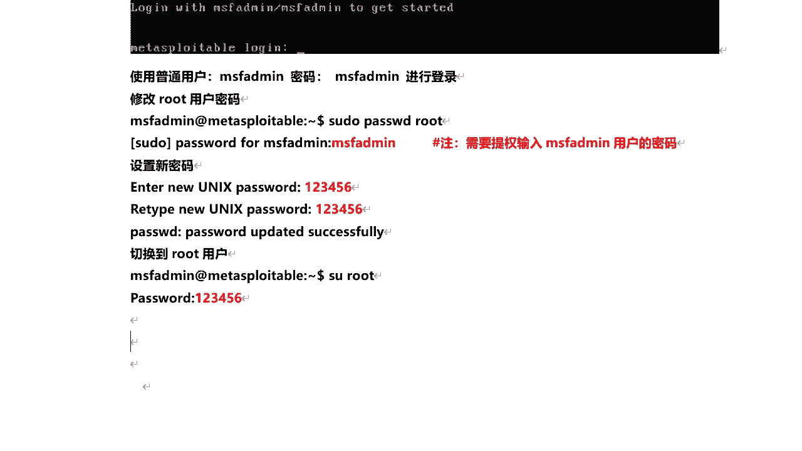
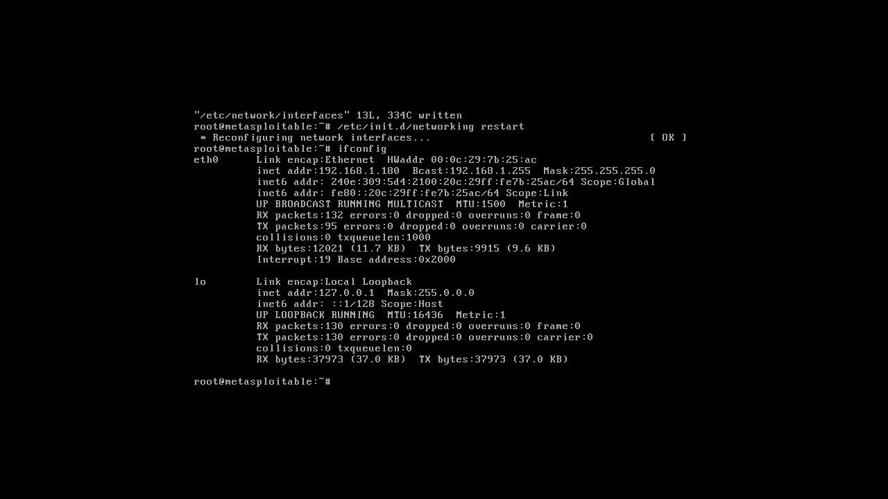
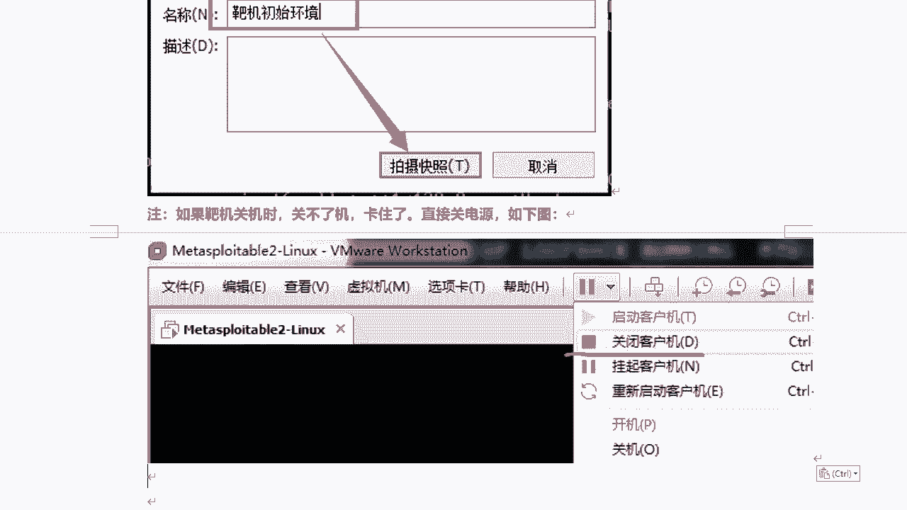

# P62：11.2-【Metasploit渗透】Metasploitable2-Linux 靶机系统介绍 🎯

在本节课中，我们将要学习如何搭建和配置 Metasploitable 2 靶机系统。这是一个专门为安全测试和漏洞演示设计的 Ubuntu 操作系统，我们将从下载解压开始，完成虚拟机的导入、网络配置、系统登录以及必要的初始化设置。

---

## 靶机系统概述

Metasploitable 2 是一个特别制作的 Ubuntu 操作系统，其核心基于 Debian。它与 Kali Linux 的核心相同，基本命令也基本一致。该系统被设计为安全工具，用于测试和演示常见的安全漏洞。版本 2 比上一个版本包含了更多可利用的安全漏洞。该虚拟机兼容 VMware、VirtualBox 和其他虚拟化平台。

上一节我们介绍了靶机的基本概念，本节中我们来看看如何具体搭建它。

---



## 虚拟机搭建步骤


搭建此靶机非常简单，主要步骤是解压压缩包并用虚拟机软件打开。

以下是详细的搭建流程：





1.  **解压文件**：将下载的 Metasploitable 2 压缩包直接解压到当前文件夹。
2.  **打开虚拟机**：启动你的虚拟机软件（如 VMware），点击“打开虚拟机”，然后导航到解压后的目录，选择 `.vmx` 文件并打开。
3.  **调整网络设置（可选）**：在开启虚拟机之前，检查其网络适配器设置。默认模式为 NAT。如果你的其他虚拟机（如 Kali）使用的是桥接模式，请将此靶机的网络也改为桥接模式以保持网络环境一致。如果都使用 NAT 模式，则无需更改。
4.  **启动虚拟机**：完成网络设置后，点击“开启此虚拟机”。在 VMware 中，可能会弹出“我已复制该虚拟机”的提示，选择它即可。

> 注意：整个安装过程就是解压并用虚拟机软件打开，操作比较简单。唯一需要注意的就是网络连接模式，需根据你的测试环境（NAT 或桥接）进行相应调整。

---

## 系统登录与初始配置

虚拟机启动后，会进入登录界面。系统已经预设了默认账户。

以下是登录和初始配置的步骤：

1.  **使用默认账户登录**：系统会提示默认账号和密码均为 `msfadmin`。在 `login:` 后输入 `msfadmin`，在 `Password:` 后输入 `msfadmin`（Linux 系统输入密码时不显示字符，正常输入即可）。
2.  **释放鼠标焦点**：登录后，鼠标可能会被锁定在虚拟机窗口内。要释放鼠标，需同时按下 `Ctrl + Alt` 键。
3.  **设置 root 密码**：默认登录的是普通用户。如需进行系统级配置，需要 root 权限。可以使用以下命令为 root 账户设置密码：
    ```bash
    sudo passwd root
    ```
    执行后，首先会要求输入当前用户 `msfadmin` 的密码进行验证，然后即可设置并确认新的 root 密码。
4.  **切换至 root 账户**：设置好 root 密码后，可以使用以下命令切换到 root 用户：
    ```bash
    sudo -i
    ```
    命令提示符从 `$` 变为 `#`，即表示已成功切换至 root 账户。

到目前为止，靶机已经可以正常使用。网络方面，系统默认通过 DHCP 获取 IP 地址，在大多数情况下无需手动设置即可进行网络通信。

---

## （可选）配置静态 IP 地址



虽然 DHCP 获取的 IP 地址通常够用，但在某些特定测试场景下，你可能需要设置一个固定的静态 IP。



以下是配置静态 IP 的方法，此操作非必需：

1.  使用 `ifconfig` 命令查看当前获取到的动态 IP 地址。
2.  编辑网络配置文件：
    ```bash
    vi /etc/network/interfaces
    ```
3.  将 `eth0` 网卡的配置从 `dhcp` 改为 `static`，并添加以下行（请根据你的实际网络环境修改 IP 地址、子网掩码和网关）：
    ```
    address 192.168.1.180
    netmask 255.255.255.0
    gateway 192.168.1.1
    ```
    > 注意：IP 地址应与你物理机在同一网段，且不能与网络中其他设备冲突。
4.  保存并退出编辑器（在 vi 中按 `Esc` 键，然后输入 `:wq` 并回车）。
5.  重启网络服务使配置生效：
    ```bash
    /etc/init.d/networking restart
    ```
6.  再次使用 `ifconfig` 命令确认 IP 地址已修改成功。

---

## 创建虚拟机快照 📸

所有配置完成后，强烈建议为虚拟机创建一个快照。这样，在后续的渗透测试练习中，如果靶机系统被意外破坏，可以快速恢复到初始状态，无需重新搭建。

以下是创建快照的建议步骤：


1.  首先，关闭客户机操作系统。
2.  在虚拟机软件中，选择“虚拟机”菜单下的“快照” -> “拍摄快照”。
3.  为快照起一个易于识别的名称（例如 “Initial_Setup”），然后点击确定。


> 提示：在虚拟机关机状态下创建快照，所占用的磁盘空间更小，也更稳定。

---



## 课程总结



本节课中，我们一起学习了 Metasploitable 2 靶机系统的完整搭建与配置流程。我们从解压虚拟机文件开始，完成了虚拟机的导入、网络模式的选择、系统的登录、root 账户密码的设置，并介绍了配置静态 IP 和创建系统快照的方法。现在，你已经拥有了一个包含多种预设漏洞的、可用于安全学习和测试的 Linux 靶机环境。在接下来的课程中，我们将以此为基础，开展渗透测试实践。