# 课程P63：11.3 - 【Metasploit渗透】Metasploit基本使用方法-1 🔧

在本节课中，我们将要学习Metasploit渗透测试框架的基本使用方法，包括其依赖的数据库、启动方式以及最核心的搜索与查看命令。掌握这些是后续进行有效渗透测试的基础。

---

## 数据库依赖与启动 🗄️

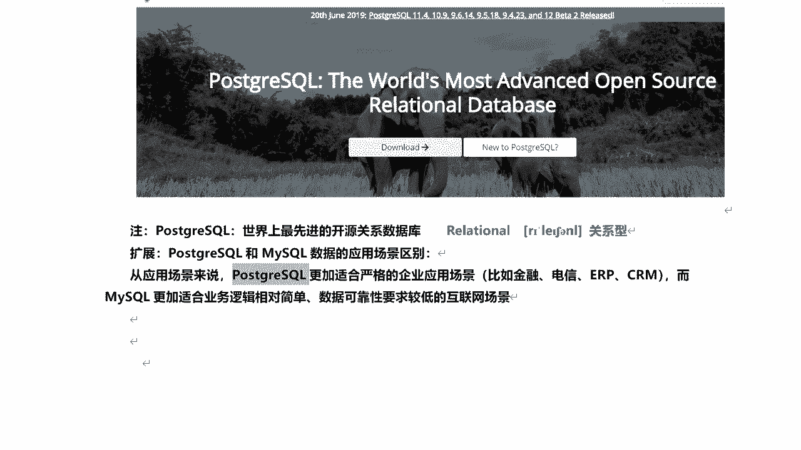


Metasploit框架需要使用PostgreSQL数据库来存储扫描报告和测试结果。

PostgreSQL是一个功能齐全的自由软件对象-关系数据库管理系统（ORDBMS）。它基于加州大学开发的POSTGRES 4.2版本。与之对应的是另一个常见的关系型数据库管理系统MySQL。

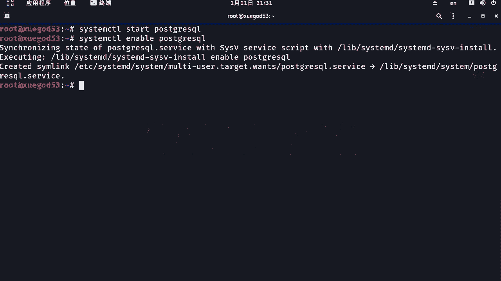

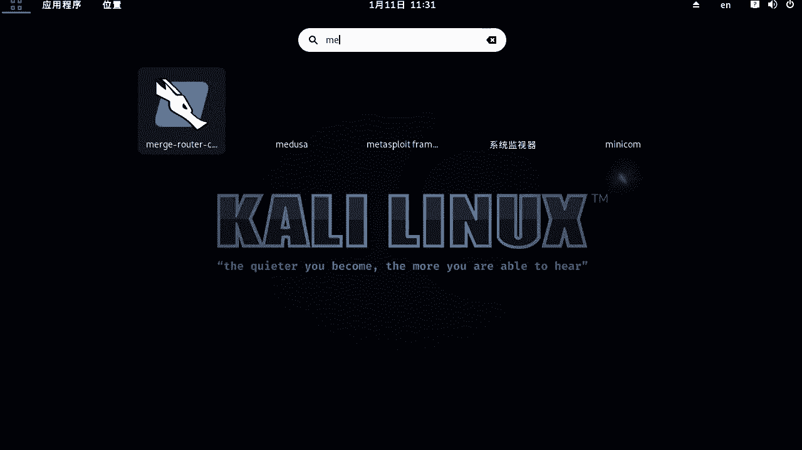

两者的主要应用场景区别如下：
*   **PostgreSQL**：更适合要求严格的企业应用场景，如金融、电信、ERP、CRM等系统。
*   **MySQL**：更适合业务逻辑相对简单、数据可靠性要求较低的互联网场景。

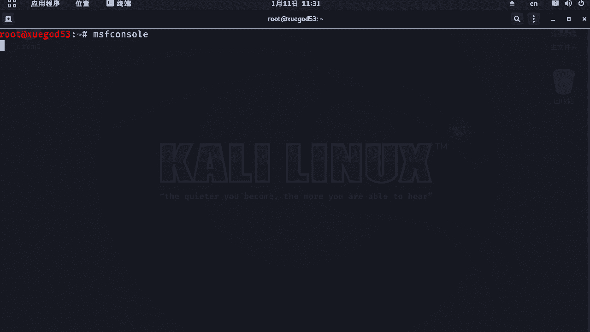

在使用Metasploit之前，需要先启动并设置PostgreSQL数据库开机自启。


以下是启动和设置数据库的命令：
```bash
systemctl start postgresql  # 启动PostgreSQL数据库
systemctl enable postgresql # 设置PostgreSQL开机自启动
```

数据库启动后，即可进入Metasploit框架。


---

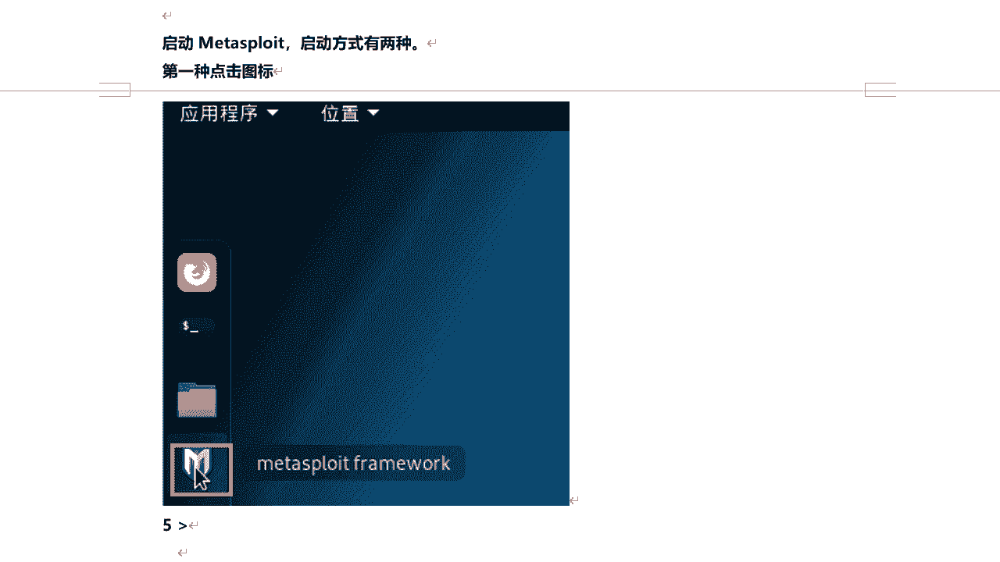


## 进入Metasploit框架 🚪

有两种方式可以启动Metasploit框架：
1.  在Kali Linux的应用程序菜单中点击“Metasploit”图标。
2.  在命令行终端中输入 `msfconsole` 命令。

第一次启动 `msfconsole` 时可能会较慢，因为它需要初始化。如果出现“no database support”的错误提示，说明需要初始化数据库。


解决方法是先退出msfconsole，执行以下命令初始化数据库，然后再次启动：
```bash
msfdb init  # 初始化Metasploit数据库
msfconsole   # 再次启动Metasploit控制台
```

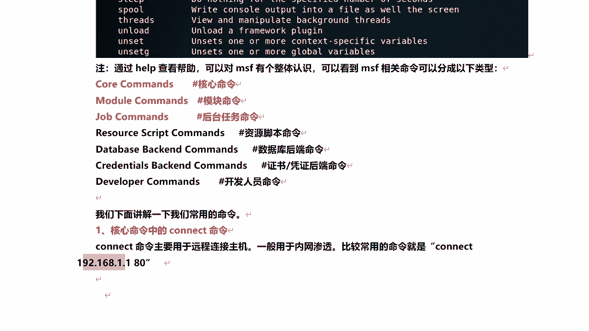

成功进入后，会显示框架版本、各类型模块的数量，并且提示符会变为 `msf5 >` 或 `msf6 >`。

---

## 核心命令概览 📋


在msfconsole提示符下输入 `help` 命令，可以查看所有可用的命令，主要分为以下几类：
*   **核心命令**：包含最常用的一些基础命令。
*   **模块命令**：用于操作各种渗透模块的命令。
*   **后台任务命令**：管理后台运行的任务。
*   **数据库后端命令**：管理数据库，如导入导出扫描报告。
*   **凭证后端命令**：管理获取到的凭证信息。
*   **开发人员命令**：用于编辑和开发模块（需要Ruby语言基础）。

对于初学者，我们首先关注前两类中的常用命令。

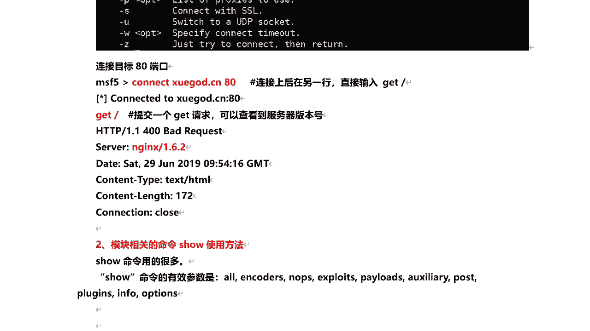

---

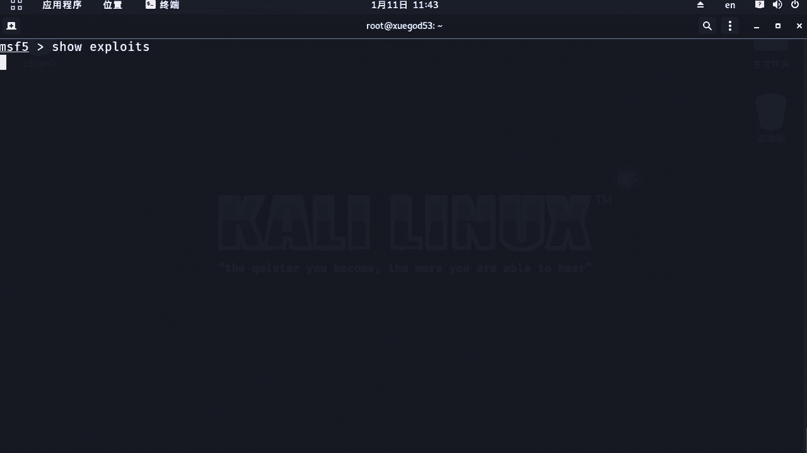

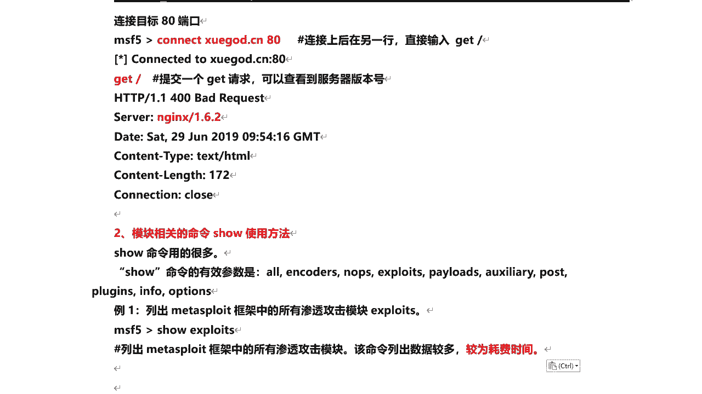

## 常用命令详解

### 1. Connect命令


`connect` 命令主要用于连接远程主机，通常在内网渗透中使用。其基本语法是连接指定IP地址和端口。

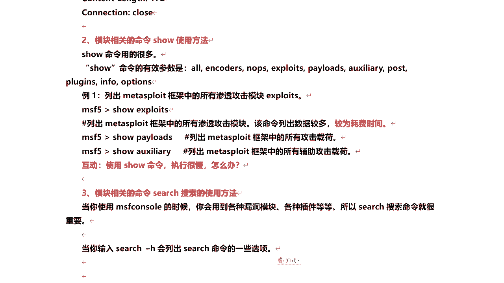

例如，连接IP为192.168.1.1的主机的80端口：
```bash
connect 192.168.1.1 80
```

连接成功后，可以在该会话中直接向目标发送HTTP请求，例如获取Web服务器信息：
```bash
GET / HTTP/1.0
```
执行上述命令后，可能会在响应头中看到服务器版本信息（如 `nginx/1.6.2`），这有助于后续寻找对应的漏洞。

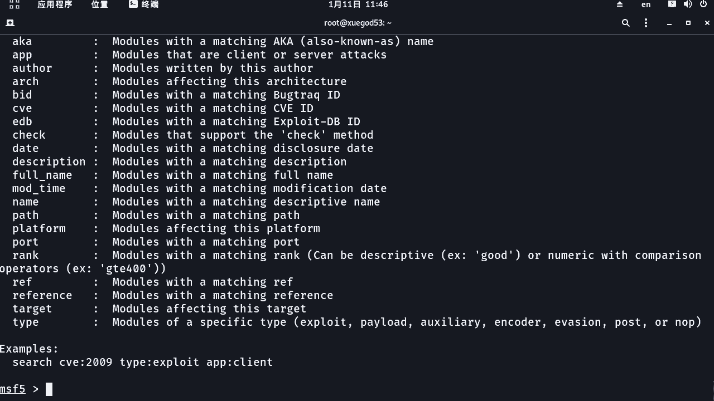

**重要提示**：必须在成功执行 `connect` 命令建立连接后，才能输入后续的请求命令。直接在 `msf5 >` 提示符下输入 `GET` 命令会报错。


---


### 2. Show命令

`show` 命令用于列出框架中的各种模块。为了避免列出所有内容导致加载缓慢，通常需要指定参数来查看特定类型的模块。

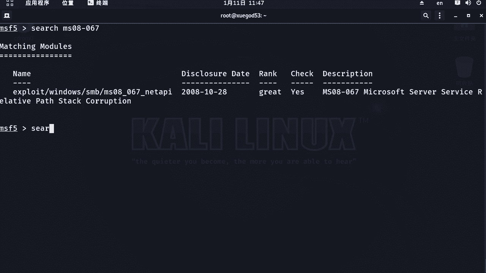

以下是 `show` 命令的常用参数：
*   `show exploits`：列出所有渗透攻击模块。
*   `show payloads`：列出所有攻击载荷模块。
*   `show auxiliary`：列出所有辅助模块。
*   `show encoders`：列出所有编码器模块。
*   `show all`：列出所有模块（慎用，加载很慢）。

例如，执行 `show exploits` 会列出所有可用的漏洞利用模块，但数量可能非常庞大，加载需要时间。

---

### 3. Search命令 🔍

由于模块数量巨大，直接使用 `show` 命令查找效率低下。`search` 命令是查找特定模块最常用、最高效的工具。

输入 `search -h` 可以查看该命令的帮助信息和可用参数。


#### 基础搜索
最直接的方式是使用关键字搜索。例如，搜索所有与 `mysql` 相关的模块：
```bash
search mysql
```

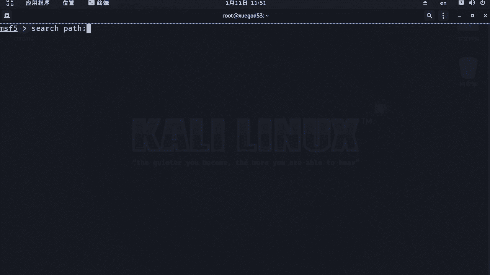

或者根据漏洞编号（如MS08-067）搜索：
```bash
search ms08-067
```


搜索结果会显示多个字段：
*   **Name**：模块名称。
*   **Disclosure Date**：漏洞披露日期。
*   **Rank**：利用模块的可靠性等级。
*   **Check**：是否支持漏洞存在性检查。
*   **Description**：模块描述。


#### Rank等级说明
Rank等级反映了漏洞利用模块的可靠性和对目标系统的影响，从高到低排列：
*   **Excellent**：利用程序非常可靠，通常不会导致服务崩溃（如SQL注入）。
*   **Great**：有默认目标系统，能自动检测或返回特定地址。
*   **Normal**：可靠性一般，是常见的利用状态。
*   **Average**：可靠性较低。
*   **Low** / **Manual**：不稳定或难以利用，通常需要手动配置。

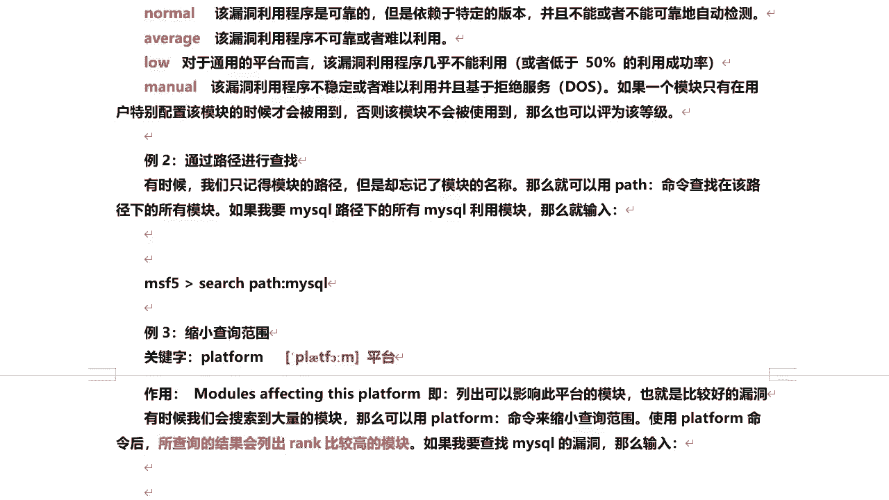

在选择模块时，Rank等级可以作为重要的参考依据。


#### 高级搜索
为了更精确地定位模块，可以使用联合搜索参数：

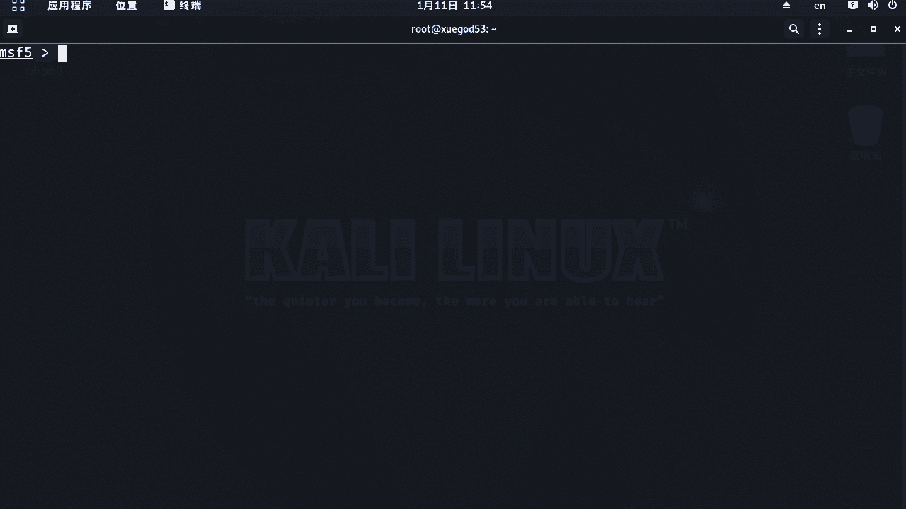

*   **按路径搜索**：当只记得模块路径时使用。
    ```bash
    search path:mysql
    ```

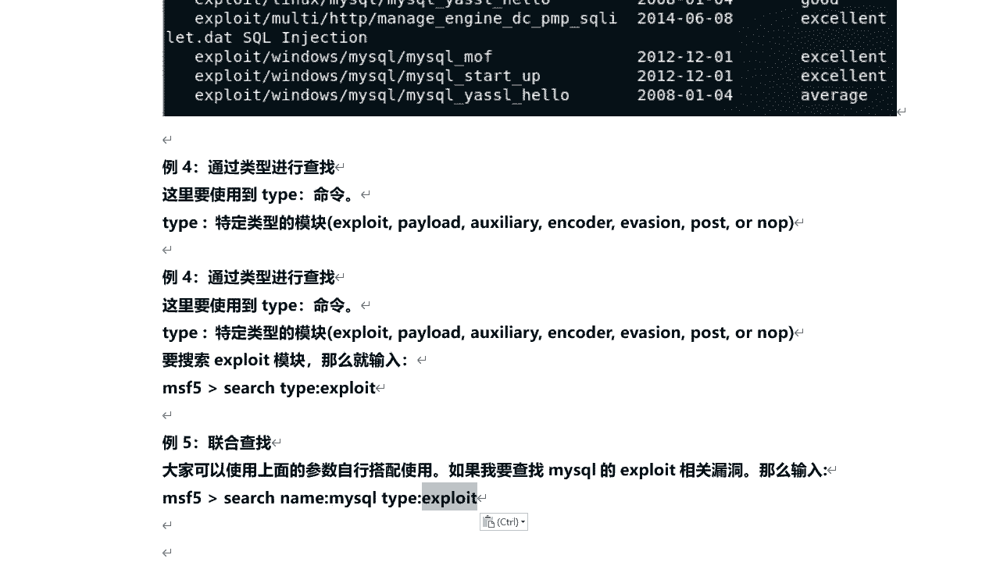


*   **按平台搜索**：缩小到特定操作系统平台。
    ```bash
    search platform:windows mysql
    ```

*   **按类型搜索**：查找特定类型的模块。
    ```bash
    search type:exploit mysql
    ```

*   **按CVE编号搜索**：CVE（公共漏洞和暴露）是为广泛认可的安全漏洞分配的公共名称。通过CVE编号可以精准查找对应模块。
    ```bash
    search cve:2017-8464
    search cve:2018-  platform:linux
    ```

联合使用这些参数可以极大提高搜索的精准度，例如查找Windows平台下MySQL的渗透攻击模块：
```bash
search platform:windows type:exploit mysql
```

---


## 总结 📝

本节课中我们一起学习了Metasploit框架的入门知识。我们首先了解了其对PostgreSQL数据库的依赖以及启动方法。然后，我们掌握了进入msfconsole的两种方式，并解决了首次启动时的数据库初始化问题。最后，我们重点讲解了三个核心命令：用于连接主机的 `connect`、用于查看模块的 `show`，以及功能强大、用于精准查找模块的 `search` 命令及其各种高级用法。

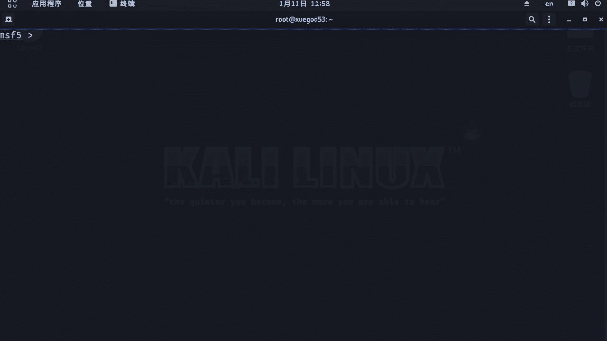

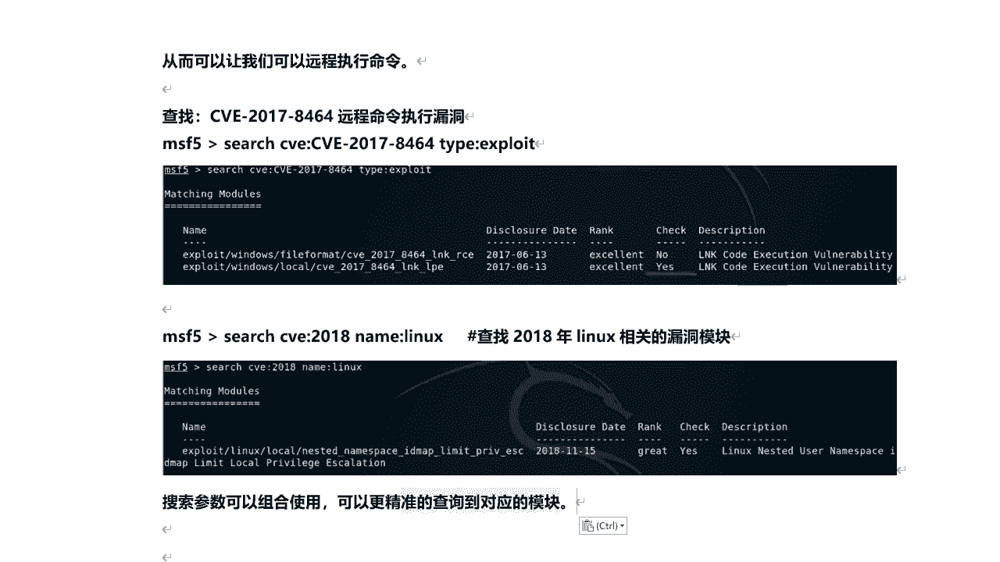

熟练掌握这些基础命令，是后续有效使用Metasploit进行漏洞利用和渗透测试的关键第一步。